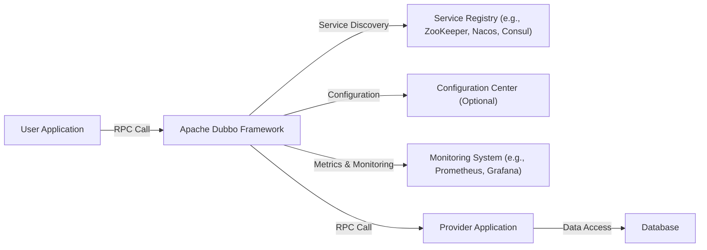
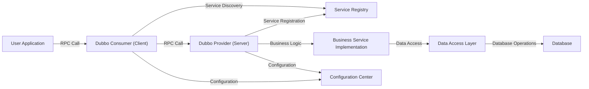
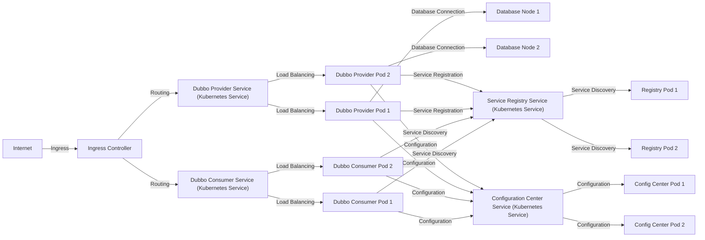
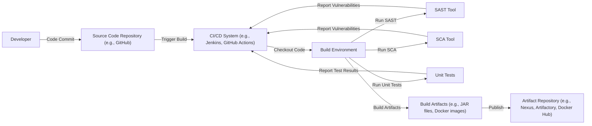

# BUSINESS POSTURE

Business Priorities and Goals:

*   Provide a high-performance, extensible, and easy-to-use RPC framework for Java applications.
*   Enable microservices architecture by facilitating communication between distributed services.
*   Offer a rich set of features including service discovery, load balancing, routing, and fault tolerance.
*   Maintain a vibrant open-source community and encourage contributions.
*   Ensure compatibility with various protocols and serialization formats.
*   Minimize operational overhead for developers adopting the framework.

Most Important Business Risks:

*   Service disruption or unavailability due to bugs, misconfiguration, or infrastructure failures.
*   Security vulnerabilities that could lead to data breaches, unauthorized access, or denial-of-service attacks.
*   Performance bottlenecks that impact application responsiveness and user experience.
*   Lack of adoption due to complexity, poor documentation, or insufficient community support.
*   Incompatibility with evolving technologies and standards, leading to obsolescence.
*   Supply chain attacks that can compromise the integrity of the framework.

# SECURITY POSTURE

Existing Security Controls:

*   security control: Secure software development practices are encouraged within the Apache Software Foundation, although specific implementations within the Dubbo project need further clarification from the repository. This includes secure coding guidelines, code reviews, and vulnerability management processes.
*   security control: Dubbo supports multiple protocols, some of which offer built-in security features (e.g., HTTPS). (Described in Dubbo documentation).
*   security control: Dubbo allows for custom filters, which can be used to implement security-related logic such as authentication and authorization. (Described in Dubbo documentation).
*   security control: Dubbo supports extensions, allowing integration with external security systems. (Described in Dubbo documentation).
*   security control: Dubbo's architecture promotes loose coupling, which can limit the impact of security breaches.
*   accepted risk: The repository does not explicitly mention specific security certifications or compliance standards (e.g., SOC 2, ISO 27001). This is common for open-source projects but represents an accepted risk, especially for enterprise deployments.
*   accepted risk: The repository does not explicitly detail a comprehensive security testing strategy, including penetration testing and fuzzing.
*   accepted risk: The repository does not explicitly detail a robust vulnerability disclosure and management program.

Recommended Security Controls:

*   Implement a comprehensive security testing strategy, including static analysis (SAST), dynamic analysis (DAST), software composition analysis (SCA), penetration testing, and fuzzing.
*   Establish a clear vulnerability disclosure and management program, including a security contact and a process for handling reported vulnerabilities.
*   Provide detailed security documentation, including best practices for secure configuration and deployment.
*   Consider implementing built-in support for authentication and authorization mechanisms, such as OAuth 2.0 or JWT.
*   Offer guidance on integrating Dubbo with existing security infrastructure, such as identity providers and access management systems.
*   Regularly audit dependencies for known vulnerabilities and update them promptly.
*   Implement supply chain security measures, such as code signing and provenance verification.

Security Requirements:

*   Authentication:
    *   The system should support strong authentication mechanisms for service consumers and providers.
    *   Integration with existing identity providers (e.g., LDAP, Active Directory, OAuth 2.0 providers) should be possible.
    *   Multi-factor authentication should be supported as an option.
*   Authorization:
    *   The system should provide fine-grained access control to services and methods.
    *   Role-Based Access Control (RBAC) or Attribute-Based Access Control (ABAC) should be supported.
    *   Authorization policies should be configurable and manageable.
*   Input Validation:
    *   All input received from service consumers should be strictly validated.
    *   Validation rules should be defined based on data types, formats, and allowed ranges.
    *   Invalid input should be rejected with appropriate error messages.
*   Cryptography:
    *   Sensitive data transmitted between services should be encrypted using strong cryptographic protocols (e.g., TLS 1.3).
    *   Data at rest (e.g., in databases or caches) should be encrypted if it contains sensitive information.
    *   Cryptographic keys should be managed securely, following best practices for key generation, storage, and rotation.

# DESIGN

## C4 CONTEXT

Element Descriptions:

*   Element:
    *   Name: User Application
    *   Type: External System (Client)
    *   Description: An application that consumes services provided through the Dubbo framework.
    *   Responsibilities: Initiates RPC calls to services exposed by provider applications via Dubbo.
    *   Security controls: Implements authentication and authorization mechanisms to identify and authorize itself to the Dubbo framework and the services it consumes. Uses secure communication channels (e.g., HTTPS) when interacting with Dubbo. Performs input validation on data received from Dubbo services.

*   Element:
    *   Name: Apache Dubbo Framework
    *   Type: System
    *   Description: The core RPC framework that facilitates communication between user and provider applications.
    *   Responsibilities: Handles service discovery, load balancing, routing, serialization, and communication between services. Provides extensibility points for custom filters and protocols.
    *   Security controls: Enforces security policies defined by the application. May provide built-in support for authentication and authorization. Uses secure communication channels (e.g., HTTPS) when configured.

*   Element:
    *   Name: Service Registry (e.g., ZooKeeper, Nacos, Consul)
    *   Type: External System
    *   Description: A system that stores information about available services and their locations.
    *   Responsibilities: Provides service discovery capabilities to Dubbo, allowing clients to locate service providers.
    *   Security controls: Access to the service registry should be restricted to authorized clients and services. Secure communication channels should be used. The registry itself should be hardened against attacks.

*   Element:
    *   Name: Configuration Center (Optional)
    *   Type: External System
    *   Description: A system that stores and manages configuration data for Dubbo applications.
    *   Responsibilities: Provides centralized configuration management for Dubbo services.
    *   Security controls: Access to the configuration center should be restricted. Sensitive configuration data should be encrypted.

*   Element:
    *   Name: Monitoring System (e.g., Prometheus, Grafana)
    *   Type: External System
    *   Description: A system that collects and visualizes metrics and logs from Dubbo applications.
    *   Responsibilities: Provides monitoring and alerting capabilities for Dubbo services.
    *   Security controls: Access to the monitoring system should be restricted. Sensitive monitoring data should be protected.

*   Element:
    *   Name: Provider Application
    *   Type: External System (Server)
    *   Description: An application that provides services through the Dubbo framework.
    *   Responsibilities: Implements the business logic for the services it exposes. Registers itself with the service registry.
    *   Security controls: Implements authentication and authorization mechanisms to control access to its services. Uses secure communication channels (e.g., HTTPS) when interacting with Dubbo. Performs input validation on data received from Dubbo clients. Protects sensitive data at rest.

*   Element:
    *   Name: Database
    *   Type: External System (Data Store)
    *   Description: A database used by the provider application to store and retrieve data.
    *   Responsibilities: Stores and manages data used by the provider application.
    *   Security controls: Access to the database should be restricted. Data at rest should be encrypted if it contains sensitive information. Database connections should be secured. Regular security audits and patching should be performed.

## C4 CONTAINER

Element Descriptions:

*   Element:
    *   Name: Dubbo Consumer (Client)
    *   Type: Container
    *   Description: The client-side component of the Dubbo framework, running within the user application.
    *   Responsibilities: Handles service discovery, load balancing, routing, and communication with Dubbo providers. Serializes and deserializes requests and responses.
    *   Security controls: Implements authentication and authorization mechanisms to identify and authorize itself to the Dubbo provider. Uses secure communication channels (e.g., HTTPS) when interacting with Dubbo providers. Performs input validation on data received from Dubbo providers.

*   Element:
    *   Name: Service Registry
    *   Type: External System (Container)
    *   Description:  Same as in the Context diagram.

*   Element:
    *   Name: Dubbo Provider (Server)
    *   Type: Container
    *   Description: The server-side component of the Dubbo framework, running within the provider application.
    *   Responsibilities: Exposes services to Dubbo consumers. Handles incoming requests, invokes the corresponding business logic, and returns responses. Registers services with the service registry.
    *   Security controls: Enforces authentication and authorization policies to control access to its services. Uses secure communication channels (e.g., HTTPS) when interacting with Dubbo consumers. Performs input validation on data received from Dubbo consumers.

*   Element:
    *   Name: Business Service Implementation
    *   Type: Container
    *   Description: The component that contains the actual business logic of the service.
    *   Responsibilities: Implements the business logic for the services exposed by the Dubbo provider.
    *   Security controls: Implements input validation and business-level security checks.

*   Element:
    *   Name: Data Access Layer
    *   Type: Container
    *   Description: The component responsible for interacting with the database.
    *   Responsibilities: Handles database operations, such as querying and updating data.
    *   Security controls: Uses parameterized queries or other secure methods to prevent SQL injection vulnerabilities. Enforces access control to the database.

*   Element:
    *   Name: Database
    *   Type: External System (Container)
    *   Description: Same as in the Context diagram.

*   Element:
    *   Name: Configuration Center
    *   Type: External System (Container)
    *   Description: Same as in the Context diagram.

## DEPLOYMENT

Possible Deployment Solutions:

1.  Traditional Deployment: Deploying provider and consumer applications as WAR or JAR files on physical servers or virtual machines.
2.  Containerized Deployment: Deploying provider and consumer applications as Docker containers, managed by an orchestration platform like Kubernetes.
3.  Serverless Deployment: Deploying provider and consumer applications as functions on a serverless platform (e.g., AWS Lambda, Azure Functions). This approach is less common for Dubbo due to its stateful nature and reliance on long-lived connections.

Chosen Solution: Containerized Deployment with Kubernetes

Element Descriptions:

*   Element:
    *   Name: Internet
    *   Type: External System
    *   Description: The public internet.
    *   Responsibilities: Source of external traffic.
    *   Security controls: Firewall, Intrusion Detection/Prevention Systems.

*   Element:
    *   Name: Ingress Controller
    *   Type: Infrastructure Node
    *   Description: A Kubernetes Ingress controller that manages external access to services within the cluster.
    *   Responsibilities: Routes incoming traffic to the appropriate Kubernetes services based on rules.
    *   Security controls: TLS termination, access control based on IP address or other criteria.

*   Element:
    *   Name: Dubbo Consumer Service (Kubernetes Service)
    *   Type: Kubernetes Service
    *   Description: A Kubernetes Service that provides a stable endpoint for accessing Dubbo consumer pods.
    *   Responsibilities: Load balances traffic across multiple Dubbo consumer pods.
    *   Security controls: Network policies to restrict access to the service.

*   Element:
    *   Name: Dubbo Provider Service (Kubernetes Service)
    *   Type: Kubernetes Service
    *   Description: A Kubernetes Service that provides a stable endpoint for accessing Dubbo provider pods.
    *   Responsibilities: Load balances traffic across multiple Dubbo provider pods.
    *   Security controls: Network policies to restrict access to the service.

*   Element:
    *   Name: Dubbo Consumer Pod 1, Dubbo Consumer Pod 2
    *   Type: Kubernetes Pod
    *   Description: Kubernetes Pods running instances of the Dubbo consumer application.
    *   Responsibilities: Executes the Dubbo consumer logic.
    *   Security controls: Container security best practices (e.g., minimal base image, non-root user, read-only filesystem). Resource limits to prevent denial-of-service attacks.

*   Element:
    *   Name: Dubbo Provider Pod 1, Dubbo Provider Pod 2
    *   Type: Kubernetes Pod
    *   Description: Kubernetes Pods running instances of the Dubbo provider application.
    *   Responsibilities: Executes the Dubbo provider logic.
    *   Security controls: Container security best practices (e.g., minimal base image, non-root user, read-only filesystem). Resource limits to prevent denial-of-service attacks.

*   Element:
    *   Name: Database Node 1, Database Node 2
    *   Type: Infrastructure Node
    *   Description: Nodes of the database cluster.
    *   Responsibilities: Stores and manages data.
    *   Security controls: Database security best practices (e.g., strong passwords, access control, encryption at rest and in transit, regular security audits and patching).

*   Element:
    *   Name: Service Registry Service (Kubernetes Service)
    *   Type: Kubernetes Service
    *   Description: A Kubernetes Service that provides a stable endpoint for accessing the service registry pods.
    *   Responsibilities: Load balances traffic across multiple service registry pods.
    *   Security controls: Network policies to restrict access to the service.

*   Element:
    *   Name: Registry Pod 1, Registry Pod 2
    *   Type: Kubernetes Pod
    *   Description: Kubernetes Pods running instances of the service registry (e.g., ZooKeeper, Nacos, Consul).
    *   Responsibilities: Provides service discovery capabilities.
    *   Security controls: Container security best practices. Access control to the registry.

*   Element:
    *   Name: Configuration Center Service (Kubernetes Service)
    *   Type: Kubernetes Service
    *   Description: A Kubernetes Service that provides a stable endpoint for accessing the configuration center pods.
    *   Responsibilities: Load balances traffic across multiple configuration center pods.
    *   Security controls: Network policies to restrict access to the service.

*   Element:
    *   Name: Config Center Pod 1, Config Center Pod 2
    *   Type: Kubernetes Pod
    *   Description: Kubernetes Pods running instances of the configuration center.
    *   Responsibilities: Provides centralized configuration management.
    *   Security controls: Container security best practices. Access control to the configuration data. Encryption of sensitive configuration data.

## BUILD

Build Process Description:

1.  Developer commits code to the source code repository (e.g., GitHub).
2.  The code commit triggers a build in the CI/CD system (e.g., Jenkins, GitHub Actions).
3.  The CI/CD system checks out the code into a build environment.
4.  Static Application Security Testing (SAST) is performed using a SAST tool. The SAST tool analyzes the source code for potential security vulnerabilities.
5.  Software Composition Analysis (SCA) is performed using an SCA tool. The SCA tool identifies open-source components and their known vulnerabilities.
6.  Unit tests are executed to verify the functionality of the code.
7.  If all checks (SAST, SCA, unit tests) pass, the build process proceeds to build the artifacts (e.g., JAR files, Docker images).
8.  The build artifacts are published to an artifact repository (e.g., Nexus, Artifactory, Docker Hub).
9.  The CI/CD system reports the results of the SAST, SCA, and unit tests. If any vulnerabilities or failing tests are found, the build is marked as failed, and notifications are sent to the development team.

Security Controls in Build Process:

*   SAST: Identifies potential security vulnerabilities in the source code.
*   SCA: Identifies known vulnerabilities in open-source dependencies.
*   Unit Tests: Ensures code functionality and can help prevent security regressions.
*   Build Automation: Ensures consistent and repeatable builds, reducing the risk of manual errors.
*   Artifact Repository: Provides a secure and controlled location for storing build artifacts.
*   Code Signing (Recommended): Digitally sign build artifacts to ensure their integrity and authenticity.
*   Provenance Verification (Recommended): Verify the origin and history of build artifacts to prevent supply chain attacks.

# RISK ASSESSMENT

Critical Business Processes:

*   Service Communication: The core process of enabling communication between distributed services is critical. Any disruption to this process can lead to application outages and business impact.
*   Service Discovery: The ability for services to discover each other is essential for the functioning of the microservices architecture. Failure of service discovery can prevent services from communicating.
*   Load Balancing: Efficient load balancing is crucial for ensuring application performance and availability. Poor load balancing can lead to performance bottlenecks and service degradation.

Data Sensitivity:

*   The sensitivity of the data handled by Dubbo depends on the specific applications using the framework.
*   If Dubbo is used to transmit sensitive data (e.g., personally identifiable information (PII), financial data, health information), then this data must be protected with strong encryption and access controls.
*   Even if the data transmitted by Dubbo is not inherently sensitive, metadata about service interactions (e.g., service names, request patterns) could be considered sensitive and should be protected.

# QUESTIONS & ASSUMPTIONS

Questions:

*   What specific security standards or compliance requirements (e.g., PCI DSS, HIPAA) must Dubbo applications adhere to?
*   What are the existing security policies and procedures within the organization deploying Dubbo?
*   What is the threat model for the specific applications using Dubbo?
*   What are the performance and scalability requirements for Dubbo applications?
*   What are the existing monitoring and logging infrastructure?
*   What level of support is available for Dubbo (e.g., community support, commercial support)?
*   Are there any specific security concerns or requirements from stakeholders?
*   What is the process for handling security incidents related to Dubbo?
*   What is the budget for security tools and resources?
*   What is the expected lifespan of the Dubbo applications?

Assumptions:

*   BUSINESS POSTURE: The organization deploying Dubbo has a moderate risk appetite, balancing the need for innovation with the importance of security and reliability.
*   SECURITY POSTURE: The organization has a basic security program in place, but it may not be fully mature or comprehensive. There is an understanding of the importance of security, but resources and expertise may be limited.
*   DESIGN: The Dubbo framework will be deployed in a containerized environment using Kubernetes. A service registry (e.g., ZooKeeper, Nacos, Consul) will be used for service discovery. A CI/CD system will be used for building and deploying Dubbo applications.