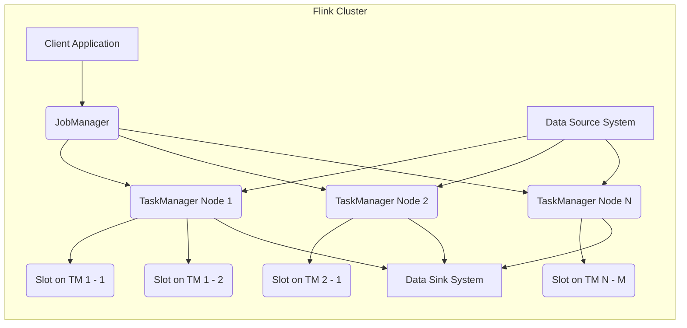
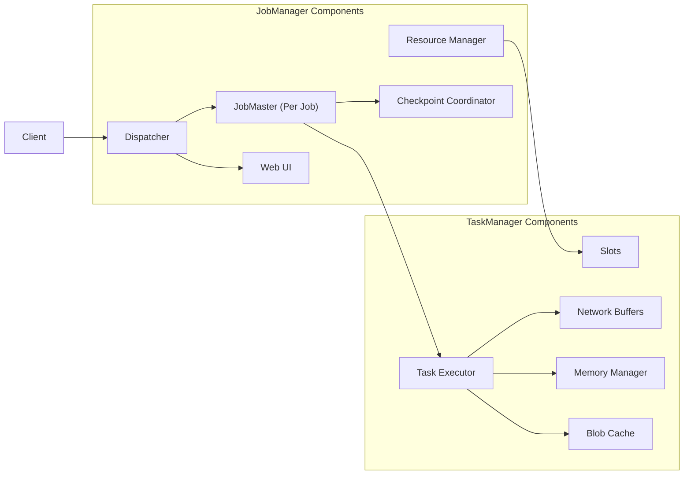
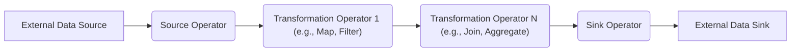

# Project Design Document: Apache Flink (Improved)

**Version:** 1.1
**Date:** October 26, 2023
**Author:** AI Software Architect

## 1. Introduction

This document provides an enhanced architectural overview of Apache Flink, a distributed stream and batch processing engine. Building upon the previous version, this iteration offers more granular detail and clarifies key aspects relevant to threat modeling. The focus remains on the core architectural elements and their security implications.

## 2. Goals and Objectives

The fundamental goals of Apache Flink are:

*   **Ultra-high-throughput and low-latency stream processing:**  Enabling near real-time analytics and event-driven architectures with minimal delay.
*   **Unified engine for stream and batch processing:**  Providing a consistent programming model and execution environment where batch processing is treated as bounded stream processing.
*   **Strong consistency and exactly-once processing guarantees:** Ensuring data integrity and reliable results even in the presence of failures.
*   **Horizontal scalability and robust fault tolerance:**  Distributing workloads across a cluster of machines and automatically recovering from node failures.
*   **Flexible deployment options and extensibility:** Supporting diverse deployment environments and allowing integration with various data sources, sinks, and custom logic.

## 3. High-Level Architecture

Apache Flink operates as a distributed system employing a master-worker architecture. The interplay between the central coordinator and the worker nodes is crucial for executing user-defined applications.

*   **Client Application:**  The user program that defines the data processing logic and submits it as a "job" to the Flink cluster. This could be a Java/Scala application or use Flink's Table API or SQL.
*   **JobManager:** The central coordinating entity within the Flink cluster. It manages job submissions, resource allocation, task scheduling, and overall cluster coordination.
*   **TaskManager Node:** Worker processes responsible for executing the individual tasks of a Flink application. Each TaskManager runs on a separate machine or container.
*   **Slot:** A unit of resource allocation within a TaskManager. Slots represent a fixed share of the TaskManager's resources (CPU, memory). Multiple tasks from the same or different jobs can run concurrently within different slots on the same TaskManager.
*   **Data Source System:** External systems from which Flink reads input data. Examples include Apache Kafka, Apache Cassandra, cloud storage (S3, GCS), and various databases.
*   **Data Sink System:** External systems to which Flink writes the processed output data. Examples include Apache Kafka, databases, filesystems, and message queues.

## 4. Detailed Component Architecture

This section provides a more in-depth look at the internal components of the JobManager and TaskManager and their interactions.

### 4.1. JobManager Components (Detailed)

*   **Resource Manager:**  Responsible for managing and allocating cluster resources (TaskManager slots). It tracks the availability of TaskManagers and their slots, and grants resource requests from the JobMasters. It can integrate with external resource management frameworks like YARN or Kubernetes.
*   **Dispatcher:** The first point of contact for client applications submitting jobs. It receives job submissions, persists them, and starts a dedicated JobMaster for each submitted job. It also hosts the Flink Web UI, providing monitoring and management capabilities.
*   **JobMaster (Per Job):**  Manages the execution lifecycle of a single Flink job. Its responsibilities include:
    *   Requesting and allocating resources from the Resource Manager.
    *   Scheduling tasks (the individual units of work within a job) to available slots on TaskManagers.
    *   Monitoring the progress of task execution and handling failures.
    *   Coordinating checkpoints with the Checkpoint Coordinator.
    *   Maintaining the job's state and metadata.
*   **Checkpoint Coordinator:**  Orchestrates the checkpointing process, which is fundamental for Flink's fault tolerance and exactly-once processing guarantees. It coordinates the periodic saving of the application's state to persistent storage.
*   **Web UI:** Provides a web-based interface for monitoring the status of Flink jobs, the cluster's health, and various metrics. It allows for basic management operations like cancelling jobs.

### 4.2. TaskManager Components (Detailed)

*   **Slots:**  Represent isolated units of computation within a TaskManager. Each slot has a fixed amount of resources (CPU cores, memory). Slots enable parallel execution of tasks, either from the same job or different jobs.
*   **Network Buffers:**  Used for buffering data exchanged between tasks running on different TaskManagers. Flink uses a sophisticated buffering mechanism to ensure efficient and reliable data transfer over the network.
*   **Memory Manager:**  Manages the memory allocated to the TaskManager, including memory for task execution, network buffers, and other internal data structures.
*   **Task Executor:**  The core component responsible for executing the individual tasks assigned to the TaskManager. It receives tasks from the JobMaster and processes data according to the task's defined logic.
*   **Blob Cache:** A local cache on each TaskManager used to store large application artifacts (like JAR files) and configuration files. This avoids redundant downloads from a central repository.

## 5. Data Flow (Enhanced)

The journey of data through a Flink application involves a series of transformations executed by operators. Understanding this flow is crucial for identifying potential data security vulnerabilities.

*   **External Data Source:** The origin of the data being processed. Flink connects to various sources using connectors. Security considerations include authentication and authorization to access the source.
*   **Source Operator:**  Responsible for reading data from the external source and emitting it as a data stream or batch within the Flink application. This involves deserialization of the data.
*   **Transformation Operators:**  Apply user-defined logic to the data stream. These operators perform operations like:
    *   **Stateless Operations:**  `Map`, `Filter`, where each element is processed independently.
    *   **Stateful Operations:** `Windowing`, `Aggregation`, `Join`, which require maintaining state across multiple data elements. State management and its security are critical.
*   **Sink Operator:**  Writes the processed data to an external data sink. This involves serialization of the data and authentication/authorization to write to the sink.
*   **External Data Sink:** The destination where the processed data is stored or consumed.

**Key Data Flow Considerations (Expanded):**

*   **Data Serialization and Deserialization:** Data is serialized when moving between operators (especially across the network) and when writing to sinks. The choice of serialization format impacts performance and security (e.g., vulnerabilities in deserialization libraries).
*   **Network Communication:** TaskManagers communicate using TCP/IP. Data exchange between tasks often involves shuffling data across the network. Security protocols like TLS/SSL can be used to encrypt network traffic.
*   **State Management:** Stateful operators maintain internal state, which can be stored in-memory or on disk. For fault tolerance, this state is periodically persisted during checkpoints. The security of the checkpoint storage (e.g., access control, encryption) is paramount. Flink supports different state backends (e.g., memory, RocksDB).
*   **Data Partitioning and Shuffling:**  Data is often partitioned and shuffled between operators to enable parallel processing. Understanding how data is distributed can be important for data locality and security considerations.

## 6. Deployment Considerations (Detailed)

Flink's deployment environment significantly influences the security landscape.

*   **Standalone Cluster:** Flink processes run directly on the operating system of the machines. Security relies on OS-level security measures (firewalls, user permissions). Management and monitoring are typically manual.
*   **YARN (Yet Another Resource Negotiator):** Flink runs as an application within a Hadoop YARN cluster. Security leverages YARN's security features (Kerberos authentication, authorization). Resource management is handled by YARN.
*   **Mesos:** Similar to YARN, Flink can be deployed on an Apache Mesos cluster manager, inheriting Mesos' security mechanisms.
*   **Kubernetes:** Flink can be deployed as containers within a Kubernetes cluster. Security relies on Kubernetes' security features (RBAC, network policies, secrets management). This is a popular deployment option, offering scalability and orchestration.
*   **Cloud Platforms (AWS, Google Cloud, Azure):** Managed Flink services on cloud platforms offer integrated security features provided by the cloud provider (IAM, network security groups, encryption services). These services often simplify deployment and management.

**Security Implications by Deployment Mode:**

*   **Standalone:** Requires careful manual configuration and management of security. More vulnerable if not properly secured.
*   **YARN/Mesos:** Leverages existing cluster security infrastructure, simplifying security management.
*   **Kubernetes:** Offers fine-grained control over security through Kubernetes' features but requires proper configuration.
*   **Cloud Platforms:** Benefits from the cloud provider's security infrastructure but requires understanding and configuring those services correctly.

## 7. Key Components for Threat Modeling (Expanded)

For a comprehensive threat model, consider the following components and their potential vulnerabilities:

*   **Client-JobManager Communication:**
    *   **Threats:** Unauthorized job submission, injection of malicious code through job configurations, eavesdropping on communication channels.
    *   **Considerations:** Authentication mechanisms (e.g., Kerberos), authorization policies, secure communication protocols (TLS/SSL).
*   **JobManager-TaskManager Communication:**
    *   **Threats:** Man-in-the-middle attacks, unauthorized access to task execution, tampering with task assignments.
    *   **Considerations:** Mutual authentication, encrypted communication channels (TLS/SSL), secure internal network.
*   **Inter-TaskManager Communication:**
    *   **Threats:** Eavesdropping on data exchanged between tasks, data corruption during transit.
    *   **Considerations:** Network segmentation, encryption of inter-process communication, integrity checks.
*   **Communication with External Systems (Data Sources and Sinks):**
    *   **Threats:** Unauthorized access to data sources/sinks, injection attacks through data streams, data breaches.
    *   **Considerations:** Secure connectors, proper authentication and authorization credentials, secure storage of credentials, data encryption at rest and in transit.
*   **Checkpointing Mechanism:**
    *   **Threats:** Unauthorized access to checkpoint data, tampering with checkpoint data leading to data corruption or replay attacks.
    *   **Considerations:** Secure storage for checkpoints (e.g., access control, encryption), integrity checks on checkpoint data.
*   **Web UI:**
    *   **Threats:** Cross-site scripting (XSS), cross-site request forgery (CSRF), unauthorized access to monitoring and management functions.
    *   **Considerations:** Authentication and authorization for UI access, input validation, security headers, regular security updates.
*   **State Management:**
    *   **Threats:** Unauthorized access to application state, tampering with state data, information leakage through state.
    *   **Considerations:** Encryption of state data at rest and in transit, access control to state backend, secure configuration of state backend.
*   **Blob Cache:**
    *   **Threats:**  Tampering with cached artifacts, serving malicious artifacts to TaskManagers.
    *   **Considerations:** Integrity checks on cached blobs, secure access to the blob storage location.

## 8. Security Considerations (Detailed)

This section expands on the initial security considerations, providing more specific examples and potential vulnerabilities.

*   **Authentication and Authorization:**
    *   **Mechanisms:** Kerberos integration, custom authentication plugins, integration with cloud provider IAM.
    *   **Vulnerabilities:** Weak passwords, misconfigured authentication, lack of granular authorization controls.
*   **Network Security:**
    *   **Measures:** TLS/SSL encryption for inter-component communication and communication with external systems, network segmentation, firewalls.
    *   **Vulnerabilities:** Unencrypted communication channels, misconfigured firewalls, exposed ports.
*   **Data Encryption:**
    *   **Scope:** Encryption of data at rest (checkpoints, state backends) and in transit (network communication).
    *   **Technologies:**  Encryption at the storage layer, encryption within Flink using custom serializers or libraries.
    *   **Vulnerabilities:** Unencrypted data storage, weak encryption algorithms, insecure key management.
*   **Access Control:**
    *   **Levels:** Access control to the Flink cluster, access control to specific jobs or resources, access control to the Web UI.
    *   **Implementation:** Role-Based Access Control (RBAC), integration with external authorization systems.
    *   **Vulnerabilities:** Overly permissive access controls, privilege escalation.
*   **Input Validation:**
    *   **Importance:** Preventing injection attacks (e.g., SQL injection if interacting with databases).
    *   **Implementation:** Validating data at the source operator, using parameterized queries.
    *   **Vulnerabilities:** Lack of input validation, improper sanitization of input data.
*   **Dependency Management:**
    *   **Risks:** Vulnerabilities in third-party libraries used by Flink or user applications.
    *   **Mitigation:** Regularly scanning dependencies for vulnerabilities, using dependency management tools.
*   **Logging and Auditing:**
    *   **Purpose:** Tracking security-related events, aiding in incident response.
    *   **Considerations:** Comprehensive logging of authentication attempts, authorization decisions, and critical system events. Secure storage and access control for logs.

## 9. Future Considerations

The architecture of Apache Flink is continuously evolving. Future developments that may impact security include:

*   **Further enhancements to security features:**  More fine-grained authorization, improved encryption options, enhanced auditing capabilities.
*   **New data source and sink connectors:**  Each new connector introduces potential new security considerations.
*   **Evolution of resource management and scheduling:** Changes in how resources are managed could impact security boundaries.
*   **Developments in state management:** New state backends or features might introduce new security challenges.

This improved design document provides a more detailed and nuanced understanding of Apache Flink's architecture, serving as a stronger foundation for identifying and mitigating potential security threats. Continuous review and updates are essential to keep pace with the evolving nature of the platform.
