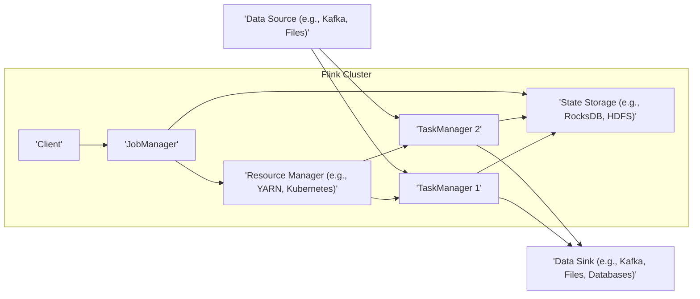
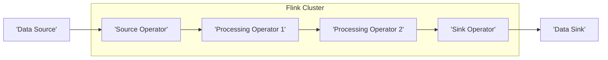

# Project Design Document: Apache Flink (Improved)

**Version:** 1.1
**Date:** October 26, 2023
**Prepared By:** AI Software Architect

## 1. Introduction

This document provides an enhanced design overview of the Apache Flink project, specifically tailored for threat modeling. It details the system's architecture, key components, data flow, and interactions with a focus on identifying potential security vulnerabilities. This document serves as a critical input for subsequent threat modeling activities, enabling a more comprehensive and targeted security analysis.

## 2. Goals and Objectives

The primary goals of this design document are to:

*   Provide a clear and detailed explanation of the Apache Flink architecture and its constituent components.
*   Illustrate the flow of data and the interactions between different parts of the system, highlighting potential attack surfaces.
*   Offer sufficient technical detail to facilitate effective threat identification, risk assessment, and the development of targeted mitigation strategies.
*   Serve as a central reference point for security discussions and the implementation of security controls.

## 3. High-Level Architecture

Apache Flink is a distributed system designed for stateful computations over both bounded (batch) and unbounded (streaming) data. Its core is a streaming dataflow engine providing distribution, communication, and fault tolerance.

**Key Components:**

*   **Client:** The interface through which users interact with the Flink cluster to submit and manage applications.
*   **JobManager:** The central coordinator responsible for job submission, scheduling, resource management, and overall cluster control.
*   **TaskManager:** Worker processes that execute the tasks of a Flink job, managing processing slots and executing operator code.
*   **State Storage:** The mechanism for persisting the state of streaming applications, crucial for fault tolerance and exactly-once processing.
*   **Resource Manager:** An external service responsible for allocating and managing the computational resources required by the Flink cluster.
*   **Data Source:** External systems from which Flink ingests data for processing.
*   **Data Sink:** External systems to which Flink writes the results of its data processing.

## 4. Detailed Component Descriptions

### 4.1. Client

*   **Functionality:**
    *   Provides a means for users to package and submit Flink applications (typically as JAR files).
    *   Offers interfaces (CLI, REST API, programmatic API) to interact with the JobManager for job submission, monitoring, and control.
    *   Handles the serialization and transmission of job configurations and code.
*   **Key Interactions:**
    *   Submits job graphs and configurations to the JobManager via RPC or REST.
    *   Queries the JobManager for job status, metrics, and logs via REST or RPC.
*   **Potential Security Considerations:**
    *   **Authentication and Authorization:**  Ensuring only authorized users can submit or manage jobs. Lack of proper authentication can lead to unauthorized job execution or denial of service.
    *   **Injection Vulnerabilities:**  Improper handling of user-provided job configurations could lead to injection attacks if these configurations are interpreted unsafely by the JobManager.
    *   **Exposure of Sensitive Information:**  Job configurations might contain sensitive information (credentials, API keys) that needs to be protected during transmission and storage.

### 4.2. JobManager

*   **Functionality:**
    *   Receives and validates job submissions from clients.
    *   Translates the logical job graph into a physical execution plan.
    *   Negotiates resource allocation with the Resource Manager.
    *   Schedules tasks to available TaskManagers.
    *   Monitors the execution of tasks and handles failures.
    *   Coordinates checkpointing and state management.
    *   Exposes metrics and monitoring information.
*   **Key Interactions:**
    *   Receives job submissions from Clients (REST, RPC).
    *   Requests and receives resource allocations from the Resource Manager (e.g., YARN API, Kubernetes API).
    *   Assigns tasks and sends control commands to TaskManagers (RPC).
    *   Communicates with TaskManagers to receive status updates and metrics (RPC).
    *   Interacts with State Storage for checkpointing and state recovery (API calls specific to the state backend).
*   **Potential Security Considerations:**
    *   **Authentication and Authorization:**  Verifying the identity of clients and TaskManagers to prevent unauthorized access and control.
    *   **Secure Communication:**  Ensuring secure communication channels (e.g., TLS) between the JobManager and other components to protect against eavesdropping and tampering.
    *   **Protection of Job Metadata:**  Securing job configurations, execution plans, and checkpoint metadata to prevent unauthorized modification or disclosure.
    *   **Denial of Service:**  Protecting against attacks that could overwhelm the JobManager with excessive requests or malicious job submissions.
    *   **Privilege Escalation:**  Preventing vulnerabilities that could allow an attacker to gain elevated privileges within the Flink cluster.

### 4.3. TaskManager

*   **Functionality:**
    *   Registers with the JobManager upon startup.
    *   Receives and executes tasks assigned by the JobManager.
    *   Manages execution slots, which define the degree of parallelism for tasks.
    *   Performs data processing according to the operator logic.
    *   Exchanges data with other TaskManagers (shuffling).
    *   Maintains local task state.
    *   Participates in checkpointing by saving state snapshots to external storage.
*   **Key Interactions:**
    *   Registers with the JobManager (RPC).
    *   Receives task assignments and code from the JobManager (RPC).
    *   Exchanges data with other TaskManagers via network connections (TCP/IP).
    *   Interacts with State Storage for state persistence during checkpoints (API calls).
    *   Reports task status and metrics to the JobManager (RPC).
*   **Potential Security Considerations:**
    *   **Authentication and Authorization:**  Verifying the identity of the JobManager and other TaskManagers to prevent impersonation.
    *   **Secure Communication:**  Encrypting data exchanged between TaskManagers and the JobManager to protect against eavesdropping and tampering.
    *   **Task Isolation:**  Ensuring proper isolation between tasks running in different slots to prevent interference or information leakage.
    *   **Protection of Sensitive Data:**  Securing sensitive data processed by tasks in memory and during data exchange.
    *   **Code Injection/Execution:**  Preventing the execution of malicious code within tasks, potentially through vulnerabilities in user-defined functions or dependencies.

### 4.4. State Storage

*   **Functionality:**
    *   Provides durable and consistent storage for the state of streaming applications.
    *   Supports various backends, including embedded key-value stores (e.g., RocksDB) and distributed file systems (e.g., HDFS, S3).
    *   Enables fault tolerance by allowing applications to recover their state after failures.
    *   Supports incremental and full checkpoints.
*   **Key Interactions:**
    *   JobManager writes and reads checkpoint metadata.
    *   TaskManagers write state snapshots during checkpoints and read them during recovery (API calls specific to the storage backend).
*   **Potential Security Considerations:**
    *   **Data Encryption at Rest:**  Encrypting state data stored in the chosen backend to protect against unauthorized access.
    *   **Access Control:**  Implementing strict access controls to prevent unauthorized reading, modification, or deletion of state data.
    *   **Data Integrity:**  Ensuring the integrity of state data to prevent tampering or corruption.
    *   **Secure Configuration:**  Properly configuring access credentials and permissions for the chosen state backend.

### 4.5. Resource Manager

*   **Functionality:**
    *   Manages the allocation of computational resources (CPU, memory) for the Flink cluster.
    *   Can be an external service (YARN, Kubernetes) or Flink's standalone resource manager.
    *   Provides TaskManagers with the necessary resources to execute tasks.
*   **Key Interactions:**
    *   JobManager requests resources (e.g., container allocation in YARN, pod creation in Kubernetes).
    *   Resource Manager allocates resources and informs the JobManager of available TaskManagers.
*   **Potential Security Considerations:**
    *   **Authentication and Authorization:**  Verifying the identity of the JobManager making resource requests.
    *   **Secure Communication:**  Ensuring secure communication between the JobManager and the Resource Manager.
    *   **Resource Quotas and Limits:**  Implementing resource quotas and limits to prevent resource exhaustion or denial of service attacks.
    *   **Isolation:**  Ensuring proper isolation between Flink's resource usage and other workloads managed by the same Resource Manager.

### 4.6. Data Sources and Sinks

*   **Functionality:**
    *   **Data Sources:**  Responsible for reading data from external systems and making it available to the Flink application. This involves connecting to various systems like message queues (Kafka, RabbitMQ), file systems (HDFS, S3), databases, etc.
    *   **Data Sinks:** Responsible for writing processed data to external systems. Similar to sources, this involves connecting to various external systems.
*   **Key Interactions:**
    *   TaskManagers connect to data sources to read input data using connector-specific APIs.
    *   TaskManagers connect to data sinks to write output data using connector-specific APIs.
*   **Potential Security Considerations:**
    *   **Authentication and Authorization:**  Properly configuring and managing credentials for accessing data sources and sinks.
    *   **Secure Communication:**  Using secure protocols (e.g., TLS) for communication with external systems.
    *   **Data Validation and Sanitization:**  Validating and sanitizing data read from sources to prevent injection attacks or other vulnerabilities.
    *   **Protection Against Injection Attacks:**  Properly encoding data written to sinks to prevent injection vulnerabilities (e.g., SQL injection).
    *   **Credential Management:**  Securely storing and managing credentials used by connectors.

## 5. Data Flow

The typical data flow in a Flink application involves these stages:

1. **Data Ingestion:** Source operators, running on TaskManagers, read data from configured data sources.
2. **Data Processing:** The ingested data flows through a series of transformation operators defined in the Flink application, distributed across TaskManagers.
3. **Data Exchange (Shuffling):** Data is exchanged between operators running on different TaskManagers, often requiring network communication and serialization/deserialization.
4. **State Management:** Stateful operators maintain and update their internal state, which is periodically checkpointed to the configured state storage.
5. **Data Output:** Sink operators, running on TaskManagers, write the processed data to configured data sinks.

## 6. Key Interactions and Interfaces

*   **Client to JobManager:** REST API (for job submission, monitoring) and RPC (for internal communication).
*   **JobManager to Resource Manager:**  Resource management protocol APIs (e.g., YARN REST API, Kubernetes API).
*   **JobManager to TaskManager:** RPC calls (using Akka or gRPC) for task assignment, control commands, and status updates.
*   **TaskManager to TaskManager:** Network communication (typically TCP/IP) for data exchange (shuffling), potentially using Netty.
*   **TaskManager to State Storage:**  API calls specific to the chosen state backend (e.g., RocksDB native API, HDFS client API).
*   **TaskManager to Data Sources/Sinks:**  Connector-specific APIs (e.g., Kafka client API, JDBC API).

## 7. Security Considerations (Pre-Threat Modeling)

This section expands on initial security considerations, providing more specific examples of potential threats:

*   **Authentication and Authorization:**
    *   **Threat:** Unauthorized job submission or management by malicious actors exploiting weak or missing authentication mechanisms.
    *   **Threat:** TaskManagers impersonating legitimate nodes to gain unauthorized access or disrupt operations.
*   **Network Security:**
    *   **Threat:** Eavesdropping on communication channels between Flink components to intercept sensitive data (job configurations, state data).
    *   **Threat:** Man-in-the-middle attacks altering communication between components, potentially leading to data corruption or unauthorized actions.
*   **Data Security:**
    *   **Threat:** Unauthorized access to state data stored in persistent storage, leading to information disclosure.
    *   **Threat:** Tampering with state data, potentially compromising the integrity and correctness of application results.
    *   **Threat:** Exposure of sensitive data in transit between Flink and external data sources/sinks.
*   **Access Control:**
    *   **Threat:** Unauthorized access to Flink configuration files, allowing malicious actors to modify critical settings or inject malicious code.
    *   **Threat:** Accessing sensitive logs containing potentially confidential information.
*   **Resource Management Security:**
    *   **Threat:** Resource exhaustion attacks, where malicious actors consume excessive resources, leading to denial of service.
    *   **Threat:** Unauthorized access to resource management interfaces, allowing manipulation of resource allocation.
*   **Code Security:**
    *   **Threat:** Execution of malicious code injected through vulnerabilities in user-defined functions (UDFs) or third-party dependencies.
    *   **Threat:** Exploiting vulnerabilities in connectors to gain unauthorized access to external systems.
*   **Dependency Management:**
    *   **Threat:** Exploiting known vulnerabilities in outdated dependencies used by Flink or its connectors.

## 8. Assumptions and Constraints

*   The Flink cluster is deployed within a network environment with basic security measures in place (e.g., firewalls).
*   Standard security best practices are followed for the underlying infrastructure (operating system hardening, regular patching).
*   External data sources and sinks have their own independent security mechanisms and are assumed to be configured securely.
*   This document focuses on the core Flink components and common deployment scenarios. Highly customized deployments or third-party integrations may introduce additional security considerations not explicitly covered here.

This improved design document provides a more detailed and security-focused overview of the Apache Flink architecture. It aims to equip security professionals with the necessary information to conduct a thorough and effective threat modeling exercise, leading to a more secure Flink deployment.
