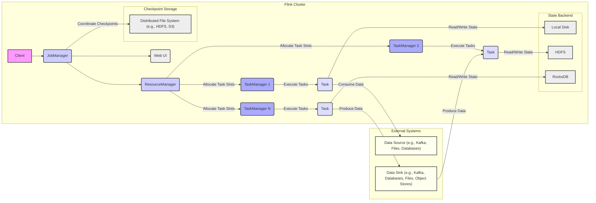

# Project Design Document: Apache Flink

**Version:** 1.1
**Date:** October 26, 2023
**Author:** AI Software Architect

## 1. Introduction

This document provides a detailed design overview of the Apache Flink project, focusing on aspects relevant for threat modeling. It outlines the key architectural components, data flow, technologies, and deployment options. This document serves as a foundation for identifying potential security vulnerabilities and threats.

## 2. Project Overview

Apache Flink is a distributed stream processing framework designed for stateful computations over both unbounded and bounded data streams. Its architecture prioritizes high throughput and low latency, making it suitable for real-time analytics, event-driven applications, and complex data pipelines. Flink offers exactly-once processing guarantees and robust fault tolerance mechanisms.

## 3. System Architecture

The Flink architecture follows a master-slave pattern, with a central JobManager coordinating the execution of tasks across multiple TaskManagers.

## 4. Component Breakdown

This section provides a detailed breakdown of the core Flink components, highlighting their responsibilities and interactions.

*   **Client:**
    *   The entry point for submitting Flink applications.
    *   Packages user code (JAR files) and job configurations.
    *   Communicates with the JobManager to initiate job execution.
    *   Authentication and authorization mechanisms at this level are crucial.

*   **JobManager:**
    *   The central coordinator of the Flink cluster, responsible for:
        *   **Job Submission and Management:** Receiving, validating, and managing the lifecycle of Flink jobs.
        *   **Resource Management:** Interacting with the ResourceManager to acquire and release resources.
        *   **Task Scheduling and Deployment:** Assigning tasks to available TaskManagers.
        *   **State Management and Checkpointing:** Coordinating state persistence and fault tolerance mechanisms.
        *   **Monitoring and Coordination:** Tracking job progress and handling failures.
    *   Key sub-components:
        *   **Dispatcher:**  Receives job submissions and starts the corresponding JobMaster. Responsible for initial authentication and authorization checks.
        *   **ResourceManager:** Manages cluster resources (TaskManager slots). Interacts with underlying resource providers (e.g., YARN, Kubernetes). Security considerations include preventing unauthorized resource requests.
        *   **JobMaster:** Manages the execution of a single job. Maintains the job graph, schedules tasks, and coordinates checkpoints. Sensitive information about the job execution resides here.
        *   **Checkpoint Coordinator:** Orchestrates the checkpointing process, ensuring consistent state backups. Secure access to checkpoint storage is vital.

*   **ResourceManager:**
    *   Manages the pool of available TaskManager resources.
    *   Negotiates with resource providers (e.g., YARN, Kubernetes) to allocate and deallocate TaskManagers.
    *   Tracks the capacity and availability of TaskManagers.
    *   Security considerations involve preventing unauthorized resource allocation or denial-of-service attacks.

*   **TaskManager:**
    *   The worker nodes that execute the tasks of a Flink job.
    *   Manages task slots, which are units of computation within a TaskManager.
    *   Executes individual tasks, processing data and managing local state.
    *   Communicates with other TaskManagers for data exchange.
    *   Security considerations include isolating tasks, securing inter-task communication, and protecting access to local resources.

*   **Task Slots:**
    *   Represent a fixed amount of resources (CPU, memory) within a TaskManager.
    *   Provide resource isolation between tasks.
    *   Tasks from the same or different jobs can run in different slots within the same TaskManager.

*   **Task:**
    *   The fundamental unit of work in Flink, representing an operator in the dataflow graph.
    *   Processes data records, performs computations, and manages operator state.
    *   Security considerations involve preventing malicious code execution within tasks and ensuring data integrity.

*   **Web UI:**
    *   Provides a web-based interface for monitoring the Flink cluster and running jobs.
    *   Displays information about job status, resource utilization, logs, and configuration.
    *   Authentication and authorization are critical to prevent unauthorized access to sensitive information and control functionalities.

*   **State Backend:**
    *   Manages the state of operators in a Flink job, determining how state is stored and accessed.
    *   Impacts performance, durability, and scalability.
    *   Common state backends:
        *   **MemoryStateBackend:** Stores state in-memory (volatile, not recommended for production).
        *   **FsStateBackend:** Stores state on a file system (local or distributed). Access control to the file system is crucial.
        *   **RocksDBStateBackend:** Stores state in an embedded RocksDB database on local disk. Security considerations include securing local disk access.

*   **Checkpoint Storage:**
    *   Stores persistent snapshots of the application state (checkpoints) for fault tolerance.
    *   Typically a distributed file system like HDFS or object storage like S3.
    *   Secure access to checkpoint storage is paramount to prevent data loss or corruption.

## 5. Data Flow

Understanding the data flow is crucial for identifying potential data breaches or manipulation points.

1. **Job Submission:** The Client submits a Flink application (JAR file and configuration) to the JobManager, often via a REST API or command-line interface. This communication channel needs to be secured (e.g., HTTPS).
2. **Job Graph Construction:** The JobManager translates the application code into a logical dataflow graph (JobGraph) and then a physical execution graph (ExecutionGraph).
3. **Resource Allocation:** The ResourceManager allocates TaskManagers and task slots based on the ExecutionGraph requirements. This involves communication with underlying resource management systems.
4. **Task Deployment:** The JobManager deploys the individual tasks of the job to the allocated TaskManagers. This involves transferring task code and configurations.
5. **Data Ingestion:** TaskManagers receive data from configured data sources. This can involve various protocols and formats, each with its own security considerations (e.g., Kafka authentication, database credentials).
6. **Operator Execution and Data Processing:** Tasks execute the operators defined in the dataflow graph, processing data records. Data transformations and computations occur here.
7. **State Access and Management:** Operators access and update their state using the configured state backend. This involves read/write operations to the chosen storage medium.
8. **Inter-Task Communication:** Tasks exchange data with each other over the network, as defined by the dataflow graph (e.g., using Netty). This communication needs to be secured (e.g., encryption).
9. **Checkpointing:** The Checkpoint Coordinator periodically triggers checkpoints. TaskManagers persist their state to the configured checkpoint storage. This data needs to be protected at rest.
10. **Data Egress:** Processed data is written to configured data sinks. Similar to data ingestion, this involves various protocols and formats with their own security implications.

## 6. Key Technologies

Flink leverages several technologies, each with its own security landscape.

*   **Java/Scala:** The primary programming languages. Vulnerabilities in the JVM or language libraries can impact Flink.
*   **Akka:** Used for distributed communication and actor-based concurrency within the JobManager and TaskManagers. Securing Akka remoting is important.
*   **Netty:** Used for efficient network communication. Proper configuration and usage are crucial for secure communication.
*   **ZooKeeper (Optional):** Used for high-availability coordination of JobManagers. Securing access to ZooKeeper is essential.
*   **YARN/Kubernetes/Mesos (Optional):** Used for resource management. Security depends on the configuration and security of the underlying resource management platform.
*   **File Systems (Local/Distributed):** Used for state backend and checkpoint storage. Access control and encryption are key security measures.

## 7. Deployment Options

The deployment environment significantly impacts the security posture of a Flink application.

*   **Standalone Cluster:** Flink processes run directly on a set of machines. Security relies on operating system and network security configurations.
*   **YARN (Hadoop):** Flink runs as an application within a YARN cluster. Security is integrated with YARN's security features (e.g., Kerberos).
*   **Kubernetes:** Flink runs as containers orchestrated by Kubernetes. Security relies on Kubernetes security policies, network policies, and container security best practices.
*   **Mesos:** Flink runs on a Mesos cluster. Security is integrated with Mesos' security features.
*   **Cloud Platforms (AWS, Azure, GCP):** Managed Flink services or deployments on cloud infrastructure. Security relies on the cloud provider's security controls and configurations.

## 8. Security Considerations

This section expands on the high-level security considerations, providing more specific areas for threat modeling.

*   **Authentication and Authorization:**
    *   **User Authentication:** Verifying the identity of users accessing the Flink cluster (e.g., via the Web UI, CLI).
    *   **Job Submission Authorization:** Controlling which users can submit and manage Flink jobs.
    *   **Component Authentication:** Securing communication between Flink components (JobManager, TaskManagers).
    *   **Web UI Access Control:** Restricting access to the Web UI based on user roles.

*   **Network Security:**
    *   **Encryption in Transit:** Protecting data exchanged between Flink components and external systems using protocols like TLS/SSL.
    *   **Network Segmentation:** Isolating the Flink cluster network from other networks to limit the impact of breaches.
    *   **Firewall Rules:** Configuring firewalls to restrict network access to necessary ports and services.

*   **Data Security:**
    *   **Encryption at Rest:** Encrypting sensitive data stored in state backends and checkpoint storage.
    *   **Data Validation and Sanitization:** Preventing injection attacks by validating and sanitizing input data.
    *   **Access Control to Data Sources and Sinks:** Ensuring only authorized Flink jobs can access external data systems.

*   **Resource Management Security:**
    *   **Resource Quotas:** Limiting the resources that individual jobs or users can consume to prevent resource exhaustion.
    *   **TaskManager Isolation:** Isolating TaskManager processes to prevent interference or malicious activity.
    *   **Preventing Unauthorized Resource Requests:** Securing the communication between the JobManager and ResourceManager.

*   **Dependency Management:**
    *   **Vulnerability Scanning:** Regularly scanning dependencies for known vulnerabilities.
    *   **Dependency Whitelisting:** Restricting the use of specific libraries to reduce the attack surface.

*   **Code Security:**
    *   **Secure Coding Practices:** Following secure coding guidelines when developing Flink applications.
    *   **Input Validation:** Validating all external inputs to prevent injection attacks.
    *   **Regular Security Audits:** Conducting security audits of Flink applications and configurations.

*   **Logging and Monitoring:**
    *   **Security Logging:** Logging security-related events for auditing and incident response.
    *   **Intrusion Detection:** Implementing systems to detect and respond to malicious activity.

This detailed design document provides a comprehensive overview of the Apache Flink architecture and highlights key areas relevant for threat modeling. The information presented here will be used to systematically identify potential vulnerabilities and develop appropriate security mitigations.