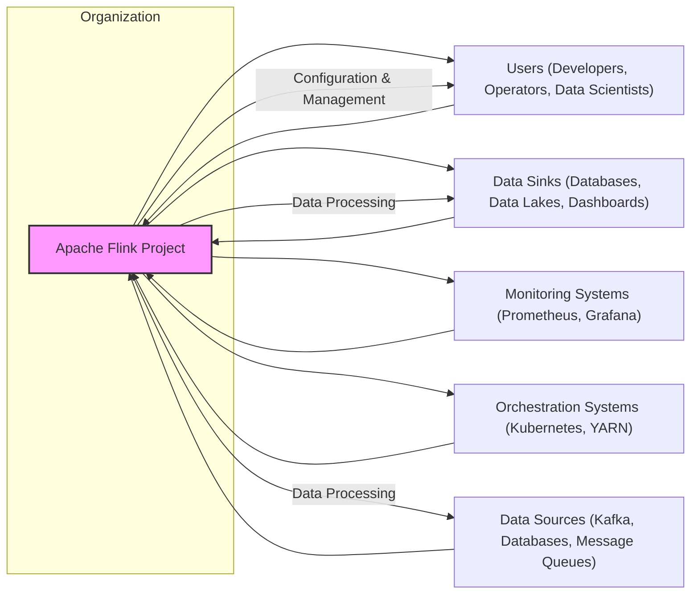
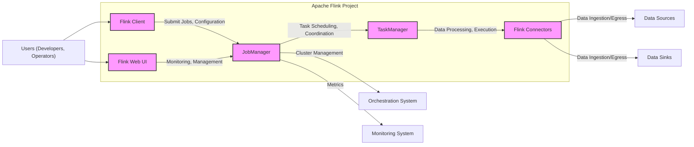
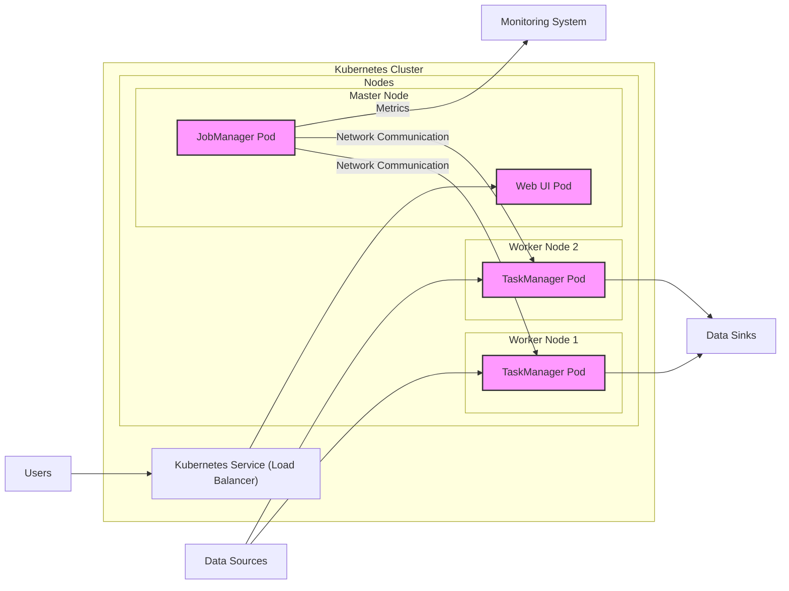

# BUSINESS POSTURE

The Apache Flink project aims to provide a versatile stream processing framework capable of handling both batch and stream data processing with high performance and scalability. It targets businesses that require real-time data analysis, event-driven applications, data pipelines, and analytics.

Business priorities and goals:
- Provide a robust and scalable platform for stream and batch data processing.
- Offer high-performance data processing capabilities with low latency.
- Support a wide range of data sources and sinks.
- Enable complex event processing and stateful computations.
- Foster a vibrant open-source community and ecosystem.

Most important business risks:
- Service disruption due to system failures or security vulnerabilities impacting critical data processing pipelines.
- Data integrity issues leading to incorrect analytical results and business decisions.
- Performance bottlenecks hindering real-time processing capabilities and impacting service level agreements.
- Data breaches exposing sensitive data processed by Flink applications, leading to reputational damage and regulatory fines.
- Vendor lock-in if relying heavily on specific cloud provider features for Flink deployment and management.

# SECURITY POSTURE

Existing security controls:
- security control: Code reviews are conducted by the open-source community as part of the contribution process. (Location: GitHub Pull Request reviews)
- security control: Public vulnerability reporting and disclosure process through Apache Security Mailing lists. (Location: Apache Security website and project documentation)
- security control: Standard GitHub repository security features like branch protection and access controls. (Location: GitHub repository settings)
- accepted risk: Reliance on community contributions for identifying and fixing security vulnerabilities, which might lead to slower response times compared to dedicated security teams.
- accepted risk: Potential vulnerabilities in third-party dependencies used by Flink, requiring ongoing monitoring and updates.

Recommended security controls:
- security control: Implement automated security scanning tools (SAST/DAST) in the CI/CD pipeline to identify potential vulnerabilities early in the development lifecycle.
- security control: Conduct regular penetration testing and security audits to proactively identify and address security weaknesses.
- security control: Enhance dependency management practices, including vulnerability scanning of dependencies and automated updates to secure versions.
- security control: Implement robust authentication and authorization mechanisms for accessing Flink management interfaces and APIs.
- security control: Provide clear guidelines and best practices for secure development and deployment of Flink applications to users.

Security requirements:
- Authentication:
  - Requirement: Secure authentication mechanisms should be in place to control access to Flink cluster management interfaces (Web UI, CLI, REST API).
  - Requirement: Consider supporting various authentication methods like Kerberos, LDAP, OAuth 2.0 for integration with existing enterprise identity providers.
- Authorization:
  - Requirement: Implement fine-grained authorization controls to manage access to Flink resources and operations based on user roles and permissions.
  - Requirement: Ensure that authorization policies are consistently enforced across all access points to the Flink cluster.
- Input Validation:
  - Requirement: All external inputs to Flink applications and management interfaces must be thoroughly validated to prevent injection attacks (e.g., SQL injection, command injection).
  - Requirement: Implement input sanitization and encoding to mitigate cross-site scripting (XSS) vulnerabilities in web interfaces.
- Cryptography:
  - Requirement: Sensitive data at rest (e.g., configuration files, checkpoints) should be encrypted to protect confidentiality.
  - Requirement: Data in transit between Flink components and external systems should be encrypted using TLS/SSL to ensure data integrity and confidentiality.
  - Requirement: Provide secure key management practices for cryptographic keys used for encryption and authentication.

# DESIGN

## C4 CONTEXT

Context Diagram Elements:

- Element:
  - Name: Apache Flink Project
  - Type: Software System
  - Description: Apache Flink is an open-source stream processing framework for distributed, high-performing, always-available, and accurate data streaming applications.
  - Responsibilities: Provides a platform for developing and running stream and batch processing applications. Manages data processing, state management, fault tolerance, and scalability.
  - Security controls: Access control to management interfaces, secure configuration management, vulnerability management process.

- Element:
  - Name: Users (Developers, Operators, Data Scientists)
  - Type: Person
  - Description: Individuals who interact with the Flink project to develop, deploy, operate, and monitor Flink applications.
  - Responsibilities: Develop Flink applications, deploy and manage Flink clusters, monitor application performance and health, analyze data processed by Flink.
  - Security controls: Authentication to access Flink management interfaces, authorization based on roles, secure development practices for applications.

- Element:
  - Name: Data Sources (Kafka, Databases, Message Queues)
  - Type: External System
  - Description: External systems that provide data to be processed by Flink applications. Examples include message queues like Kafka, databases, and other data streams.
  - Responsibilities: Ingest data into Flink applications, ensure data availability and reliability, potentially implement data security controls at the source.
  - Security controls: Data source specific security controls (e.g., Kafka ACLs, database access controls), secure communication channels (TLS).

- Element:
  - Name: Data Sinks (Databases, Data Lakes, Dashboards)
  - Type: External System
  - Description: External systems that receive processed data from Flink applications. Examples include databases, data lakes, dashboards, and other downstream systems.
  - Responsibilities: Store processed data, make data available for consumption, potentially implement data security controls at the sink.
  - Security controls: Data sink specific security controls (e.g., database access controls, data encryption at rest), secure communication channels (TLS).

- Element:
  - Name: Monitoring Systems (Prometheus, Grafana)
  - Type: External System
  - Description: External systems used to monitor the health and performance of the Flink cluster and applications.
  - Responsibilities: Collect metrics from Flink, visualize monitoring data, provide alerts for anomalies and failures.
  - Security controls: Authentication and authorization for accessing monitoring data, secure communication channels for metric collection.

- Element:
  - Name: Orchestration Systems (Kubernetes, YARN)
  - Type: External System
  - Description: Cluster management and orchestration systems used to deploy and manage Flink clusters.
  - Responsibilities: Deploy and manage Flink components, provide resource management and scheduling, ensure high availability and scalability.
  - Security controls: Orchestration system specific security controls (e.g., Kubernetes RBAC, network policies), secure configuration and management of the orchestration platform.

## C4 CONTAINER

Container Diagram Elements:

- Element:
  - Name: Flink Client
  - Type: Application
  - Description: Command-line interface and libraries used by developers and operators to interact with the Flink cluster. Used to submit jobs, configure the cluster, and manage applications.
  - Responsibilities: Job submission, cluster configuration, application management, user authentication.
  - Security controls: User authentication (e.g., Kerberos), secure communication with JobManager (TLS), input validation for commands and configurations.

- Element:
  - Name: Flink Web UI
  - Type: Web Application
  - Description: Web-based user interface for monitoring and managing Flink clusters and applications. Provides dashboards, job status, metrics, and configuration options.
  - Responsibilities: Cluster monitoring, job management, configuration management, user authentication and authorization.
  - Security controls: User authentication (e.g., password-based, OAuth 2.0), authorization based on roles, input validation, secure session management, protection against XSS and CSRF attacks, HTTPS for communication.

- Element:
  - Name: JobManager
  - Type: Application
  - Description: The central coordinator of the Flink cluster. Responsible for job scheduling, resource management, task coordination, and cluster management.
  - Responsibilities: Job scheduling and execution, resource allocation, fault tolerance, cluster management, communication with TaskManagers, security management for the cluster.
  - Security controls: Authentication and authorization for inter-component communication, secure storage of cluster state and metadata, access control to management APIs, protection against denial-of-service attacks.

- Element:
  - Name: TaskManager
  - Type: Application
  - Description: Worker nodes in the Flink cluster that execute tasks assigned by the JobManager. Responsible for data processing, state management, and communication with connectors.
  - Responsibilities: Data processing and computation, state management for stream processing, communication with JobManager and other TaskManagers, data exchange with connectors.
  - Security controls: Authentication and authorization for communication with JobManager, secure data processing environment, resource isolation, protection against malicious code execution.

- Element:
  - Name: Flink Connectors
  - Type: Library
  - Description: Libraries that provide connectivity to various data sources and sinks. Enable Flink to read data from and write data to external systems like Kafka, databases, and file systems.
  - Responsibilities: Data ingestion from sources, data egress to sinks, data format conversion, handling source/sink specific authentication and authorization.
  - Security controls: Secure handling of credentials for external systems, input validation for data read from sources, output sanitization for data written to sinks, secure communication with external systems (TLS).

## DEPLOYMENT

Deployment Architecture: Kubernetes Cluster

Deployment Diagram Elements:

- Element:
  - Name: Kubernetes Cluster
  - Type: Infrastructure
  - Description: A Kubernetes cluster used to orchestrate and manage the Flink deployment. Provides container orchestration, resource management, and high availability.
  - Responsibilities: Container orchestration, resource management, service discovery, load balancing, scaling, high availability, security of the Kubernetes platform.
  - Security controls: Kubernetes RBAC, network policies, pod security policies, secrets management, security audits of Kubernetes configuration.

- Element:
  - Name: Worker Node 1 & Worker Node 2
  - Type: Infrastructure
  - Description: Virtual machines or physical servers that host TaskManager pods.
  - Responsibilities: Provide compute resources for TaskManagers, ensure network connectivity, operating system security.
  - Security controls: Operating system hardening, security patching, network security controls (firewalls, network segmentation), access control to nodes.

- Element:
  - Name: Master Node
  - Type: Infrastructure
  - Description: Virtual machine or physical server that hosts JobManager and Web UI pods.
  - Responsibilities: Host control plane components (JobManager, Web UI), ensure high availability of control plane, operating system security.
  - Security controls: Operating system hardening, security patching, network security controls, access control to nodes, secure configuration of control plane components.

- Element:
  - Name: JobManager Pod
  - Type: Container
  - Description: Kubernetes pod running the Flink JobManager container.
  - Responsibilities: Flink cluster coordination, job scheduling, resource management.
  - Security controls: Container image security scanning, resource limits, network policies, security context configuration, application-level security controls of JobManager.

- Element:
  - Name: TaskManager Pod 1 & TaskManager Pod 2
  - Type: Container
  - Description: Kubernetes pods running Flink TaskManager containers.
  - Responsibilities: Data processing, task execution.
  - Security controls: Container image security scanning, resource limits, network policies, security context configuration, application-level security controls of TaskManagers.

- Element:
  - Name: Web UI Pod
  - Type: Container
  - Description: Kubernetes pod running the Flink Web UI container.
  - Responsibilities: Provide web-based management interface.
  - Security controls: Container image security scanning, resource limits, network policies, security context configuration, application-level security controls of Web UI.

- Element:
  - Name: Kubernetes Service (Load Balancer)
  - Type: Infrastructure Service
  - Description: Kubernetes service of type LoadBalancer to expose the Flink Web UI to users.
  - Responsibilities: Load balancing traffic to Web UI pods, external access point for Web UI.
  - Security controls: Network security controls (firewall rules), TLS termination, access control to the load balancer.

## BUILD

```mermaid
flowchart LR
    Developer["Developer"] --> SourceCode["Source Code (GitHub)"]
    SourceCode -- Git Push --> CI["CI System (GitHub Actions)"]
    CI -- Build & Test --> BuildArtifacts["Build Artifacts (JARs)"]
    CI -- Security Checks (SAST, Dependency Scan) --> BuildArtifacts
    BuildArtifacts -- Publish --> ArtifactRepository["Artifact Repository (Maven Central)"]
    ArtifactRepository -- Download --> DeploymentEnvironment["Deployment Environment"]
    style CI fill:#f9f,stroke:#333,stroke-width:2px
    style BuildArtifacts fill:#f9f,stroke:#333,stroke-width:2px
```

Build Process Description:

1. Developer writes code and commits changes to the GitHub repository.
2. Git push to the repository triggers the CI system (e.g., GitHub Actions).
3. CI system automatically builds the project using Maven, runs unit and integration tests.
4. CI system performs security checks, including:
    - Static Application Security Testing (SAST) to identify potential code vulnerabilities.
    - Dependency scanning to detect known vulnerabilities in third-party libraries.
5. If build and security checks are successful, CI system publishes build artifacts (JAR files) to an artifact repository like Maven Central.
6. Deployment environment downloads the necessary artifacts from the artifact repository for deployment.

Security Controls in Build Process:
- security control: Automated build process using CI/CD pipelines to ensure consistency and repeatability. (Location: GitHub Actions workflows in the repository)
- security control: Source code hosted in a version control system (GitHub) with access controls and audit logs. (Location: GitHub repository)
- security control: Static Application Security Testing (SAST) integrated into the CI pipeline to detect code-level vulnerabilities. (Location: To be implemented in CI workflows)
- security control: Dependency scanning integrated into the CI pipeline to identify vulnerable dependencies. (Location: To be implemented in CI workflows)
- security control: Code signing of build artifacts to ensure integrity and authenticity. (Location: To be implemented in build process)
- security control: Access control to the artifact repository to restrict who can publish and download artifacts. (Location: Maven Central/Repository settings)

# RISK ASSESSMENT

Critical business processes we are trying to protect:
- Real-time data processing pipelines that provide timely insights for business operations.
- Continuous data ingestion and processing for event-driven applications.
- Reliable and accurate data analytics for decision-making.
- Uninterrupted operation of Flink-based services that are critical for business continuity.

Data we are trying to protect and their sensitivity:
- Streaming data: Sensitivity depends on the application. Could include personally identifiable information (PII), financial data, or confidential business data. Sensitivity level can range from low to high.
- Application state: Contains intermediate processing results and stateful information. Sensitivity depends on the data being processed. Could be medium to high sensitivity if it reflects sensitive data.
- Configuration data: Includes cluster configuration, job definitions, and credentials. High sensitivity as it can be used to compromise the system.
- Logs: Can contain operational information, debugging data, and potentially sensitive data depending on logging configuration. Sensitivity level can range from low to medium.
- Metrics: Performance and health metrics of the Flink cluster and applications. Low sensitivity in general, but can reveal operational patterns.

# QUESTIONS & ASSUMPTIONS

Questions:
- What is the specific use case for Apache Flink in your organization? Understanding the use case will help tailor security requirements and design considerations.
- What type of data will be processed by Flink, and what is its sensitivity level? This will determine the necessary data protection measures.
- What are the compliance requirements for data processing in your organization (e.g., GDPR, HIPAA, PCI DSS)? Compliance requirements will influence security controls and architecture design.
- What is the expected scale and performance requirements for the Flink deployment? Scale and performance needs will impact infrastructure and security design.
- What is the existing security infrastructure and tooling available in your organization? Leveraging existing security tools and infrastructure can improve efficiency and reduce costs.

Assumptions:
- BUSINESS POSTURE: The primary business goal is to leverage real-time data processing for improved business insights and operational efficiency. High availability and data integrity are critical business requirements.
- SECURITY POSTURE: Security is a significant concern, and the organization aims to implement reasonable security controls to protect data and infrastructure. A risk-based approach to security is preferred, balancing security needs with operational feasibility. Secure software development lifecycle practices are considered important.
- DESIGN: The Flink deployment will be containerized and orchestrated using Kubernetes in a cloud environment. Standard open-source security best practices will be followed. The focus is on securing the Flink platform and applications against common threats.