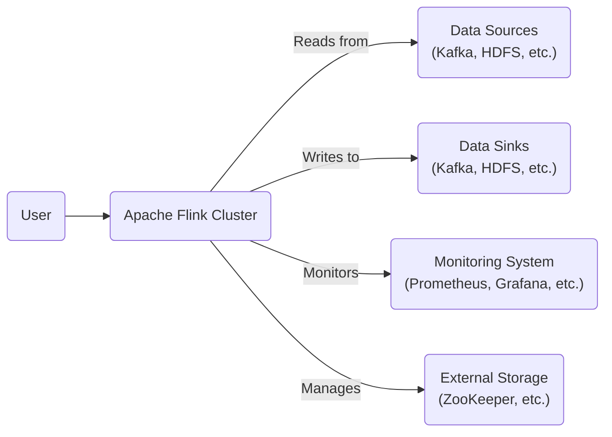
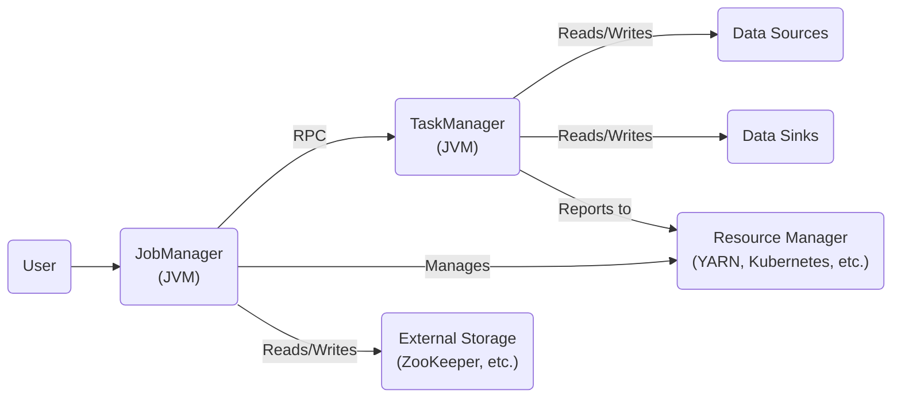
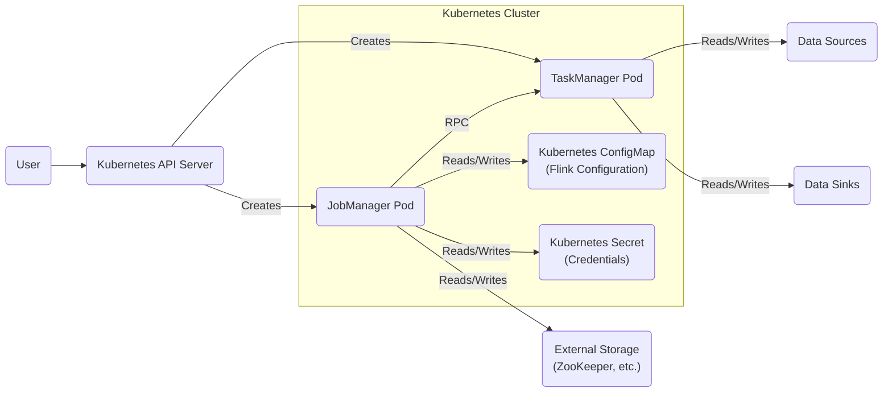
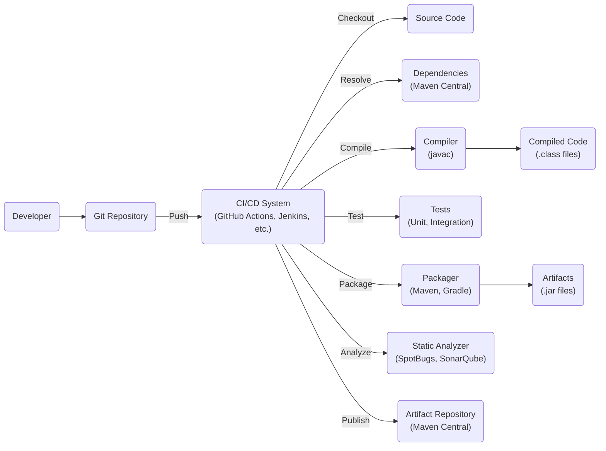

# BUSINESS POSTURE

Apache Flink is a mature, widely-used open-source project. It's not a "fresh startup" but rather a well-established framework with a large community and significant adoption in production environments. The business priorities and goals revolve around:

*   Reliability: Flink is used for mission-critical, real-time data processing. Downtime or data loss can have significant consequences for users.
*   Scalability: Flink needs to handle massive data streams and scale to meet growing demands.
*   Performance: Low-latency processing is crucial for many real-time applications.
*   Accuracy: Data processing must be accurate and consistent.
*   Maintainability: The project needs to be maintainable and evolvable over time.
*   Community: A strong and active community is vital for the long-term success of the project.
*   Usability: Flink should be relatively easy to use and deploy, despite its inherent complexity.
*   Extensibility: The ability to extend Flink with custom connectors, functions, and libraries is important.

Most important business risks that need to be addressed:

*   Data Loss/Corruption: Given Flink's role in processing critical data streams, any loss or corruption of data is a major risk.
*   System Downtime: Unavailability of the Flink cluster can disrupt real-time applications and business operations.
*   Security Breaches: Unauthorized access to data or the Flink cluster could lead to data breaches, manipulation, or denial of service.
*   Performance Degradation: Unexpected performance bottlenecks can impact the ability to meet SLAs for real-time processing.
*   Incompatibility: Breaking changes or compatibility issues between versions can disrupt existing deployments.

# SECURITY POSTURE

Existing security controls (based on reviewing the Apache Flink documentation and common practices):

*   security control: Authentication: Flink supports Kerberos, and TLS/SSL for secure communication. Where: Flink documentation, configuration files.
*   security control: Authorization: Flink supports Access Control Lists (ACLs) to restrict access to resources. Where: Flink documentation, configuration files.
*   security control: Encryption: TLS/SSL can be used to encrypt data in transit. Where: Flink documentation, configuration files.
*   security control: Auditing: Flink provides logging capabilities that can be used for auditing. Where: Flink documentation, logging configuration.
*   security control: Secure Configuration: Flink documentation provides guidance on secure configuration practices. Where: Flink documentation.
*   security control: Dependency Management: Flink uses build tools like Maven and Gradle, which help manage dependencies and their security. Where: pom.xml, build.gradle files.
*   security control: Code Reviews: As an Apache project, Flink likely follows a rigorous code review process. Where: GitHub pull requests.
*   security control: Static Analysis: Static analysis tools are likely used to identify potential security vulnerabilities. Where: CI/CD pipeline, build scripts.

Accepted risks:

*   accepted risk: Complexity: Flink is a complex system, and inherent complexity can introduce security risks.
*   accepted risk: Open Source: While open source offers transparency, it also means that vulnerabilities are publicly visible.
*   accepted risk: User Misconfiguration: Flink's security relies heavily on proper configuration by users. Misconfiguration is a significant risk.
*   accepted risk: Third-Party Dependencies: Flink relies on numerous third-party libraries, which may have their own vulnerabilities.

Recommended security controls (high priority):

*   Implement regular dynamic application security testing (DAST) to identify runtime vulnerabilities.
*   Integrate Software Composition Analysis (SCA) tools to continuously monitor and manage vulnerabilities in third-party dependencies.
*   Enhance input validation and sanitization across all input points, including user-provided configurations and data sources.
*   Implement comprehensive monitoring and alerting for security-related events.
*   Provide more detailed security hardening guides and checklists for different deployment scenarios.
*   Establish a clear vulnerability disclosure and management process.

Security Requirements:

*   Authentication:
    *   Support strong authentication mechanisms (e.g., multi-factor authentication).
    *   Integrate with existing identity providers (e.g., LDAP, Active Directory).
    *   Provide secure credential management.
*   Authorization:
    *   Implement fine-grained access control based on roles and permissions.
    *   Support attribute-based access control (ABAC).
    *   Regularly review and update access control policies.
*   Input Validation:
    *   Validate all inputs from external sources (e.g., user input, data sources, configuration files).
    *   Use whitelisting rather than blacklisting for input validation.
    *   Sanitize data to prevent injection attacks (e.g., SQL injection, cross-site scripting).
*   Cryptography:
    *   Use strong, industry-standard cryptographic algorithms and protocols.
    *   Securely manage cryptographic keys.
    *   Encrypt data at rest and in transit.
    *   Regularly review and update cryptographic configurations.

# DESIGN

## C4 CONTEXT

Element Descriptions:

*   Element:
    *   Name: User
    *   Type: Person
    *   Description: Represents a user interacting with the Flink cluster, submitting jobs, and viewing results.
    *   Responsibilities: Submitting jobs, monitoring job status, viewing results, managing resources.
    *   Security controls: Authentication, Authorization.

*   Element:
    *   Name: Apache Flink Cluster
    *   Type: Software System
    *   Description: The core Apache Flink system responsible for processing data streams.
    *   Responsibilities: Job execution, resource management, fault tolerance, data processing.
    *   Security controls: Authentication, Authorization, Encryption, Auditing, Input Validation.

*   Element:
    *   Name: Data Sources
    *   Type: Software System
    *   Description: External systems that provide input data to the Flink cluster (e.g., Kafka, HDFS, Amazon S3).
    *   Responsibilities: Providing data streams to Flink.
    *   Security controls: Authentication, Authorization (depending on the specific data source).

*   Element:
    *   Name: Data Sinks
    *   Type: Software System
    *   Description: External systems that receive output data from the Flink cluster (e.g., Kafka, HDFS, Amazon S3).
    *   Responsibilities: Storing processed data from Flink.
    *   Security controls: Authentication, Authorization (depending on the specific data sink).

*   Element:
    *   Name: Monitoring System
    *   Type: Software System
    *   Description: External system used to monitor the health and performance of the Flink cluster (e.g., Prometheus, Grafana).
    *   Responsibilities: Collecting metrics, visualizing data, alerting on issues.
    *   Security controls: Authentication, Authorization (depending on the specific monitoring system).

*   Element:
    *   Name: External Storage
    *   Type: Software System
    *   Description: External storage used by Flink for coordination, metadata, and state management (e.g., ZooKeeper, etcd, a database for HA).
    *   Responsibilities: Providing distributed coordination, storing metadata, managing state.
    *   Security controls: Authentication, Authorization, Encryption (depending on the specific storage system).

## C4 CONTAINER

Element Descriptions:

*   Element:
    *   Name: JobManager
    *   Type: Container (JVM Process)
    *   Description: The master process that coordinates the execution of Flink jobs.
    *   Responsibilities: Job scheduling, resource allocation, checkpointing, recovery.
    *   Security controls: Authentication, Authorization, Input Validation, Auditing.

*   Element:
    *   Name: TaskManager
    *   Type: Container (JVM Process)
    *   Description: Worker processes that execute the tasks of a Flink job.
    *   Responsibilities: Task execution, data processing, data exchange.
    *   Security controls: Authentication, Authorization, Input Validation.

*   Element:
    *   Name: Resource Manager
    *   Type: Container (External System)
    *   Description: External system that manages cluster resources (e.g., YARN, Kubernetes, Mesos, or Flink's standalone resource manager).
    *   Responsibilities: Resource allocation, container management.
    *   Security controls: Authentication, Authorization (depending on the specific resource manager).

*   Element:
    *   Name: Data Sources
    *   Type: External System
    *   Description: External systems providing input data.
    *   Responsibilities: Providing data streams.
    *   Security controls: Authentication, Authorization (depending on the specific data source).

*   Element:
    *   Name: Data Sinks
    *   Type: External System
    *   Description: External systems receiving output data.
    *   Responsibilities: Storing processed data.
    *   Security controls: Authentication, Authorization (depending on the specific data sink).

*   Element:
    *   Name: External Storage
    *   Type: External System
    *   Description: External storage for coordination and metadata.
    *   Responsibilities: Distributed coordination, metadata storage.
    *   Security controls: Authentication, Authorization, Encryption (depending on the specific storage system).

## DEPLOYMENT

Flink can be deployed in various ways:

1.  Local: Single JVM for testing.
2.  Standalone Cluster: Flink's own resource management.
3.  YARN: Hadoop YARN.
4.  Mesos: Apache Mesos.
5.  Kubernetes: Container orchestration.
6.  Cloud Provider Managed: AWS EMR, Google Cloud Dataflow, Azure HDInsight, etc.

We'll describe the Kubernetes deployment in detail, as it's a common and complex scenario.

Element Descriptions:

*   Element:
    *   Name: User
    *   Type: Person
    *   Description: User interacting with the Kubernetes cluster.
    *   Responsibilities: Deploying, managing, and monitoring Flink applications.
    *   Security controls: Authentication, Authorization (via Kubernetes RBAC).

*   Element:
    *   Name: Kubernetes API Server
    *   Type: Software System
    *   Description: The control plane for the Kubernetes cluster.
    *   Responsibilities: Managing Kubernetes resources (Pods, Services, etc.).
    *   Security controls: Authentication, Authorization (Kubernetes RBAC), TLS Encryption.

*   Element:
    *   Name: JobManager Pod
    *   Type: Kubernetes Pod
    *   Description: Kubernetes Pod running the Flink JobManager.
    *   Responsibilities: Job scheduling, resource allocation, checkpointing, recovery.
    *   Security controls: Authentication, Authorization, Input Validation, Auditing (inherited from Flink and Kubernetes). Network Policies.

*   Element:
    *   Name: TaskManager Pod
    *   Type: Kubernetes Pod
    *   Description: Kubernetes Pod running the Flink TaskManager.
    *   Responsibilities: Task execution, data processing.
    *   Security controls: Authentication, Authorization, Input Validation (inherited from Flink and Kubernetes). Network Policies.

*   Element:
    *   Name: Kubernetes ConfigMap
    *   Type: Kubernetes ConfigMap
    *   Description: Kubernetes ConfigMap storing Flink configuration.
    *   Responsibilities: Providing configuration to Flink Pods.
    *   Security controls: Kubernetes RBAC.

*   Element:
    *   Name: Kubernetes Secret
    *   Type: Kubernetes Secret
    *   Description: Kubernetes Secret storing sensitive information (credentials).
    *   Responsibilities: Providing credentials securely to Flink Pods.
    *   Security controls: Kubernetes RBAC, Encryption at Rest (depending on Kubernetes configuration).

*   Element:
    *   Name: Data Sources
    *   Type: External System
    *   Description: External systems providing input data.
    *   Responsibilities: Providing data streams.
    *   Security controls: Authentication, Authorization (depending on the specific data source).

*   Element:
    *   Name: Data Sinks
    *   Type: External System
    *   Description: External systems receiving output data.
    *   Responsibilities: Storing processed data.
    *   Security controls: Authentication, Authorization (depending on the specific data sink).

*   Element:
    *   Name: External Storage
    *   Type: External System
    *   Description: External storage for coordination and metadata.
    *   Responsibilities: Distributed coordination, metadata storage.
    *   Security controls: Authentication, Authorization, Encryption (depending on the specific storage system).

## BUILD

Flink uses Maven and Gradle for build automation. The build process involves several steps, including:

1.  Code Checkout: Developers check out code from the Git repository.
2.  Dependency Resolution: Maven/Gradle resolves and downloads dependencies.
3.  Compilation: Java code is compiled into bytecode.
4.  Testing: Unit tests, integration tests, and other tests are executed.
5.  Packaging: JAR files and other artifacts are created.
6.  Static Analysis: Static analysis tools (e.g., FindBugs, SpotBugs, SonarQube) are used to identify potential code quality and security issues.
7.  Documentation Generation: Documentation is generated.
8.  Release: Artifacts are published to a repository (e.g., Maven Central).

Security Controls in Build Process:

*   Dependency Management: Maven/Gradle help manage dependencies and their versions, reducing the risk of using vulnerable libraries.
*   Static Analysis: Static analysis tools identify potential security vulnerabilities in the code.
*   Tests: Automated tests help ensure code quality and prevent regressions, including security-related ones.
*   Reproducible Builds: Efforts are made to ensure builds are reproducible, enhancing auditability and integrity.
*   Signed Artifacts: Released artifacts are often signed to verify their authenticity and integrity.
*   Supply Chain Security: Measures are taken to secure the build pipeline and prevent tampering with dependencies or artifacts. This is an ongoing effort in the open-source community.

# RISK ASSESSMENT

Critical Business Processes:

*   Real-time Data Processing: Flink is used for processing continuous data streams, often in mission-critical applications.
*   Stateful Computations: Flink supports stateful processing, where the results of computations depend on previous events.
*   Fault Tolerance: Flink is designed to be fault-tolerant, ensuring continuous operation even in the presence of failures.

Data Sensitivity:

*   The sensitivity of the data processed by Flink varies greatly depending on the specific use case. It can range from non-sensitive data to highly sensitive personal, financial, or operational data.
*   Flink itself doesn't inherently classify data sensitivity. It's the responsibility of the users to understand and manage the sensitivity of the data they process with Flink.
*   Data processed by Flink can include:
    *   Personally Identifiable Information (PII)
    *   Financial Transactions
    *   Sensor Data
    *   Log Data
    *   Clickstream Data
    *   And many other types of data.

# QUESTIONS & ASSUMPTIONS

Questions:

*   What specific security certifications or compliance requirements (e.g., SOC 2, GDPR, HIPAA) are relevant to users of Flink? This will influence the necessary security controls.
*   What are the most common threat models considered by Flink users? Understanding the threats they face will help prioritize security measures.
*   What level of detail is required for the threat modeling exercise? Should we focus on specific components or the entire system?
*   Are there any specific security concerns raised by the Flink community or users that should be addressed?
*   What are the specific mechanisms used for inter-process communication (IPC) between JobManager and TaskManagers, and how are they secured?
*   How are user-defined functions (UDFs) sandboxed or isolated to prevent malicious code execution?
*   What are the specific auditing capabilities of Flink, and how can they be integrated with external security information and event management (SIEM) systems?

Assumptions:

*   BUSINESS POSTURE: We assume that Flink users prioritize reliability, scalability, performance, and accuracy. We also assume a strong emphasis on community and maintainability.
*   SECURITY POSTURE: We assume that basic security controls like authentication, authorization, and encryption are in place. We also assume a reliance on secure configuration and dependency management.
*   DESIGN: We assume a standard deployment model (e.g., Kubernetes) and typical interactions with data sources, data sinks, and monitoring systems. We assume the use of Maven/Gradle for build automation. We assume that users are responsible for securing their own data and infrastructure.