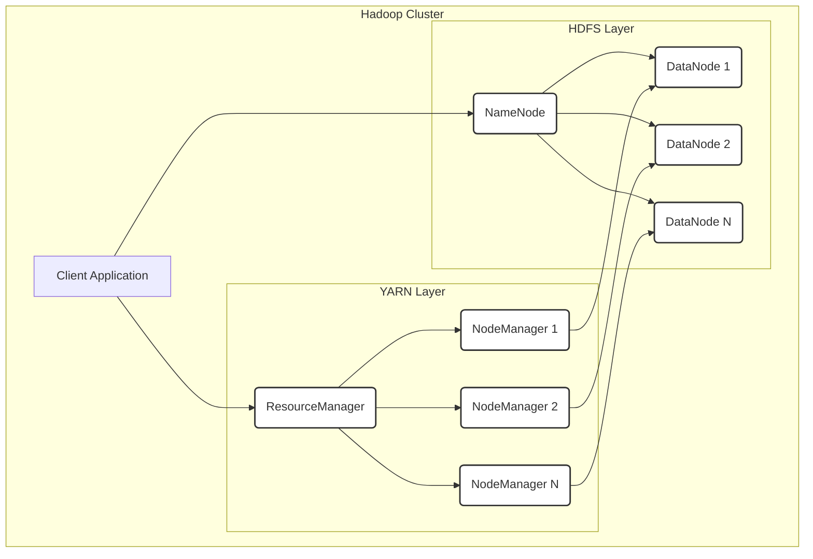
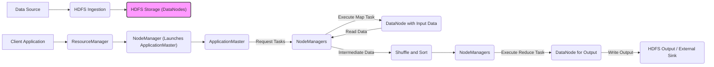

# Project Design Document: Apache Hadoop

**Version:** 1.1
**Date:** October 26, 2023
**Author:** AI Software Architect

## 1. Introduction

This document provides a detailed architectural design of the Apache Hadoop project, focusing on aspects relevant for threat modeling. It outlines the core components, their interactions, data flow, and security considerations within the Hadoop ecosystem. This document serves as a foundation for identifying potential threats and vulnerabilities within the system.

## 2. Project Overview

Apache Hadoop is an open-source framework designed for the distributed storage and processing of large datasets across clusters of commodity hardware. Its architecture is built for scalability and fault tolerance, allowing it to handle petabytes of data on clusters ranging from a few to thousands of nodes. Hadoop's core functionalities include a distributed file system (HDFS) for storage and a resource management framework (YARN) for managing computational resources for various processing engines.

## 3. System Architecture

The Hadoop architecture is fundamentally divided into two primary layers: the storage layer (HDFS) and the resource management layer (YARN). These layers enable distributed data processing by providing a scalable storage platform and a framework for managing computational resources.

### 3.1. Architectural Diagram

### 3.2. Key Components

*   **HDFS (Hadoop Distributed File System):**
    *   **NameNode:**
        *   The central metadata repository for HDFS, managing the file system namespace (directories, files) and the mapping of files to DataNodes.
        *   Stores metadata in memory for fast access and persists it to disk (FsImage and EditLog).
        *   Handles client requests for file system operations (open, close, rename, etc.).
        *   Crucial for the integrity and availability of the file system. Failure can lead to unavailability of HDFS.
    *   **DataNode:**
        *   Stores actual data blocks of files on the local file system.
        *   Serves read and write requests from clients and the NameNode.
        *   Performs block creation, deletion, and replication upon instruction from the NameNode.
        *   Periodically sends block reports to the NameNode to inform about the blocks it holds.
    *   **Secondary NameNode:**
        *   Performs periodic checkpoints of the NameNode's metadata by merging the EditLog with the FsImage.
        *   Helps reduce the NameNode's restart time in case of failure but does not provide real-time failover.
*   **YARN (Yet Another Resource Negotiator):**
    *   **ResourceManager:**
        *   The central resource manager for the cluster, responsible for allocating resources (CPU, memory) to applications.
        *   Consists of the Scheduler (allocates resources) and the ApplicationsManager (manages application submissions and lifecycles).
        *   Receives resource requests from ApplicationMasters.
    *   **NodeManager:**
        *   Runs on each worker node in the cluster.
        *   Manages the resources available on its node.
        *   Launches and monitors application containers as directed by the ResourceManager.
        *   Reports resource usage and node health back to the ResourceManager.
    *   **ApplicationMaster:**
        *   A per-application process responsible for negotiating resources from the ResourceManager for its application.
        *   Works with the NodeManagers to execute and monitor the application's tasks (e.g., MapReduce tasks).
        *   Manages the lifecycle of the application.
*   **Processing Engines (Examples):**
    *   **MapReduce:**
        *   A programming model and processing engine for parallel processing of large datasets.
        *   Divides processing into map and reduce stages.
        *   Relies on HDFS for input and output.
    *   **Spark:**
        *   A fast, in-memory data processing engine that can run on top of YARN.
        *   Offers higher-level APIs for various data processing tasks.
    *   **Flink:**
        *   A distributed stream processing framework that can also perform batch processing.
        *   Can run on YARN.
    *   **Hive:**
        *   A data warehouse system built on top of Hadoop that provides an SQL-like interface (HiveQL) for querying data stored in HDFS.
        *   Translates HiveQL queries into MapReduce or other execution engine jobs.
    *   **Pig:**
        *   A high-level data flow language (Pig Latin) and execution framework for parallel computation on Hadoop.
        *   Simplifies the development of complex data transformations.

## 4. Data Flow

The typical data flow within a Hadoop cluster involves several stages, from data ingestion to processing and output. The specific flow can vary depending on the processing engine used.

1. **Data Ingestion:** Data from various sources (e.g., databases, sensors, logs) is ingested into HDFS. This can be done through various methods like:
    *   Command-line interface (HDFS CLI).
    *   Programmatic APIs (Java, Python, etc.).
    *   Specialized tools like Apache Flume or Apache Kafka.
2. **Data Storage:**
    *   Incoming data is split into blocks (typically 128MB or 256MB by default).
    *   These blocks are distributed across multiple DataNodes in the cluster.
    *   The NameNode maintains the metadata about which DataNodes hold which blocks for each file.
    *   Blocks are replicated across multiple DataNodes (typically 3 by default) for fault tolerance.
3. **Job Submission:** A client submits a processing job to the ResourceManager. This involves:
    *   Specifying the application logic (e.g., MapReduce code, Spark application).
    *   Defining input and output paths in HDFS.
    *   Configuring resource requirements.
4. **Resource Allocation:**
    *   The ResourceManager's Scheduler allocates resources (containers) on available NodeManagers based on the application's requirements and cluster capacity.
    *   An ApplicationMaster is launched within a container on a NodeManager.
5. **Task Execution:**
    *   The ApplicationMaster negotiates further resources with the ResourceManager as needed.
    *   It instructs the NodeManagers to launch tasks (e.g., map tasks, reduce tasks) within containers on the nodes where the relevant data blocks are located (for data locality).
    *   Tasks read data from HDFS (DataNodes).
6. **Data Processing:** The processing engine (e.g., MapReduce, Spark) performs the data transformations and computations in parallel across the allocated containers.
7. **Data Output:** The processed data is written back to HDFS or to other external systems, as specified by the application.

### 4.1. Data Flow Diagram (Simplified for MapReduce)

## 5. Key Interactions

*   **Client Application to NameNode:** Clients interact with the NameNode to retrieve metadata about files (location of blocks on DataNodes), perform file system operations (create, delete, rename), and get access tokens for accessing DataNodes.
*   **Client Application to ResourceManager:** Clients submit applications, query application status, and potentially kill applications through the ResourceManager.
*   **NameNode to DataNodes:** The NameNode periodically receives heartbeat and block reports from DataNodes. It instructs DataNodes to perform block replication, deletion, and other data management tasks.
*   **ResourceManager to NodeManagers:** The ResourceManager sends commands to NodeManagers to launch and manage containers, monitor resource usage, and retrieve node health information.
*   **ApplicationMaster to ResourceManager:** The ApplicationMaster negotiates resources (containers) for its application.
*   **ApplicationMaster to NodeManagers:** The ApplicationMaster requests NodeManagers to launch tasks within allocated containers and monitors their progress.
*   **DataNodes to each other:** DataNodes communicate during block replication to copy data blocks to other DataNodes for fault tolerance.

## 6. Security Considerations (Detailed)

Hadoop provides various security features, but proper configuration and management are critical to ensure a secure environment.

*   **Authentication:**
    *   **Kerberos:** The primary authentication mechanism for Hadoop, providing strong authentication for users and services. Requires configuration of Kerberos principals and keytab files.
    *   **Simple Authentication and Security Layer (SASL):** Used for authentication between Hadoop components.
*   **Authorization:**
    *   **HDFS Permissions:** Traditional Unix-like permissions (read, write, execute) can be set on HDFS files and directories to control access.
    *   **HDFS ACLs (Access Control Lists):** Provide more fine-grained control over access permissions, allowing specific users or groups to be granted or denied access.
    *   **YARN ACLs:** Control who can submit and manage applications in YARN.
    *   **Service Level Authorization:** Controls which users or groups can access specific Hadoop services (e.g., NameNode, ResourceManager).
*   **Data Confidentiality:**
    *   **HDFS Encryption at Rest:** Data blocks and metadata can be encrypted on disk using encryption keys managed by a Key Management Server (KMS).
    *   **Encryption in Transit (TLS/SSL):** Communication between Hadoop components can be encrypted using TLS/SSL to protect data in transit from eavesdropping. This includes client-to-service and service-to-service communication.
*   **Data Integrity:**
    *   **Checksums:** HDFS calculates checksums for data blocks to detect data corruption during storage and transmission.
*   **Auditing:**
    *   **Hadoop Audit Logging:** Logs user and system activities, including file access, modifications, and administrative actions. These logs are crucial for security monitoring and compliance.
*   **Network Security:**
    *   **Firewalls:** Network firewalls should be configured to restrict access to Hadoop services and components to authorized networks and ports.
    *   **Secure RPC:** Hadoop uses Remote Procedure Calls (RPC) for communication. Secure RPC mechanisms should be enabled.
*   **Node Security:**
    *   **Operating System Hardening:** Secure configuration of the underlying operating systems on cluster nodes is essential.
    *   **Regular Security Patches:** Applying security patches to the operating system and Hadoop components is crucial to address known vulnerabilities.
    *   **Antivirus and Intrusion Detection Systems:** Consider deploying these on cluster nodes for enhanced security.
*   **Web UI Security:** Hadoop provides web UIs for monitoring and management. These should be secured using authentication and authorization mechanisms.
*   **Data Masking and Tokenization:** For sensitive data, consider implementing data masking or tokenization techniques before storing it in HDFS.

## 7. Technology Stack

*   **Core Components:** Java
*   **Operating System:** Primarily Linux-based distributions (e.g., CentOS, Ubuntu)
*   **Networking:** TCP/IP
*   **Security:** Kerberos, SASL, TLS/SSL
*   **Data Serialization:** Protocol Buffers, Avro
*   **Data Formats:** Text, CSV, JSON, Avro, Parquet, ORC

## 8. Deployment Model

Hadoop can be deployed in various environments:

*   **On-Premise:** Deployment and management of the Hadoop cluster on physical hardware within an organization's data center. Requires significant infrastructure investment and management overhead.
*   **Cloud-Based:** Utilizing managed Hadoop services offered by cloud providers:
    *   **Amazon EMR (Elastic MapReduce):** A managed Hadoop framework on AWS.
    *   **Google Cloud Dataproc:** A managed Hadoop and Spark service on Google Cloud Platform.
    *   **Azure HDInsight:** A managed Hadoop and Spark service on Microsoft Azure.
    Cloud-based deployments offer scalability, reduced management overhead, and pay-as-you-go pricing.
*   **Hybrid:** A combination of on-premise and cloud deployments, where some parts of the Hadoop ecosystem reside on-premise and others in the cloud.

## 9. Conclusion

This document provides a detailed architectural overview of Apache Hadoop, emphasizing aspects relevant for threat modeling. Understanding the components, their interactions, data flow, and security mechanisms is crucial for identifying potential vulnerabilities and implementing appropriate security controls. This document serves as a valuable resource for security assessments and the development of mitigation strategies for Hadoop deployments.