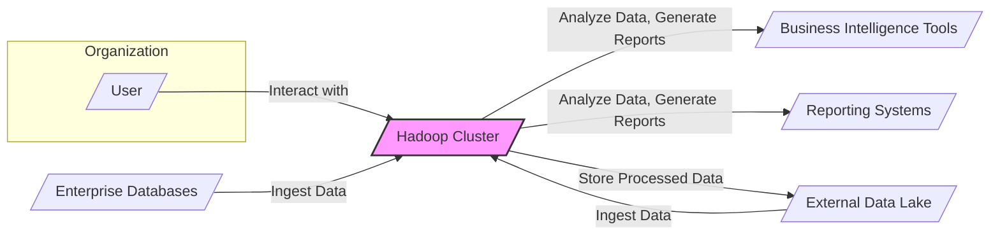

# BUSINESS POSTURE

The Apache Hadoop project aims to provide a reliable, scalable, distributed computing platform for processing large datasets. It enables organizations to store and analyze massive amounts of data that would be impractical to handle with traditional single-server systems.

Business priorities and goals for organizations adopting Hadoop typically include:
- Big Data Processing: Efficiently process and analyze large volumes of data to gain insights.
- Scalability and Reliability: Handle growing data volumes and ensure continuous operation even with hardware failures.
- Cost-Effectiveness: Provide a cost-effective solution for big data processing compared to traditional data warehousing solutions.
- Data Analytics and Business Intelligence: Enable advanced analytics, machine learning, and business intelligence applications on large datasets.

Most important business risks associated with Hadoop deployments include:
- Data Breaches and Data Loss: Unauthorized access to sensitive data stored and processed within Hadoop clusters.
- Service Disruption and Downtime: Failures in the Hadoop cluster leading to unavailability of data processing services.
- Data Integrity Issues: Corruption or modification of data during processing or storage.
- Compliance and Regulatory Risks: Failure to meet data privacy and security regulations (e.g., GDPR, HIPAA) when handling sensitive data.
- Performance Bottlenecks: Inefficient configuration or resource management leading to slow data processing and missed business objectives.

# SECURITY POSTURE

Existing security controls for the Apache Hadoop project and typical deployments:
- security control: Access Control Lists (ACLs) for HDFS file and directory permissions. Implemented within HDFS.
- security control: Kerberos authentication for cluster services and user access. Configured and managed within the Hadoop cluster and integrated with enterprise Kerberos infrastructure.
- security control: Data encryption in transit using TLS/SSL for communication between Hadoop components and clients. Configured within Hadoop services.
- security control: Data encryption at rest for HDFS data. Configured within HDFS using encryption zones and key management systems.
- security control: Ranger or Apache Sentry for fine-grained authorization and policy management. Deployed as separate components integrated with Hadoop services.
- security control: Audit logging for user access and administrative actions. Configured within Hadoop services and potentially integrated with centralized logging systems.
- security control: Secure Shell (SSH) access control to cluster nodes. Operating system level security control.
- security control: Network segmentation to isolate Hadoop clusters from untrusted networks. Network infrastructure level security control.
- security control: Regular security patching of operating systems and Hadoop components. Operational security process.
- security control: Vulnerability scanning of Hadoop infrastructure and applications. Security operations process.

Accepted risks for typical Hadoop deployments:
- accepted risk: Complexity of security configuration and management, potentially leading to misconfigurations.
- accepted risk: Performance overhead of encryption and security features.
- accepted risk: Reliance on external security infrastructure like Kerberos and key management systems.
- accepted risk: Potential vulnerabilities in third-party Hadoop ecosystem components.
- accepted risk: Insider threats with privileged access to Hadoop clusters.

Recommended security controls to implement:
- security control: Implement multi-factor authentication (MFA) for administrative access to Hadoop clusters and related systems.
- security control: Deploy and utilize a centralized security information and event management (SIEM) system to monitor Hadoop security events and detect anomalies.
- security control: Implement data loss prevention (DLP) measures to prevent sensitive data from leaving the Hadoop environment without authorization.
- security control: Conduct regular penetration testing and security audits of Hadoop deployments to identify and remediate vulnerabilities.
- security control: Implement infrastructure as code (IaC) for consistent and secure Hadoop cluster deployments.

Security requirements for the Apache Hadoop project and deployments:
- Authentication:
    - Requirement: Securely authenticate users and services accessing Hadoop resources.
    - Requirement: Support integration with enterprise authentication systems like Active Directory or LDAP.
    - Requirement: Implement strong password policies and account lockout mechanisms.
- Authorization:
    - Requirement: Enforce fine-grained access control to data and resources based on user roles and permissions.
    - Requirement: Support policy-based authorization management.
    - Requirement: Implement least privilege access principles.
- Input Validation:
    - Requirement: Validate all inputs to Hadoop services to prevent injection attacks and data corruption.
    - Requirement: Sanitize user-provided data before processing or storage.
    - Requirement: Implement input validation at multiple layers (e.g., application, API, data storage).
- Cryptography:
    - Requirement: Encrypt sensitive data at rest and in transit.
    - Requirement: Use strong cryptographic algorithms and key management practices.
    - Requirement: Protect cryptographic keys from unauthorized access.

# DESIGN

## C4 CONTEXT



### C4 Context Elements

- Element:
    - Name: User
    - Type: Person
    - Description: Business users, data scientists, analysts, and administrators who interact with the Hadoop cluster.
    - Responsibilities: Access and analyze data, manage Hadoop jobs, administer the cluster.
    - Security controls: Authentication via Kerberos or other enterprise authentication systems, role-based access control, audit logging of user activities.

- Element:
    - Name: Hadoop Cluster
    - Type: System
    - Description: The Apache Hadoop distributed processing platform.
    - Responsibilities: Store large datasets, process data using distributed computing frameworks (e.g., MapReduce, Spark), manage cluster resources, provide data access APIs.
    - Security controls: Kerberos authentication, ACLs, encryption at rest and in transit, Ranger/Sentry authorization, audit logging, network segmentation, vulnerability management.

- Element:
    - Name: Enterprise Databases
    - Type: System
    - Description: Existing relational databases and other data sources within the organization.
    - Responsibilities: Provide structured data for ingestion into the Hadoop cluster.
    - Security controls: Database-level access controls, encryption, audit logging, network security.

- Element:
    - Name: External Data Lake
    - Type: System
    - Description: Cloud-based or external data storage systems that provide data for Hadoop processing or serve as a destination for processed data.
    - Responsibilities: Store large volumes of external data, receive processed data from Hadoop.
    - Security controls: Cloud provider security controls, access keys, encryption, network security.

- Element:
    - Name: Business Intelligence Tools
    - Type: System
    - Description: Applications used for data visualization, reporting, and business intelligence analysis, consuming data processed by Hadoop.
    - Responsibilities: Visualize and analyze data from Hadoop, generate reports and dashboards.
    - Security controls: Authentication and authorization to access BI tools, secure data connections to Hadoop, data access controls within BI tools.

- Element:
    - Name: Reporting Systems
    - Type: System
    - Description: Automated reporting systems that generate scheduled reports based on data processed by Hadoop.
    - Responsibilities: Generate and distribute reports based on Hadoop data.
    - Security controls: Authentication and authorization to access reporting systems, secure data connections to Hadoop, access controls for report distribution.

## C4 CONTAINER

```mermaid
flowchart LR
    subgraph "Hadoop Cluster"
        subgraph "HDFS"
            HDFS_NameNode[/"NameNode"/]
            HDFS_DataNode[/"DataNode"/]
        end
        subgraph "YARN"
            YARN_ResourceManager[/"ResourceManager"/]
            YARN_NodeManager[/"NodeManager"/]
        end
        subgraph "Compute Engines"
            MapReduce[/"MapReduce"/]
            Spark[/"Spark"/]
            Hive[/"Hive"/]
        end
        subgraph "Security & Management"
            Kerberos[/"Kerberos KDC"/]
            Ranger[/"Ranger"/]
            Ambari[/"Ambari/Cloudera Manager"/]
        end
    end
    User[/"User"/]

    User -->|Submit Jobs, Access Data| YARN_ResourceManager
    User -->|Access Data| HDFS_NameNode
    YARN_ResourceManager -->|Resource Allocation| YARN_NodeManager
    YARN_NodeManager -->|Execute Tasks| MapReduce
    YARN_NodeManager -->|Execute Tasks| Spark
    YARN_NodeManager -->|Execute Tasks| Hive
    HDFS_NameNode -->|Metadata Management| HDFS_DataNode
    MapReduce -->|Read/Write Data| HDFS_DataNode
    Spark -->|Read/Write Data| HDFS_DataNode
    Hive -->|Read/Write Data| HDFS_DataNode
    YARN_ResourceManager -->|Authentication| Kerberos
    HDFS_NameNode -->|Authentication| Kerberos
    MapReduce -->|Authorization| Ranger
    Spark -->|Authorization| Ranger
    Hive -->|Authorization| Ranger
    Ambari -->|Cluster Management| HDFS_NameNode
    Ambari -->|Cluster Management| YARN_ResourceManager
    Ambari -->|Security Policy Management| Ranger

    style "Hadoop Cluster" fill:#f9f,stroke:#333,stroke-width:2px
    style HDFS fill:#ccf,stroke:#333,stroke-width:1px,dasharray: 5 5
    style YARN fill:#ccf,stroke:#333,stroke-width:1px,dasharray: 5 5
    style "Compute Engines" fill:#ccf,stroke:#333,stroke-width:1px,dasharray: 5 5
    style "Security & Management" fill:#ccf,stroke:#333,stroke-width:1px,dasharray: 5 5
```

### C4 Container Elements

- Element:
    - Name: HDFS NameNode
    - Type: Container
    - Description: The central metadata repository for the Hadoop Distributed File System (HDFS). Manages the file system namespace and regulates access to files by clients.
    - Responsibilities: Metadata management, namespace management, client access control, data replication management.
    - Security controls: Kerberos authentication, ACLs, audit logging, secure communication channels (TLS/SSL).

- Element:
    - Name: HDFS DataNode
    - Type: Container
    - Description: Stores data blocks in the Hadoop Distributed File System (HDFS). Serves read and write requests from clients and performs block creation, deletion, and replication upon instruction from the NameNode.
    - Responsibilities: Data storage, data retrieval, data replication, data checksum verification.
    - Security controls: Access control based on NameNode instructions, data encryption at rest (optional), secure communication channels (TLS/SSL).

- Element:
    - Name: YARN ResourceManager
    - Type: Container
    - Description: The cluster resource manager in Hadoop YARN (Yet Another Resource Negotiator). Manages resource allocation across the cluster and schedules applications.
    - Responsibilities: Resource management, application scheduling, node management, cluster monitoring.
    - Security controls: Kerberos authentication, authorization, resource quotas, secure communication channels (TLS/SSL).

- Element:
    - Name: YARN NodeManager
    - Type: Container
    - Description: The per-node agent in Hadoop YARN. Manages resources on a single node, launches and monitors containers, and reports node status to the ResourceManager.
    - Responsibilities: Container management, resource monitoring, task execution, node health reporting.
    - Security controls: Access control based on ResourceManager instructions, resource isolation (containers), secure communication channels (TLS/SSL).

- Element:
    - Name: MapReduce
    - Type: Container
    - Description: Hadoop's original batch processing framework. Provides a programming model for processing large datasets in parallel.
    - Responsibilities: Batch data processing, parallel task execution, data shuffling and sorting.
    - Security controls: Authorization via Ranger/Sentry, secure data access to HDFS, audit logging.

- Element:
    - Name: Spark
    - Type: Container
    - Description: A fast, general-purpose distributed processing engine for big data. Supports in-memory processing and various data processing workloads.
    - Responsibilities: Fast data processing, in-memory computing, real-time analytics, machine learning.
    - Security controls: Authorization via Ranger/Sentry, secure data access to HDFS, secure communication channels (TLS/SSL), audit logging.

- Element:
    - Name: Hive
    - Type: Container
    - Description: A data warehousing system built on top of Hadoop. Provides SQL-like query language (HiveQL) for querying and analyzing large datasets stored in Hadoop.
    - Responsibilities: Data warehousing, SQL-based data querying, data summarization and reporting.
    - Security controls: Authorization via Ranger/Sentry, secure data access to HDFS, SQL injection prevention, audit logging.

- Element:
    - Name: Kerberos KDC
    - Type: Container
    - Description: Key Distribution Center for Kerberos authentication. Provides authentication services for Hadoop cluster components and users.
    - Responsibilities: Authentication ticket granting, key management, user and service principal management.
    - Security controls: Secure KDC infrastructure, access control to KDC administration, audit logging.

- Element:
    - Name: Ranger
    - Type: Container
    - Description: A centralized security administration and authorization service for Hadoop. Provides fine-grained access control policies across Hadoop components.
    - Responsibilities: Centralized policy management, authorization enforcement, audit logging of access decisions.
    - Security controls: Secure Ranger administration interface, policy enforcement points within Hadoop components, audit logging.

- Element:
    - Name: Ambari/Cloudera Manager
    - Type: Container
    - Description: Cluster management and monitoring tools for Hadoop. Provide interfaces for cluster deployment, configuration, monitoring, and security management.
    - Responsibilities: Cluster provisioning, configuration management, monitoring, security configuration, user management.
    - Security controls: Authentication and authorization for management access, secure communication channels (TLS/SSL), audit logging of administrative actions.

## DEPLOYMENT

Hadoop clusters can be deployed in various environments, including on-premise data centers, private clouds, and public clouds (e.g., AWS, Azure, GCP). A common deployment architecture is on-premise or private cloud using a dedicated cluster of servers.

```mermaid
flowchart LR
    subgraph "On-Premise Data Center"
        subgraph "Rack 1"
            Server1[/"Server"/]
            Server2[/"Server"/]
        end
        subgraph "Rack 2"
            Server3[/"Server"/]
            Server4[/"Server"/]
        end
        Network[/"Network Switches"/]
    end
    ClientMachine[/"Client Machine"/]

    ClientMachine -- Network
    Network -- Server1
    Network -- Server2
    Network -- Server3
    Network -- Server4

    Server1 -- HDFS_DataNode
    Server1 -- YARN_NodeManager
    Server2 -- HDFS_DataNode
    Server2 -- YARN_NodeManager
    Server3 -- HDFS_DataNode
    Server3 -- YARN_NodeManager
    Server4 -- HDFS_DataNode
    Server4 -- YARN_NodeManager
    Server1 -- HDFS_NameNode
    Server2 -- YARN_ResourceManager
    Server3 -- Kerberos
    Server4 -- Ranger
    Server4 -- Ambari

    style "On-Premise Data Center" fill:#f9f,stroke:#333,stroke-width:2px
    style "Rack 1" fill:#ccf,stroke:#333,stroke-width:1px,dasharray: 5 5
    style "Rack 2" fill:#ccf,stroke:#333,stroke-width:1px,dasharray: 5 5
```

### Deployment Elements

- Element:
    - Name: Server
    - Type: Infrastructure Node
    - Description: Physical or virtual servers within the data center. Each server hosts multiple Hadoop containers.
    - Responsibilities: Provide compute and storage resources for Hadoop containers.
    - Security controls: Operating system hardening, security patching, SSH access control, host-based intrusion detection systems (HIDS).

- Element:
    - Name: Network Switches
    - Type: Infrastructure Node
    - Description: Network infrastructure connecting servers within the Hadoop cluster and to external networks.
    - Responsibilities: Network connectivity, network segmentation, traffic routing.
    - Security controls: Network access control lists (ACLs), network segmentation (VLANs), intrusion detection and prevention systems (IDPS).

- Element:
    - Name: Client Machine
    - Type: Infrastructure Node
    - Description: User's workstation or application server used to interact with the Hadoop cluster.
    - Responsibilities: User interface for Hadoop, application execution environment.
    - Security controls: Endpoint security software, operating system security, user authentication.

## BUILD

The Apache Hadoop project uses a complex build process managed through Apache Maven. The build process involves compiling Java and other code, running unit and integration tests, creating distribution packages, and publishing artifacts.

```mermaid
flowchart LR
    Developer[/"Developer"/] -->|Code Changes, Commit| GitRepository[/"Git Repository (GitHub)"/]
    GitRepository -->|Webhook, Trigger Build| CI_CD[/"CI/CD System (GitHub Actions, Jenkins)"/]
    CI_CD -->|Checkout Code, Build, Test, Scan| BuildEnvironment[/"Build Environment"/]
    BuildEnvironment -->|Build Artifacts, Reports| ArtifactRepository[/"Artifact Repository (Nexus, Artifactory)"/]
    ArtifactRepository -->|Publish Artifacts| ReleaseRepository[/"Release Repository (Maven Central)"/]

    subgraph "Build Environment"
        SAST[/"SAST Scanner"/]
        Lint[/"Linter"/]
        DependencyCheck[/"Dependency Check"/]
        UnitTests[/"Unit Tests"/]
        IntegrationTests[/"Integration Tests"/]
        Compiler[/"Compiler"/]
    end
    BuildEnvironment --> SAST
    BuildEnvironment --> Lint
    BuildEnvironment --> DependencyCheck
    BuildEnvironment --> UnitTests
    BuildEnvironment --> IntegrationTests
    BuildEnvironment --> Compiler

    style "Build Environment" fill:#ccf,stroke:#333,stroke-width:1px,dasharray: 5 5
```

### Build Elements

- Element:
    - Name: Git Repository (GitHub)
    - Type: Code Repository
    - Description: Source code repository for the Apache Hadoop project hosted on GitHub.
    - Responsibilities: Version control, code collaboration, change tracking.
    - Security controls: Access control to repository, branch protection rules, code review process.

- Element:
    - Name: CI/CD System (GitHub Actions, Jenkins)
    - Type: Automation System
    - Description: Continuous Integration and Continuous Delivery system used to automate the build, test, and release process. Examples include GitHub Actions or Jenkins.
    - Responsibilities: Build automation, testing, artifact generation, release management.
    - Security controls: Secure CI/CD pipeline configuration, access control to CI/CD system, secret management for credentials, build environment security.

- Element:
    - Name: Build Environment
    - Type: Execution Environment
    - Description: Environment where the build process is executed. Includes tools for compilation, testing, and security scanning.
    - Responsibilities: Code compilation, unit testing, integration testing, static analysis security testing (SAST), dependency checking, code linting.
    - Security controls: Secure build environment configuration, dependency management, vulnerability scanning of build tools, access control to build environment.

- Element:
    - Name: Artifact Repository (Nexus, Artifactory)
    - Type: Artifact Storage
    - Description: Repository for storing build artifacts, such as compiled JAR files, distribution packages, and reports. Examples include Nexus or Artifactory.
    - Responsibilities: Artifact storage, versioning, access control, artifact distribution within the organization.
    - Security controls: Access control to artifact repository, vulnerability scanning of artifacts, integrity checks for artifacts.

- Element:
    - Name: Release Repository (Maven Central)
    - Type: Public Repository
    - Description: Public repository where official releases of Apache Hadoop are published, such as Maven Central.
    - Responsibilities: Public distribution of release artifacts.
    - Security controls: Signing of release artifacts, integrity checks, vulnerability scanning before release.

# RISK ASSESSMENT

Critical business processes protected by Hadoop deployments:
- Data Analytics and Reporting: Generating business insights and reports from large datasets.
- Data Warehousing: Storing and managing large volumes of data for analytical purposes.
- Machine Learning and AI: Training and deploying machine learning models on big data.
- Real-time Data Processing: Processing streaming data for immediate insights and actions.

Data being protected and their sensitivity:
- Customer Data: Personally identifiable information (PII), transaction history, preferences. Sensitivity: High (requires strong protection due to privacy regulations and reputational risk).
- Financial Data: Transaction records, financial statements, billing information. Sensitivity: High (requires strong protection due to financial regulations and business impact).
- Operational Data: System logs, performance metrics, application data. Sensitivity: Medium to High (important for business continuity and security monitoring).
- Intellectual Property: Algorithms, models, research data. Sensitivity: High (critical for competitive advantage and innovation).

# QUESTIONS & ASSUMPTIONS

Questions:
- What specific use cases and business requirements are driving the Hadoop deployment?
- What is the sensitivity level of the data being processed and stored in Hadoop?
- What are the organization's compliance and regulatory requirements related to data security and privacy?
- What existing security infrastructure and tools are available within the organization?
- What is the organization's risk appetite and tolerance for security vulnerabilities?
- What is the expected scale and performance requirements for the Hadoop cluster?
- What is the budget and resources available for security implementation and operations?

Assumptions:
- The Hadoop deployment is intended for processing and storing sensitive business data.
- Security is a high priority for the organization deploying Hadoop.
- The organization has or is willing to invest in necessary security infrastructure and tools.
- The Hadoop cluster will be deployed in a network environment that can be segmented and secured.
- The organization has skilled personnel to manage and operate a secure Hadoop environment.
- The design is for a typical on-premise or private cloud Hadoop deployment.
- The build process described is representative of a large open-source project like Apache Hadoop, even if specific details might vary.