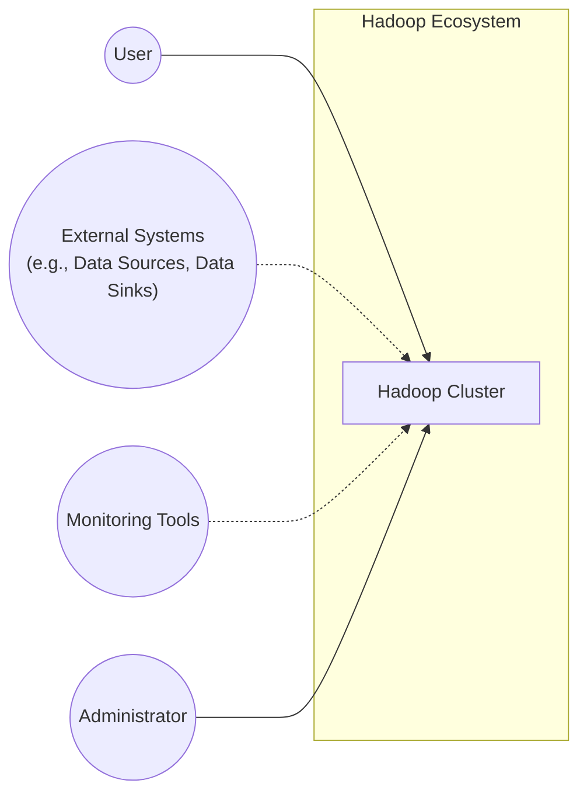
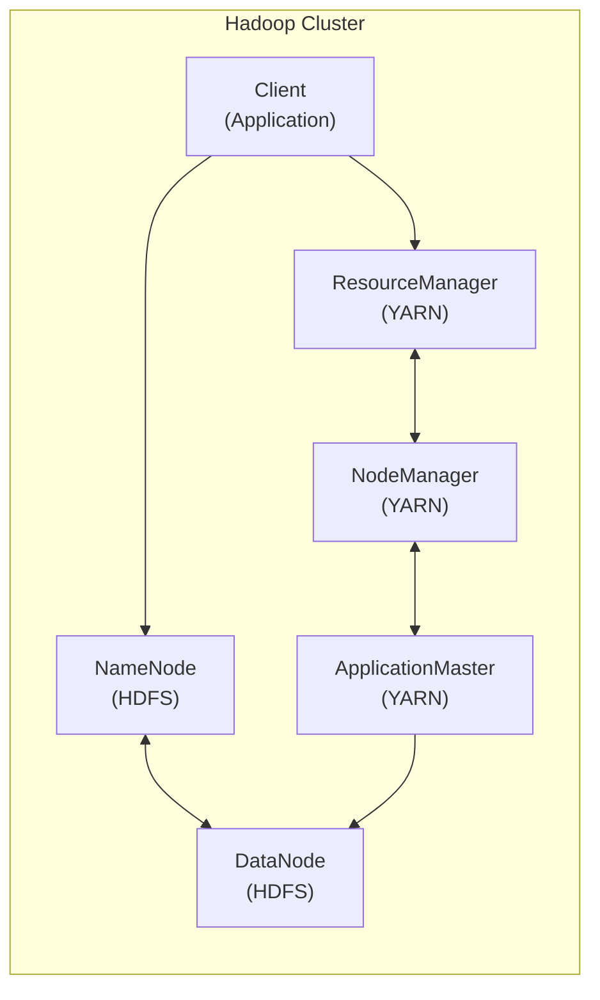
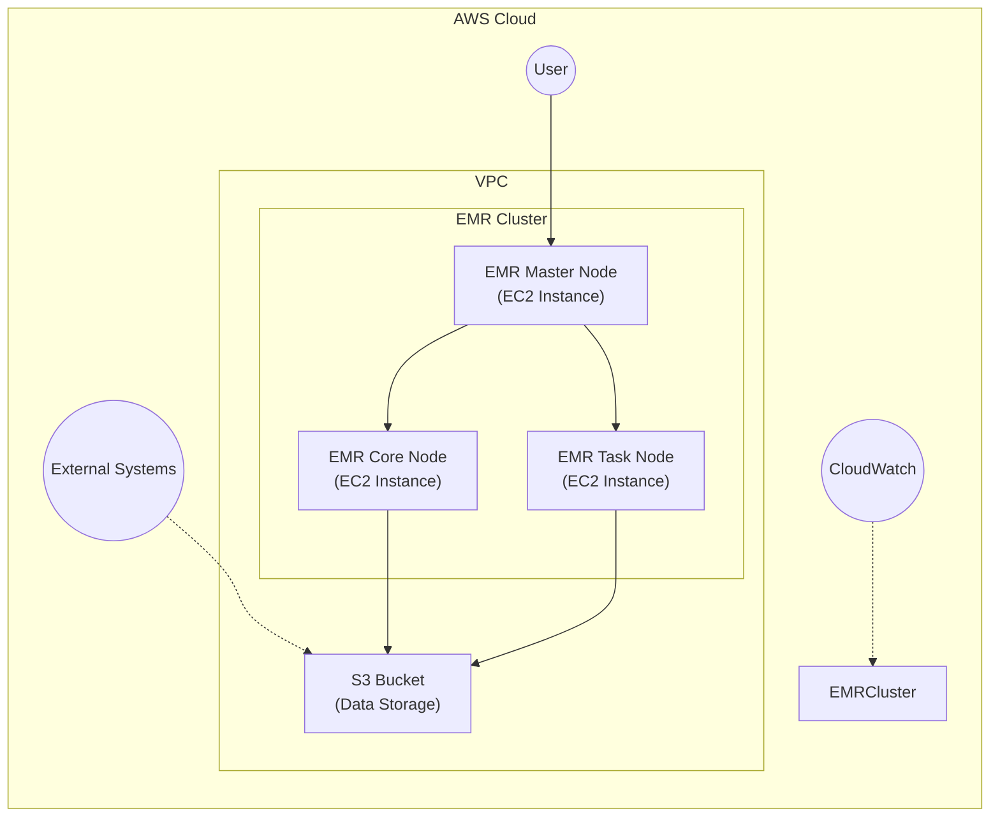
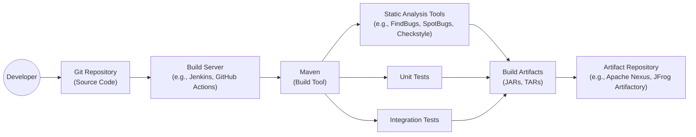

# Project Design Document: Apache Hadoop

## BUSINESS POSTURE

Apache Hadoop is a mature, widely-used open-source project. It's a cornerstone of many organizations' big data strategies. The business priorities and goals revolve around:

*   Reliable and Scalable Data Storage: Providing a distributed file system (HDFS) that can handle petabytes of data across commodity hardware.
*   Efficient Data Processing: Enabling large-scale data processing using the MapReduce framework and, more recently, other processing engines like Spark and Flink that can leverage HDFS.
*   Cost-Effectiveness: Leveraging commodity hardware to reduce the cost of storing and processing large datasets compared to traditional solutions.
*   Open Source Ecosystem: Fostering a vibrant community and ecosystem of tools and applications built around Hadoop.
*   Fault Tolerance: Ensuring data availability and processing continuity even in the face of hardware failures.

Business Risks:

*   Data Breaches: Unauthorized access to sensitive data stored in HDFS.
*   Data Loss: Loss of data due to hardware failures, software bugs, or operational errors.
*   Service Disruption: Interruption of data processing jobs due to cluster instability or resource contention.
*   Compliance Violations: Failure to meet regulatory requirements related to data privacy and security.
*   Performance Bottlenecks: Inefficient data processing or storage leading to delays and increased costs.
*   Complexity and Operational Overhead: The inherent complexity of managing a distributed system like Hadoop can lead to operational challenges and increased costs.
*   Security Vulnerabilities: Exploitation of vulnerabilities in Hadoop components or related ecosystem projects.
*   Data Integrity Issues: Corruption of data during storage or processing.

## SECURITY POSTURE

Existing Security Controls:

*   security control: Kerberos Authentication: Hadoop uses Kerberos for strong authentication of users and services. Described in Hadoop documentation and configuration files.
*   security control: Access Control Lists (ACLs): HDFS provides ACLs to control access to files and directories. Described in HDFS documentation.
*   security control: Service-Level Authorization: Hadoop provides authorization mechanisms to control which users can submit jobs and access resources. Described in Hadoop configuration files.
*   security control: Data Encryption (at rest and in transit): Hadoop supports encryption of data both in transit (using TLS/SSL) and at rest (using HDFS encryption zones). Described in Hadoop documentation and configuration files.
*   security control: Auditing: Hadoop provides auditing capabilities to track user activity and system events. Described in Hadoop documentation and configuration files.
*   security control: Secure Configuration: Hadoop provides various configuration options to enhance security, such as disabling unnecessary services and enabling security features. Described in Hadoop configuration files.

Accepted Risks:

*   accepted risk: Complexity of Configuration: Securely configuring Hadoop can be complex, and misconfigurations can lead to security vulnerabilities.
*   accepted risk: Reliance on External Security Infrastructure: Hadoop's security often relies on external systems like Kerberos, which introduces dependencies and potential points of failure.
*   accepted risk: Potential for Insider Threats: While access controls are in place, malicious insiders with legitimate access could still pose a threat.
*   accepted risk: Ecosystem Security: The security of the Hadoop ecosystem depends on the security of numerous related projects, which may have their own vulnerabilities.

Recommended Security Controls:

*   security control: Implement regular security audits and penetration testing.
*   security control: Integrate with centralized identity and access management (IAM) systems.
*   security control: Implement network segmentation to isolate Hadoop clusters from other networks.
*   security control: Enable and monitor security-related logs comprehensively.
*   security control: Implement data masking or anonymization for sensitive data.
*   security control: Regularly update Hadoop and related ecosystem components to the latest versions to patch security vulnerabilities.
*   security control: Implement robust monitoring and alerting for security-related events.

Security Requirements:

*   Authentication:
    *   All users and services must be strongly authenticated, preferably using Kerberos.
    *   Multi-factor authentication should be considered for privileged users.
    *   Integration with existing enterprise identity providers (e.g., Active Directory) should be supported.

*   Authorization:
    *   Access to data and resources must be controlled based on the principle of least privilege.
    *   Fine-grained access control mechanisms (e.g., ACLs) should be used.
    *   Role-based access control (RBAC) should be implemented.

*   Input Validation:
    *   All input from external sources (e.g., user-submitted jobs, data from external systems) must be validated to prevent injection attacks and other vulnerabilities.
    *   Data should be validated for type, length, format, and range.

*   Cryptography:
    *   Data in transit must be encrypted using TLS/SSL.
    *   Data at rest should be encrypted using HDFS encryption zones or other appropriate encryption mechanisms.
    *   Strong cryptographic algorithms and key management practices must be used.

## DESIGN

### C4 CONTEXT

Elements Description:

*   Element:
    *   Name: User
    *   Type: Person
    *   Description: A person who interacts with the Hadoop cluster to submit jobs, access data, or perform other tasks.
    *   Responsibilities: Submitting jobs, accessing data, analyzing results.
    *   Security controls: Kerberos Authentication, ACLs, Service-Level Authorization.

*   Element:
    *   Name: Hadoop Cluster
    *   Type: Software System
    *   Description: The core Hadoop cluster, including HDFS, YARN, and MapReduce.
    *   Responsibilities: Storing data, processing data, managing resources.
    *   Security controls: Kerberos Authentication, ACLs, Service-Level Authorization, Data Encryption, Auditing.

*   Element:
    *   Name: External Systems
    *   Type: Software System
    *   Description: External systems that interact with the Hadoop cluster, such as data sources, data sinks, or other applications.
    *   Responsibilities: Providing data to Hadoop, receiving data from Hadoop, integrating with Hadoop workflows.
    *   Security controls: Secure communication channels (e.g., TLS/SSL), authentication and authorization mechanisms.

*   Element:
    *   Name: Monitoring Tools
    *   Type: Software System
    *   Description: Tools used to monitor the health and performance of the Hadoop cluster.
    *   Responsibilities: Collecting metrics, generating alerts, providing dashboards.
    *   Security controls: Secure communication channels, authentication and authorization.

*   Element:
    *   Name: Administrator
    *   Type: Person
    *   Description: A person who manages and maintains the Hadoop cluster.
    *   Responsibilities: Configuring the cluster, monitoring performance, troubleshooting issues, managing security.
    *   Security controls: Strong authentication (e.g., multi-factor authentication), privileged access management.

### C4 CONTAINER

Elements Description:

*   Element:
    *   Name: NameNode
    *   Type: Container (Java Application)
    *   Description: The master node for HDFS. Manages the file system namespace and metadata.
    *   Responsibilities: Managing file system metadata, coordinating data access, handling client requests.
    *   Security controls: Kerberos Authentication, ACLs, Data Encryption (metadata), Auditing.

*   Element:
    *   Name: DataNode
    *   Type: Container (Java Application)
    *   Description: Stores the actual data blocks of files in HDFS.
    *   Responsibilities: Storing data blocks, serving data to clients, replicating data for fault tolerance.
    *   Security controls: Kerberos Authentication, Data Encryption (data blocks), Data Integrity Checks.

*   Element:
    *   Name: ResourceManager
    *   Type: Container (Java Application)
    *   Description: The master node for YARN. Manages resources and schedules applications.
    *   Responsibilities: Managing cluster resources, scheduling applications, monitoring application progress.
    *   Security controls: Kerberos Authentication, Service-Level Authorization, Auditing.

*   Element:
    *   Name: NodeManager
    *   Type: Container (Java Application)
    *   Description: Runs on each worker node and manages resources and containers on that node.
    *   Responsibilities: Launching and monitoring containers, managing resources on the node, reporting to the ResourceManager.
    *   Security controls: Kerberos Authentication, Secure Container Execution.

*   Element:
    *   Name: ApplicationMaster
    *   Type: Container (Java Application)
    *   Description: A per-application process that manages the execution of a specific application.
    *   Responsibilities: Negotiating resources with the ResourceManager, managing tasks, monitoring progress.
    *   Security controls: Kerberos Authentication, Application-Specific Security.

*   Element:
    *   Name: Client
    *   Type: Container (Application Code)
    *   Description: The application code that interacts with HDFS and YARN to submit jobs and access data.
    *   Responsibilities: Submitting jobs, accessing data, interacting with the Hadoop cluster.
    *   Security controls: Kerberos Authentication, Secure Communication Channels.

### DEPLOYMENT

Hadoop can be deployed in various ways:

1.  On-Premise: Traditional deployment on physical servers within an organization's data center.
2.  Cloud-Based: Deployment on virtual machines or using managed services provided by cloud providers (e.g., AWS EMR, Azure HDInsight, Google Cloud Dataproc).
3.  Hybrid: A combination of on-premise and cloud-based deployments.
4.  Containerized: Deployment using containerization technologies like Docker and Kubernetes.

Chosen Deployment Model: Cloud-Based (AWS EMR)

Elements Description:

*   Element:
    *   Name: EMR Master Node
    *   Type: Infrastructure (EC2 Instance)
    *   Description: The master node of the EMR cluster. Runs the NameNode, ResourceManager, and other master services.
    *   Responsibilities: Managing the cluster, coordinating data access, scheduling jobs.
    *   Security controls: AWS IAM Roles, Security Groups, VPC Network ACLs, Kerberos Authentication, Data Encryption (at rest and in transit).

*   Element:
    *   Name: EMR Core Node
    *   Type: Infrastructure (EC2 Instance)
    *   Description: Core nodes of the EMR cluster. Run DataNodes and NodeManagers.
    *   Responsibilities: Storing data, executing tasks.
    *   Security controls: AWS IAM Roles, Security Groups, VPC Network ACLs, Kerberos Authentication, Data Encryption (at rest and in transit).

*   Element:
    *   Name: EMR Task Node
    *   Type: Infrastructure (EC2 Instance)
    *   Description: Task nodes of the EMR cluster. Run NodeManagers. Can be scaled dynamically.
    *   Responsibilities: Executing tasks.
    *   Security controls: AWS IAM Roles, Security Groups, VPC Network ACLs, Kerberos Authentication, Data Encryption (at rest and in transit).

*   Element:
    *   Name: S3 Bucket
    *   Type: Infrastructure (Object Storage)
    *   Description: Used for storing input data, output data, and logs.
    *   Responsibilities: Storing data.
    *   Security controls: AWS IAM Roles, S3 Bucket Policies, Encryption (SSE-S3, SSE-KMS, SSE-C), Versioning, Access Logging.

*   Element:
    *   Name: User
    *   Type: Person
    *   Description: A person who interacts with the EMR cluster.
    *   Responsibilities: Submitting jobs, accessing data.
    *   Security controls: AWS IAM Users and Roles, Multi-Factor Authentication (MFA).

*   Element:
    *   Name: External Systems
    *   Type: Software System
    *   Description: External systems that interact with the EMR cluster or S3.
    *   Responsibilities: Providing data, receiving data.
    *   Security controls: Secure communication channels (e.g., HTTPS), authentication and authorization.

*   Element:
    *   Name: CloudWatch
    *   Type: Software System
    *   Description: AWS monitoring service.
    *   Responsibilities: Collecting metrics, generating alerts.
    *   Security controls: AWS IAM Roles, secure communication channels.

### BUILD

Hadoop's build process is complex and involves multiple components. It uses Apache Maven as the primary build tool.

Build Process Description:

1.  Developers commit code to the Git repository.
2.  A build server (e.g., Jenkins, GitHub Actions) triggers a build based on commits or a schedule.
3.  Maven is used to manage dependencies, compile code, run tests, and package the software.
4.  Static analysis tools (e.g., FindBugs, SpotBugs, Checkstyle) are integrated into the Maven build process to identify potential bugs and code quality issues.
5.  Unit tests and integration tests are executed as part of the build process.
6.  Build artifacts (JARs, TARs) are generated.
7.  Build artifacts are published to an artifact repository (e.g., Apache Nexus, JFrog Artifactory).

Security Controls:

*   security control: Code Review: All code changes are reviewed by other developers before being merged.
*   security control: Static Analysis: Static analysis tools are used to identify potential security vulnerabilities.
*   security control: Dependency Management: Maven is used to manage dependencies and ensure that only approved versions are used.
*   security control: Software Composition Analysis (SCA): Tools like OWASP Dependency-Check can be integrated to identify known vulnerabilities in third-party libraries.
*   security control: Build Server Security: The build server itself is secured and access is restricted.
*   security control: Artifact Repository Security: The artifact repository is secured and access is controlled.
*   security control: Signed Artifacts: Build artifacts can be digitally signed to ensure their integrity.

## RISK ASSESSMENT

Critical Business Processes:

*   Data Storage: Reliable and scalable storage of large datasets.
*   Data Processing: Efficient processing of large datasets using MapReduce and other frameworks.
*   Data Analytics: Enabling data-driven decision-making.
*   Business Continuity: Ensuring the availability of data and processing capabilities.

Data Sensitivity:

*   Hadoop clusters can store a wide variety of data, ranging from non-sensitive public data to highly sensitive personal or financial data.
*   The sensitivity of the data stored in a particular Hadoop cluster depends on the specific use case and the organization's data classification policies.
*   Examples of sensitive data that might be stored in Hadoop:
    *   Personally Identifiable Information (PII)
    *   Protected Health Information (PHI)
    *   Financial Data
    *   Customer Data
    *   Intellectual Property

## QUESTIONS & ASSUMPTIONS

Questions:

*   What specific compliance requirements (e.g., GDPR, HIPAA, PCI DSS) apply to the data stored and processed by Hadoop in different deployments?
*   What are the specific data retention policies for different types of data stored in Hadoop?
*   What are the existing disaster recovery and business continuity plans for Hadoop deployments?
*   What are the specific SLAs for data availability and processing performance?
*   What are the existing monitoring and alerting systems for Hadoop clusters?
*   What is the process for managing and rotating cryptographic keys used for data encryption?
*   What is the process for incident response in case of a security breach?
*   What level of detail is required for logging and auditing?
*   Are there any specific security requirements related to the use of third-party tools or libraries within the Hadoop ecosystem?
*   What is the process for vulnerability management and patching of Hadoop and related components?

Assumptions:

*   BUSINESS POSTURE: The organization has a mature security program and understands the importance of securing big data infrastructure.
*   BUSINESS POSTURE: The organization has sufficient resources to implement and maintain the necessary security controls.
*   SECURITY POSTURE: The organization has a dedicated security team or individuals responsible for Hadoop security.
*   SECURITY POSTURE: The organization has a process for regularly reviewing and updating security policies and procedures.
*   DESIGN: Hadoop is deployed in a secure network environment.
*   DESIGN: The organization has a strong understanding of the Hadoop architecture and its security implications.
*   DESIGN: The organization follows best practices for secure software development and deployment.
*   DESIGN: Regular backups of critical data are performed.