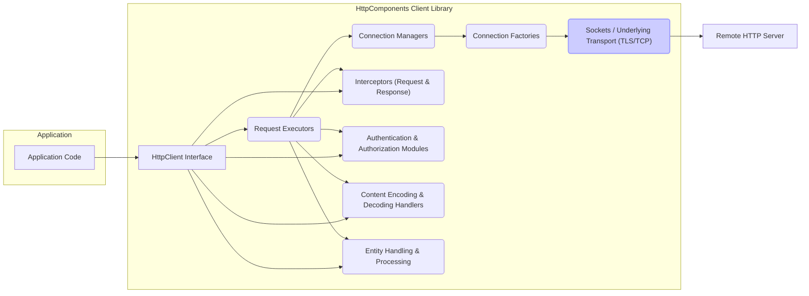

# Project Design Document: Apache HttpComponents Client

**Version:** 1.1
**Date:** October 26, 2023
**Author:** AI Software Architect

## 1. Introduction

This document provides a detailed design overview of the Apache HttpComponents Client library, focusing on aspects relevant for security threat modeling. It outlines the key architectural components, data flow, and functionalities to facilitate the identification of potential security vulnerabilities. This document serves as a foundational resource for security assessments and discussions.

## 2. Goals

The primary goals of this design document are to:

*   Provide a comprehensive and security-focused architectural overview of the Apache HttpComponents Client library.
*   Clearly identify key components, their responsibilities, and potential security implications.
*   Describe the typical data flow within the library, highlighting security-sensitive stages.
*   Explicitly outline areas relevant for security considerations and threat modeling, including potential threats.
*   Serve as a definitive reference point for security assessments, penetration testing, and security architecture reviews.

## 3. Scope

This document focuses on the core functionalities and architecture of the Apache HttpComponents Client library as represented in the provided GitHub repository, with a strong emphasis on security-relevant aspects. It covers the lifecycle of making and processing HTTP requests, including:

*   Request construction and execution.
*   Connection establishment and management (including secure connections).
*   Request and response interception and modification.
*   Authentication, authorization, and credential handling.
*   Content handling, encoding, and decoding.
*   Error handling and exception management.

This document does not delve into:

*   Fine-grained implementation details of individual classes or methods beyond their functional purpose.
*   Exhaustive lists of all configuration options; instead, it focuses on those with security implications.
*   The historical evolution of the project or specific release notes.
*   Performance tuning or optimization strategies unless directly related to security (e.g., connection limits for DoS prevention).

## 4. Architectural Overview

The Apache HttpComponents Client library employs a modular and extensible architecture, designed to facilitate the creation and execution of HTTP requests. Understanding the interactions between these modules is crucial for identifying potential attack vectors.



**Key Architectural Layers and Components:**

*   **Application Code:** The user's application code that instantiates and utilizes the HttpComponents Client library to initiate and manage HTTP communication. This is the primary point of interaction and potential vulnerability if not used securely.
*   **HttpClient Interface:** The primary interface for interacting with the library, providing methods for executing various types of HTTP requests. Implementations of this interface manage the request lifecycle.
*   **Request Executors:** Responsible for the core logic of executing HTTP requests. This involves selecting an appropriate connection, sending the request data, and receiving the response. Security considerations include handling timeouts and error conditions gracefully.
*   **Connection Managers:** Manage the pool of persistent HTTP connections, including secure (TLS/SSL) connections. This component is critical for performance and security, handling connection reuse, eviction, and ensuring secure connection parameters.
*   **Connection Factories:** Responsible for creating new connections to the target server. For HTTPS, this involves establishing a secure TLS/SSL handshake, a critical security juncture.
*   **Sockets / Underlying Transport (TLS/TCP):** The underlying network layer responsible for transmitting data. When using HTTPS, this layer provides encryption and integrity checks via TLS/SSL. The security of this layer depends on the proper configuration of TLS.
*   **Interceptors (Request & Response):** Provide a powerful mechanism to intercept and modify HTTP requests before they are sent and HTTP responses after they are received. While offering flexibility, interceptors can also introduce security vulnerabilities if not implemented carefully.
*   **Authentication & Authorization Modules:** Handle the process of authenticating with the remote server and managing authorization credentials. This includes support for various authentication schemes and secure storage/transmission of credentials.
*   **Content Encoding & Decoding Handlers:** Manage the encoding and decoding of HTTP message bodies, ensuring data integrity and potentially handling compression. Vulnerabilities can arise from improper handling of encoded data.
*   **Entity Handling & Processing:** Deals with the representation and processing of HTTP message bodies (entities). This includes handling different content types and providing methods for accessing and manipulating the content. This is a key area for vulnerabilities like XXE or injection attacks if not handled securely.
*   **Remote HTTP Server:** The external system that receives and processes the HTTP requests initiated by the client. The security of the interaction depends on both the client and server implementations.

## 5. Component Details

This section provides a more detailed description of the key components within the HttpComponents Client library, with a focus on their security implications.

*   **`HttpClient` Interface (e.g., `CloseableHttpClient`):**
    *   The central entry point for executing requests. Improper configuration (e.g., disabling security features) can introduce vulnerabilities.
    *   Allows setting default request headers, which could be exploited if not carefully managed.

*   **`HttpRequest` and `HttpResponse` Objects:**
    *   Represent the HTTP request and response. Vulnerabilities can arise from constructing requests with malicious data or not properly validating responses.
    *   Headers within these objects are a common target for injection attacks.

*   **`HttpClientContext`:**
    *   Stores request-specific state, including security-related information like authentication state. Improper management of this context could lead to information leakage.

*   **`ClientConnectionManager` (e.g., `PoolingHttpClientConnectionManager`):**
    *   Manages the lifecycle of connections, including secure connections. Misconfiguration of connection pooling (e.g., excessive connection reuse with sensitive data) can be a risk.
    *   Handles TLS session reuse, which has security implications if not implemented correctly.

*   **`HttpRequestInterceptor` and `HttpResponseInterceptor`:**
    *   Powerful components that can modify requests and responses. Malicious or poorly written interceptors can introduce vulnerabilities like adding unintended headers, logging sensitive data insecurely, or bypassing security checks.
    *   The order of interceptor execution is important for security.

*   **`CredentialsProvider`:**
    *   Stores and provides authentication credentials. Secure storage and retrieval of credentials are paramount. Vulnerabilities here can lead to credential compromise.

*   **`AuthenticationStrategy`:**
    *   Determines how authentication challenges are handled. Choosing weak or outdated authentication schemes can weaken security.

*   **`HttpEntity` (e.g., `StringEntity`, `ByteArrayEntity`, `FileEntity`):**
    *   Represents the request or response body. Improper handling of entity content can lead to vulnerabilities like buffer overflows or injection attacks.
    *   Care must be taken when processing entities from untrusted sources.

*   **`SSLConnectionSocketFactory`:**
    *   Responsible for creating secure (TLS/SSL) connections. Configuration of this factory (e.g., supported protocols, cipher suites, certificate validation) is critical for security. Weak configurations can make connections vulnerable to attacks.

*   **`HostnameVerifier`:**
    *   Verifies that the hostname in the server's certificate matches the requested hostname. Disabling or using a permissive hostname verifier can expose the application to man-in-the-middle attacks.

*   **`HttpRoutePlanner`:**
    *   Determines the route to the target server, including proxy usage. Misconfigured or compromised proxies can introduce security risks.

## 6. Data Flow with Security Considerations

The typical data flow for executing an HTTP request using the HttpComponents Client library, highlighting security-relevant steps, is as follows:

```mermaid
graph LR
    A["Application Code"] --> B{Create HttpRequest Object (Potential for Injection)};
    B --> C{Get HttpClient Instance (Configuration Security)};
    C --> D{Get HttpContext (Sensitive Data Handling)};
    D --> E{Request Interceptors (Potential for Malicious Logic)};
    E --> F{Route Planning (Proxy Security)};
    F --> G{Connection Manager: Get Connection (Connection Security)};
    G -- Secure Connection? --> H{TLS Handshake (Certificate Validation, Cipher Suites)};
    H --> I{Request Executor: Send Request (Header Injection)};
    I --> J{Underlying Transport (TLS/TCP Encryption)};
    J -- Request Sent --> K["Remote HTTP Server"];
    K -- Response Received --> J;
    J --> L{Request Executor: Receive Response};
    L --> M{Response Interceptors (Potential for Malicious Logic)};
    M --> N{Entity Handling (Vulnerability to XXE, etc.)};
    N --> O{Return HttpResponse to Application (Data Validation)};
    style H fill:#ccf,stroke:#99f,stroke-width:2px
    style J fill:#ccf,stroke:#99f,stroke-width:2px
```

**Detailed Steps with Security Focus:**

1. **Application Code:** The application constructs the `HttpRequest` object. **Security Consideration:**  Ensure proper input validation and sanitization to prevent injection attacks (e.g., header injection, URL manipulation).
2. **Create HttpRequest Object (Potential for Injection):**  The `HttpRequest` object is populated with details. **Security Consideration:**  Be wary of including user-supplied data directly in URLs or headers without proper encoding.
3. **Get HttpClient Instance (Configuration Security):** The application retrieves an `HttpClient` instance. **Security Consideration:** The configuration of the `HttpClient` (e.g., TLS settings, hostname verification) directly impacts security.
4. **Get HttpContext (Sensitive Data Handling):** An `HttpContext` is obtained. **Security Consideration:** Avoid storing sensitive information in the `HttpContext` unless necessary and ensure it's handled securely.
5. **Request Interceptors (Potential for Malicious Logic):** Registered `HttpRequestInterceptor` instances are executed. **Security Consideration:**  Carefully review and control the logic within interceptors, as they can introduce vulnerabilities.
6. **Route Planning (Proxy Security):** The `HttpRoutePlanner` determines the route. **Security Consideration:**  Ensure proxy configurations are secure and prevent unintended access or information leakage through proxies.
7. **Connection Manager: Get Connection (Connection Security):** The `ConnectionManager` retrieves or establishes a connection. **Security Consideration:**  Proper configuration of connection pooling and timeouts is important for preventing resource exhaustion and potential denial-of-service.
8. **TLS Handshake (Certificate Validation, Cipher Suites):** If HTTPS is used, a TLS handshake occurs. **Security Consideration:**  This is a critical security step. Ensure proper certificate validation and the use of strong cipher suites. Weak configurations can be exploited.
9. **Request Executor: Send Request (Header Injection):** The `RequestExecutor` sends the request. **Security Consideration:**  Double-check that no malicious headers have been added or manipulated.
10. **Underlying Transport (TLS/TCP Encryption):** Data is transmitted over the network. **Security Consideration:** With HTTPS, TLS provides encryption and integrity. Ensure TLS is enabled and configured correctly.
11. **Remote HTTP Server:** The server processes the request.
12. **Response Received:** The server sends the response.
13. **Request Executor: Receive Response:** The `RequestExecutor` receives the response.
14. **Response Interceptors (Potential for Malicious Logic):** Registered `HttpResponseInterceptor` instances are executed. **Security Consideration:** Similar to request interceptors, ensure response interceptors do not introduce vulnerabilities.
15. **Entity Handling (Vulnerability to XXE, etc.):** The response entity is processed. **Security Consideration:**  Be extremely cautious when processing response bodies, especially if the content type is XML or other structured formats prone to vulnerabilities like XXE attacks.
16. **Return HttpResponse to Application (Data Validation):** The `HttpResponse` is returned to the application. **Security Consideration:**  The application should validate the response status code and content to ensure it's expected and safe to process.

## 7. Security Considerations

This section expands on the initial security considerations, providing more specific examples of potential threats and vulnerabilities.

*   **TLS/SSL Configuration:**
    *   **Threats:** Man-in-the-middle attacks, eavesdropping, data tampering.
    *   **Vulnerabilities:** Using outdated TLS protocols (e.g., SSLv3, TLS 1.0), weak cipher suites, disabled certificate validation, allowing insecure renegotiation.
*   **Hostname Verification:**
    *   **Threats:** Man-in-the-middle attacks.
    *   **Vulnerabilities:** Disabling hostname verification or using a permissive verifier allows attackers to present fraudulent certificates.
*   **Input Validation (Request Construction):**
    *   **Threats:** Header injection, URL manipulation, cross-site scripting (if URLs are reflected).
    *   **Vulnerabilities:**  Failing to sanitize or encode user-supplied data before including it in requests.
*   **Authentication and Authorization:**
    *   **Threats:** Credential theft, unauthorized access, privilege escalation.
    *   **Vulnerabilities:** Storing credentials insecurely, transmitting credentials in plaintext (without HTTPS), using weak authentication schemes, improper session management.
*   **Cookie Handling:**
    *   **Threats:** Session hijacking, cross-site scripting (via cookie manipulation), cross-site request forgery.
    *   **Vulnerabilities:** Not setting the `HttpOnly` and `Secure` flags on cookies, using predictable session IDs.
*   **Redirection Handling:**
    *   **Threats:** Open redirects, phishing attacks.
    *   **Vulnerabilities:**  Uncritically following redirects to arbitrary URLs provided by the server.
*   **Proxy Configuration:**
    *   **Threats:** Information leakage, man-in-the-middle attacks (if the proxy is compromised).
    *   **Vulnerabilities:** Using untrusted or misconfigured proxies, exposing sensitive data through proxy logs.
*   **Interceptors:**
    *   **Threats:** Introduction of vulnerabilities, bypassing security checks, logging sensitive data insecurely.
    *   **Vulnerabilities:**  Poorly written interceptor logic, allowing untrusted input to influence interceptor behavior.
*   **Content Handling:**
    *   **Threats:** XML External Entity (XXE) attacks, denial-of-service (through large or malicious content), injection attacks (if content is interpreted as code).
    *   **Vulnerabilities:**  Not disabling external entity processing in XML parsers, failing to validate content length or type.
*   **Connection Management:**
    *   **Threats:** Denial-of-service (connection exhaustion).
    *   **Vulnerabilities:**  Not setting appropriate connection limits, failing to close connections properly, allowing excessive connection reuse with sensitive data.
*   **Dependency Management:**
    *   **Threats:** Exploiting vulnerabilities in the HttpComponents Client library itself or its dependencies.
    *   **Vulnerabilities:** Using outdated versions of the library or its dependencies with known security flaws.

## 8. Trust Boundaries

Understanding the trust boundaries within the system is crucial for effective threat modeling.

*   **Boundary 1: Application Code / HttpComponents Client Library:** The application code interacts with the library. The library trusts the application to provide valid and safe input, but vulnerabilities can arise if the application misuses the library.
*   **Boundary 2: HttpComponents Client Library / Network:** The library sends data over the network. This boundary is protected by TLS/SSL for HTTPS connections, but the security depends on proper configuration.
*   **Boundary 3: Client / Remote HTTP Server:** The client communicates with the remote server. The client must trust the server's identity (verified through certificates) and the integrity of the data received.
*   **Boundary 4: Interceptors:** Interceptors operate within the library but can introduce their own trust boundaries if they interact with external systems or process untrusted data.

## 9. Technologies Used

*   **Java:** The primary programming language.
*   **HTTP Protocol (versions 1.1, potentially 2):** The communication protocol.
*   **TCP/IP:** The underlying network protocol.
*   **TLS/SSL (via Java Secure Socket Extension - JSSE):** For secure communication.

## 10. Deployment Considerations

The Apache HttpComponents Client library is typically deployed as a JAR file embedded within a Java application. The security of the application and the environment in which it runs significantly impacts the overall security posture. Considerations include:

*   **Runtime Environment:** Ensure the Java Runtime Environment (JRE) is up-to-date with the latest security patches.
*   **Application Security:** The application using the library must be developed with security best practices in mind.
*   **Network Security:** The network infrastructure should be secured to prevent unauthorized access and eavesdropping.

## 11. Future Considerations

Potential future changes that could impact the design and security include:

*   Full adoption of HTTP/3 and its QUIC transport protocol, which has different security characteristics than TCP/TLS.
*   Integration with more advanced authentication and authorization frameworks.
*   Changes to address newly discovered vulnerabilities or improve existing security features.
*   Enhanced support for security-related features like certificate pinning or stricter TLS configurations.

This improved design document provides a more comprehensive and security-focused overview of the Apache HttpComponents Client library, making it more suitable for thorough threat modeling activities.
