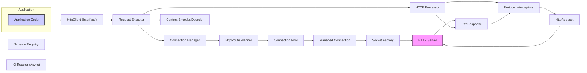

# Project Design Document: Apache HttpComponents Client

**Version:** 1.1
**Date:** October 26, 2023
**Author:** AI Software Architect

## 1. Introduction

This document provides a detailed design overview of the Apache HttpComponents Client library. It outlines the library's architecture, key components, data flow, and integration points, with a particular focus on aspects relevant to security threat modelling. This document serves as a foundation for understanding the system's attack surface and potential vulnerabilities.

## 2. Project Overview

The Apache HttpComponents Client is a widely adopted Java library for building robust and efficient HTTP-based applications. It offers a comprehensive set of APIs and abstractions for managing the complexities of HTTP communication, including request and response handling, connection management, authentication, and protocol-specific features. Its maturity and extensive use make it a critical component in many Java-based systems that interact with web services and network resources over HTTP.

## 3. Goals and Objectives

* Provide a reliable, performant, and secure HTTP client implementation.
* Offer a flexible and extensible architecture to accommodate diverse HTTP features, extensions, and security requirements.
* Simplify the development of HTTP-aware applications by abstracting low-level networking details.
* Adhere to modern HTTP standards and promote security best practices in HTTP communication.
* Enable developers to implement secure communication patterns, including authentication, authorization, and data protection.

## 4. Target Audience

This document is intended for individuals involved in the security and development lifecycle of applications utilizing the Apache HttpComponents Client library:

* Security engineers and architects responsible for threat modelling and security assessments.
* Software developers using the Apache HttpComponents Client library to build HTTP-based applications.
* System architects designing application architectures that incorporate the library and need to understand its security implications.
* Quality assurance engineers involved in security testing and validation of applications using the library.
* DevOps engineers responsible for deploying and managing applications that rely on the library.

## 5. High-Level Architecture

**Description:**

* **Application Code:** The portion of the user's application that initiates HTTP requests using the HttpComponents Client library. This is the primary point of interaction with the library.
* **HttpClient (Interface):** The main interface for executing HTTP requests. Concrete implementations like `CloseableHttpClient` provide various configurations and functionalities. This is a key entry point for controlling HTTP behavior.
* **Request Executor:** Responsible for the overall execution flow of an HTTP request, including selecting a connection, handling retries, and managing interceptors. This component orchestrates the request lifecycle.
* **Connection Manager:** Manages the lifecycle of HTTP connections, including connection pooling, reuse, and eviction. Implementations like `PoolingHttpClientConnectionManager` optimize connection usage and performance. This is critical for managing resources and potentially mitigating connection-based attacks.
* **HTTP Processor:** A core component responsible for processing HTTP messages (requests and responses), including parsing headers and applying protocol logic. This is a central point for enforcing HTTP standards and handling protocol-level security.
* **Protocol Interceptors:**  Provide a mechanism to intercept and modify HTTP requests and responses at various stages of processing. This allows for customization, including adding security headers, logging, and authentication. Improperly implemented interceptors can introduce vulnerabilities.
* **HttpRequest:** Represents an outgoing HTTP request, encapsulating details such as the HTTP method, URI, headers, and request body (entity). This is the data being sent to the server.
* **HttpResponse:** Represents an incoming HTTP response from the server, containing the status code, headers, and response body (entity). This is the data received from the server.
* **HttpRoute Planner:** Determines the route to the target server, considering factors like proxy configurations and network topology. Incorrect routing can lead to unintended targets.
* **Connection Pool:** A repository of reusable HTTP connections managed by the Connection Manager, improving performance by reducing connection establishment overhead. Security considerations include managing stale connections and preventing connection hijacking.
* **Managed Connection:** A wrapper around a physical socket connection, managed by the Connection Manager. This layer handles the underlying network communication.
* **Scheme Registry:** Maps protocol schemes (e.g., HTTP, HTTPS) to their corresponding socket factories and default ports. This is crucial for establishing secure connections.
* **Socket Factory:** Responsible for creating socket connections, including handling the complexities of SSL/TLS handshake for HTTPS. Properly configured socket factories are essential for secure communication.
* **IO Reactor (Async):** (Used in asynchronous clients) Manages non-blocking I/O operations, enabling efficient handling of concurrent requests. Security considerations in asynchronous operations include proper handling of callbacks and shared state.
* **Content Encoder/Decoder:** Handles the encoding and decoding of HTTP message bodies (e.g., gzip, deflate). Vulnerabilities can arise from improper handling of encoded content.
* **HTTP Server:** The external server that the client is communicating with. The security posture of the server is a critical factor in the overall security of the interaction.

## 6. Key Components

* **`HttpClient` Interface and Implementations (`CloseableHttpClient`, `InternalHttpClient`):**
    * Defines the core contract for executing HTTP requests.
    * Implementations offer varying levels of customization and control over the request execution process.
    * Security considerations involve choosing appropriate implementations and configuring them securely (e.g., setting timeouts, default headers).
* **`HttpRequest` and `HttpResponse` Interfaces and Implementations (`BasicHttpRequest`, `BasicHttpResponse`):**
    * Represent the fundamental units of HTTP communication.
    * Crucial for understanding the data being transmitted and received.
    * Security implications include protecting sensitive information within headers and entities.
* **`HttpClientContext`:**
    * Holds the execution state for a specific request, including configuration, connection details, user credentials, and attributes.
    * Securely managing and clearing sensitive information within the context is vital.
* **`HttpRoutePlanner` Implementations (`DefaultRoutePlanner`, `SystemDefaultRoutePlanner`):**
    * Determines the route to the target server, potentially involving proxy servers.
    * Misconfiguration can lead to requests being routed through unintended or malicious proxies.
* **`ConnectionManager` Implementations (`BasicHttpClientConnectionManager`, `PoolingHttpClientConnectionManager`):**
    * Manage the lifecycle of connections, impacting performance and resource utilization.
    * Security considerations include managing connection timeouts, preventing connection leaks, and handling stale connections securely.
* **`HttpRequestInterceptor` and `HttpResponseInterceptor` Implementations:**
    * Allow for custom logic to be executed at various stages of request and response processing.
    * Powerful for adding security headers (e.g., `Strict-Transport-Security`), logging, authentication, and request/response modification.
    * Malicious or poorly written interceptors can introduce vulnerabilities.
* **`Scheme` and `SchemeRegistry`:**
    * Define the properties of communication protocols (HTTP, HTTPS).
    * Crucial for enforcing secure communication by specifying secure socket factories for HTTPS.
    * Incorrect configuration can lead to insecure connections.
* **`ClientConnectionOperator` and `HttpClientConnection` Implementations:**
    * Handle the low-level details of establishing and managing socket connections.
    * Security considerations include proper handling of socket timeouts and potential vulnerabilities in the underlying socket implementation.
* **`HttpEntity` Implementations (`StringEntity`, `ByteArrayEntity`, `InputStreamEntity`):**
    * Represent the content of HTTP messages.
    * Security implications involve protecting sensitive data within the entity and handling potentially malicious content.
* **`CookieStore` Implementations (`BasicCookieStore`):**
    * Manage client-side cookies.
    * Security considerations include properly handling cookie scope, secure flags, and HttpOnly flags to prevent cookie-based attacks.
* **`CookieSpecProvider` Implementations:**
    * Define how cookies are parsed and formatted.
    * Incorrect cookie handling can lead to vulnerabilities.
* **`CredentialsProvider` Implementations (`BasicCredentialsProvider`):**
    * Store authentication credentials.
    * Secure storage and management of credentials are paramount. Avoid storing credentials in plain text.
* **`HttpRequestRetryHandler` Implementations (`DefaultHttpRequestRetryHandler`):**
    * Determine retry behavior for failed requests.
    * Security considerations involve preventing excessive retries that could lead to denial-of-service attacks.
* **Asynchronous Client Components (`CloseableHttpAsyncClient`, `IOReactorConfig`, etc.):**
    * Enable non-blocking, asynchronous HTTP communication.
    * Security considerations include managing shared state and preventing race conditions in asynchronous operations.

## 7. Data Flow

The typical data flow for a synchronous HTTP request using the HttpComponents Client, highlighting security-relevant steps, is as follows:

1. The **Application Code** constructs an `HttpRequest` object, potentially including sensitive data in headers or the entity. **Security Consideration:** Ensure sensitive data is protected and appropriate encoding is used.
2. The application obtains an instance of `HttpClient`, configured with security settings such as TLS protocols and timeouts. **Security Consideration:** Verify the `HttpClient` is configured with strong security settings.
3. The application calls the `execute()` method, passing the `HttpRequest` and optionally an `HttpClientContext` containing authentication credentials. **Security Consideration:** Protect credentials within the `HttpClientContext`.
4. The `Request Executor` receives the request and initiates the execution pipeline.
5. The `HttpRoutePlanner` determines the `HttpRoute`. **Security Consideration:** Validate the target host and ensure requests are not inadvertently routed to malicious destinations.
6. The `Connection Manager` attempts to obtain a connection from the `Connection Pool`. If a new connection is needed:
    * The `SchemeRegistry` is consulted to obtain the appropriate `Socket Factory`.
    * The `Socket Factory` establishes a socket connection to the target server. **Security Consideration:** For HTTPS, this involves a TLS handshake. Ensure the TLS handshake uses strong ciphers and proper certificate validation is performed to prevent man-in-the-middle attacks.
7. **Request Processing:**
    * `HttpRequestInterceptor`s are executed. **Security Consideration:** Interceptors can add security headers (e.g., `Authorization`, `X-Frame-Options`). Ensure interceptors are implemented securely.
    * The `HTTP Processor` serializes the `HttpRequest` into a byte stream. **Security Consideration:** Ensure proper encoding to prevent injection attacks.
    * The byte stream is transmitted over the established socket connection.
8. **Response Processing:**
    * The `HTTP Processor` receives the byte stream from the socket.
    * The byte stream is parsed into an `HttpResponse` object.
    * **Security Consideration:** Validate the response status code and headers.
    * `HttpResponseInterceptor`s are executed. **Security Consideration:** Interceptors can process security headers (e.g., `Strict-Transport-Security`).
9. The `Content Encoder/Decoder` handles content encoding. **Security Consideration:** Be aware of potential vulnerabilities in decompression libraries.
10. The `HttpResponse` object is returned to the application code.
11. The application code consumes the `HttpEntity`. **Security Consideration:** Sanitize and validate the response content to prevent vulnerabilities like XSS.
12. The `Connection Manager` manages the connection, potentially returning it to the pool. **Security Consideration:** Ensure connections are properly closed and resources are released.

## 8. Security Considerations (Detailed)

This section expands on the security considerations identified earlier, providing more specific examples and potential mitigation strategies:

* **TLS/SSL Configuration:**
    * **Vulnerability:** Man-in-the-middle attacks if weak ciphers are used or certificate validation is disabled.
    * **Mitigation:** Configure the `SSLContext` with strong TLS protocols (TLS 1.2 or higher) and enforce certificate validation. Use a reputable trust store. Consider using certificate pinning for enhanced security.
* **Input Validation:**
    * **Vulnerability:** HTTP header injection, SSRF if URLs or headers are not properly validated.
    * **Mitigation:** Validate all user-supplied input used in constructing requests (URLs, headers, parameters). Use parameterized queries or prepared statements when constructing URLs. Implement allow-lists for accepted values.
* **Cookie Handling:**
    * **Vulnerability:** Session hijacking, cross-site scripting (XSS) if cookies are not handled securely.
    * **Mitigation:** Ensure `secure` and `HttpOnly` flags are set for sensitive cookies. Use appropriate domain and path scoping. Avoid storing sensitive data directly in cookies.
* **Authentication and Authorization:**
    * **Vulnerability:** Unauthorized access if authentication is weak or credentials are compromised.
    * **Mitigation:** Use strong authentication mechanisms (e.g., OAuth 2.0, mutual TLS). Store credentials securely (e.g., using a secrets manager). Implement proper authorization checks on the server-side.
* **Redirection Handling:**
    * **Vulnerability:** Open redirects, phishing attacks if redirection targets are not validated.
    * **Mitigation:** Avoid automatic redirects for untrusted URLs. Validate redirection targets against a whitelist of allowed domains.
* **Content Handling:**
    * **Vulnerability:** Cross-site scripting (XSS), injection attacks if response content is not properly sanitized.
    * **Mitigation:** Sanitize and validate response content before rendering it in a web browser or using it in other contexts. Use appropriate encoding for different content types.
* **Dependency Management:**
    * **Vulnerability:** Exploiting known vulnerabilities in transitive dependencies.
    * **Mitigation:** Regularly update dependencies to the latest secure versions. Use dependency scanning tools to identify and remediate vulnerabilities.
* **Error Handling and Information Disclosure:**
    * **Vulnerability:** Sensitive information leakage through verbose error messages or stack traces.
    * **Mitigation:** Implement robust error handling that avoids revealing sensitive details. Log errors securely and avoid exposing them to end-users.
* **Connection Management and Resource Exhaustion:**
    * **Vulnerability:** Denial-of-service (DoS) attacks through connection exhaustion.
    * **Mitigation:** Configure connection pool settings (max connections, timeouts) appropriately. Implement circuit breakers to prevent cascading failures.
* **Proxy Configuration:**
    * **Vulnerability:** Requests being routed through malicious proxies, bypassing security controls.
    * **Mitigation:** Carefully configure proxy settings and ensure they are only used for trusted proxies. Avoid using system-wide proxy settings for sensitive applications.

## 9. Integration Points (Security Focused)

This section highlights integration points with a focus on potential security risks:

* **Application Code:**
    * **Risk:** Vulnerabilities introduced through incorrect usage of the HttpComponents Client API (e.g., improper input validation, insecure configuration).
    * **Mitigation:** Follow secure coding practices, perform thorough code reviews, and provide developer training on secure HTTP client usage.
* **Operating System:**
    * **Risk:** Reliance on the OS for network security (e.g., firewall rules).
    * **Mitigation:** Ensure the underlying OS is hardened and properly configured with appropriate firewall rules.
* **DNS Servers:**
    * **Risk:** DNS spoofing or poisoning attacks could lead to connections to malicious servers.
    * **Mitigation:** Use DNSSEC to verify the authenticity of DNS responses.
* **Proxy Servers:**
    * **Risk:** Man-in-the-middle attacks if connecting through untrusted proxies.
    * **Mitigation:** Only use trusted and well-managed proxy servers. Implement mutual authentication with proxies if possible.
* **Authentication Providers:**
    * **Risk:** Compromised credentials or insecure authentication protocols.
    * **Mitigation:** Use strong authentication protocols (e.g., OAuth 2.0, SAML). Securely manage and store API keys or tokens.
* **External HTTP Servers/Web Services:**
    * **Risk:** Connecting to vulnerable or malicious external services.
    * **Mitigation:** Validate the security posture of external services before integration. Implement input validation for responses received from external services.
* **Logging Frameworks:**
    * **Risk:** Sensitive information being logged insecurely.
    * **Mitigation:** Configure logging frameworks to avoid logging sensitive data. Securely store and manage log files.
* **Monitoring and Metrics Systems:**
    * **Risk:** Exposure of sensitive data through monitoring metrics.
    * **Mitigation:** Ensure that monitoring systems do not inadvertently collect or expose sensitive information.
* **Security Libraries (e.g., for cryptography):**
    * **Risk:** Vulnerabilities in integrated security libraries.
    * **Mitigation:** Use well-vetted and up-to-date security libraries. Follow best practices for cryptographic operations.

## 10. Deployment Considerations (Security Focused)

Security implications related to the deployment environment:

* **Java Runtime Environment (JRE):**
    * **Risk:** Vulnerabilities in the JRE could be exploited.
    * **Mitigation:** Keep the JRE updated with the latest security patches.
* **Network Configuration:**
    * **Risk:** Insecure network configurations (e.g., open ports, lack of network segmentation) can increase the attack surface.
    * **Mitigation:** Implement proper network segmentation and firewall rules to restrict access to the application.
* **Security Policies:**
    * **Risk:** Non-compliance with organizational security policies.
    * **Mitigation:** Ensure the application's configuration and usage of the HttpComponents Client align with organizational security policies.
* **Resource Limits:**
    * **Risk:** Denial-of-service if resource limits are not properly configured.
    * **Mitigation:** Configure appropriate resource limits (e.g., memory, connection limits) to prevent resource exhaustion.

## 11. Future Enhancements (Potential Security Implications)

Potential future changes and their possible security impacts:

* **Improved HTTP/3 Support:**
    * **Potential Impact:** New security considerations related to QUIC protocol and its implementation.
* **Reactive Programming Integration:**
    * **Potential Impact:** New attack vectors related to asynchronous programming and handling of reactive streams.
* **Enhanced Security Features:**
    * **Potential Impact:**  Requires careful design and implementation to avoid introducing new vulnerabilities.
* **Performance Optimizations:**
    * **Potential Impact:** Changes in connection management or data handling could introduce new security risks if not carefully considered.

This improved document provides a more detailed and security-focused overview of the Apache HttpComponents Client library, making it a more effective resource for threat modelling activities.