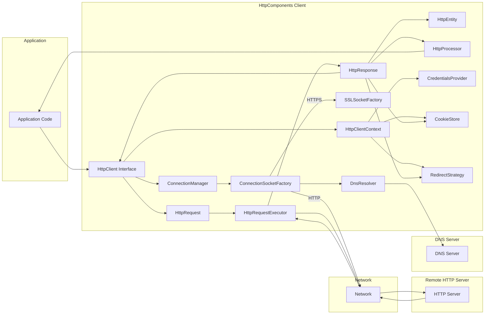

# Project Design Document: Apache HttpComponents Client

**Version:** 1.1
**Date:** October 26, 2023
**Author:** AI Software Architect

## 1. Introduction

This document provides an enhanced and detailed design overview of the Apache HttpComponents Client library. It aims to clearly describe the architecture, key components, and data flow within the library, with a specific focus on providing the necessary information for effective threat modeling.

### 1.1. Purpose

The primary purpose of this document is to serve as a comprehensive and improved design reference for security professionals and developers involved in threat modeling the Apache HttpComponents Client library. It meticulously outlines the system's boundaries, components, and their interactions, enabling a more thorough and accurate analysis of potential threats and attack vectors.

### 1.2. Scope

This document comprehensively covers the core functionalities and architectural aspects of the Apache HttpComponents Client library. It focuses on the client-side operations involved in initiating and managing HTTP requests and the subsequent handling of responses. While the document primarily focuses on the client library itself, it acknowledges and describes the interactions with external entities like DNS servers and remote HTTP servers where these interactions are crucial for understanding potential security implications. It does not delve into the internal workings of the JVM or the underlying operating system in detail, unless directly relevant to the library's security.

### 1.3. Audience

The intended audience for this document includes:

*   Security architects and engineers responsible for conducting threat modeling exercises and security assessments of systems utilizing the HttpComponents Client.
*   Software developers who actively use or contribute to the Apache HttpComponents Client library, requiring a deep understanding of its architecture for secure implementation.
*   DevOps engineers involved in the deployment, configuration, and management of applications that depend on this library, needing to understand its security-related configuration options.

## 2. System Overview

The Apache HttpComponents Client library is a well-established and widely adopted Java library designed for building robust and performant HTTP-based applications. It offers a rich set of APIs and functionalities for managing various aspects of HTTP communication, including but not limited to:

*   Programmatic creation and execution of diverse HTTP request types (GET, POST, PUT, DELETE, etc.).
*   Sophisticated connection management features, such as connection pooling, persistent connections (keep-alive), and connection eviction strategies.
*   Comprehensive support for various authentication and authorization mechanisms, including Basic, Digest, and integration points for more complex schemes like OAuth.
*   Flexible cookie management, allowing for the storage, retrieval, and manipulation of HTTP cookies.
*   Full support for different HTTP protocol versions, including HTTP/1.1 and HTTP/2, with negotiation capabilities.
*   Mechanisms for handling content encoding and decoding (e.g., gzip, deflate).
*   Robust error handling and configurable retry mechanisms for dealing with transient network issues or server-side errors.
*   Extensive support for secure communication via SSL/TLS, including customizable SSL context configurations.

The library's design emphasizes flexibility and extensibility, enabling developers to tailor its behavior through a variety of configuration options, custom interceptors, and pluggable strategies.

## 3. Architectural Design

The Apache HttpComponents Client library employs a layered architecture with clearly defined interfaces between its constituent components. This modular design promotes maintainability, testability, and allows for independent evolution of different parts of the library.

### 3.1. Key Components

The following are the key logical components within the Apache HttpComponents Client library, elaborated for clarity:

*   **`HttpClient` Interface:** This serves as the primary entry point for executing HTTP requests. Concrete implementations of this interface (e.g., `CloseableHttpClient`) provide the core logic for sending requests and receiving responses. It orchestrates the interaction between other components.
*   **`HttpRequest` Interface (and implementations like `HttpGet`, `HttpPost`):** Represents an abstract HTTP request. Concrete implementations encapsulate specific details such as the HTTP method (GET, POST, etc.), the target URI, HTTP headers, and the request entity (if any).
*   **`HttpResponse` Interface (and implementations like `BasicHttpResponse`):** Represents the HTTP response received from the server. It encapsulates the HTTP status code, response headers, and the response entity.
*   **`HttpEntity` Interface (and implementations like `StringEntity`, `ByteArrayEntity`):** Represents the payload or content of an HTTP request or response. It can be a stream of bytes, a string, or other data formats. Implementations provide ways to access and consume the content.
*   **`HttpClientContext` Class:** Holds the execution state and request-specific configuration for a particular HTTP request execution. This includes authentication credentials, cookie store, redirect strategy, and other contextual information that can vary between requests.
*   **`ConnectionManager` Interface (and implementations like `PoolingHttpClientConnectionManager`):** Responsible for the management of HTTP connections. This includes connection pooling to efficiently reuse connections, handling keep-alive connections to reduce latency, and implementing connection eviction policies to manage resources.
*   **`SchemeRegistry` Class (deprecated, replaced by `RegistryBuilder` and `HttpClientConnectionManager` configuration):**  Historically, this mapped protocol schemes (e.g., HTTP, HTTPS) to their corresponding socket factories. Modern versions use a more flexible registry within the `HttpClientConnectionManager`.
*   **`HttpRequestExecutor` Class:**  The core component responsible for the actual execution of the HTTP request over an established connection. It handles the low-level details of sending the request and receiving the response.
*   **`HttpProcessor` Interface (and implementations like `RequestAddCookies`, `ResponseContentDecompressor`):** Represents a chain of interceptors that can intercept and modify the request before it is sent (request interceptors) and the response after it is received (response interceptors). This allows for adding headers, decompressing content, etc.
*   **`CredentialsProvider` Interface (and implementations like `BasicCredentialsProvider`):** Provides authentication credentials (e.g., username/password) for different authentication schemes. Implementations manage the storage and retrieval of these credentials.
*   **`CookieStore` Interface (and implementations like `BasicCookieStore`):** Manages HTTP cookies. Implementations are responsible for storing, retrieving, and managing the lifecycle of cookies based on the `Set-Cookie` headers.
*   **`RedirectStrategy` Interface (and implementations like `DefaultRedirectStrategy`):** Determines how HTTP redirects (e.g., status codes 301, 302) are handled. Implementations define the logic for following redirects.
*   **`ConnectionSocketFactory` Interface (and implementations like `PlainConnectionSocketFactory`):** Creates and manages client-side sockets for different protocols (e.g., plain TCP for HTTP).
*   **`SSLSocketFactory` Class (and implementations using `SSLContexts`):** A specialized implementation of `ConnectionSocketFactory` for secure HTTPS connections. It handles the SSL/TLS handshake, certificate validation, and encryption of communication.
*   **`DnsResolver` Interface (and implementations like `SystemDefaultDnsResolver`):** Responsible for resolving hostnames to IP addresses. Implementations interact with the underlying operating system's DNS resolution mechanisms.

### 3.2. Component Interactions

The following list describes the typical sequence of actions during an HTTP request execution, highlighting the interactions between the key components:

1. The application initiates the process by creating an `HttpRequest` object, specifying the target URI, HTTP method (e.g., GET, POST), any necessary headers, and the request entity (if required for methods like POST or PUT).
2. The application then obtains an instance of `HttpClient`, which serves as the orchestrator for the request execution.
3. The application calls the `HttpClient.execute()` method, passing the `HttpRequest` object and optionally a `HttpClientContext`. The `HttpClientContext` can contain request-specific configurations like authentication credentials or a custom cookie store.
4. The `HttpClient` delegates to the `ConnectionManager` to acquire a connection to the target server. The `ConnectionManager` checks its pool for an existing, reusable connection. If none is available, it establishes a new connection.
5. Establishing a new connection involves using the `SchemeRegistry` (or the configured connection factory within `HttpClientConnectionManager`) and the appropriate `ConnectionSocketFactory`. For HTTPS requests, this involves the `SSLSocketFactory` performing the TLS handshake, including certificate validation against configured trust stores. The `DnsResolver` is used to resolve the server's hostname to an IP address.
6. Before the request is sent, the `HttpProcessor`'s registered request interceptors are applied to the `HttpRequest`. These interceptors can modify the request, for example, by adding common headers, applying authentication schemes, or adding cookies.
7. The `HttpRequestExecutor` takes the processed `HttpRequest` and sends it over the established connection to the remote HTTP server.
8. The remote HTTP server processes the request and sends back an `HttpResponse`.
9. The `HttpRequestExecutor` receives the `HttpResponse` from the server.
10. After receiving the response, the `HttpProcessor`'s registered response interceptors are applied to the `HttpResponse`. These interceptors can modify the response, for example, by decompressing the response entity or validating headers.
11. If the `HttpResponse` indicates a redirect (e.g., status code 302), the `RedirectStrategy` is consulted to determine if and how the redirect should be followed. This might involve creating a new `HttpRequest` and repeating the execution process.
12. The `CookieStore` is updated based on any `Set-Cookie` headers present in the `HttpResponse`, storing or updating cookies for future requests to the same domain.
13. Finally, the `HttpClient.execute()` method returns the fully processed `HttpResponse` to the calling application code.
14. The application then processes the `HttpResponse`, typically accessing the response entity to retrieve the data returned by the server.
15. The `ConnectionManager` manages the connection lifecycle. If the connection is no longer needed, it might be returned to the connection pool for reuse by subsequent requests, improving efficiency.

### 3.3. Data Flow Diagram

## 4. Security Considerations

This section provides a more detailed examination of key security considerations relevant to the Apache HttpComponents Client library, highlighting potential threats and areas requiring careful attention.

*   **TLS/SSL Configuration:**
    *   **Threat:** Man-in-the-middle attacks if weak cipher suites are allowed or proper certificate validation is not enforced.
    *   **Consideration:** Ensure strong cipher suites are configured and used. Implement robust certificate validation, including hostname verification against the server's certificate and proper management of the trust store containing trusted Certificate Authorities (CAs). Be aware of the supported TLS protocols (TLS 1.2, TLS 1.3) and prioritize the most secure options.
*   **Input Validation:**
    *   **Threat:** Injection attacks (e.g., CRLF injection leading to HTTP response splitting or header injection) if URLs or headers are not properly validated.
    *   **Consideration:** Implement rigorous validation of all input that forms part of the HTTP request, including URLs, headers, and request parameters. Sanitize or encode data appropriately to prevent malicious injection.
*   **Cookie Management:**
    *   **Threat:** Cookie theft or manipulation if cookies are not handled securely.
    *   **Consideration:** Ensure secure handling of cookies by respecting the `HttpOnly` and `Secure` flags. Utilize HTTPS to protect cookies in transit. Be mindful of cookie scoping to prevent unintended sharing of cookies between different parts of an application or different domains.
*   **Authentication and Authorization:**
    *   **Threat:** Credential compromise if credentials are not stored or transmitted securely.
    *   **Consideration:** Store and handle authentication credentials securely. Utilize secure authentication schemes where possible. Be cautious with custom authentication implementations, ensuring they are robust against common attacks. Leverage the `CredentialsProvider` interface securely.
*   **Redirection Handling:**
    *   **Threat:** Open redirect vulnerabilities that can be exploited for phishing or to redirect users to malicious sites.
    *   **Consideration:** Carefully validate redirect URLs to prevent open redirects. Consider limiting redirection to specific whitelisted domains. Be aware of potential information leakage through redirect URLs.
*   **Connection Management:**
    *   **Threat:** Connection hijacking if connections are not managed securely.
    *   **Consideration:** Ensure secure connection reuse and termination. Be aware of the potential for connection hijacking, especially in untrusted network environments. Properly configure connection timeouts and eviction policies.
*   **Error Handling:**
    *   **Threat:** Information disclosure through overly verbose error messages.
    *   **Consideration:** Avoid disclosing sensitive information in error messages. Implement proper exception handling to prevent denial-of-service attacks caused by resource exhaustion due to unhandled errors.
*   **Dependency Management:**
    *   **Threat:** Introduction of vulnerabilities through vulnerable transitive dependencies.
    *   **Consideration:** Regularly audit and update the HttpComponents Client library and all its dependencies to patch known vulnerabilities. Utilize dependency management tools to identify and manage vulnerabilities.
*   **DNS Security:**
    *   **Threat:** DNS spoofing attacks that could redirect requests to malicious servers.
    *   **Consideration:** Be aware of the potential for DNS spoofing attacks. Consider using DNS over HTTPS (DoH) for enhanced security of DNS resolution.
*   **Proxy Configuration:**
    *   **Threat:** Unauthorized access or interception of traffic if proxy settings are not configured securely.
    *   **Consideration:** Securely configure proxy settings, including authentication requirements for proxy servers. Be cautious when using untrusted proxies.
*   **HTTP Protocol Vulnerabilities:**
    *   **Threat:** Exploitation of known vulnerabilities in HTTP protocols (e.g., request smuggling).
    *   **Consideration:** Stay informed about known vulnerabilities in HTTP protocols and ensure the HttpComponents Client library is updated to versions that mitigate these risks. Be aware of potential issues arising from interactions with non-compliant servers.

## 5. Deployment Considerations

The security of applications utilizing the Apache HttpComponents Client library is also influenced by deployment considerations:

*   **Environment Security:** The overall security posture of the environment where the application is deployed (e.g., cloud environment, on-premise data center) significantly impacts the security of the client library.
*   **Secure Configuration:** Proper and secure configuration of the `HttpClient` instance is crucial. This includes setting appropriate TLS settings, timeouts, connection pool parameters, and other security-related configurations.
*   **Least Privilege:** The application running the client library should be granted only the necessary permissions to perform its intended functions, adhering to the principle of least privilege.
*   **Monitoring and Logging:** Implement robust monitoring of network traffic and application logs to detect suspicious activity or potential security breaches related to the client library's operations.
*   **Regular Updates:** Regularly update the HttpComponents Client library to the latest stable version to benefit from security patches and bug fixes.

## 6. Assumptions and Constraints

The following assumptions and constraints are relevant to this design document:

*   This document primarily focuses on the security aspects of the client-side HTTP communication facilitated by the library.
*   It assumes the reader possesses a foundational understanding of HTTP protocols, web security principles, and common attack vectors.
*   The library is assumed to be used within a standard Java runtime environment.
*   The inherent security of the remote HTTP servers the client interacts with is generally considered outside the direct scope of this document, except where the client's interaction with their security mechanisms is relevant.

## 7. Future Considerations

Ongoing improvements and future areas of focus for the Apache HttpComponents Client library from a security perspective could include:

*   Further enhanced support for emerging security protocols and industry best practices.
*   Advanced mechanisms for proactively detecting and mitigating HTTP protocol vulnerabilities, potentially through more intelligent request/response analysis.
*   More fine-grained control over security settings and configurations, allowing developers to tailor security policies more precisely.
*   Seamless integration with security scanning tools and frameworks to facilitate automated vulnerability assessments.
*   Continued efforts to harden the library against potential attack vectors and ensure resilience against evolving threats.

This improved document provides a more detailed and comprehensive design overview of the Apache HttpComponents Client library, specifically enhanced for threat modeling activities. By providing a deeper understanding of the library's architecture, component interactions, and security considerations, this document aims to empower security professionals and developers to more effectively identify, assess, and mitigate potential security risks.