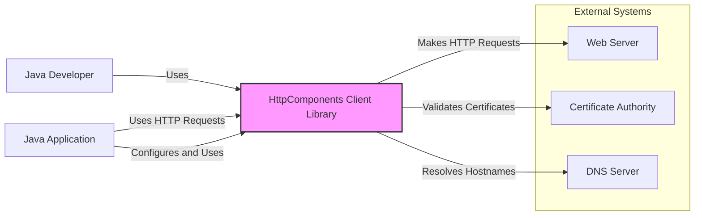
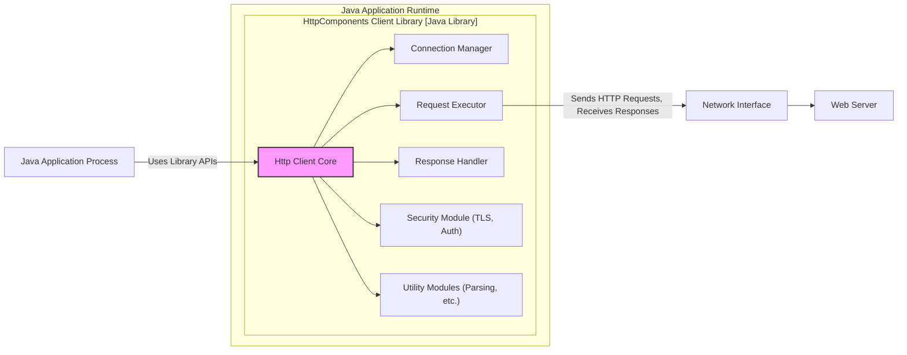
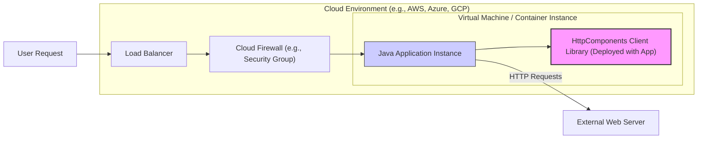

# BUSINESS POSTURE

This project, Apache HttpComponents Client, aims to provide a robust, efficient, and feature-rich HTTP client library for Java. It is designed to simplify the process of making HTTP requests and handling responses within Java applications.

Business Priorities and Goals:
- Provide a reliable and stable HTTP client library for Java developers.
- Offer high performance and efficiency in HTTP communication.
- Support a wide range of HTTP standards and features.
- Maintain compatibility and ease of integration with existing Java ecosystems.
- Ensure the library is secure and protects applications from HTTP-related vulnerabilities.
- Foster a strong community and provide ongoing maintenance and updates.

Business Risks:
- Security vulnerabilities in the library could be exploited by attackers, compromising applications that depend on it.
- Performance bottlenecks in the library could negatively impact the performance of applications using it.
- Lack of compatibility with new HTTP standards or Java versions could limit the library's usability and adoption.
- Bugs or instability in the library could lead to application failures and disruptions.
- Insufficient maintenance and support could result in unpatched vulnerabilities and a decline in the library's quality over time.

# SECURITY POSTURE

Existing Security Controls:
- security control: Open Source Development - The project is developed openly, allowing for community review and scrutiny of the code. This can help identify potential security issues. Implemented through GitHub repository and public contribution process.
- security control: Version Control - Source code is managed using Git, providing traceability of changes and facilitating security audits. Implemented through GitHub.
- security control: Build Automation -  Likely uses automated build processes (e.g., Maven) which can be configured to include basic security checks. Implemented through project build scripts and potentially CI/CD pipelines.
- security control: Dependency Management - Uses dependency management tools (e.g., Maven) to manage external libraries, which allows for tracking and updating dependencies for security vulnerabilities. Implemented through pom.xml files.

Accepted Risks:
- accepted risk: Reliance on Community Security Contributions -  Security depends partly on the vigilance of the open-source community to identify and report vulnerabilities.
- accepted risk: Third-Party Dependency Vulnerabilities - Vulnerabilities in third-party dependencies could affect the library.
- accepted risk: User Misconfiguration - Users might misconfigure the library in ways that introduce security vulnerabilities in their applications.

Recommended Security Controls:
- security control: Automated Security Scanning - Implement automated Static Application Security Testing (SAST) and Dependency Scanning in the CI/CD pipeline to detect potential vulnerabilities in the code and dependencies.
- security control: Regular Security Audits - Conduct periodic security audits and penetration testing to identify and address security weaknesses.
- security control: Vulnerability Disclosure Policy - Establish a clear vulnerability disclosure policy to handle security reports responsibly and efficiently.
- security control: Security Code Reviews - Implement mandatory security focused code reviews for all code changes, especially those related to parsing, networking, and cryptography.

Security Requirements:
- Authentication:
    - Requirement: The library should securely handle authentication credentials (e.g., API keys, tokens, usernames/passwords) when making requests.
    - Requirement: The library should support various authentication schemes (e.g., Basic, Bearer, OAuth) and allow users to implement custom schemes securely.
- Authorization:
    - Requirement: The library should correctly handle server-side authorization responses (e.g., 401 Unauthorized, 403 Forbidden) and provide mechanisms for applications to react appropriately.
    - Requirement: The library itself does not enforce authorization policies, but it should not introduce vulnerabilities that could bypass authorization mechanisms implemented by applications or servers.
- Input Validation:
    - Requirement: The library must perform robust input validation on all data received from HTTP responses (headers, body) to prevent injection attacks (e.g., header injection, response splitting).
    - Requirement: The library should provide mechanisms for users to validate input data before making HTTP requests to prevent sending malformed or malicious requests.
- Cryptography:
    - Requirement: The library must support secure communication over HTTPS/TLS, using strong cryptographic algorithms and protocols.
    - Requirement: The library should handle TLS certificate validation correctly to prevent man-in-the-middle attacks.
    - Requirement: If the library provides any cryptographic functionalities beyond TLS (which is less likely for an HTTP client), these must be implemented securely using well-vetted cryptographic libraries and best practices.

# DESIGN

## C4 CONTEXT

Context Diagram Elements:

- Name: Java Developer
    - Type: Person
    - Description: Software developers who use the HttpComponents Client Library to build Java applications.
    - Responsibilities: Integrate the library into their applications, configure it appropriately, and handle HTTP interactions.
    - Security controls: Secure development practices, secure configuration of the library in their applications.

- Name: Java Application
    - Type: Software System
    - Description: Java applications that utilize the HttpComponents Client Library to communicate with web services and servers over HTTP.
    - Responsibilities:  Business logic, data processing, user interaction, and using the HTTP client for network communication.
    - Security controls: Application-level security controls, input validation, authorization, secure data handling, and proper use of the HTTP client library.

- Name: HttpComponents Client Library
    - Type: Software System
    - Description: The Apache HttpComponents Client Library, a Java library providing functionalities for making HTTP requests and handling responses.
    - Responsibilities:  Creating and sending HTTP requests, handling HTTP responses, managing connections, supporting various HTTP features and protocols, and providing a secure and efficient HTTP client implementation.
    - Security controls: TLS/SSL for secure communication, input validation of HTTP responses, secure handling of authentication credentials, protection against HTTP-specific vulnerabilities (e.g., response splitting).

- Name: Web Server
    - Type: Software System
    - Description:  External web servers or web services that the Java Application interacts with via HTTP requests made by the HttpComponents Client Library.
    - Responsibilities:  Serving HTTP resources, processing requests, handling authentication and authorization, and providing responses.
    - Security controls: Server-side security controls, firewalls, intrusion detection systems, secure configuration, and proper handling of HTTP requests.

- Name: Certificate Authority
    - Type: Software System
    - Description:  Trusted entities that issue digital certificates used for TLS/SSL encryption.
    - Responsibilities:  Issuing, managing, and revoking digital certificates.
    - Security controls: Physical and logical security controls to protect the certificate issuance process and private keys.

- Name: DNS Server
    - Type: Software System
    - Description: Domain Name System servers that translate domain names into IP addresses.
    - Responsibilities:  Resolving domain names to IP addresses.
    - Security controls: DNS security extensions (DNSSEC) to prevent DNS spoofing and cache poisoning.

## C4 CONTAINER

Container Diagram Elements:

- Name: HttpComponents Client Library [Java Library]
    - Type: Container
    - Description:  A Java library providing HTTP client functionalities. It is composed of several modules.
    - Responsibilities:  Abstraction of HTTP communication, providing APIs for Java applications to make HTTP requests, managing connections, handling security aspects, and parsing HTTP messages.
    - Security controls:  Input validation within modules, secure implementation of TLS/SSL in Security Module, secure parsing in UtilModule, and protection against common HTTP vulnerabilities.

    - Name: HttpClient Core
        - Type: Module
        - Description: Core API and functionalities for creating and executing HTTP requests.
        - Responsibilities:  Providing the main API for users, orchestrating request execution, and managing configuration.
        - Security controls: API design to encourage secure usage, input validation of user-provided parameters.

    - Name: Connection Manager
        - Type: Module
        - Description: Manages HTTP connections, connection pooling, and connection persistence.
        - Responsibilities:  Efficiently managing network connections, connection reuse, and handling connection timeouts.
        - Security controls: Secure connection establishment, handling of connection limits to prevent denial-of-service, and secure storage of connection state if any.

    - Name: Request Executor
        - Type: Module
        - Description:  Responsible for executing HTTP requests over the network.
        - Responsibilities:  Sending HTTP requests to servers, receiving responses, and handling network-level communication.
        - Security controls:  Protection against network-level attacks, proper handling of network errors, and secure communication protocols (TLS/SSL).

    - Name: Response Handler
        - Type: Module
        - Description:  Parses and processes HTTP responses received from servers.
        - Responsibilities:  Parsing HTTP headers and bodies, handling different response types, and providing access to response data.
        - Security controls:  Robust input validation of HTTP responses to prevent injection attacks, handling of malformed responses, and secure parsing of different content types.

    - Name: Security Module (TLS, Auth)
        - Type: Module
        - Description:  Handles security-related functionalities such as TLS/SSL encryption and authentication schemes.
        - Responsibilities:  Establishing secure TLS/SSL connections, managing certificates, supporting various authentication methods, and securely handling credentials.
        - Security controls:  Strong cryptographic algorithms and protocols, secure certificate validation, secure credential handling, and protection against man-in-the-middle attacks.

    - Name: Utility Modules (Parsing, etc.)
        - Type: Module
        - Description:  Provides utility functionalities such as HTTP message parsing, header handling, and other helper functions.
        - Responsibilities:  Parsing HTTP messages, handling headers, and providing common utility functions.
        - Security controls:  Secure parsing logic to prevent parsing vulnerabilities, input validation of parsed data, and protection against injection attacks through parsing.

- Name: Java Application Process
    - Type: Container
    - Description: The runtime environment where the Java application and the HttpComponents Client Library are executed.
    - Responsibilities:  Executing the Java application code, providing resources for the library, and managing the application lifecycle.
    - Security controls:  Operating system level security controls, JVM security settings, and application-level security configurations.

- Name: Network Interface
    - Type: Container
    - Description:  The network interface used by the Java Application Process to communicate over the network.
    - Responsibilities:  Sending and receiving network packets.
    - Security controls:  Operating system firewall, network security groups, and network intrusion detection systems.

- Name: Web Server
    - Type: External Container
    - Description:  External web servers or web services that the Java Application interacts with. (Same as in Context Diagram)
    - Responsibilities:  Serving HTTP resources, processing requests, handling authentication and authorization, and providing responses. (Same as in Context Diagram)
    - Security controls: Server-side security controls, firewalls, intrusion detection systems, secure configuration, and proper handling of HTTP requests. (Same as in Context Diagram)

## DEPLOYMENT

Deployment Architecture Option: Cloud-based Java Application Deployment

Deployment Diagram Elements:

- Name: Cloud Environment (e.g., AWS, Azure, GCP)
    - Type: Environment
    - Description:  The cloud infrastructure where the Java application is deployed.
    - Responsibilities:  Providing infrastructure resources, managing virtual machines or containers, and offering network and security services.
    - Security controls: Cloud provider security controls, physical security of data centers, network security, and access management.

- Name: Virtual Machine / Container Instance
    - Type: Infrastructure Node
    - Description:  A virtual machine or container instance running in the cloud environment.
    - Responsibilities:  Hosting the Java application and the HttpComponents Client Library.
    - Security controls: Operating system security hardening, instance-level firewalls, and access control.

    - Name: Java Application Instance
        - Type: Software Deployment Unit
        - Description:  A running instance of the Java application.
        - Responsibilities:  Executing the application logic and using the HttpComponents Client Library.
        - Security controls: Application-level security controls, secure configuration, and monitoring.

    - Name: HttpComponents Client Library (Deployed with App)
        - Type: Software Deployment Unit
        - Description:  The HttpComponents Client Library deployed as part of the Java application.
        - Responsibilities:  Providing HTTP client functionalities to the Java application instance.
        - Security controls:  Security controls are inherited from the library design and build process.

- Name: Load Balancer
    - Type: Infrastructure Node
    - Description:  Distributes incoming traffic across multiple instances of the Java application for scalability and availability.
    - Responsibilities:  Load balancing, traffic routing, and health checks.
    - Security controls:  SSL termination, DDoS protection, and access control.

- Name: Cloud Firewall (e.g., Security Group)
    - Type: Infrastructure Node
    - Description:  A network firewall provided by the cloud environment to control inbound and outbound traffic to the Java application instances.
    - Responsibilities:  Filtering network traffic based on defined rules.
    - Security controls:  Network access control lists (ACLs), stateful firewall inspection.

- Name: External Web Server
    - Type: External Infrastructure Node
    - Description:  External web servers or web services that the Java Application communicates with. (Same as in Context Diagram)
    - Responsibilities:  Serving HTTP resources, processing requests, handling authentication and authorization, and providing responses. (Same as in Context Diagram)
    - Security controls: Server-side security controls, firewalls, intrusion detection systems, secure configuration, and proper handling of HTTP requests. (Same as in Context Diagram)

## BUILD

```mermaid
flowchart LR
    subgraph "Developer Workstation"
        Developer["Developer"]
        SourceCode["Source Code (Git)"]
    end
    subgraph "CI/CD Pipeline (e.g., GitHub Actions)"
        CodeCheckout["Code Checkout"]
        BuildProcess["Build Process (Maven)"]
        SecurityScans["Security Scans (SAST, Dependency)"]
        ArtifactRepository["Artifact Repository (Maven Central)"]
    end
    Developer -->|Code Commit| SourceCode
    SourceCode --> CodeCheckout
    CodeCheckout --> BuildProcess
    BuildProcess --> SecurityScans
    SecurityScans --> ArtifactRepository
    ArtifactRepository -->|Library Artifacts| JavaAppDeployment["Java Application Deployment"]
    style ArtifactRepository fill:#aaf,stroke:#333,stroke-width:1px
    style SecurityScans fill:#faa,stroke:#333,stroke-width:1px
```

Build Process Diagram Elements:

- Name: Developer Workstation
    - Type: Environment
    - Description:  The development environment used by developers to write and test code.
    - Responsibilities:  Code development, local testing, and committing code to version control.
    - Security controls:  Developer workstation security, code review practices, and secure coding guidelines.

    - Name: Developer
        - Type: Person
        - Description:  Software developers contributing to the project. (Same as in Context Diagram)
        - Responsibilities:  Writing code, fixing bugs, and implementing new features. (Same as in Context Diagram)
        - Security controls:  Secure coding practices, awareness of security vulnerabilities, and code review participation.

    - Name: Source Code (Git)
        - Type: Data Store
        - Description:  The Git repository hosting the source code of the HttpComponents Client Library.
        - Responsibilities:  Storing and managing the source code, tracking changes, and facilitating collaboration.
        - Security controls:  Access control to the repository, branch protection, and audit logging.

- Name: CI/CD Pipeline (e.g., GitHub Actions)
    - Type: System
    - Description:  An automated CI/CD pipeline used to build, test, and publish the library.
    - Responsibilities:  Automating the build process, running tests, performing security scans, and publishing artifacts.
    - Security controls:  Secure CI/CD pipeline configuration, access control to the pipeline, and security scanning tools.

    - Name: Code Checkout
        - Type: Process
        - Description:  Step in the CI/CD pipeline that retrieves the source code from the Git repository.
        - Responsibilities:  Fetching the latest code changes.
        - Security controls:  Secure access to the Git repository, integrity checks of the checked-out code.

    - Name: Build Process (Maven)
        - Type: Process
        - Description:  Step in the CI/CD pipeline that compiles the code, runs unit tests, and packages the library using Maven.
        - Responsibilities:  Compiling code, running tests, and creating build artifacts.
        - Security controls:  Dependency management, build reproducibility, and secure build environment.

    - Name: Security Scans (SAST, Dependency)
        - Type: Process
        - Description:  Step in the CI/CD pipeline that performs static application security testing (SAST) and dependency scanning to identify vulnerabilities.
        - Responsibilities:  Detecting potential security flaws in the code and dependencies.
        - Security controls:  SAST and dependency scanning tools, vulnerability reporting, and integration with vulnerability management systems.

    - Name: Artifact Repository (Maven Central)
        - Type: Data Store
        - Description:  A repository (e.g., Maven Central) where the built library artifacts are published.
        - Responsibilities:  Storing and distributing the library artifacts.
        - Security controls:  Access control to the repository, integrity checks of artifacts, and secure artifact publishing process.

- Name: Java Application Deployment
    - Type: Environment
    - Description:  The environment where Java applications consume the HttpComponents Client Library. (Same as in Deployment Diagram)
    - Responsibilities:  Running Java applications that depend on the library. (Same as in Deployment Diagram)
    - Security controls: Application-level security controls, secure deployment practices, and dependency management. (Same as in Deployment Diagram)

# RISK ASSESSMENT

Critical Business Processes:
- Secure and reliable HTTP communication for Java applications.
- Maintaining the reputation and trust associated with the Apache HttpComponents project.
- Ensuring the continued usability and adoption of the library by the Java developer community.

Data to Protect:
- Potentially sensitive data transmitted over HTTP connections established by the library (depending on the application using the library). This could include:
    - Authentication credentials (e.g., API keys, tokens, usernames/passwords).
    - Application-specific data exchanged with web services.
    - Configuration data for the library and applications.

Data Sensitivity:
- Sensitivity of data transmitted over HTTP is highly dependent on the application using the library. It can range from public information to highly confidential data (e.g., financial transactions, personal data).
- The library itself does not store persistent sensitive data, but it handles sensitive data in transit.
- The source code of the library itself is publicly available, but unauthorized modifications or compromises to the build and release process could introduce vulnerabilities.

# QUESTIONS & ASSUMPTIONS

Questions:
- What specific SAST and dependency scanning tools are currently used in the CI/CD pipeline (if any)?
- Is there a documented vulnerability disclosure policy for the project?
- Are there regular security audits or penetration testing performed on the library?
- What is the process for handling and patching reported vulnerabilities?
- What are the performance testing and monitoring practices for the library?

Assumptions:
- BUSINESS POSTURE: The primary business goal is to provide a secure, reliable, and high-performance HTTP client library for the Java ecosystem. The project prioritizes stability and compatibility.
- SECURITY POSTURE: The project follows general secure development practices for open-source projects. Security is considered important, but there might be areas for improvement in automated security testing and formal security audits. The project relies on community contributions for security vulnerability identification.
- DESIGN: The library is designed as a modular Java library with clear separation of concerns. It supports standard HTTP protocols and security features like TLS/SSL. The build process is automated using standard Java build tools and likely includes some basic security checks.