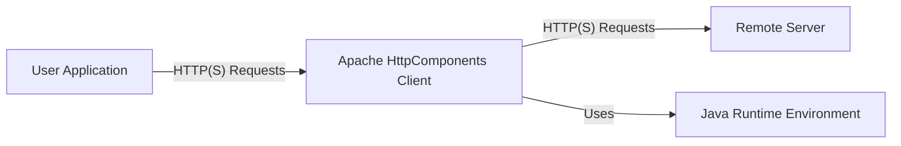
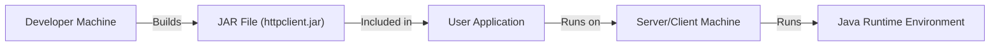
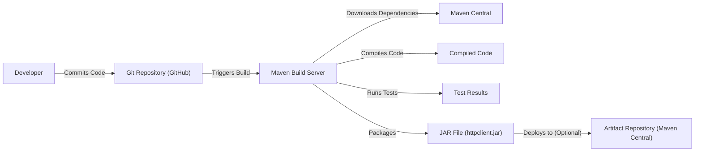

# BUSINESS POSTURE

Business Priorities and Goals:

*   Provide a robust, efficient, and feature-rich HTTP client library for Java applications.
*   Maintain backward compatibility with previous versions as much as possible.
*   Ensure high performance and scalability for handling a large volume of HTTP requests.
*   Provide a secure and reliable communication channel for applications.
*   Support a wide range of HTTP standards and features.
*   Offer a flexible and extensible API for developers to customize and extend.
*   Maintain a high level of code quality and test coverage.
*   Provide comprehensive documentation and examples.
*   Foster an active open-source community.

Business Risks:

*   Security vulnerabilities in the library could expose applications to attacks.
*   Performance bottlenecks could impact the responsiveness of applications.
*   Compatibility issues could break existing applications.
*   Lack of support for new HTTP standards could limit the library's usefulness.
*   Bugs or defects could lead to data corruption or loss.
*   Poor documentation or lack of community support could hinder adoption.

# SECURITY POSTURE

Existing Security Controls:

*   security control: Secure coding practices are followed, although specifics are not detailed in the repository's top-level view. This is assumed based on the project's maturity and Apache's general practices.
*   security control: Regular updates and releases to address bug fixes and security vulnerabilities. This is evident from the project's release history.
*   security control: Support for HTTPS and secure communication protocols. This is a core feature of an HTTP client.
*   security control: Input validation is likely performed, but specific details are not readily available in the repository overview. This is a standard practice for any library handling external input.
*   security control: Dependency management to track and update third-party libraries. This is evident from the use of build tools like Maven.
*   security control: Code reviews are likely part of the development process, based on Apache's standard practices.

Accepted Risks:

*   accepted risk: Potential for unknown vulnerabilities (zero-days) inherent in any complex software.
*   accepted risk: Reliance on the security of underlying Java runtime and operating system.
*   accepted risk: Potential for misuse of the library by developers in their applications (e.g., not validating server certificates properly).
*   accepted risk: The library's security depends on the correct configuration and usage by developers.

Recommended Security Controls:

*   Implement Static Application Security Testing (SAST) in the build pipeline.
*   Implement Dynamic Application Security Testing (DAST) for runtime vulnerability analysis.
*   Conduct regular penetration testing to identify potential vulnerabilities.
*   Implement Software Composition Analysis (SCA) to identify vulnerabilities in third-party dependencies.
*   Provide clear security guidelines and best practices in the documentation.
*   Establish a clear vulnerability reporting and disclosure process.

Security Requirements:

*   Authentication:
    *   Support for various authentication mechanisms, including Basic, Digest, NTLM, Kerberos, and OAuth.
    *   Secure storage and handling of credentials.
    *   Protection against credential stuffing and brute-force attacks.
*   Authorization:
    *   Support for authorization headers and mechanisms.
    *   Proper handling of authorization failures.
*   Input Validation:
    *   Validate all input parameters, including URLs, headers, and request bodies.
    *   Sanitize input to prevent injection attacks (e.g., header injection).
    *   Enforce length and format restrictions on input data.
*   Cryptography:
    *   Support for strong encryption algorithms and protocols (e.g., TLS 1.2+).
    *   Proper management of cryptographic keys and certificates.
    *   Validation of server certificates to prevent man-in-the-middle attacks.
    *   Secure random number generation for cryptographic operations.

# DESIGN

## C4 CONTEXT



Element Descriptions:

*   Element:
    *   Name: User Application
    *   Type: Software System
    *   Description: A Java application that utilizes the Apache HttpComponents Client library to make HTTP requests.
    *   Responsibilities: Initiating HTTP requests, processing responses, handling errors.
    *   Security controls: Depends on the specific application; should follow secure coding practices.
*   Element:
    *   Name: Apache HttpComponents Client
    *   Type: Software System
    *   Description: The library providing HTTP client functionality.
    *   Responsibilities: Managing connections, sending requests, receiving responses, handling redirects, authentication, and other HTTP-related tasks.
    *   Security controls: Secure coding practices, HTTPS support, input validation (assumed), dependency management, regular updates.
*   Element:
    *   Name: Remote Server
    *   Type: Software System
    *   Description: A server that receives and processes HTTP requests from the client.
    *   Responsibilities: Responding to HTTP requests, providing data or services.
    *   Security controls: Depends on the specific server; should follow secure server configuration and operation practices.
*   Element:
    *   Name: Java Runtime Environment
    *   Type: Platform
    *   Description: The Java runtime environment required to execute the library and user application.
    *   Responsibilities: Providing the necessary libraries and runtime support for Java applications.
    *   Security controls: Regular Java updates to address security vulnerabilities.

## C4 CONTAINER

```mermaid
graph LR
    User["User Application"] -- "HTTP(S) Requests" --> HttpClient["Apache HttpComponents Client"];
    HttpClient -- "HTTP(S) Requests" --> RemoteServer["Remote Server"];
    HttpClient -- "Uses" --> JRE["Java Runtime Environment"];
    subgraph HttpClient
        ConnectionManager["Connection Manager"] -- "Manages Connections" --> ConnectionPool["Connection Pool"];
        RequestExecutor["Request Executor"] -- "Executes Requests" --> ResponseHandler["Response Handler"];
        HttpClient --> ConnectionManager;
        HttpClient --> RequestExecutor;
    end

```

Element Descriptions:

*   Element:
    *   Name: Connection Manager
    *   Type: Component
    *   Description: Manages the lifecycle of HTTP connections.
    *   Responsibilities: Creating, reusing, and closing connections.
    *   Security controls: Secure connection configuration (e.g., TLS settings).
*   Element:
    *   Name: Connection Pool
    *   Type: Component
    *   Description: A pool of reusable HTTP connections.
    *   Responsibilities: Maintaining a pool of connections to improve performance.
    *   Security controls: Limiting the number of connections to prevent resource exhaustion.
*   Element:
    *   Name: Request Executor
    *   Type: Component
    *   Description: Executes HTTP requests.
    *   Responsibilities: Sending requests and receiving responses.
    *   Security controls: Input validation, secure handling of request data.
*   Element:
    *   Name: Response Handler
    *   Type: Component
    *   Description: Processes HTTP responses.
    *   Responsibilities: Parsing responses, handling errors, and returning data to the user application.
    *   Security controls: Secure handling of response data.
*   Element:
    *   Name: User Application
    *   Type: Software System
    *   Description: A Java application that utilizes the Apache HttpComponents Client library to make HTTP requests.
    *   Responsibilities: Initiating HTTP requests, processing responses, handling errors.
    *   Security controls: Depends on the specific application; should follow secure coding practices.
*   Element:
    *   Name: Apache HttpComponents Client
    *   Type: Software System
    *   Description: The library providing HTTP client functionality.
    *   Responsibilities: Managing connections, sending requests, receiving responses, handling redirects, authentication, and other HTTP-related tasks.
    *   Security controls: Secure coding practices, HTTPS support, input validation (assumed), dependency management, regular updates.
*   Element:
    *   Name: Remote Server
    *   Type: Software System
    *   Description: A server that receives and processes HTTP requests from the client.
    *   Responsibilities: Responding to HTTP requests, providing data or services.
    *   Security controls: Depends on the specific server; should follow secure server configuration and operation practices.
*   Element:
    *   Name: Java Runtime Environment
    *   Type: Platform
    *   Description: The Java runtime environment required to execute the library and user application.
    *   Responsibilities: Providing the necessary libraries and runtime support for Java applications.
    *   Security controls: Regular Java updates to address security vulnerabilities.

## DEPLOYMENT

Possible Deployment Solutions:

1.  Embedded within a Java application (most common).
2.  Deployed as a standalone service (less common, but possible for specific use cases).
3.  Used within a Java EE application server.

Chosen Solution (1. Embedded within a Java Application):



Element Descriptions:

*   Element:
    *   Name: Developer Machine
    *   Type: Infrastructure Node
    *   Description: The machine used by developers to build the library.
    *   Responsibilities: Compiling code, running tests, packaging the library.
    *   Security controls: Secure development environment, access controls.
*   Element:
    *   Name: JAR File (httpclient.jar)
    *   Type: Artifact
    *   Description: The compiled and packaged library.
    *   Responsibilities: Providing the HTTP client functionality.
    *   Security controls: Code signing (optional), integrity checks.
*   Element:
    *   Name: User Application
    *   Type: Software System
    *   Description: The application that uses the HttpComponents Client library.
    *   Responsibilities: Making HTTP requests using the library.
    *   Security controls: Secure coding practices, input validation, proper handling of credentials.
*   Element:
    *   Name: Server/Client Machine
    *   Type: Infrastructure Node
    *   Description: The machine where the user application is deployed and run.
    *   Responsibilities: Running the user application.
    *   Security controls: Secure operating system configuration, firewall, intrusion detection/prevention systems.
*   Element:
    *   Name: Java Runtime Environment
    *   Type: Platform
    *   Description: The Java runtime environment required to execute the user application and the library.
    *   Responsibilities: Providing the necessary libraries and runtime support.
    *   Security controls: Regular Java updates to address security vulnerabilities.

## BUILD

The Apache HttpComponents Client project uses Maven as its build system. The build process typically involves the following steps:

1.  Developer checks out the code from the Git repository.
2.  Developer runs Maven commands (e.g., `mvn clean install`).
3.  Maven downloads dependencies from Maven Central or other configured repositories.
4.  Maven compiles the source code.
5.  Maven runs unit tests.
6.  Maven packages the compiled code and resources into a JAR file.
7.  Maven can optionally deploy the JAR file to a repository (e.g., Maven Central).



Security Controls in Build Process:

*   Dependency Management: Maven manages dependencies and their versions, helping to track and update third-party libraries.
*   Automated Build: The build process is automated using Maven, reducing the risk of manual errors.
*   Unit Tests: Maven runs unit tests to ensure code quality and identify potential bugs.
*   SAST (Recommended): Integrate Static Application Security Testing tools (e.g., SonarQube, FindBugs, SpotBugs) into the Maven build process to identify potential security vulnerabilities in the code.
*   SCA (Recommended): Integrate Software Composition Analysis tools (e.g., OWASP Dependency-Check, Snyk) into the Maven build process to identify vulnerabilities in third-party dependencies.
*   Code Signing (Optional): The JAR file can be digitally signed to ensure its integrity and authenticity.

# RISK ASSESSMENT

Critical Business Processes:

*   Making HTTP requests to remote servers. This is the core functionality of the library.
*   Securely communicating with remote servers (HTTPS).
*   Handling sensitive data transmitted over HTTP.

Data Sensitivity:

*   The library itself does not store or manage sensitive data directly. However, it is used to transmit data, which may be sensitive depending on the application using the library.
*   Data sensitivity levels:
    *   Public: Non-sensitive data that can be publicly accessed.
    *   Confidential: Data that should only be accessed by authorized users.
    *   Secret: Highly sensitive data, such as API keys, passwords, or personal information.

# QUESTIONS & ASSUMPTIONS

Questions:

*   What specific security standards or compliance requirements must the library adhere to (e.g., PCI DSS, HIPAA)?
*   Are there any specific performance requirements or limitations?
*   What are the expected usage patterns (e.g., number of concurrent connections, request frequency)?
*   Are there any specific logging or auditing requirements?
*   What is the process for reporting and handling security vulnerabilities?

Assumptions:

*   BUSINESS POSTURE: The project prioritizes security and follows best practices for secure software development.
*   SECURITY POSTURE: Secure coding practices are followed, and regular security reviews are conducted.
*   DESIGN: The library is designed to be flexible and extensible, allowing developers to customize its behavior. The provided diagrams are high-level representations and may not include all implementation details.
*   DEPLOYMENT: The most common deployment scenario is embedding the library within a Java application.
*   BUILD: The build process is automated using Maven and includes unit tests.