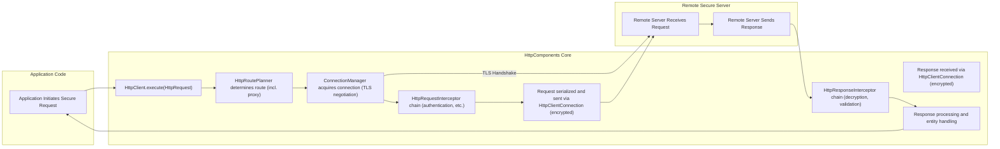
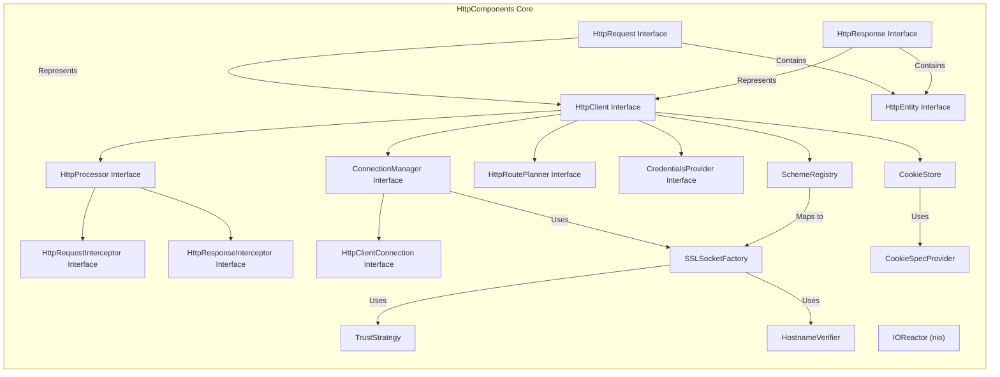

## Project Design Document: Apache HttpComponents Core for Threat Modeling (Improved)

**1. Introduction**

This document provides an enhanced design overview of the Apache HttpComponents Core library, specifically tailored for threat modeling activities. Building upon the previous version, this document offers a more detailed examination of the library's architecture, data flow, and security considerations to facilitate a comprehensive understanding of its potential vulnerabilities and attack surfaces.

**2. Project Overview**

The Apache HttpComponents Core library serves as a foundational Java library for building client-side HTTP communication capabilities. It offers a low-level API for managing HTTP requests and responses, handling connections efficiently, and interacting with the intricacies of the HTTP protocol. Its design emphasizes flexibility and extensibility, making it a versatile base for constructing more sophisticated HTTP clients.

**3. Goals**

*   Provide a clear and in-depth description of the Apache HttpComponents Core library's architecture, emphasizing security-relevant aspects.
*   Elucidate the interactions between key components, highlighting potential security implications.
*   Detail the typical data flow within the library, with a focus on points where security controls are applied or where vulnerabilities might exist.
*   Identify and elaborate on key security considerations crucial for effective threat modeling.
*   Define trust boundaries within the library's operation.

**4. Scope**

This document focuses on the core functionalities of the Apache HttpComponents Core library relevant to handling secure HTTP communication. This includes:

*   Secure connection management (including TLS/SSL).
*   Request and response processing, with emphasis on header and entity handling.
*   Authentication and authorization mechanisms.
*   Management of HTTP sessions and cookies.
*   Handling of redirects and other control flow mechanisms.
*   I/O operations related to secure network communication.

This document does *not* cover:

*   Specific implementations of higher-level HTTP clients built upon HttpComponents Core.
*   Fine-grained code-level implementation details.
*   Performance tuning and optimization strategies unrelated to security.
*   Specific configurations or deployments of applications using the library.

**5. Architectural Overview**

The Apache HttpComponents Core library comprises several interconnected components, each playing a vital role in the HTTP communication process. From a security perspective, understanding these components and their interactions is crucial:

*   **`HttpClient` Interface:** The primary entry point for executing HTTP requests. Different implementations offer varying strategies for connection management and request execution, impacting security characteristics.
*   **`HttpRequest` and `HttpResponse` Interfaces:** Represent the fundamental HTTP request and response messages. Security considerations include the integrity and confidentiality of headers and entities.
*   **`HttpProcessor` Interface:** Responsible for applying interceptors to requests and responses. This is a critical point for implementing security policies, but also a potential area for introducing vulnerabilities if interceptors are not implemented securely.
*   **`HttpRequestInterceptor` and `HttpResponseInterceptor` Interfaces:** Define the contract for interceptors. Security implications arise from the ability of interceptors to modify or inspect messages, potentially introducing vulnerabilities or bypassing security controls.
*   **`ConnectionManager` Interface:** Manages the lifecycle of HTTP connections, including connection pooling and the establishment of secure connections (TLS/SSL). Proper configuration is vital for preventing connection leaks and ensuring secure communication.
*   **`HttpClientConnection` Interface:** Represents a single HTTP connection, handling the underlying socket I/O. Security depends on the correct implementation of secure socket layers.
*   **`HttpRoutePlanner` Interface:** Determines the route for a request, including proxy selection. This is a critical component for preventing unintended connections and ensuring traffic flows through expected channels.
*   **`CredentialsProvider` Interface:** Provides authentication credentials. Secure storage and handling of credentials are paramount.
*   **`SchemeRegistry`:** Maps protocol schemes (e.g., `http`, `https`) to socket factories. Ensuring `https` uses secure factories is crucial.
*   **`SSLSocketFactory` (and related classes):** Responsible for creating secure sockets for HTTPS connections. Proper configuration of TLS versions, cipher suites, and certificate validation is essential.
*   **`TrustStrategy` and `HostnameVerifier`:** Used in conjunction with `SSLSocketFactory` to define trust criteria for server certificates and hostnames, preventing man-in-the-middle attacks.
*   **`HttpEntity` Interface:** Represents the content of a message. Security considerations include preventing injection attacks through malicious content and ensuring data integrity.
*   **`CookieStore` and `CookieSpecProvider`:** Manage HTTP cookies. Secure handling of cookies is important to prevent session hijacking and other cookie-based attacks.
*   **`IOReactor` (within the `nio` package):** Provides non-blocking I/O, which can have performance and security implications related to resource management.

**6. Data Flow with Security Focus**

The following diagram illustrates the flow of an HTTPS request, highlighting security-relevant steps:

**Detailed Data Flow Description (with Security Emphasis):**

1. **Application Initiates Secure Request:** The application creates an `HttpRequest` (likely targeting an `https` URL) and calls `HttpClient.execute()`.
2. **`HttpClient.execute(HttpRequest)`:** The `HttpClient` receives the request.
3. **`HttpRoutePlanner` determines route (including proxy):** The `HttpRoutePlanner` determines the route, potentially involving secure proxy configurations. Misconfigured proxies can introduce security risks.
4. **`ConnectionManager` acquires connection (TLS negotiation):** The `ConnectionManager` attempts to acquire a connection. For `https` requests, this involves establishing a secure TLS connection. This includes the TLS handshake, certificate validation (using `TrustStrategy` and `HostnameVerifier`), and cipher suite negotiation. Vulnerabilities in TLS implementation or configuration can be exploited here.
5. **`HttpRequestInterceptor` chain (authentication, etc.):**  Interceptors are invoked. This is where authentication headers might be added (using credentials from `CredentialsProvider`), potentially over the newly established secure connection. Malicious interceptors could compromise the request.
6. **Request serialized and sent via `HttpClientConnection` (encrypted):** The `HttpRequest` is serialized and sent over the secure `HttpClientConnection`, ensuring confidentiality and integrity through encryption.
7. **Remote Secure Server Receives Request:** The remote server receives and processes the encrypted HTTP request.
8. **Remote Secure Server Sends Response:** The remote server generates and sends an encrypted `HttpResponse`.
9. **Response received via `HttpClientConnection` (encrypted):** The encrypted `HttpResponse` is received.
10. **`HttpResponseInterceptor` chain (decryption, validation):** Interceptors are invoked to process the response. This might include decryption, validation of headers and content, and handling of cookies. Improper validation can lead to vulnerabilities.
11. **Response processing and entity handling:** The `HttpResponse` is processed, and the `HttpEntity` is made available. Care must be taken to handle the entity securely, preventing injection attacks or information leaks.
12. **Application receives response:** The processed `HttpResponse` is returned to the application.

**7. Key Security Considerations**

Expanding on the initial considerations, here are key security aspects relevant to HttpComponents Core:

*   **Input Validation and Sanitization:**
    *   **Header Parsing:**  Rigorous validation of HTTP headers is crucial to prevent header injection attacks.
    *   **URI Handling:**  Proper parsing and validation of URIs prevent injection and redirection vulnerabilities.
    *   **Entity Handling:**  Sanitizing and validating request and response entities prevents cross-site scripting (XSS) and other injection attacks.
*   **TLS/SSL Configuration and Implementation:**
    *   **Protocol Versions:**  Enforcing strong TLS versions (e.g., TLS 1.2 or higher) and disabling older, vulnerable versions is essential.
    *   **Cipher Suites:**  Selecting strong and appropriate cipher suites is critical for encryption strength.
    *   **Certificate Validation:**  Strict validation of server certificates using `TrustStrategy` and `HostnameVerifier` prevents man-in-the-middle attacks.
    *   **Client Certificate Authentication:**  Securely managing and using client certificates for mutual authentication.
*   **Authentication and Authorization:**
    *   **Secure Credential Storage:**  Protecting credentials managed by `CredentialsProvider` from unauthorized access.
    *   **Authentication Scheme Implementation:**  Ensuring correct and secure implementation of various authentication schemes (e.g., OAuth, Basic, Digest).
    *   **Authorization Enforcement:**  While HttpComponents Core primarily handles authentication, understanding how it interacts with authorization mechanisms in the application is important.
*   **Session Management and Cookie Handling:**
    *   **Secure Cookie Attributes:**  Properly setting `HttpOnly`, `Secure`, and `SameSite` attributes for cookies to mitigate various attacks.
    *   **Session Fixation Prevention:**  Implementing mechanisms to prevent session fixation vulnerabilities.
    *   **Cookie Scope and Domain:**  Ensuring cookies are scoped correctly to prevent unauthorized access.
*   **Redirection Handling:**
    *   **Preventing Open Redirects:**  Carefully validating redirect targets to avoid redirecting users to malicious sites.
    *   **Handling of Redirect Loops:**  Implementing safeguards against excessive redirects.
*   **Error Handling and Information Disclosure:**
    *   **Sanitizing Error Messages:**  Preventing sensitive information from being leaked in error messages.
    *   **Proper Exception Handling:**  Avoiding the exposure of stack traces or internal details to attackers.
*   **Resource Management:**
    *   **Connection Pooling Configuration:**  Properly configuring connection pool sizes and timeouts to prevent resource exhaustion.
    *   **Preventing Connection Leaks:**  Ensuring connections are properly closed to avoid resource depletion.
*   **Third-Party Dependencies:**
    *   Staying updated with security patches for any underlying libraries used by HttpComponents Core.
*   **Security of Interceptors:**
    *   Ensuring that custom `HttpRequestInterceptor` and `HttpResponseInterceptor` implementations are secure and do not introduce vulnerabilities.

**8. Trust Boundaries**

Understanding trust boundaries is crucial for threat modeling. In the context of HttpComponents Core:

*   **Boundary with the Application:** The library receives instructions and data from the application. It trusts the application to provide valid and intended data, but must still validate inputs to prevent misuse.
*   **Boundary with the Network:** The network is an untrusted environment. All data transmitted over the network should be treated as potentially compromised, necessitating encryption (TLS/SSL).
*   **Boundary with Remote Servers:** Remote servers are generally untrusted. The library must validate server certificates and responses to prevent attacks.
*   **Boundary with Custom Interceptors:** While providing extensibility, custom interceptors represent a trust boundary. The library relies on developers to implement interceptors securely.

**9. Deployment Considerations**

The security posture of applications using HttpComponents Core is heavily influenced by the deployment environment. Consider these factors:

*   **Web Applications:** Deployed in web servers, susceptible to web-based attacks.
*   **Microservices:** Interacting with other services, requiring secure inter-service communication.
*   **Desktop Applications:** May have different security constraints and access to local resources.
*   **Mobile Applications:** Operating in potentially hostile environments.

The configuration and usage of HttpComponents Core must be tailored to the specific deployment context to mitigate relevant threats.

**10. Diagrams**

*   **Enhanced Component Diagram (Security Focused):**

**11. Future Considerations**

Ongoing efforts to enhance the security of applications using HttpComponents Core should include:

*   Regularly reviewing and updating dependencies.
*   Conducting penetration testing and security audits.
*   Staying informed about emerging threats and vulnerabilities related to HTTP and TLS.
*   Adhering to secure coding practices when implementing custom interceptors or extending the library.

This improved design document provides a more comprehensive foundation for threat modeling the Apache HttpComponents Core library, enabling a deeper understanding of its security characteristics and potential vulnerabilities.