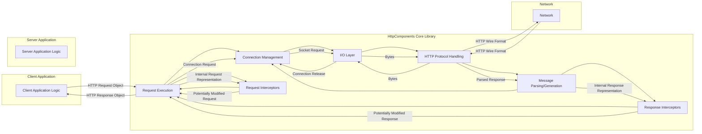
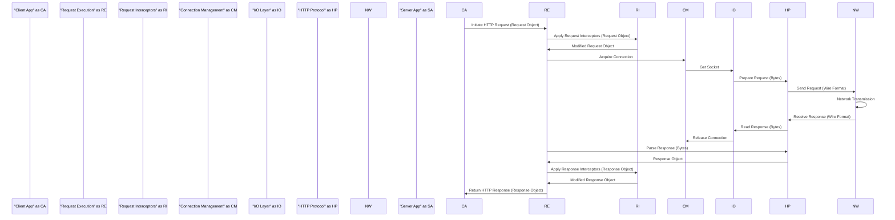

# Project Design Document: Apache HttpComponents Core - Improved

**Version:** 1.1
**Date:** October 26, 2023
**Author:** Gemini (AI Language Model)

## 1. Introduction

This document provides an enhanced design overview of the Apache HttpComponents Core library, building upon the previous version. It aims for greater clarity, detail, and a stronger focus on aspects relevant to threat modeling. This document will serve as a robust foundation for subsequent threat modeling activities, enabling a deeper understanding of potential security vulnerabilities and risks.

### 1.1. Purpose

The primary purpose of this document is to provide a more comprehensive and nuanced architectural understanding of the Apache HttpComponents Core library, specifically tailored for effective threat modeling.

### 1.2. Scope

This document expands on the core functionalities and architectural components of the Apache HttpComponents Core library. It provides greater detail on component interactions, data transformation points, and potential security boundaries. While still avoiding low-level code specifics, it delves deeper into the responsibilities and potential security implications of key modules.

### 1.3. Goals

*   Provide a more detailed and precise description of major components and their responsibilities.
*   Elucidate the key data flows, highlighting data transformation and potential injection points.
*   Clearly identify trust boundaries and areas of significant interest for security analysis, including data entry and exit points.
*   Offer enhanced visual representations of the system architecture and data flow, emphasizing security-relevant interactions.
*   Strengthen the security considerations section with more specific examples and potential threats.

## 2. System Overview

The Apache HttpComponents Core library serves as a foundational layer for constructing HTTP-based client and server applications. It abstracts the complexities of HTTP message handling, connection management, and protocol specifics. Its modular design promotes flexibility and extensibility.

### 2.1. High-Level Architecture

The library is structured into distinct layers and components that collaborate to facilitate HTTP communication. This diagram highlights the interaction between the library and external entities.

### 2.2. Key Components

*   **Request Execution:**  The central component responsible for orchestrating the execution of HTTP requests.
*   **Connection Management:**  Manages the creation, pooling, reuse, and closing of HTTP connections.
*   **I/O Layer:**  Handles the low-level network input/output operations using sockets.
*   **HTTP Protocol Handling:**  Implements the core logic of the HTTP protocol, including version handling and header processing.
*   **Message Parsing/Generation:**  Converts between internal representations of HTTP messages and the byte streams used for network transmission.
*   **Request Interceptors:**  Provide a mechanism to intercept and modify outgoing HTTP requests before they are sent.
*   **Response Interceptors:**  Provide a mechanism to intercept and modify incoming HTTP responses after they are received.

## 3. Component Details

This section provides a more in-depth examination of the key components, emphasizing their responsibilities and potential security implications.

### 3.1. Request Execution

*   **Purpose:**  To manage the overall lifecycle of an HTTP request from initiation to response reception.
*   **Responsibilities:**
    *   Selecting the appropriate `HttpClient` instance based on configuration.
    *   Applying configured `Request Interceptors` to modify the outgoing request.
    *   Delegating the acquisition of an `HttpConnection` to the `Connection Management` component.
    *   Passing the request to the `I/O Layer` for transmission after protocol handling.
    *   Receiving the response from the `I/O Layer`.
    *   Applying configured `Response Interceptors` to modify the incoming response.
    *   Handling potential exceptions during the request execution process, including retries.
*   **Security Relevance:**  This component acts as a central point for request and response processing, making it a critical area for security considerations related to interception and modification.

### 3.2. Connection Management

*   **Purpose:** To efficiently manage HTTP connections, reducing overhead and improving performance.
*   **Responsibilities:**
    *   Maintaining a pool of active and idle `HttpConnection` instances.
    *   Acquiring connections for new requests, prioritizing reuse of existing connections.
    *   Releasing connections back to the pool after use, making them available for subsequent requests.
    *   Managing the lifecycle of connections, including timeouts and closure.
    *   Supporting different connection strategies, such as persistent connections and connection keep-alive.
*   **Security Relevance:**  Improper connection management can lead to vulnerabilities such as connection hijacking or denial-of-service attacks through resource exhaustion. Securely managing connection state and preventing unauthorized reuse is crucial.

### 3.3. I/O Layer

*   **Purpose:** To provide an abstraction over the underlying network socket operations.
*   **Responsibilities:**
    *   Establishing and managing socket connections to remote servers.
    *   Writing the byte representation of HTTP requests to the socket.
    *   Reading the byte representation of HTTP responses from the socket.
    *   Handling low-level I/O exceptions and errors.
    *   Potentially supporting different I/O models (e.g., blocking, non-blocking) through implementations.
*   **Security Relevance:**  This layer is directly responsible for network communication. Vulnerabilities here could expose sensitive data in transit or allow for man-in-the-middle attacks if not properly secured (e.g., using TLS/SSL).

### 3.4. HTTP Protocol Handling

*   **Purpose:** To implement the rules and semantics defined by the HTTP protocol specification.
*   **Responsibilities:**
    *   Ensuring that requests and responses conform to HTTP standards (e.g., proper header formatting, status codes).
    *   Handling different versions of the HTTP protocol (e.g., HTTP/1.1, HTTP/2).
    *   Managing aspects like content encoding (e.g., gzip) and transfer encoding (e.g., chunked).
    *   Processing and interpreting HTTP headers.
    *   Potentially handling HTTP authentication and authorization schemes.
*   **Security Relevance:**  Incorrect or incomplete protocol handling can lead to vulnerabilities like HTTP request smuggling or response splitting. Proper validation and adherence to standards are essential.

### 3.5. Message Parsing/Generation

*   **Purpose:** To convert between the structured representation of HTTP messages within the library and the raw byte streams transmitted over the network.
*   **Responsibilities:**
    *   Parsing incoming byte streams from the `I/O Layer` into `HttpRequest` and `HttpResponse` objects.
    *   Generating byte streams from `HttpRequest` and `HttpResponse` objects for transmission via the `I/O Layer`.
    *   Handling the parsing and serialization of HTTP headers.
    *   Managing the encoding and decoding of message bodies.
*   **Security Relevance:**  This component is a prime location for vulnerabilities related to input validation. Improper parsing can lead to injection attacks if malicious data is not correctly sanitized or escaped.

### 3.6. Request and Response Interceptors

*   **Purpose:** To provide extensibility points for modifying HTTP requests and responses.
*   **Responsibilities:**
    *   **Request Interceptors:**  Modifying outgoing request headers, adding authentication information, transforming request bodies.
    *   **Response Interceptors:** Inspecting response headers, modifying response bodies, handling specific error conditions.
*   **Security Relevance:**  While offering flexibility, interceptors also introduce potential security risks. Malicious or poorly written interceptors could introduce vulnerabilities, bypass security checks, or leak sensitive information. The order of interceptor execution can also be critical.

## 4. Data Flow

The following sequence diagram illustrates the typical flow of data during an HTTP request processed by HttpComponents Core, highlighting key components and data transformations.

**Detailed Data Flow Description:**

1. The **Client Application** initiates an HTTP request by creating an HTTP request object.
2. The **Request Execution** component receives the request object.
3. **Request Interceptors** are applied sequentially, potentially modifying the request object.
4. **Request Execution** requests a connection from the **Connection Management** component.
5. **Connection Management** obtains a socket connection from the **I/O Layer**.
6. The **I/O Layer** provides the socket to the **HTTP Protocol Handling** component.
7. The **HTTP Protocol Handling** component serializes the request object into a byte stream (wire format).
8. The byte stream is sent over the **Network** to the **Server Application**.
9. The **Server Application** processes the request and sends a response in wire format.
10. The response is received by the client-side **HTTP Protocol Handling** component.
11. The **HTTP Protocol Handling** component reads the response byte stream from the **I/O Layer**.
12. The **I/O Layer** informs **Connection Management** that the connection can be released.
13. The **HTTP Protocol Handling** component parses the byte stream into a response object.
14. **Response Interceptors** are applied sequentially, potentially modifying the response object.
15. The **Request Execution** component returns the processed HTTP response object to the **Client Application**.

## 5. Security Considerations

This section expands on potential security concerns, providing more specific examples and focusing on areas critical for threat modeling.

*   **Input Validation Vulnerabilities:**
    *   **HTTP Request Smuggling:**  Improper parsing of request headers could allow attackers to inject malicious requests.
    *   **Response Splitting:**  Failure to sanitize response headers could enable attackers to inject arbitrary content into the response stream.
    *   **Header Injection:**  Insufficient validation of user-controlled data used in headers could lead to security issues.
*   **Connection Security Weaknesses:**
    *   **Man-in-the-Middle Attacks:**  Lack of proper TLS/SSL configuration or certificate validation can expose communication to eavesdropping and tampering.
    *   **Insecure Renegotiation:**  Vulnerabilities in TLS/SSL renegotiation could be exploited to downgrade connection security.
    *   **Connection Hijacking:**  Predictable session identifiers or insecure connection management could allow attackers to take over existing connections.
*   **State Management Issues:**
    *   **Session Fixation:**  Allowing an attacker to set the session ID could lead to unauthorized access.
    *   **Connection Pool Poisoning:**  A malicious server could send responses that corrupt the connection pool, affecting subsequent requests.
*   **Dependency Vulnerabilities:**
    *   Using outdated or vulnerable versions of underlying libraries (e.g., a specific TLS/SSL implementation) can introduce known security flaws.
*   **Configuration Security Flaws:**
    *   **Insecure Defaults:**  Default configurations that do not enforce strong security measures.
    *   **Permissive Settings:**  Allowing insecure protocols or ciphers.
    *   **Insufficient Timeouts:**  Leaving connections open for excessive periods, increasing the attack surface.
*   **Denial of Service (DoS) Risks:**
    *   **Connection Exhaustion:**  An attacker could open a large number of connections, exhausting server resources.
    *   **Large Request/Response Bodies:**  Sending excessively large messages could overwhelm the parsing and processing capabilities.
*   **Information Disclosure Risks:**
    *   **Verbose Error Messages:**  Revealing sensitive information in error responses.
    *   **Logging Sensitive Data:**  Accidentally logging authentication credentials or other confidential information.
*   **Interceptor-Related Risks:**
    *   **Malicious Interceptors:**  Third-party interceptors could introduce vulnerabilities or bypass security controls.
    *   **Interceptor Ordering Issues:**  Incorrect ordering of interceptors could lead to unexpected behavior and security flaws.

## 6. Technologies Used

*   **Primary Language:** Java
*   **Core Dependencies:**  Java Standard Library (Networking, I/O, Security)

## 7. Deployment Considerations

The Apache HttpComponents Core library is typically deployed as a JAR file embedded within Java-based client or server applications. Its security posture is heavily influenced by the security of the hosting application and the environment in which it runs. Proper configuration within the application is crucial for mitigating potential risks.

## 8. Future Considerations

*   Detailed analysis of specific security features and configurations available within the library (e.g., custom `SSLSocketFactory` implementations, hostname verification strategies).
*   In-depth examination of the library's mechanisms for handling and reporting errors and exceptions from a security perspective.
*   Continuous monitoring for and patching of any identified vulnerabilities in the library and its dependencies.
*   Further exploration of security best practices for configuring and utilizing the library in various deployment scenarios.

This improved design document provides a more detailed and security-focused understanding of the Apache HttpComponents Core library's architecture and data flow, serving as a valuable resource for comprehensive threat modeling.