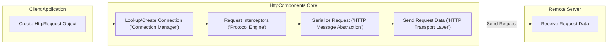
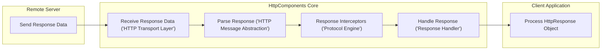

# Project Design Document: Apache HttpComponents Core

**Version:** 1.1
**Date:** October 26, 2023
**Author:** AI Software Architect

## 1. Introduction

This document provides an enhanced and more detailed design overview of the Apache HttpComponents Core library, specifically tailored for threat modeling. It builds upon the previous version by providing greater clarity and depth regarding the library's architecture, component interactions, data flow, and external interfaces. This refined document will serve as a robust foundation for identifying and analyzing potential security vulnerabilities.

## 2. Project Overview

The Apache HttpComponents Core library serves as a foundational layer for building both client-side and server-side HTTP-based applications. It offers a granular, low-level API for managing HTTP requests and responses, handling connections efficiently, and implementing various aspects of the HTTP protocol suite. The library prioritizes performance, extensibility, and flexibility, empowering developers to create highly customized HTTP communication solutions.

## 3. Goals

*   Present a clear, detailed, and security-focused description of the Apache HttpComponents Core architecture.
*   Provide in-depth explanations of key components, their responsibilities, and potential security implications.
*   Illustrate the flow of data within the library with enhanced clarity and detail.
*   Thoroughly document external interfaces, highlighting potential security boundaries and interaction points.
*   Establish a strong and comprehensive foundation for subsequent threat modeling activities.

## 4. Target Audience

This document is intended for:

*   Security engineers, architects, and penetration testers conducting threat modeling and security assessments.
*   Developers actively using, extending, or contributing to the Apache HttpComponents Core library.
*   Individuals seeking a comprehensive understanding of the library's internal mechanisms from a security perspective.

## 5. Architectural Overview

The Apache HttpComponents Core library employs a modular architecture, separating concerns into distinct components that collaborate to facilitate HTTP communication. This layered design promotes maintainability and allows for customization at various levels. The core principles revolve around managing HTTP messages, handling protocol specifics, and managing the underlying I/O operations.

## 6. Key Components

*   **`org.apache.hc.core5.http` (HTTP Message Abstraction):**
    *   **Responsibility:** Defines the fundamental interfaces and classes for representing HTTP requests and responses in an abstract manner. This includes `HttpRequest`, `HttpResponse`, `Header`, `HttpEntity`, and `StatusLine`.
    *   **Security Relevance:**  Incorrect handling or manipulation of these objects could lead to vulnerabilities like header injection or response splitting if data from untrusted sources is incorporated without proper sanitization.
*   **`org.apache.hc.core5.http.protocol` (HTTP Protocol Engine):**
    *   **Responsibility:**  Manages the execution of the HTTP protocol logic. This includes request and response processing pipelines, handling HTTP context, and managing state. Key elements are `HttpRequestInterceptor` and `HttpResponseInterceptor`.
    *   **Security Relevance:** Interceptors operate on the raw HTTP messages. Improperly implemented interceptors could introduce vulnerabilities or bypass security checks. The protocol engine's handling of state needs to be secure to prevent session fixation or other state-related attacks.
*   **`org.apache.hc.core5.http.io` (HTTP Transport Layer):**
    *   **Responsibility:** Handles the low-level input/output operations for transmitting and receiving HTTP messages over the network. This includes connection management, socket handling (plain and SSL/TLS), and data streaming. Key interfaces include `HttpClientConnectionManager` and `HttpConnection`.
    *   **Security Relevance:** This layer is critical for secure communication. Vulnerabilities here could involve issues with connection hijacking, lack of proper TLS negotiation, or exposure of sensitive data in transit if encryption is not correctly implemented or configured.
*   **`org.apache.hc.core5.http.impl` (Default Implementations):**
    *   **Responsibility:** Provides concrete, default implementations for the interfaces defined in other packages. This includes default request executors, connection managers (e.g., `PoolingHttpClientConnectionManager`), and protocol handlers.
    *   **Security Relevance:** The security of the default implementations is paramount. Bugs or vulnerabilities in these implementations can directly impact applications using the library.
*   **`org.apache.hc.core5.http.config` (Configuration Management):**
    *   **Responsibility:** Defines configuration options for various aspects of HTTP processing, allowing customization of connection parameters, timeouts, protocol settings, and SSL/TLS settings.
    *   **Security Relevance:**  Misconfigurations in this area can significantly weaken security. For example, disabling TLS, using weak cipher suites, or setting overly permissive connection limits can create vulnerabilities.
*   **`org.apache.hc.core5.http.ssl` (Secure Socket Layer/Transport Layer Security):**
    *   **Responsibility:** Provides classes and utilities for integrating SSL/TLS encryption into HTTP communication. This includes managing SSL/TLS context creation, certificate handling, and hostname verification.
    *   **Security Relevance:** This component is directly responsible for ensuring the confidentiality and integrity of communication. Vulnerabilities or misconfigurations here can lead to eavesdropping or manipulation of data in transit.
*   **`org.apache.hc.core5.http.support` (Utility Classes):**
    *   **Responsibility:** Offers helper classes and utilities for common HTTP-related tasks, such as URI manipulation and header parsing.
    *   **Security Relevance:** While utility classes, improper use or vulnerabilities within them could indirectly lead to security issues, such as incorrect URI handling leading to access control bypasses.
*   **`org.apache.hc.core5.http.nio` (Non-Blocking I/O Framework):**
    *   **Responsibility:** Provides support for asynchronous, non-blocking I/O operations, enabling the development of highly concurrent HTTP clients and servers. This includes non-blocking connection management and message processing.
    *   **Security Relevance:** Asynchronous programming can introduce complexities that might lead to subtle security vulnerabilities if not handled carefully, such as race conditions or improper state management.
*   **`org.apache.hc.core5.http.entity` (HTTP Message Content Handling):**
    *   **Responsibility:** Deals with the content or payload of HTTP messages (the entity-body). It provides different types of entities (e.g., `StringEntity`, `ByteArrayEntity`, `InputStreamEntity`) and handles content encoding/decoding.
    *   **Security Relevance:** Improper handling of entities, especially when dealing with user-provided content, can lead to vulnerabilities like buffer overflows or injection attacks if content is not properly validated and sanitized.
*   **`org.apache.hc.core5.http.param` (HTTP Parameters - *Largely Superseded*):**
    *   **Responsibility:**  Historically used for configuring HTTP components. Many functionalities have been migrated to the `config` package.
    *   **Security Relevance:** While largely superseded, understanding how parameters were used can be relevant for analyzing older code or understanding the evolution of the library's configuration mechanisms.

## 7. Data Flow (Enhanced)

The following diagrams illustrate the data flow for both outgoing and incoming HTTP requests, providing a more granular view:

**Outgoing HTTP Request:**

**Incoming HTTP Response:**

**Detailed Data Flow Description:**

**Outgoing Request:**

1. **Request Creation:** The client application constructs an `HttpRequest` object, including the target URI, headers, and entity.
2. **Connection Management:** The `ConnectionManager` attempts to retrieve an existing persistent connection to the target host or establishes a new connection if necessary.
3. **Request Interception:** Configured `HttpRequestInterceptor` instances in the `Protocol Engine` process the outgoing request. This might involve adding headers (e.g., authentication), logging, or modifying the request.
4. **Request Serialization:** The `HTTP Message Abstraction` layer serializes the `HttpRequest` object into a byte stream suitable for network transmission.
5. **Data Transmission:** The `HTTP Transport Layer` sends the serialized request data over the established socket connection to the remote server.

**Incoming Response:**

1. **Data Reception:** The `HTTP Transport Layer` receives the response data from the remote server over the socket connection.
2. **Response Parsing:** The `HTTP Message Abstraction` layer parses the raw response data into an `HttpResponse` object, including headers, status line, and entity.
3. **Response Interception:** Configured `HttpResponseInterceptor` instances in the `Protocol Engine` process the incoming response. This might involve validating headers, decompressing the entity, or logging.
4. **Response Handling:** A `ResponseHandler` (provided by the client application or a default implementation) processes the received `HttpResponse`.
5. **Response Processing:** The client application receives and processes the `HttpResponse` object.

## 8. External Interfaces (Detailed)

The Apache HttpComponents Core library interacts with the following external entities, each presenting potential security considerations:

*   **Client Applications (Developers):**
    *   **Interface:** The primary interface is the Java API provided by the library. Developers use these classes and interfaces to construct and execute HTTP requests.
    *   **Security Boundary:**  Vulnerabilities can be introduced if developers misuse the API, for example, by not properly escaping user input when constructing headers or URIs, or by ignoring security recommendations in the library's documentation.
*   **Remote HTTP Servers:**
    *   **Interface:** Communication occurs over the HTTP protocol (HTTP/1.1, HTTP/2) via TCP/IP sockets.
    *   **Security Boundary:** The library must handle potentially malicious responses from remote servers, such as oversized headers, malformed content, or attempts to exploit vulnerabilities in the HTTP protocol itself.
*   **Operating System:**
    *   **Interface:** The library relies on the OS for network socket operations, thread management, and access to system resources.
    *   **Security Boundary:**  Vulnerabilities in the underlying OS networking stack could potentially be exploited. The library's security is also dependent on the security of the OS's random number generator for cryptographic operations.
*   **Java Runtime Environment (JRE):**
    *   **Interface:** The library depends on the JRE for core functionalities like memory management, I/O operations, and cryptographic services (through the Java Cryptography Architecture - JCA).
    *   **Security Boundary:**  Security vulnerabilities in the JRE itself can directly impact the security of applications using HttpComponents Core.
*   **Optional Dependencies:**
    *   **SLF4j (Logging Facade):**
        *   **Interface:** Used for logging events within the library.
        *   **Security Boundary:**  While a logging facade itself doesn't directly introduce vulnerabilities, misconfigured logging can expose sensitive information.
    *   **Java Security Provider (for SSL/TLS):** (e.g., SunJSSE, Bouncy Castle)
        *   **Interface:** Provides the underlying cryptographic implementations for SSL/TLS.
        *   **Security Boundary:**  Vulnerabilities in the security provider can directly compromise the security of TLS connections. The library's configuration of the security provider is also critical.

## 9. Security Considerations (Expanded)

This section expands on the initial security considerations, providing more specific examples of potential threats:

*   **Input Validation Failures:**
    *   **Threat:** Header Injection: Malicious input in request headers can be interpreted as separate headers by the server.
    *   **Threat:** Response Splitting: Manipulating response headers to inject malicious content.
    *   **Threat:** Cross-Site Scripting (XSS) via reflected data in error messages if not properly sanitized.
*   **TLS/SSL Vulnerabilities:**
    *   **Threat:** Man-in-the-Middle (MitM) attacks if TLS is not enforced or improperly configured.
    *   **Threat:** Use of weak or deprecated cipher suites, making connections vulnerable to eavesdropping.
    *   **Threat:** Failure to validate server certificates, allowing connections to rogue servers.
    *   **Threat:** Downgrade attacks exploiting vulnerabilities in TLS protocol negotiation.
*   **Denial of Service (DoS) Attacks:**
    *   **Threat:** Connection exhaustion by rapidly opening and closing connections.
    *   **Threat:** Resource consumption through excessively large request or response bodies.
    *   **Threat:** Slowloris attacks that keep connections open for extended periods.
*   **Injection Attacks:**
    *   **Threat:** Header injection (as mentioned above).
    *   **Threat:** Potential for CRLF injection if the library allows direct manipulation of raw HTTP protocol elements.
*   **Man-in-the-Middle (MitM) Attacks:**
    *   **Threat:**  Lack of proper TLS/SSL implementation or certificate validation.
    *   **Threat:**  Exploiting vulnerabilities in the underlying network infrastructure.
*   **Vulnerabilities in Dependencies:**
    *   **Threat:** Exploiting known vulnerabilities in the JRE or the configured security provider.
*   **Configuration Security Issues:**
    *   **Threat:** Using insecure default configurations.
    *   **Threat:** Allowing overly permissive configurations that weaken security (e.g., disabling hostname verification).
*   **Data Handling Issues:**
    *   **Threat:** Exposure of sensitive data in transit if TLS is not used.
    *   **Threat:** Logging sensitive information inappropriately.
    *   **Threat:** Improper handling or storage of credentials.
*   **Error Handling Weaknesses:**
    *   **Threat:** Information leakage through overly verbose error messages.
    *   **Threat:** Unexpected behavior or crashes due to unhandled exceptions.

## 10. Deployment Considerations

The deployment considerations remain largely the same as in the previous version. The library is typically packaged as a JAR file and included in the classpath of a Java application. Security considerations during deployment include:

*   Ensuring the JAR file is obtained from a trusted source to prevent supply chain attacks.
*   Properly configuring the application's environment to enforce secure TLS settings.
*   Regularly updating the library to patch any discovered vulnerabilities.

## 11. Assumptions and Constraints

The assumptions and constraints from the previous version still apply. Additionally, it's assumed that developers using the library have a basic understanding of HTTP and network security principles.

## 12. Future Considerations

*   Detailed sequence diagrams for specific use cases, highlighting security checkpoints.
*   Analysis of specific security features implemented within the library (e.g., built-in protections against certain attacks).
*   Guidance on secure coding practices when using the HttpComponents Core library.

This improved design document provides a more comprehensive and security-focused overview of the Apache HttpComponents Core library. The enhanced details regarding components, data flow, and external interfaces, along with the expanded security considerations, will significantly aid in conducting thorough threat modeling activities.