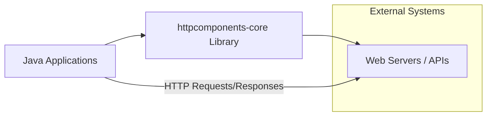
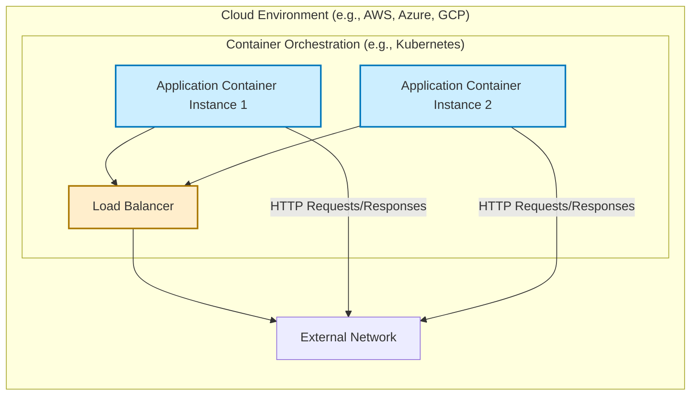
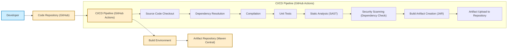

# BUSINESS POSTURE

This project, `httpcomponents-core`, provides a foundational HTTP client library for Java. It aims to offer a robust, efficient, and flexible set of components for building HTTP-based applications and services.

- Business Priorities and Goals:
  - Provide a reliable and performant HTTP client library for Java developers.
  - Offer a flexible and extensible architecture to accommodate diverse HTTP use cases.
  - Maintain compatibility and stability across different Java environments.
  - Foster an active open-source community around the project.
  - Ensure the library is secure and addresses common HTTP-related vulnerabilities.

- Business Risks:
  - Security vulnerabilities in the library could impact a wide range of applications relying on it.
  - Performance issues could lead to degraded application performance.
  - Lack of maintenance or community support could make the library outdated and less reliable.
  - Compatibility problems with newer Java versions or other libraries could limit adoption.
  - Bugs or defects could cause application instability or incorrect behavior.

# SECURITY POSTURE

- Security Controls:
  - security control: Open Source Security Audit - The project is open source, allowing for community review and identification of potential vulnerabilities. Implemented through public code repository and community contributions.
  - security control: Dependency Management - Project uses Maven for dependency management, allowing for controlled inclusion of external libraries. Described in `pom.xml` files.
  - security control: Code Review -  Likely implemented through pull request reviews within the development process, although not explicitly documented in the repository. Assumed based on standard open-source practices.
  - security control: Static Code Analysis -  Likely used by developers during development, although not explicitly integrated into a CI/CD pipeline visible in the repository. Assumed based on standard software development practices.
  - security control: Unit and Integration Testing -  Extensive test suite is present in the repository. Implemented in `src/test/java` and executed during build process.

- Accepted Risks:
  - accepted risk: Reliance on community contributions for security vulnerability identification and patching.
  - accepted risk: Potential for undiscovered vulnerabilities in the code base due to complexity of HTTP protocol and library implementation.
  - accepted risk: Security of applications using the library is ultimately the responsibility of the application developers.

- Recommended Security Controls:
  - security control: Implement automated security scanning in CI/CD pipeline (e.g., SAST, DAST, dependency scanning).
  - security control: Establish a clear vulnerability reporting and response process.
  - security control: Conduct periodic security audits by external security experts.
  - security control: Provide security guidelines and best practices for developers using the library.

- Security Requirements:
  - Authentication: The library itself does not implement authentication mechanisms, but it provides the building blocks for applications to implement various HTTP authentication schemes (e.g., Basic, Digest, OAuth). Security Requirement: Applications using this library MUST implement appropriate authentication mechanisms when required.
  - Authorization: The library does not enforce authorization policies. Security Requirement: Applications using this library MUST implement appropriate authorization mechanisms to control access to resources.
  - Input Validation: The library performs some level of input validation to ensure correct HTTP protocol handling. Security Requirement: Applications using this library MUST perform thorough input validation on data received from external sources before using it in HTTP requests or responses.
  - Cryptography: The library supports HTTPS and TLS/SSL for secure communication. Security Requirement: Applications handling sensitive data MUST use HTTPS and ensure proper TLS/SSL configuration when communicating over the network. Security Requirement: If application needs to implement custom cryptography, it should be done using well-vetted and established cryptographic libraries, not implemented from scratch.

# DESIGN

## C4 CONTEXT



- C4 Context Elements:
  - - Name: Java Applications
    - Type: Software System
    - Description: Applications developed in Java that utilize the `httpcomponents-core` library to perform HTTP communication.
    - Responsibilities:
      - Initiate HTTP requests to web servers and APIs.
      - Process HTTP responses received from web servers and APIs.
      - Implement application-specific logic using the HTTP client functionality provided by the library.
    - Security controls:
      - Input validation of data before sending in HTTP requests.
      - Implementation of authentication and authorization mechanisms.
      - Secure storage and handling of sensitive data.
      - Proper error handling and logging.

  - - Name: httpcomponents-core Library
    - Type: Software System
    - Description: A Java library providing core components for building HTTP clients. It handles low-level HTTP protocol details, connection management, request/response processing, and more.
    - Responsibilities:
      - Provide APIs for creating and sending HTTP requests.
      - Manage HTTP connections and connection pooling.
      - Handle HTTP protocol parsing and serialization.
      - Support various HTTP features and extensions.
    - Security controls:
      - Input validation of HTTP protocol elements.
      - Protection against common HTTP vulnerabilities (e.g., request smuggling, header injection).
      - Secure handling of TLS/SSL connections.

  - - Name: Web Servers / APIs
    - Type: Software System
    - Description: External web servers and APIs that the Java applications interact with using HTTP. These can be internal or external services.
    - Responsibilities:
      - Receive and process HTTP requests from Java applications.
      - Respond to HTTP requests with appropriate data or actions.
      - Enforce their own security policies and controls.
    - Security controls:
      - Authentication and authorization of incoming requests.
      - Input validation of request data.
      - Protection against web application vulnerabilities.
      - Secure configuration of web server software.

## C4 CONTAINER

```mermaid
flowchart LR
    subgraph "Java Applications"
        A["Application Code"]
    end
    subgraph "httpcomponents-core Library"
        B["Client API"]
        C["Connection Management"]
        D["Request/Response Processing"]
        E["Protocol Handlers"]
        F["IO Layer"]
    end

    A --> B
    B --> C
    B --> D
    B --> E
    B --> F
    F --> "Network"

    style A fill:#CCEEFF,stroke:#0077BB,stroke-width:2px
    style B fill:#FFEECC,stroke:#AA7700,stroke-width:2px
    style C fill:#FFEECC,stroke:#AA7700,stroke-width:2px
    style D fill:#FFEECC,stroke:#AA7700,stroke-width:2px
    style E fill:#FFEECC,stroke:#AA7700,stroke-width:2px
    style F fill:#FFEECC,stroke:#AA7700,stroke-width:2px
```

- C4 Container Elements:
  - - Name: Application Code
    - Type: Container (Java Application Component)
    - Description: The part of the Java application that directly uses the `httpcomponents-core` library. This includes application-specific logic, configuration, and data handling.
    - Responsibilities:
      - Instantiate and configure HTTP clients from the library.
      - Construct and send HTTP requests using the library's API.
      - Process HTTP responses received through the library.
      - Handle application-specific error conditions and exceptions.
    - Security controls:
      - Input validation of application data before using the library.
      - Proper handling of sensitive data within the application.
      - Secure configuration of the HTTP client (e.g., TLS/SSL settings).

  - - Name: Client API
    - Type: Container (Library Module)
    - Description: Public API of the `httpcomponents-core` library that applications use to interact with the HTTP client functionality. Provides classes and interfaces for creating requests, handling responses, and managing connections.
    - Responsibilities:
      - Expose a user-friendly API for HTTP client operations.
      - Abstract away low-level HTTP protocol details from application developers.
      - Provide configuration options for customizing client behavior.
    - Security controls:
      - API design to encourage secure usage patterns.
      - Input validation of parameters passed through the API.
      - Documentation and examples promoting secure coding practices.

  - - Name: Connection Management
    - Type: Container (Library Module)
    - Description: Module responsible for managing HTTP connections, including connection pooling, keep-alive handling, and connection timeouts.
    - Responsibilities:
      - Establish and maintain HTTP connections to servers.
      - Implement connection pooling to improve performance and resource utilization.
      - Handle connection timeouts and error conditions.
      - Manage TLS/SSL handshake and session reuse.
    - Security controls:
      - Secure management of TLS/SSL sessions and keys.
      - Protection against connection hijacking or man-in-the-middle attacks.
      - Proper handling of connection errors and exceptions to prevent information leakage.

  - - Name: Request/Response Processing
    - Type: Container (Library Module)
    - Description: Module that handles the processing of HTTP requests and responses, including parsing headers, bodies, and status codes.
    - Responsibilities:
      - Parse incoming HTTP responses from servers.
      - Serialize outgoing HTTP requests to be sent to servers.
      - Handle HTTP header processing and manipulation.
      - Manage HTTP entity bodies (content).
    - Security controls:
      - Input validation of HTTP headers and bodies.
      - Protection against HTTP request smuggling and header injection vulnerabilities.
      - Secure handling of HTTP cookies and other sensitive data in headers.

  - - Name: Protocol Handlers
    - Type: Container (Library Module)
    - Description: Module that implements specific HTTP protocol handling logic, including different HTTP versions, methods, and extensions.
    - Responsibilities:
      - Implement HTTP protocol-specific logic.
      - Support different HTTP versions (e.g., HTTP/1.1, HTTP/2).
      - Handle various HTTP methods (GET, POST, PUT, DELETE, etc.).
      - Support HTTP extensions and features.
    - Security controls:
      - Adherence to HTTP protocol standards and security best practices.
      - Protection against protocol-level vulnerabilities.
      - Handling of protocol-specific security features (e.g., HTTP Strict Transport Security - HSTS).

  - - Name: IO Layer
    - Type: Container (Library Module)
    - Description: Module responsible for the low-level input/output operations, including network socket communication and data streaming.
    - Responsibilities:
      - Establish and manage network sockets.
      - Send and receive data over the network.
      - Handle data streaming and buffering.
      - Implement low-level network protocols (e.g., TCP).
    - Security controls:
      - Secure socket configuration and management.
      - Protection against network-level attacks (e.g., denial-of-service).
      - Secure handling of network data streams.

## DEPLOYMENT

Deployment of `httpcomponents-core` is not about deploying the library itself, but rather how applications that *use* the library are deployed.  Applications using this library can be deployed in various environments. Let's consider a common scenario: deployment in a cloud environment using containers.



- Deployment Elements:
  - - Name: Application Container Instance 1 & 2
    - Type: Deployment Unit (Container)
    - Description: Instances of the Java application, packaged as containers (e.g., Docker), running in a container orchestration platform. Each instance uses the `httpcomponents-core` library.
    - Responsibilities:
      - Run the Java application code.
      - Handle HTTP requests and responses using `httpcomponents-core`.
      - Scale horizontally to handle traffic load.
    - Security controls:
      - Container image security scanning.
      - Runtime security monitoring within the container.
      - Network policies to restrict container communication.
      - Resource limits to prevent resource exhaustion.

  - - Name: Load Balancer
    - Type: Infrastructure Component
    - Description: A load balancer distributing incoming traffic across multiple application container instances.
    - Responsibilities:
      - Distribute incoming HTTP traffic to application instances.
      - Provide high availability and fault tolerance.
      - Potentially handle TLS/SSL termination.
    - Security controls:
      - DDoS protection.
      - Web Application Firewall (WAF) capabilities.
      - TLS/SSL certificate management.
      - Access control lists (ACLs) to restrict access.

  - - Name: External Network
    - Type: Environment
    - Description: The external network, including the internet, from which users and other systems access the application.
    - Responsibilities:
      - Provide connectivity for external users and systems.
      - Route network traffic.
    - Security controls:
      - Firewall to control inbound and outbound traffic.
      - Intrusion Detection/Prevention Systems (IDS/IPS).
      - Network monitoring and logging.

## BUILD



- Build Process Elements:
  - - Name: Developer
    - Type: Actor
    - Description: Software developers who write and contribute code to the `httpcomponents-core` project.
    - Responsibilities:
      - Write code, fix bugs, and implement new features.
      - Perform local testing and code reviews.
      - Commit code changes to the code repository.
    - Security controls:
      - Secure development environment.
      - Code review practices.
      - Security awareness training.

  - - Name: Code Repository (GitHub)
    - Type: System
    - Description: GitHub repository hosting the source code of `httpcomponents-core`.
    - Responsibilities:
      - Version control of source code.
      - Collaboration platform for developers.
      - Trigger CI/CD pipeline on code changes.
    - Security controls:
      - Access control and authentication for repository access.
      - Branch protection rules.
      - Audit logging of repository activities.

  - - Name: CI/CD Pipeline (GitHub Actions)
    - Type: System
    - Description: Automated CI/CD pipeline using GitHub Actions to build, test, and publish the library.
    - Responsibilities:
      - Automate the build process.
      - Run unit tests and integration tests.
      - Perform static analysis and security scanning.
      - Build and package artifacts (JAR files).
      - Publish artifacts to the artifact repository.
    - Security controls:
      - Secure configuration of CI/CD pipeline.
      - Use of secure build environments.
      - Security scanning tools integration.
      - Access control for pipeline configuration and execution.

  - - Name: Build Environment
    - Type: System
    - Description: The environment where the build process is executed, typically a containerized or virtualized environment.
    - Responsibilities:
      - Provide necessary build tools and dependencies.
      - Isolate build processes.
      - Ensure reproducible builds.
    - Security controls:
      - Hardened build environment.
      - Regular patching and updates.
      - Access control to build environment.

  - - Name: Artifact Repository (Maven Central)
    - Type: System
    - Description: Maven Central repository where the built JAR artifacts of `httpcomponents-core` are published for consumption by Java developers.
    - Responsibilities:
      - Host and distribute library artifacts.
      - Provide versioning and dependency management.
      - Ensure artifact integrity and availability.
    - Security controls:
      - Secure artifact upload process.
      - Artifact signing and verification.
      - Access control for artifact management.

# RISK ASSESSMENT

- Critical Business Processes:
  - For `httpcomponents-core` itself, the critical business process is providing a secure and reliable HTTP client library to the Java community. Failure to do so can impact a vast number of applications and services that depend on it.
  - For applications using `httpcomponents-core`, critical business processes will vary depending on the application's purpose. However, any process that relies on network communication and data exchange using HTTP is potentially at risk if the underlying HTTP client library is vulnerable.

- Data Sensitivity:
  - `httpcomponents-core` itself does not directly handle application data. However, applications using it may handle sensitive data transmitted over HTTP. The sensitivity of this data depends entirely on the application's context. Examples include:
    - Personally Identifiable Information (PII)
    - Financial data
    - Authentication credentials
    - Business-critical data

  - The library's security is crucial to protect the confidentiality, integrity, and availability of data handled by applications using it. Vulnerabilities in the library could lead to data breaches, data manipulation, or service disruptions.

# QUESTIONS & ASSUMPTIONS

- Questions:
  - What is the vulnerability reporting and response process for `httpcomponents-core`? (Assumption: There is a process, but details are not readily available in the repository).
  - Are there regular security audits conducted for the project? (Assumption: Likely not on a frequent schedule due to open-source nature, but might happen occasionally).
  - What static analysis and security scanning tools are used in the CI/CD pipeline? (Assumption: Some basic checks are in place, but details are not explicitly documented).
  - Are there specific security guidelines for developers contributing to the project? (Assumption: General open-source best practices are followed, but no explicit security-focused guidelines are documented).

- Assumptions:
  - BUSINESS POSTURE: The primary business goal is to provide a reliable and secure HTTP client library for the Java community. Security is a high priority due to the library's widespread use.
  - SECURITY POSTURE: Standard open-source security practices are generally followed, including code review and testing. However, there is room for improvement in automated security scanning and documented security processes.
  - DESIGN: The C4 diagrams and descriptions are based on a general understanding of HTTP client library architecture and common deployment patterns for applications using such libraries. Specific implementation details within `httpcomponents-core` are assumed based on common practices for similar projects.