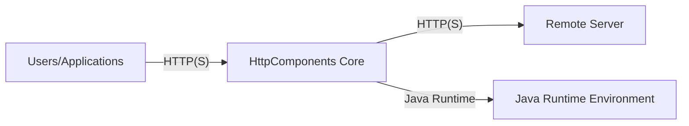
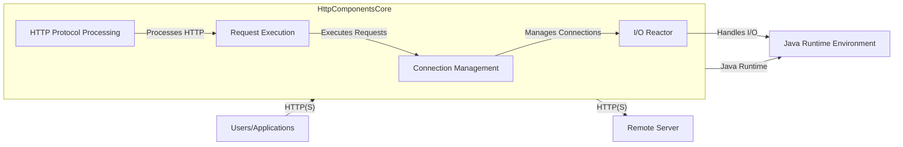
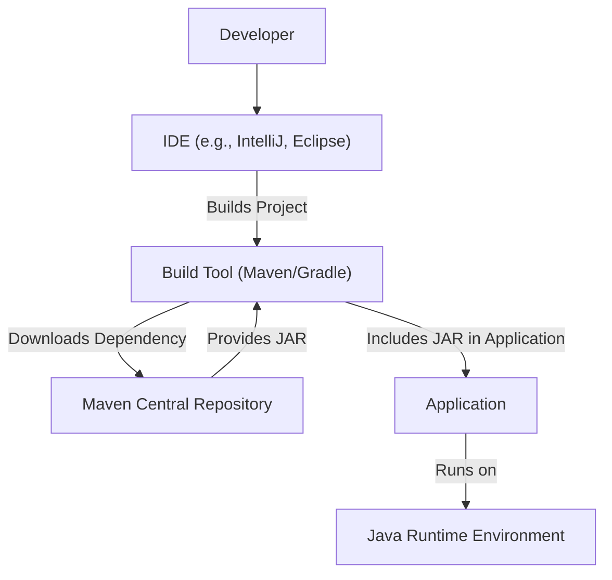
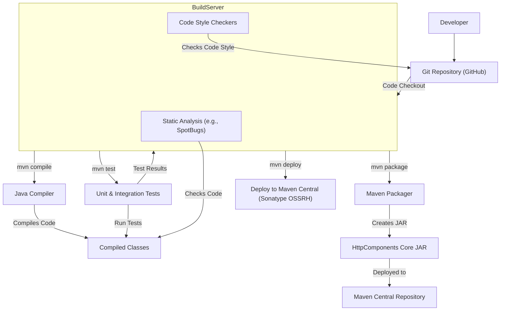

Okay, let's create a design document for the Apache HttpComponents Core project.

# BUSINESS POSTURE

Business Priorities and Goals:

*   Provide a reliable, efficient, and standards-compliant HTTP implementation for Java applications.
*   Serve as a foundational library for higher-level HTTP clients and frameworks.
*   Maintain backward compatibility and stability for existing users.
*   Foster a community-driven development process with contributions from various individuals and organizations.
*   Ensure the library is performant and scalable to handle high-volume HTTP traffic.
*   Provide a flexible and extensible API to accommodate various use cases and custom requirements.

Most Important Business Risks:

*   Security vulnerabilities in the library could expose applications using it to attacks like request smuggling, header injection, or denial of service.
*   Performance bottlenecks or inefficiencies could impact the performance of applications relying on the library.
*   Lack of compliance with evolving HTTP standards could lead to interoperability issues.
*   Inability to adapt to new transport protocols (like QUIC) could limit future applicability.
*   Loss of community support or key contributors could slow down development and maintenance.

# SECURITY POSTURE

Existing Security Controls:

*   security control: Input validation: The library likely performs input validation on HTTP headers and other input data to prevent common vulnerabilities. Implemented in parsing logic throughout the codebase.
*   security control: Secure coding practices: The project follows secure coding practices to minimize vulnerabilities. Described in contribution guidelines and evident in code reviews.
*   security control: Regular updates and security advisories: The Apache Software Foundation has a process for addressing security vulnerabilities and releasing updates. Described on the Apache HttpComponents website and mailing lists.
*   security control: Dependency management: The project manages its dependencies to avoid using vulnerable libraries. Evident in the project's build configuration (pom.xml).
*   security control: Testing: Unit and integration tests are used to verify the correctness and security of the code. Evident in the test suite within the repository.

Accepted Risks:

*   accepted risk: Complexity of HTTP: The inherent complexity of the HTTP protocol and its various extensions means that there is always a risk of unforeseen vulnerabilities.
*   accepted risk: Reliance on underlying platform: The library relies on the security of the underlying Java platform and operating system.
*   accepted risk: Third-party dependencies: While dependencies are managed, there's always a residual risk associated with vulnerabilities in third-party libraries.

Recommended Security Controls:

*   security control: Fuzz testing: Implement fuzz testing to discover edge cases and potential vulnerabilities that might be missed by traditional testing.
*   security control: Static analysis: Integrate static analysis tools into the build process to automatically detect potential security issues.
*   security control: Dynamic analysis: Consider using dynamic analysis tools (e.g., during integration testing) to identify runtime vulnerabilities.
*   security control: Security hardening guides: Provide documentation on how to securely configure and use the library in different deployment scenarios.
*   security control: Supply Chain Security: Implement SLSA framework to ensure build and supply chain integrity.

Security Requirements:

*   Authentication: The library itself doesn't directly handle authentication, but it should provide mechanisms for applications to implement various authentication schemes (e.g., Basic, Digest, OAuth) by correctly handling authentication-related headers and providing appropriate APIs.
*   Authorization: Similar to authentication, the library should facilitate authorization by providing access to relevant request information (e.g., headers, cookies) that applications can use to make authorization decisions.
*   Input Validation: Thoroughly validate all input data, including headers, parameters, and request bodies, to prevent injection attacks and other vulnerabilities.  This includes checking for length limits, allowed characters, and expected data types.
*   Cryptography: Provide support for secure communication using TLS/SSL.  Ensure that the library uses strong cryptographic algorithms and protocols, and that it correctly handles certificates and keys.  Allow configuration of ciphersuites and TLS versions.
*   Output Encoding: While primarily focused on the transport layer, any helper functions that generate HTTP messages should properly encode output to prevent injection vulnerabilities.

# DESIGN

## C4 CONTEXT

Element Description:

*   Element:
    *   Name: Users/Applications
    *   Type: External Entity (Software System)
    *   Description: Applications or users that utilize HttpComponents Core to make HTTP requests.
    *   Responsibilities: Initiating HTTP requests, processing HTTP responses, handling application-specific logic.
    *   Security controls: Implement appropriate authentication and authorization mechanisms, validate user input, securely handle sensitive data.

*   Element:
    *   Name: HttpComponents Core
    *   Type: Software System
    *   Description: The core library providing low-level HTTP transport functionality.
    *   Responsibilities: Managing connections, sending requests, receiving responses, handling protocol-level details, providing a transport-agnostic API.
    *   Security controls: Input validation, secure coding practices, regular security updates, dependency management, testing.

*   Element:
    *   Name: Remote Server
    *   Type: External Entity (Software System)
    *   Description: The server receiving and processing HTTP requests from HttpComponents Core.
    *   Responsibilities: Processing requests, generating responses, enforcing server-side security policies.
    *   Security controls: Server-side security controls are outside the scope of HttpComponents Core but are crucial for overall security.

*   Element:
    *   Name: Java Runtime Environment
    *   Type: External Entity (Platform)
    *   Description: The Java runtime environment on which HttpComponents Core executes.
    *   Responsibilities: Providing the underlying platform for the library to run.
    *   Security controls: Relies on the security of the JRE itself, including its security manager and cryptographic providers.

## C4 CONTAINER

Since HttpComponents Core is a library, the container diagram is essentially an expanded view of the context diagram.

Element Description:

*   Element:
    *   Name: Connection Management
    *   Type: Component
    *   Description: Responsible for managing persistent HTTP connections, including connection pooling and reuse.
    *   Responsibilities: Establishing connections, managing connection state, releasing connections, handling connection timeouts.
    *   Security controls: Securely manage connection pools to prevent resource exhaustion attacks, enforce connection limits, handle timeouts gracefully.

*   Element:
    *   Name: Request Execution
    *   Type: Component
    *   Description: Handles the execution of HTTP requests, including sending the request and receiving the response.
    *   Responsibilities: Sending requests over the connection, receiving responses, handling redirects, retries, and error conditions.
    *   Security controls: Validate request data before sending, handle redirects securely, limit the number of retries to prevent infinite loops.

*   Element:
    *   Name: HTTP Protocol Processing
    *   Type: Component
    *   Description: Implements the core HTTP protocol logic, including parsing and generating HTTP messages.
    *   Responsibilities: Parsing request and response lines, headers, and bodies, generating properly formatted HTTP messages.
    *   Security controls: Thoroughly validate all parsed data, enforce limits on header sizes and numbers, handle malformed input gracefully.

*   Element:
    *   Name: I/O Reactor
    *   Type: Component
    *   Description: Provides non-blocking I/O capabilities for efficient handling of multiple concurrent connections.
    *   Responsibilities: Managing I/O events, handling asynchronous read and write operations.
    *   Security controls: Ensure secure handling of I/O operations, prevent buffer overflows, and handle I/O errors gracefully.

*   Element:
    *   Name: Users/Applications
    *   Type: External Entity (Software System)
    *   Description: Applications or users that utilize HttpComponents Core to make HTTP requests.
    *   Responsibilities: Initiating HTTP requests, processing HTTP responses, handling application-specific logic.
    *   Security controls: Implement appropriate authentication and authorization mechanisms, validate user input, securely handle sensitive data.

*   Element:
    *   Name: Remote Server
    *   Type: External Entity (Software System)
    *   Description: The server receiving and processing HTTP requests from HttpComponents Core.
    *   Responsibilities: Processing requests, generating responses, enforcing server-side security policies.
    *   Security controls: Server-side security controls are outside the scope of HttpComponents Core but are crucial for overall security.

*   Element:
    *   Name: Java Runtime Environment
    *   Type: External Entity (Platform)
    *   Description: The Java runtime environment on which HttpComponents Core executes.
    *   Responsibilities: Providing the underlying platform for the library to run.
    *   Security controls: Relies on the security of the JRE itself, including its security manager and cryptographic providers.

## DEPLOYMENT

HttpComponents Core is a Java library, so deployment involves including the library's JAR file in the classpath of the application using it. There are several deployment scenarios:

1.  **Embedded within a standalone Java application:** The JAR file is included directly in the application's distribution.
2.  **Included in a web application deployed to a servlet container (e.g., Tomcat, Jetty):** The JAR file is placed in the `WEB-INF/lib` directory of the web application.
3.  **Used as a dependency in a build system (e.g., Maven, Gradle):** The library is declared as a dependency in the project's build configuration, and the build system automatically downloads and includes it.
4.  **OSGi bundle:** HttpComponents Core can be deployed as an OSGi bundle in an OSGi container.

We'll describe the Maven/Gradle dependency scenario, as it's the most common and recommended approach.

Element Description:

*   Element:
    *   Name: Developer
    *   Type: Person
    *   Description: The developer writing code that uses HttpComponents Core.
    *   Responsibilities: Writing code, configuring dependencies, building the application.
    *   Security controls: Follow secure coding practices.

*   Element:
    *   Name: IDE (e.g., IntelliJ, Eclipse)
    *   Type: Tool
    *   Description: The integrated development environment used by the developer.
    *   Responsibilities: Providing a development environment, assisting with code completion, building, and debugging.
    *   Security controls: Use a trusted and up-to-date IDE.

*   Element:
    *   Name: Build Tool (Maven/Gradle)
    *   Type: Tool
    *   Description: The build tool used to manage dependencies and build the application.
    *   Responsibilities: Downloading dependencies, compiling code, packaging the application.
    *   Security controls: Use a trusted and up-to-date build tool, verify dependency checksums, use a secure repository.

*   Element:
    *   Name: Maven Central Repository
    *   Type: External Entity (Repository)
    *   Description: The central repository for Maven artifacts, including HttpComponents Core.
    *   Responsibilities: Hosting and providing access to library JAR files.
    *   Security controls: Maven Central has its own security measures to ensure the integrity of artifacts.

*   Element:
    *   Name: Application
    *   Type: Software System
    *   Description: The application that uses HttpComponents Core.
    *   Responsibilities: Performing its intended function, using HttpComponents Core for HTTP communication.
    *   Security controls: Implement application-specific security controls.

*   Element:
    *   Name: Java Runtime Environment
    *   Type: Platform
    *   Description: The Java runtime environment on which the application runs.
    *   Responsibilities: Providing the underlying platform for the application to execute.
    *   Security controls: Use a trusted and up-to-date JRE.

## BUILD

The build process for HttpComponents Core involves compiling the source code, running tests, and packaging the library into JAR files.  The project uses Apache Maven as its build system.

Security Controls in the Build Process:

*   security control: Build Automation: GitHub Actions is used to automate the build process, ensuring consistency and repeatability.
*   security control: Dependency Management: Maven manages dependencies, ensuring that the correct versions of libraries are used.
*   security control: Unit and Integration Tests: The build process includes running a comprehensive suite of unit and integration tests to verify the correctness and security of the code.
*   security control: Static Analysis: Static analysis tools (like SpotBugs, though not explicitly configured in the provided repository, it's a recommended practice) can be integrated into the build process to automatically detect potential security issues.
*   security control: Code Style Checkers: Linters and code style checkers (like Checkstyle) can be used to enforce coding standards and prevent common errors.
*   security control: Signed Artifacts: The released JAR files should be digitally signed to ensure their integrity and authenticity.
*   security control: Secure Build Environment: The build server (GitHub Actions) should be configured securely to prevent unauthorized access and tampering.
*   security control: Supply Chain Security: Use tools and practices to ensure the security of the entire software supply chain, from source code to dependencies to the build environment. SLSA framework is recommended.

# RISK ASSESSMENT

Critical Business Processes:

*   Reliable HTTP communication for Java applications.
*   Providing a foundation for other libraries and frameworks.
*   Maintaining a stable and well-supported open-source project.

Data Sensitivity:

*   HttpComponents Core itself doesn't directly handle sensitive data *storage*. However, it *transmits* data, which can range from non-sensitive public information to highly sensitive data like credentials, personal information, or financial data. The sensitivity of the data depends entirely on the application using the library. Therefore, while the library itself isn't storing sensitive data, it's crucial that it handles all data securely during transmission, regardless of its sensitivity.

# QUESTIONS & ASSUMPTIONS

Questions:

*   Are there any specific compliance requirements (e.g., PCI DSS, HIPAA) that applications using HttpComponents Core need to meet? This would influence recommendations for secure configuration and usage.
*   What is the expected threat model for applications using this library? Are they primarily web applications, internal services, or something else?
*   What level of security auditing or penetration testing has been performed on HttpComponents Core?
*   What is the process for reporting and handling security vulnerabilities discovered in the library?
*   Is there a plan to adopt newer transport protocols like HTTP/3 (QUIC)?

Assumptions:

*   BUSINESS POSTURE: The primary goal is to provide a robust and secure HTTP transport library, prioritizing stability and backward compatibility.
*   SECURITY POSTURE: The project follows generally accepted secure coding practices, but there's always room for improvement, especially with proactive measures like fuzz testing and static/dynamic analysis.
*   DESIGN: The library is designed to be flexible and extensible, allowing applications to customize its behavior as needed. The provided C4 diagrams are a high-level representation and may not capture all internal components. The deployment model assumes a standard Maven/Gradle dependency management approach. The build process is assumed to be automated using GitHub Actions, with standard Maven build phases.