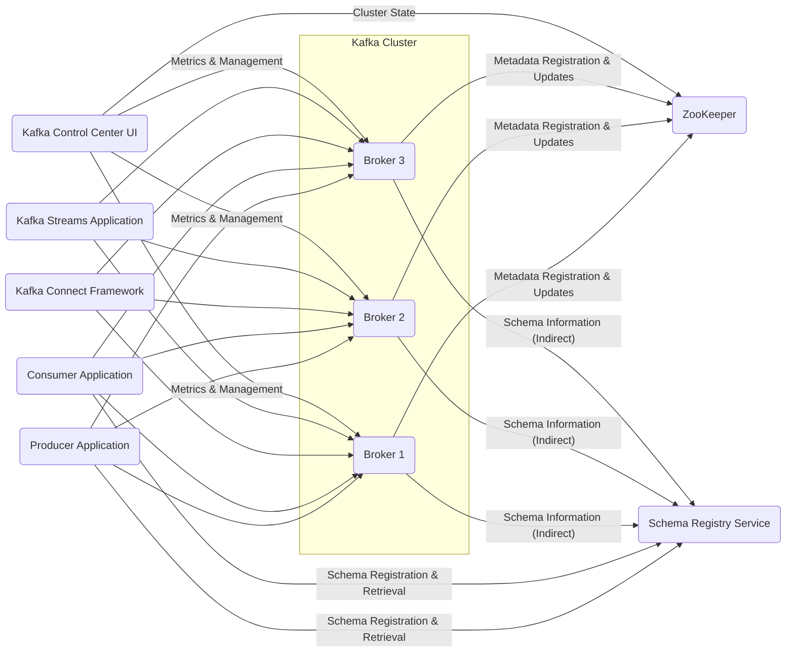

# Project Design Document: Apache Kafka (Improved)

**1. Introduction**

This document provides an enhanced and detailed design overview of the Apache Kafka project, an open-source distributed event streaming platform. It aims to provide a clear understanding of the system's architecture, key components, data flow mechanisms, and component interactions. This document is primarily intended for software, cloud, and cybersecurity architects and will serve as a robust foundation for subsequent threat modeling activities.

**2. Goals**

*   Present a comprehensive and easily understandable architectural overview of Apache Kafka.
*   Clearly define the key components of Kafka and their specific responsibilities within the system.
*   Thoroughly describe the data flow processes and mechanisms within the Kafka ecosystem.
*   Explicitly outline the primary interactions and communication patterns between the different components of Kafka.
*   Establish a precise and detailed understanding of the system's structure to facilitate effective threat modeling.

**3. Scope**

This document encompasses the core and commonly used components of Apache Kafka, including:

*   Kafka Brokers and their role in the cluster
*   Kafka Producers and their methods of sending data
*   Kafka Consumers and their mechanisms for receiving data
*   The dependency on ZooKeeper for cluster coordination
*   Kafka Topics and the concept of partitioning for scalability
*   Kafka Connect for integrating with external systems
*   Kafka Streams for building stream processing applications
*   Kafka Schema Registry for managing data schemas (as an integral part of many deployments)
*   Kafka Control Center for monitoring and management (as a common operational tool)

The following aspects are considered outside the scope of this document:

*   In-depth implementation details and internal workings of each component.
*   Exhaustive list of all possible configuration options.
*   Detailed specifications of the Kafka API endpoints and their parameters.
*   Specific details of third-party integrations beyond the general functionality of Kafka Connect.

**4. Target Audience**

*   Software Architects responsible for designing and implementing systems interacting with Kafka.
*   Cloud Architects designing and deploying Kafka infrastructure in cloud environments.
*   Cybersecurity Architects tasked with identifying and mitigating security risks in Kafka deployments.
*   Developers who will be developing applications that produce or consume data from Kafka.

**5. System Overview**

Apache Kafka is a highly scalable, fault-tolerant, and distributed event streaming platform. It enables the development of real-time data pipelines and streaming applications. Kafka operates on a publish-subscribe model, allowing producers to publish streams of events to categorized feeds called topics, and consumers to subscribe to these topics to process the events. Its distributed nature and persistence capabilities make it suitable for handling high-throughput, real-time data.

**6. Architectural Design**

The fundamental architecture of Kafka is centered around a distributed cluster of servers known as **brokers**. These brokers are the core of the system, responsible for the durable storage and reliable delivery of messages.

*   **Key Components:**
    *   **Kafka Brokers:** These are the individual server instances that collectively form the Kafka cluster. Their primary responsibilities include:
        *   Accepting and processing messages published by producers.
        *   Persistently storing messages on disk, ensuring durability.
        *   Serving messages to consumers based on their subscriptions.
        *   Replicating messages across multiple brokers to provide fault tolerance and high availability.
    *   **Kafka Producers:** Applications or services that publish (write) streams of records or events to specific Kafka topics. Producers are responsible for serializing data and sending it to the appropriate broker.
    *   **Kafka Consumers:** Applications or services that subscribe to (read) and process streams of records from one or more Kafka topics. Consumers manage their read position (offset) within the partitions they are assigned.
    *   **ZooKeeper:** A critical centralized coordination service that Kafka relies on for:
        *   Maintaining and managing the overall state of the Kafka cluster.
        *   Electing a controller broker, which is responsible for partition leadership management.
        *   Storing essential metadata about topics, partitions, brokers, and consumer groups.
    *   **Kafka Topics:**  Named categories or feeds to which records are published. Topics provide a logical separation of event streams.
    *   **Kafka Partitions:**  Topics are divided into partitions, which are ordered, immutable sequences of records. Partitioning enables horizontal scalability and parallelism in both storage and processing. Each partition is led by one broker and can be replicated to other brokers for fault tolerance.
    *   **Kafka Connect:** A framework designed for building and running reusable connectors that facilitate streaming data between Kafka and other external systems, such as databases, message queues, and cloud storage.
    *   **Kafka Streams:** A powerful client library for developing stream processing applications. It allows for building applications that consume input streams from Kafka topics, perform transformations and aggregations, and produce output streams back to Kafka topics.
    *   **Kafka Schema Registry:** (Often deployed alongside Kafka) A centralized repository for storing and managing schemas used by producers and consumers. It ensures data consistency and enables schema evolution.
    *   **Kafka Control Center:** (A common operational tool) A web-based user interface for monitoring and managing Kafka clusters. It provides insights into cluster health, topic configurations, consumer group lag, and more.

*   **High-Level Architecture Diagram:**

**7. Data Flow**

The typical data flow within Kafka involves producers publishing messages to brokers, which subsequently store and serve these messages to subscribing consumers.

*   **Producer to Broker Data Flow:**
    *   A producer application intends to send a message to a specific Kafka topic.
    *   The producer determines the target partition for the message. This can be done explicitly by the producer or automatically based on a configured partitioning strategy (e.g., round-robin, key-based hashing).
    *   The producer sends the message to the designated leader broker for that specific partition.
    *   The leader broker receives the message and appends it to its local partition log on disk.
    *   Follower brokers for that partition then replicate the message from the leader broker, ensuring data redundancy.
    *   Once the message is considered committed (acknowledged by a configurable number of in-sync replicas), the producer receives an acknowledgement from the leader broker, confirming successful delivery.

*   **Consumer to Broker Data Flow:**
    *   A consumer application subscribes to one or more Kafka topics to receive messages.
    *   Consumers are typically organized into consumer groups. Each partition of a topic is assigned to exactly one consumer within a given consumer group, ensuring that each message is processed only once per group.
    *   The consumer sends fetch requests to the leader broker(s) responsible for the partitions it is currently assigned to.
    *   The broker responds by sending batches of messages from the requested partitions to the consumer.
    *   The consumer processes the received messages.
    *   Periodically, the consumer commits its current offset (the position of the last successfully processed message in each partition) back to Kafka. This allows the consumer to resume processing from the correct point in case of failures or restarts.

*   **Broker to Broker Data Flow (Replication):**
    *   Leader brokers continuously stream newly received messages to their designated follower replica brokers for each partition they lead.
    *   Follower brokers acknowledge the receipt of these replicated messages.
    *   If a leader broker fails, ZooKeeper facilitates the election of one of the in-sync follower brokers to become the new leader for that partition, ensuring continued availability and data consistency.

*   **Kafka Connect Data Flow:**
    *   **Source Connectors:** These connectors are responsible for continuously reading data from external systems (e.g., databases, application logs) and publishing this data as messages to specified Kafka topics.
    *   **Sink Connectors:** These connectors subscribe to specific Kafka topics and continuously consume messages from those topics, writing the data to external systems (e.g., data lakes, search indexes).

*   **Kafka Streams Data Flow:**
    *   Kafka Streams applications function as both consumers and producers. They consume data from one or more input Kafka topics, perform real-time processing (e.g., filtering, transformations, aggregations), and then produce the processed results to new Kafka topics.

**8. Key Interactions**

*   **Producer-Broker Interaction Details:**
    *   Producers establish persistent TCP connections with Kafka brokers.
    *   Producers send `ProduceRequest` messages to brokers. These requests contain the topic name, partition number, and the actual message data.
    *   Brokers process the `ProduceRequest` and respond with a `ProduceResponse`, indicating the success or failure of the message publication, along with any error codes.

*   **Consumer-Broker Interaction Details:**
    *   Consumers also establish persistent TCP connections with Kafka brokers.
    *   Consumers use the `FindCoordinatorRequest` to locate the coordinator broker responsible for managing their consumer group.
    *   Consumers send `JoinGroupRequest` to the coordinator broker to join a specific consumer group. The coordinator manages partition assignments within the group.
    *   Once assigned partitions, consumers send `FetchRequest` messages to the leader brokers of their assigned partitions to retrieve new messages.
    *   Brokers respond to `FetchRequest` messages with `FetchResponse` messages containing batches of messages from the requested partitions.
    *   Consumers send `OffsetCommitRequest` messages to the coordinator broker to persist their current read offsets for the assigned partitions.

*   **Broker-ZooKeeper Interaction Details:**
    *   When a Kafka broker starts up, it registers itself with ZooKeeper by creating an ephemeral node. This allows ZooKeeper to track the active brokers in the cluster.
    *   Brokers monitor specific ZooKeeper nodes for changes in cluster state, such as new brokers joining, existing brokers leaving, or changes in topic and partition configurations.
    *   The controller broker, elected by ZooKeeper through a leader election process, maintains information about partition leaders and performs partition reassignment operations when necessary.

*   **Kafka Connect and Brokers Interaction Details:**
    *   Kafka Connect workers run connectors as tasks.
    *   Source connector tasks act as Kafka producers, publishing data fetched from external systems to Kafka topics using standard producer APIs.
    *   Sink connector tasks act as Kafka consumers, subscribing to Kafka topics and writing the consumed data to external systems using standard consumer APIs.
    *   Kafka Connect utilizes dedicated internal Kafka topics (e.g., `connect-configs`, `connect-offsets`, `connect-status`) to manage connector configurations, track offsets for reliable processing, and monitor the status of connectors and tasks.

*   **Kafka Streams and Brokers Interaction Details:**
    *   Kafka Streams applications internally use Kafka producer and consumer clients to interact with Kafka brokers.
    *   They consume data from input topics, process it using stream processing logic defined in the application, and produce the processed results to output topics.
    *   Kafka Streams also utilizes internal Kafka topics for state management (e.g., for storing stateful operations like aggregations) and for coordinating distributed processing.

*   **Schema Registry Interaction Details:**
    *   Producers, before sending a message, can register the schema of the message with the Schema Registry. The Schema Registry assigns a unique ID to the schema.
    *   Producers then include this schema ID in the messages they publish to Kafka.
    *   Consumers, upon receiving a message with a schema ID, query the Schema Registry to retrieve the corresponding schema.
    *   Consumers then use the retrieved schema to deserialize the message data.
    *   Kafka brokers themselves do not directly interact with the Schema Registry for routine message processing but might interact with it for administrative or monitoring purposes.

*   **Kafka Control Center and Brokers/ZooKeeper Interaction Details:**
    *   Kafka Control Center interacts with Kafka brokers primarily through the Kafka AdminClient API. This allows it to retrieve various metrics, configurations, and status information about the cluster, topics, and consumer groups.
    *   Kafka Control Center might also interact directly with ZooKeeper to retrieve certain cluster-level metadata and monitor the overall health of the Kafka environment.

**9. Security Considerations (Detailed)**

This section provides a more detailed overview of key security aspects relevant for threat modeling.

*   **Authentication Mechanisms:**
    *   **SASL (Simple Authentication and Security Layer):** Provides a framework for authentication using various mechanisms:
        *   **SASL/PLAIN:** A simple username/password authentication mechanism.
        *   **SASL/SCRAM (Salted Challenge Response Authentication Mechanism):** A more secure password-based authentication mechanism that uses salting and hashing.
        *   **SASL/GSSAPI (Kerberos):** A strong authentication mechanism that uses tickets granted by a Kerberos Key Distribution Center (KDC).
    *   **TLS (Transport Layer Security):**  Used to encrypt communication and can also be used for client authentication:
        *   **Mutual TLS (mTLS):** Both the client and the server present certificates to each other for authentication, providing strong mutual authentication.

*   **Authorization Mechanisms:**
    *   **ACLs (Access Control Lists):** Kafka uses ACLs to control which users or groups have permission to perform specific operations on Kafka resources (e.g., create topics, produce to topics, consume from topics, manage consumer groups). ACLs can be defined at various levels (cluster, topic, group).
    *   **Integration with External Authorization Systems:** Kafka can be integrated with external authorization systems like Apache Ranger or custom authorization plugins to provide more fine-grained and centralized access control.

*   **Encryption Mechanisms:**
    *   **In-transit Encryption (TLS):**  Essential for protecting data as it travels across the network:
        *   Encryption between producers and brokers.
        *   Encryption between consumers and brokers.
        *   Encryption between brokers within the cluster (for replication traffic).
        *   Encryption between Kafka Connect workers and brokers.
        *   Encryption between Kafka Streams applications and brokers.
        *   Encryption between clients and the Schema Registry.
    *   **At-rest Encryption:** Protecting data stored on the broker's disks:
        *   Can be implemented using file system-level encryption (e.g., LUKS).
        *   Can be implemented using disk-level encryption.
        *   Kafka also supports broker-side encryption where messages are encrypted before being written to disk.

*   **Quotas and Resource Management:**
    *   **Produce Quotas:** Limit the rate at which producers can publish messages to prevent resource exhaustion.
    *   **Consume Quotas:** Limit the rate at which consumers can consume messages.
    *   **Storage Quotas:** Limit the amount of storage that can be used by topics.

*   **Auditing and Logging:**
    *   Kafka brokers can be configured to log security-related events, such as:
        *   Authentication attempts (successful and failed).
        *   Authorization decisions (grants and denials).
        *   Administrative actions (e.g., topic creation, ACL changes).
    *   These logs are crucial for security monitoring and incident response.

*   **ZooKeeper Security Considerations:**
    *   **Authentication between Kafka Brokers and ZooKeeper:** Secure the connection between Kafka brokers and the ZooKeeper ensemble using SASL/Kerberos or other appropriate authentication mechanisms.
    *   **Access Control for ZooKeeper:** Restrict access to the ZooKeeper ensemble itself to authorized Kafka brokers and administrators to prevent unauthorized modifications to cluster metadata.

**10. Conclusion**

This improved design document provides a comprehensive and detailed architectural overview of the Apache Kafka project. It clearly outlines the key components, elucidates the data flow mechanisms, and describes the critical interactions between components. Furthermore, it delves into the essential security considerations for a Kafka deployment. This enhanced document serves as a valuable resource for software, cloud, and cybersecurity architects, providing the necessary information for conducting thorough threat modeling exercises and implementing robust security measures within the Kafka ecosystem.