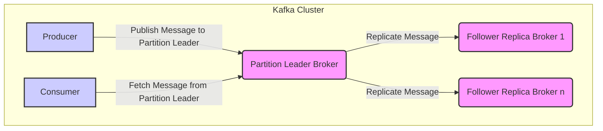
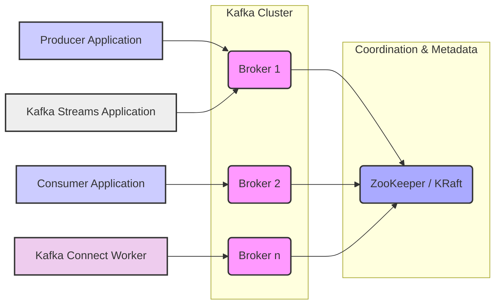

# Project Design Document: Apache Kafka

**1. Introduction**

This document provides a detailed design overview of the Apache Kafka project. It aims to capture the key architectural components, data flows, and interactions within the system. This document will serve as a foundation for subsequent threat modeling activities, enabling a comprehensive understanding of potential security vulnerabilities.

**1.1. Purpose**

The primary purpose of this document is to provide a clear and comprehensive architectural description of Apache Kafka. This description will be used as input for threat modeling exercises to identify potential security risks and vulnerabilities within the system's design and implementation.

**1.2. Scope**

This document covers the core components and functionalities of Apache Kafka, including:

*   Brokers and their role in message storage, replication, and serving client requests.
*   Topics and partitions as the fundamental units of data organization, distribution, and parallelism.
*   Producers and their interaction with brokers to publish messages, including delivery semantics.
*   Consumers and their interaction with brokers to subscribe to and consume messages, including consumer groups and offset management.
*   ZooKeeper (or KRaft) and its role in cluster management, metadata storage, and coordination.
*   Kafka Connect for building and managing scalable and reliable data pipelines between Kafka and other systems.
*   Kafka Streams for developing stateful stream processing applications that leverage Kafka's capabilities.

This document focuses on the logical architecture and key interactions. It does not delve into the specifics of individual configuration options, low-level implementation details, or the intricacies of the Kafka protocol.

**1.3. Target Audience**

This document is intended for:

*   Security architects and engineers responsible for threat modeling, security assessments, and defining security controls for Kafka deployments.
*   Software architects and developers who need a high-level understanding of Kafka's architecture to design and integrate applications.
*   Operations engineers responsible for deploying, configuring, managing, and monitoring Kafka clusters.

**2. System Overview**

Apache Kafka is a distributed, fault-tolerant, and scalable streaming platform. It provides a publish-subscribe mechanism for handling continuous streams of records. Key characteristics of Kafka include:

*   **Scalability:** Designed to handle high volumes of data and a large number of concurrent producers and consumers by distributing data across multiple brokers and partitions.
*   **Durability:** Messages are persisted on disk in an ordered and immutable fashion and replicated across multiple brokers based on configuration, ensuring data durability and fault tolerance.
*   **Fault Tolerance:** The system is designed to withstand the failure of individual brokers without data loss or service interruption due to replication and leader election mechanisms.
*   **High Throughput:** Optimized for high-speed data ingestion and delivery with minimal latency, making it suitable for real-time data pipelines and streaming applications.
*   **Extensibility:** Provides APIs and frameworks like Kafka Connect and Kafka Streams for integrating with various data sources, sinks, and processing engines.

**3. Core Components**

*   **Kafka Brokers:**
    *   Serve as the central nodes in the Kafka cluster, responsible for receiving, storing, and serving messages.
    *   Each broker manages a set of partitions for different topics.
    *   Handle `ProduceRequest`s from producers to append messages to their assigned partitions.
    *   Serve `FetchRequest`s from consumers to retrieve messages from their assigned partitions.
    *   Participate in partition leadership election and replication.
    *   A Kafka cluster consists of one or more brokers, with one broker acting as the controller (or a quorum of controllers in KRaft mode).

*   **Topics:**
    *   Represent a named category or feed of messages.
    *   Messages are published to and consumed from topics.
    *   Topics are logical abstractions and do not directly correspond to physical storage units.

*   **Partitions:**
    *   Topics are divided into one or more partitions, which are the fundamental units of parallelism and replication within Kafka.
    *   Each partition is an ordered, immutable sequence of records, continuously appended to.
    *   Each partition has a designated leader broker, responsible for handling all read and write requests for that partition.
    *   Zero or more follower brokers replicate the leader's partition log, providing redundancy and fault tolerance.

*   **Producers:**
    *   Client applications that publish (write) messages to Kafka topics.
    *   Producers send messages to the leader broker of a specific partition within a topic.
    *   Producers can choose the target partition based on a message key (using a partitioning strategy) or allow Kafka to distribute messages using a round-robin approach.
    *   Producers can configure delivery semantics (e.g., at-least-once, at-most-once, exactly-once).

*   **Consumers:**
    *   Client applications that subscribe to (read) messages from Kafka topics.
    *   Consumers read messages from one or more partitions within a topic.
    *   Consumers track their progress within a partition using offsets, which indicate the position of the last consumed message.
    *   Consumers typically belong to consumer groups.

*   **Consumer Groups:**
    *   A group of consumers that work together to consume messages from a topic.
    *   Kafka ensures that each partition of a topic is assigned to exactly one consumer within a group at any given time, enabling parallel processing of messages.
    *   Consumer groups provide a way to scale consumption and ensure that each message is processed by only one consumer within the group.

*   **ZooKeeper (or KRaft):**
    *   **ZooKeeper (Traditional):** A distributed coordination service used by Kafka for:
        *   Electing the controller broker, which manages partition leaders and replicas.
        *   Storing cluster metadata, such as topic and partition information, broker membership, and configurations.
        *   Tracking broker liveness and detecting failures.
        *   Coordinating consumer group membership and partition assignments.
    *   **KRaft (Kafka Raft Metadata Mode):** An alternative metadata management system where Kafka brokers themselves form a quorum using the Raft consensus algorithm to manage metadata. This eliminates the external dependency on ZooKeeper, simplifying the architecture and deployment.

*   **Kafka Connect:**
    *   A framework for building and running scalable and reliable data pipelines between Kafka and other systems.
    *   Provides a set of APIs and abstractions for developing reusable connectors.
    *   **Source Connectors:** Read data from external systems (e.g., databases, message queues) and publish it to Kafka topics.
    *   **Sink Connectors:** Read data from Kafka topics and write it to external systems (e.g., databases, data lakes).

*   **Kafka Streams:**
    *   A client library for building stream processing applications on top of Kafka.
    *   Enables building stateful, fault-tolerant stream processing applications that consume and produce data from Kafka topics.
    *   Provides high-level abstractions for common stream processing operations like filtering, mapping, joining, aggregating, and windowing.
    *   Leverages Kafka's scalability and fault tolerance capabilities.

**4. Data Flow**

**Detailed Data Flow:**

*   **Message Production:**
    *   A producer application wants to send a message to a specific Kafka topic.
    *   The producer consults with the Kafka brokers (or metadata stored locally) to determine the leader broker for the target partition of the topic.
    *   The producer sends a `ProduceRequest` containing the message to the leader broker.
    *   The leader broker appends the message to its local partition log.
    *   The leader broker then replicates the message to the in-sync replica (ISR) set of follower brokers for that partition.
    *   Once a sufficient number of replicas (as defined by the `acks` configuration) have acknowledged the message, the leader broker sends a `ProduceResponse` (acknowledgment) back to the producer.

*   **Message Consumption:**
    *   A consumer application, as part of a consumer group, subscribes to one or more Kafka topics.
    *   The consumer group coordinator (running within a Kafka broker or KRaft quorum) assigns partitions from the subscribed topics to the consumers in the group.
    *   The consumer sends `FetchRequest`s to the leader broker for the partitions assigned to it.
    *   The leader broker reads messages from its local partition log, starting from the consumer's current offset, and sends them back to the consumer in a `FetchResponse`.
    *   The consumer processes the received messages and periodically commits its offsets back to Kafka. This ensures that if the consumer restarts or fails, it can resume consumption from the last committed offset, avoiding message loss or duplication (depending on delivery semantics).

**5. Key Interactions**

*   **Producer to Broker:**
    *   Communication occurs using the Kafka protocol over TCP.
    *   Producers send `ProduceRequest`s containing messages to be published to specific topics and partitions.
    *   Brokers respond with `ProduceResponse`s indicating the success or failure of the publish operation, along with metadata like the assigned offset.

*   **Consumer to Broker:**
    *   Communication occurs using the Kafka protocol over TCP.
    *   Consumers send `FetchRequest`s to retrieve messages from specific partitions, specifying the offset from which they want to start reading.
    *   Brokers respond with `FetchResponse`s containing batches of messages.
    *   Consumers send `OffsetCommitRequest`s to commit the offsets of the messages they have successfully processed.
    *   Brokers respond with `OffsetCommitResponse`s indicating the success or failure of the offset commit.
    *   Consumers also participate in group management by sending `JoinGroupRequest` and `SyncGroupRequest` to coordinate partition assignments within a consumer group.

*   **Broker to Broker (Replication):**
    *   Communication occurs using the Kafka protocol over TCP.
    *   The leader broker sends messages to follower brokers to replicate the partition log.
    *   Follower brokers send acknowledgments to the leader broker upon successfully replicating messages.

*   **Broker to ZooKeeper (or KRaft):**
    *   **ZooKeeper:** Brokers communicate with ZooKeeper for:
        *   Registering their presence and health status in the cluster.
        *   Participating in controller election.
        *   Fetching and subscribing to cluster metadata changes.
        *   Participating in consumer group coordination.
    *   **KRaft:** Brokers communicate within the KRaft quorum for:
        *   Participating in leader election for metadata partitions.
        *   Proposing and voting on metadata changes.
        *   Replicating metadata logs.

*   **Kafka Connect to Broker:**
    *   Source connectors act as producers, publishing data to Kafka topics using the producer API.
    *   Sink connectors act as consumers, reading data from Kafka topics using the consumer API.
    *   Kafka Connect workers manage the lifecycle and configuration of connectors and communicate with brokers on their behalf.

*   **Kafka Streams to Broker:**
    *   Kafka Streams applications embed producers and consumers to read from input topics, process data, and write to output topics.
    *   They leverage internal topics for state management and coordination.

**6. Security Considerations (Detailed)**

*   **Authentication:**
    *   Mechanisms to verify the identity of clients (producers and consumers) and brokers connecting to the Kafka cluster.
    *   Common options include:
        *   **SASL/PLAIN:** Simple username/password authentication.
        *   **SASL/SCRAM:** Salted Challenge Response Authentication Mechanism, providing stronger security than PLAIN.
        *   **SASL/GSSAPI (Kerberos):** Industry-standard authentication protocol providing strong authentication and authorization.
        *   **Mutual TLS (Transport Layer Security):** Uses X.509 certificates for mutual authentication between clients and brokers.

*   **Authorization:**
    *   Mechanisms to control access to Kafka resources, such as topics, consumer groups, and administrative operations.
    *   Kafka uses Access Control Lists (ACLs) to define permissions for specific users or groups on various resources.
    *   ACLs can grant or deny permissions for operations like `Read`, `Write`, `Create`, `Delete`, `Describe`, `Alter`, etc.

*   **Encryption:**
    *   **In-transit encryption:** Encrypting communication between clients and brokers, and between brokers within the cluster to protect data confidentiality.
        *   TLS/SSL is the standard mechanism for encrypting network traffic.
        *   Encryption can be configured at the broker level and enforced for client connections.
    *   **At-rest encryption:** Encrypting data stored on disk in the brokers to protect data confidentiality if the storage is compromised.
        *   Kafka itself does not provide native at-rest encryption.
        *   Solutions typically involve encrypting the underlying file system or storage volumes.

*   **Data Integrity:**
    *   Kafka ensures data integrity through checksums included with each message.
    *   Brokers verify these checksums upon receiving messages and during replication.
    *   Replication also contributes to data integrity by providing redundant copies of the data.

*   **Quotas:**
    *   Mechanisms to limit the resources consumed by clients (e.g., producer and consumer bandwidth, request rates).
    *   Quotas can be configured at the broker level to prevent individual clients from monopolizing resources and impacting the performance of other clients.

*   **Auditing:**
    *   Logging of security-related events to track access attempts, authorization decisions, and administrative actions.
    *   Audit logs can be used for security monitoring, compliance, and forensic analysis.
    *   Kafka provides audit logging capabilities that can be configured to log various events.

**7. Deployment Considerations**

*   Kafka is typically deployed as a clustered application for high availability, scalability, and fault tolerance.
*   The number of brokers in the cluster depends on the expected throughput, data volume, and desired level of redundancy.
*   ZooKeeper (or a KRaft quorum) needs to be deployed and managed alongside the Kafka brokers. The number of ZooKeeper nodes is typically odd (e.g., 3 or 5) for quorum-based consensus.
*   Producers and consumers are deployed as separate applications that interact with the Kafka cluster over the network.
*   Kafka Connect workers can be deployed as a separate, scalable cluster to manage connectors.
*   Kafka Streams applications can be deployed as standalone applications or integrated into other services.
*   Consider network configuration, firewall rules, and security groups to control access to the Kafka cluster.
*   Monitoring and alerting are crucial for maintaining the health and performance of the Kafka cluster.

**8. Diagrams**

*   **High-Level Component Diagram:**

**9. Conclusion**

This document provides a detailed architectural overview of Apache Kafka, outlining its core components, data flow mechanisms, and key interactions. The information presented here is intended to serve as a solid foundation for conducting thorough threat modeling activities. By understanding the architecture and the security considerations outlined, security professionals can effectively identify potential vulnerabilities and design appropriate security controls to protect Kafka deployments. The next step will involve using this document as input for a structured threat modeling exercise.