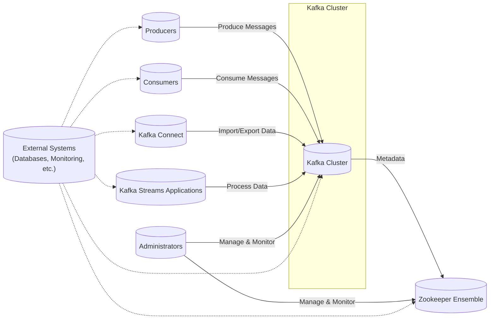
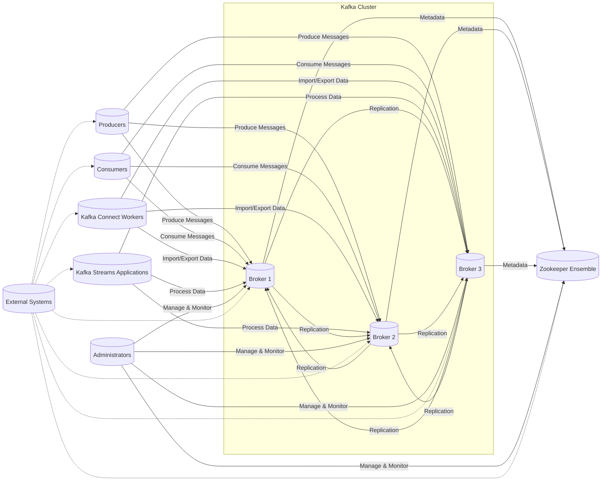
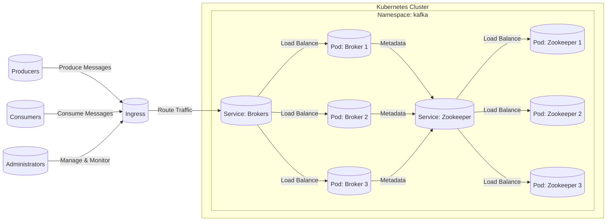
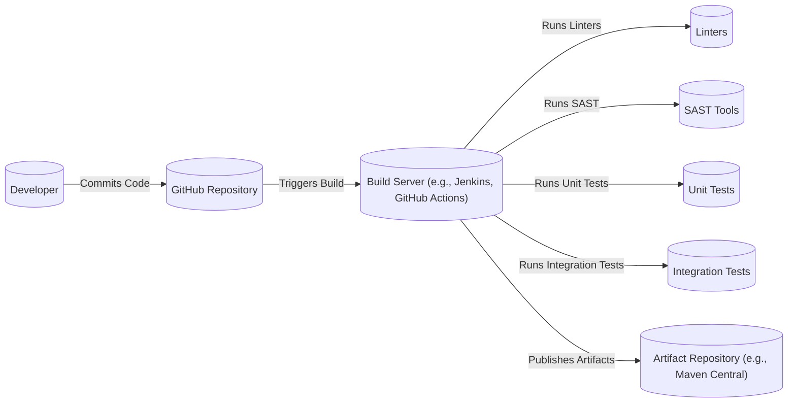

# BUSINESS POSTURE

Apache Kafka is a mature, widely-adopted, open-source project. It's used by thousands of companies, including many Fortune 500 companies, for mission-critical data pipelines and streaming applications. Therefore, the business posture emphasizes reliability, scalability, durability, and performance. The project's open-source nature also necessitates a strong focus on community engagement, clear documentation, and a well-defined contribution process.

Business Priorities:

*   Maintain high availability and fault tolerance.
*   Ensure data durability and prevent data loss.
*   Provide high throughput and low latency message processing.
*   Support a wide range of use cases and integrations.
*   Foster a vibrant and active open-source community.
*   Maintain backward compatibility where possible.

Business Goals:

*   Be the leading distributed streaming platform.
*   Enable real-time data processing and analytics.
*   Provide a reliable foundation for building event-driven architectures.

Most Important Business Risks:

*   Data loss or corruption due to software bugs or operational errors.
*   Service unavailability or performance degradation impacting critical business operations.
*   Security vulnerabilities leading to unauthorized data access or system compromise.
*   Inability to scale to meet growing data volumes and processing demands.
*   Loss of community trust and engagement due to poor project management or communication.

# SECURITY POSTURE

Kafka has evolved its security features significantly over time. The following outlines the existing security controls, accepted risks, recommended controls, and security requirements.

Existing Security Controls:

*   security control: Network Encryption (TLS): Kafka supports TLS for encrypting communication between clients and brokers, and between brokers. Described in Kafka documentation and KIPs (Kafka Improvement Proposals).
*   security control: Authentication (SASL): Kafka supports multiple SASL mechanisms for client authentication, including Kerberos, PLAIN, SCRAM, and OAUTHBEARER. Described in Kafka documentation and KIPs.
*   security control: Authorization (ACLs): Kafka uses Access Control Lists (ACLs) to manage access to resources (topics, consumer groups, etc.). Described in Kafka documentation and KIPs.
*   security control: Quotas: Kafka supports quotas to limit the bandwidth and request rates of clients, preventing resource exhaustion. Described in Kafka documentation and KIPs.
*   security control: Security Auditing: Kafka can be configured to log security-relevant events, such as authentication failures and authorization decisions. Described in Kafka documentation.
*   security control: Zookeeper Authentication and Authorization: If using Zookeeper, secure access to Zookeeper is critical. Described in Zookeeper documentation.
*   security control: Rolling Upgrades and Patches: Kafka supports rolling upgrades, allowing for security patches to be applied without downtime. Described in Kafka documentation.

Accepted Risks:

*   accepted risk: Reliance on external systems for authentication (e.g., Kerberos, LDAP) introduces dependencies and potential single points of failure.
*   accepted risk: Complexity of configuration and management, particularly for security features, can lead to misconfigurations and vulnerabilities.
*   accepted risk: Performance overhead of encryption and authentication, which may be significant in high-throughput scenarios.
*   accepted risk: Potential for vulnerabilities in third-party libraries and dependencies.

Recommended Security Controls:

*   security control: Implement robust monitoring and alerting for security-related events.
*   security control: Regularly conduct security audits and penetration testing.
*   security control: Enforce strong password policies and multi-factor authentication for administrative access.
*   security control: Implement network segmentation to isolate Kafka brokers from other systems.
*   security control: Use a dedicated, secured Zookeeper ensemble.
*   security control: Regularly review and update ACLs to ensure least privilege.

Security Requirements:

*   Authentication:
    *   All clients and brokers must authenticate using a supported SASL mechanism.
    *   Authentication credentials must be securely stored and managed.
    *   Support for mutual TLS authentication should be considered.

*   Authorization:
    *   Access to all Kafka resources (topics, consumer groups, etc.) must be controlled via ACLs.
    *   The principle of least privilege must be enforced.
    *   Regular audits of ACLs should be conducted.

*   Input Validation:
    *   Kafka brokers should validate client requests to prevent malformed messages or attacks.
    *   Input validation should be performed at multiple layers (network, protocol, application).

*   Cryptography:
    *   All network communication between clients and brokers, and between brokers, must be encrypted using TLS.
    *   Data at rest encryption should be considered for sensitive data.
    *   Use strong cryptographic algorithms and key lengths.

# DESIGN

## C4 CONTEXT

C4 Context Element List:

*   Element:
    *   Name: Kafka Cluster
    *   Type: System
    *   Description: The core Apache Kafka system, consisting of multiple brokers.
    *   Responsibilities: Receiving, storing, and serving messages; managing topic partitions and replication; handling consumer group coordination.
    *   Security controls: TLS encryption, SASL authentication, ACL-based authorization, quotas, audit logging.

*   Element:
    *   Name: Producers
    *   Type: Actor
    *   Description: Applications or systems that publish (write) messages to Kafka topics.
    *   Responsibilities: Serializing and sending messages to Kafka brokers; handling acknowledgments and retries.
    *   Security controls: TLS encryption, SASL authentication.

*   Element:
    *   Name: Consumers
    *   Type: Actor
    *   Description: Applications or systems that subscribe to (read) messages from Kafka topics.
    *   Responsibilities: Consuming messages from Kafka brokers; managing offsets and consumer group membership.
    *   Security controls: TLS encryption, SASL authentication.

*   Element:
    *   Name: Kafka Connect
    *   Type: System
    *   Description: A framework for connecting Kafka with external systems (e.g., databases, file systems).
    *   Responsibilities: Importing data from external systems into Kafka topics; exporting data from Kafka topics to external systems.
    *   Security controls: TLS encryption, SASL authentication, connector-specific security configurations.

*   Element:
    *   Name: Kafka Streams Applications
    *   Type: System
    *   Description: Applications built using the Kafka Streams library for real-time data processing.
    *   Responsibilities: Consuming messages from Kafka topics, processing them, and producing results to other Kafka topics.
    *   Security controls: TLS encryption, SASL authentication, application-specific security measures.

*   Element:
    *   Name: External Systems
    *   Type: System
    *   Description: Other systems that interact with Kafka, such as databases, monitoring tools, and other data processing platforms.
    *   Responsibilities: Varies depending on the specific system.
    *   Security controls: Varies depending on the specific system.

*   Element:
    *   Name: Administrators
    *   Type: Actor
    *   Description: Users or systems responsible for managing and monitoring the Kafka cluster.
    *   Responsibilities: Configuring brokers, creating topics, managing ACLs, monitoring performance and health.
    *   Security controls: Strong authentication, secure access protocols (e.g., SSH), audit logging.

*   Element:
    *   Name: Zookeeper Ensemble
    *   Type: System
    *   Description: A distributed coordination service used by Kafka for managing cluster metadata, broker discovery, and consumer group coordination.
    *   Responsibilities: Storing and managing Kafka cluster metadata; electing controller brokers; tracking consumer group offsets.
    *   Security controls: Authentication, authorization, network encryption (if configured).

## C4 CONTAINER

C4 Container Element List:

*   Element:
    *   Name: Broker 1, Broker 2, Broker 3
    *   Type: Container
    *   Description: Individual Kafka broker instances. Each broker is a separate process.
    *   Responsibilities: Receiving, storing, and serving messages; managing topic partitions and replication; handling consumer group coordination.
    *   Security controls: TLS encryption, SASL authentication, ACL-based authorization, quotas, audit logging.

*   Element:
    *   Name: Producers
    *   Type: Actor
    *   Description: Applications or systems that publish (write) messages to Kafka topics.
    *   Responsibilities: Serializing and sending messages to Kafka brokers; handling acknowledgments and retries.
    *   Security controls: TLS encryption, SASL authentication.

*   Element:
    *   Name: Consumers
    *   Type: Actor
    *   Description: Applications or systems that subscribe to (read) messages from Kafka topics.
    *   Responsibilities: Consuming messages from Kafka brokers; managing offsets and consumer group membership.
    *   Security controls: TLS encryption, SASL authentication.

*   Element:
    *   Name: Kafka Connect Workers
    *   Type: Container
    *   Description: Processes that run Kafka Connect connectors.
    *   Responsibilities: Importing data from external systems into Kafka topics; exporting data from Kafka topics to external systems.
    *   Security controls: TLS encryption, SASL authentication, connector-specific security configurations.

*   Element:
    *   Name: Kafka Streams Applications
    *   Type: Container
    *   Description: Applications built using the Kafka Streams library for real-time data processing.
    *   Responsibilities: Consuming messages from Kafka topics, processing them, and producing results to other Kafka topics.
    *   Security controls: TLS encryption, SASL authentication, application-specific security measures.

*   Element:
    *   Name: External Systems
    *   Type: System
    *   Description: Other systems that interact with Kafka.
    *   Responsibilities: Varies depending on the specific system.
    *   Security controls: Varies depending on the specific system.

*   Element:
    *   Name: Administrators
    *   Type: Actor
    *   Description: Users or systems responsible for managing and monitoring the Kafka cluster.
    *   Responsibilities: Configuring brokers, creating topics, managing ACLs, monitoring performance.
    *   Security controls: Strong authentication, secure access protocols (e.g., SSH), audit logging.

*   Element:
    *   Name: Zookeeper Ensemble
    *   Type: Container
    *   Description: A set of Zookeeper servers.
    *   Responsibilities: Storing and managing Kafka cluster metadata; electing controller brokers; tracking consumer group offsets.
    *   Security controls: Authentication, authorization, network encryption (if configured).

## DEPLOYMENT

Kafka can be deployed in various ways, including:

1.  Manual deployment on physical or virtual machines.
2.  Deployment using configuration management tools (e.g., Ansible, Chef, Puppet).
3.  Containerized deployment using Docker and Kubernetes.
4.  Cloud-based deployments using managed services (e.g., Confluent Cloud, Amazon MSK).

The chosen deployment model is **containerized deployment using Docker and Kubernetes**, as it offers several advantages in terms of scalability, portability, and manageability.

Deployment Element List:

*   Element:
    *   Name: Pod: Broker 1, Pod: Broker 2, Pod: Broker 3
    *   Type: Kubernetes Pod
    *   Description: Pods running Kafka broker containers.
    *   Responsibilities: Running Kafka broker instances.
    *   Security controls: Network policies, container security context (e.g., read-only root filesystem, non-root user), resource limits.

*   Element:
    *   Name: Pod: Zookeeper 1, Pod: Zookeeper 2, Pod: Zookeeper 3
    *   Type: Kubernetes Pod
    *   Description: Pods running Zookeeper server containers.
    *   Responsibilities: Running Zookeeper server instances.
    *   Security controls: Network policies, container security context, resource limits.

*   Element:
    *   Name: Service: Brokers
    *   Type: Kubernetes Service
    *   Description: A Kubernetes Service that provides a stable endpoint for accessing the Kafka brokers.
    *   Responsibilities: Load balancing traffic across the Kafka broker Pods.
    *   Security controls: Network policies.

*   Element:
    *   Name: Service: Zookeeper
    *   Type: Kubernetes Service
    *   Description: A Kubernetes Service that provides a stable endpoint for accessing the Zookeeper ensemble.
    *   Responsibilities: Load balancing traffic across the Zookeeper Pods.
    *   Security controls: Network policies.

*   Element:
    *   Name: Producers
    *   Type: Actor/System
    *   Description: Applications or systems that publish messages to Kafka.
    *   Responsibilities: Sending messages to Kafka brokers.
    *   Security controls: TLS encryption, SASL authentication (configured in the producer application).

*   Element:
    *   Name: Consumers
    *   Type: Actor/System
    *   Description: Applications or systems that consume messages from Kafka.
    *   Responsibilities: Consuming messages from Kafka brokers.
    *   Security controls: TLS encryption, SASL authentication (configured in the consumer application).

*   Element:
    *   Name: Administrators
    *   Type: Actor
    *   Description: Users or systems that manage the Kafka cluster.
    *   Responsibilities: Managing the Kubernetes deployment, configuring Kafka, monitoring performance.
    *   Security controls: Kubernetes RBAC, strong authentication to the Kubernetes API, audit logging.

*   Element:
    *   Name: Ingress
    *   Type: Kubernetes Ingress
    *   Description: An Ingress controller that exposes the Kafka brokers to external clients.
    *   Responsibilities: Routing external traffic to the Kafka brokers Service.
    *   Security controls: TLS termination, network policies.

*   Element:
    *   Name: Namespace: kafka
    *   Type: Kubernetes Namespace
    *   Description: Logical isolation for Kafka deployment.
    *   Responsibilities: Provides a scope for names. Resources inside namespace must be unique.
    *   Security controls: Network policies, resource quotas.

## BUILD

Kafka's build process is managed using Gradle. The process involves compiling the Java and Scala code, running unit and integration tests, and creating distribution packages.

Build Process Description:

1.  Developers commit code changes to the GitHub repository.
2.  A build server (e.g., Jenkins or GitHub Actions) is triggered by the commit.
3.  The build server checks out the code from the repository.
4.  Linters (e.g., Checkstyle, Scalastyle) are run to enforce code style and identify potential issues.
5.  Static Application Security Testing (SAST) tools (e.g., FindBugs, SpotBugs, PMD) are run to identify potential security vulnerabilities in the code.
6.  Unit tests are executed to verify the correctness of individual components.
7.  Integration tests are executed to verify the interaction between different components and systems.
8.  If all tests pass, the build server creates distribution packages (e.g., JAR files, tarballs).
9.  The distribution packages are published to an artifact repository (e.g., Maven Central).

Security Controls in Build Process:

*   security control: Code review: All code changes are reviewed by other developers before being merged.
*   security control: Linters: Linters enforce code style and identify potential issues, improving code quality and reducing the risk of vulnerabilities.
*   security control: SAST: SAST tools automatically scan the code for potential security vulnerabilities.
*   security control: Automated testing: Unit and integration tests help ensure the correctness and reliability of the code.
*   security control: Dependency management: Gradle manages dependencies and helps ensure that only approved versions of libraries are used.
*   security control: Build server security: The build server itself should be secured to prevent unauthorized access and tampering with the build process.
*   security control: Artifact signing: Distribution packages can be signed to ensure their integrity and authenticity.

# RISK ASSESSMENT

Critical Business Processes:

*   Real-time data ingestion and processing: Kafka is often used for mission-critical data pipelines that feed real-time analytics, monitoring, and alerting systems.
*   Event-driven architectures: Kafka enables event-driven architectures, where applications react to events in real-time.
*   Data streaming and replication: Kafka is used to stream data between different systems and data centers, ensuring data consistency and availability.

Data Sensitivity:

The data sensitivity depends on the specific use case. Kafka can handle a wide range of data, from non-sensitive log data to highly sensitive financial transactions or personal information.

*   High Sensitivity: Financial transactions, personally identifiable information (PII), protected health information (PHI), authentication credentials.
*   Medium Sensitivity: Operational metrics, application logs, user activity data.
*   Low Sensitivity: Publicly available data, non-sensitive system logs.

# QUESTIONS & ASSUMPTIONS

Questions:

*   What are the specific compliance requirements (e.g., GDPR, HIPAA, PCI DSS) that apply to the Kafka deployment?
*   What are the specific performance and scalability requirements for the Kafka cluster?
*   What are the existing monitoring and alerting systems in place?
*   What is the disaster recovery plan for the Kafka cluster?
*   Are there any specific security concerns or known vulnerabilities that need to be addressed?
*   What level of access do different types of users (developers, operators, administrators) need to the Kafka cluster?
*   What is the process for managing and rotating secrets (e.g., passwords, API keys) used by Kafka and its clients?

Assumptions:

*   BUSINESS POSTURE: The organization has a strong commitment to security and is willing to invest in the necessary resources to secure the Kafka deployment.
*   SECURITY POSTURE: The organization has a mature security program in place, including policies, procedures, and security awareness training.
*   DESIGN: The Kafka cluster will be deployed in a secure network environment, with appropriate firewalls and network segmentation. The deployment will follow best practices for security and reliability. The Zookeeper ensemble is dedicated to Kafka and properly secured.