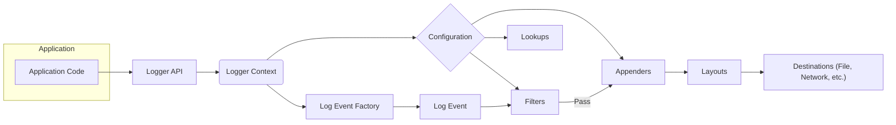
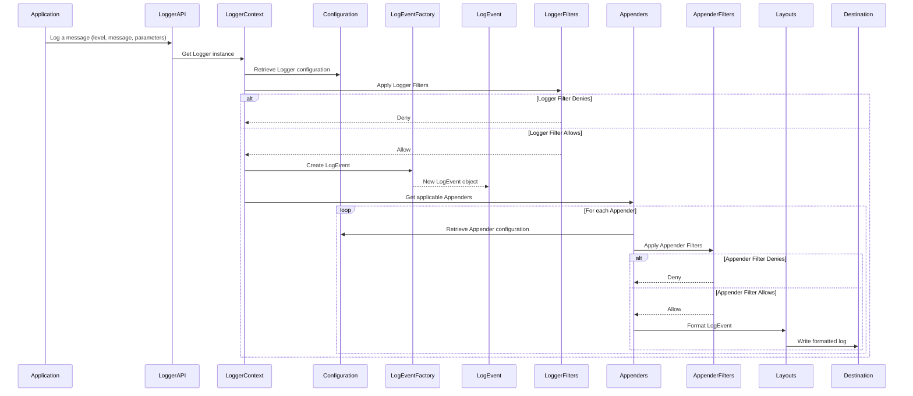

## Project Design Document: Apache Log4j 2 (Improved)

**1. Introduction**

This document provides an enhanced architectural overview of the Apache Log4j 2 project, focusing on details relevant for threat modeling. It describes the key components, their interactions, and the flow of log data within the framework. This document serves as the foundation for identifying potential security vulnerabilities and attack vectors.

**2. Project Overview**

Apache Log4j 2 is a widely adopted, open-source, Java-based logging library. It enables applications to record events and diagnostic information in a flexible and performant manner. Key design goals include reliability, extensibility, and performance, offering features like asynchronous logging, customizable appenders, and sophisticated filtering mechanisms. Understanding its architecture is crucial for identifying potential security weaknesses.

**3. Architectural Overview**

The core of Log4j 2 involves capturing logging events and routing them to various configurable destinations. The following diagram illustrates the high-level architecture and the lifecycle of a log event:

**4. Key Components (Detailed)**

*   **Logger API:** The primary interface for applications to generate log events. Developers use this API to create log messages with specified severity levels (TRACE, DEBUG, INFO, WARN, ERROR, FATAL). The API decouples the application from the underlying logging implementation.
*   **Logger Context:** Manages the hierarchy of Loggers and their associated configurations within an application. It acts as a central registry and provides access to Appenders, Filters, and the overall logging configuration. Each application typically has one or more Logger Contexts.
*   **Configuration:** Defines the behavior of Log4j 2. It specifies:
    *   **Logger Configurations:**  Enabled status and assigned level for specific Loggers or Logger hierarchies.
    *   **Appender Configurations:**  Definitions of Appenders, including their type, destination, and associated Layout and Filters.
    *   **Filter Configurations:** Rules for accepting or denying log events based on various criteria (level, message content, markers, etc.). Filters can be associated with Loggers or Appenders.
    *   **Layout Configurations:**  Specifications for formatting log events before they are written to the destination.
    *   **Lookup Configurations:** Definitions and usage of Lookups for dynamic value substitution.
    Configuration can be loaded from XML, JSON, YAML files, or programmatically.
*   **Log Event Factory:** Responsible for creating `LogEvent` objects. This allows for customization of how log events are instantiated and can be extended to include additional context.
*   **Log Event:** Represents a single logging occurrence. It encapsulates:
    *   **Timestamp:** When the event occurred.
    *   **Level:** Severity of the event (e.g., ERROR, DEBUG).
    *   **Message:** The actual log message (can contain placeholders for parameters).
    *   **Throwable:** Any exception associated with the event.
    *   **Thread Information:** Details about the thread that generated the event.
    *   **Location Information:** Class, method, and line number where the logging call originated (can be expensive to compute).
    *   **Markers:**  Tags for categorizing log events.
    *   **Context Data (MDC/ThreadContext):**  Thread-local key-value pairs that can be included in log messages.
    *   **Nested Diagnostic Context (NDC):** A stack-based context for tracking nested operations.
*   **Appenders:**  Responsible for delivering formatted log events to their destinations. Log4j 2 provides a variety of built-in Appenders:
    *   `FileAppender`: Writes logs to a file, with options for rolling files based on size or time.
    *   `RollingFileAppender`: Extends `FileAppender` with advanced rolling policies.
    *   `ConsoleAppender`: Writes logs to the standard output or error stream.
    *   `JDBCAppender`: Inserts log events into a relational database.
    *   `SocketAppender`: Sends log events over a network socket (TCP or UDP).
    *   `SMTPAppender`: Sends log events via email.
    *   `NoSQL Appenders` (e.g., for MongoDB, Cassandra):  Write logs to NoSQL databases.
    *   Custom Appenders can be created to integrate with other systems.
*   **Layouts:** Format `LogEvent` objects into a specific output format suitable for the destination. Common Layouts include:
    *   `PatternLayout`: Uses a configurable pattern string to format the log message, allowing inclusion of various event attributes.
    *   `JSONLayout`: Formats the log event as a JSON object.
    *   `XMLLayout`: Formats the log event as an XML document.
    *   `CSVLayout`: Formats the log event as comma-separated values.
    Layouts can include Lookups for dynamic content.
*   **Filters:** Allow conditional processing of log events. They can be used to:
    *   **Threshold Filter:** Accepts events with a severity level greater than or equal to the configured level.
    *   **Regex Filter:** Matches log messages against a regular expression.
    *   **Script Filter:** Executes a script (e.g., JavaScript, Groovy) to determine if an event should be processed.
    *   **Dynamic Threshold Filter:**  Filters based on values in the MDC or ThreadContext.
    *   Custom Filters can be implemented to enforce specific logging policies.
*   **Lookups:** Provide a mechanism to dynamically retrieve and insert values into log messages or configuration strings. This includes:
    *   **Environment Lookup:** Accesses environment variables.
    *   **System Properties Lookup:** Accesses Java system properties.
    *   **Jndi Lookup:** Performs JNDI lookups (can be a significant security risk if not carefully controlled).
    *   **Date Lookup:** Inserts the current date and time in a specified format.
    *   **Context Map Lookup:** Retrieves values from the MDC or ThreadContext.
    *   **Interpolator Lookup:** Allows nesting of Lookups.
    *   Custom Lookups can be created to access application-specific data.

**5. Data Flow (Detailed)**

The following sequence diagram illustrates the detailed flow of a log event through Log4j 2, highlighting key decision points and component interactions:

**Detailed Steps:**

1. The application calls a logging method on the `LoggerAPI`, providing the severity level, message (potentially with placeholders), and parameters.
2. The `LoggerAPI` interacts with the `LoggerContext` to obtain the appropriate `Logger` instance based on the application's class or package.
3. The `LoggerContext` consults the `Configuration` to determine if the `Logger` is enabled for the given severity level.
4. **Logger-level Filters** configured for the `Logger` are applied to the potential `LogEvent`. If a filter denies the event, processing stops, and no `LogEvent` is created.
5. If the event passes the Logger-level Filters, the `LoggerContext` uses the `LogEventFactory` to create a `LogEvent` object, populating it with relevant information.
6. The `LoggerContext` identifies the `Appenders` configured for the `Logger`.
7. For each applicable `Appender`:
    *   The `Appender` retrieves its configuration from the `Configuration`.
    *   **Appender-level Filters** configured for the `Appender` are applied to the `LogEvent`. If a filter denies the event for this specific `Appender`, the `Appender` will not process the event.
    *   If the event passes the Appender-level Filters, the `Appender` uses its configured `Layout` to format the `LogEvent` into the desired output format. Lookups within the Layout are resolved at this stage.
    *   The formatted log message is then written to the `Appender`'s designated `Destination`.

**6. Configuration Sources (Detailed)**

Log4j 2 prioritizes configuration sources in the following order:

*   **Programmatic Configuration:** Configuration set directly through the Log4j 2 API takes highest precedence.
*   **Configuration Files:** Log4j 2 searches for configuration files (log4j2.xml, log4j2.json, log4j2.yaml) in the classpath. It also checks for files specified by the `log4j.configurationFile` system property or URI.
*   **Default Configuration:** If no explicit configuration is found, Log4j 2 uses a default configuration that logs errors to the console.

**7. Asynchronous Logging**

Log4j 2 supports asynchronous logging at both the Logger and Appender levels to improve application performance by offloading logging operations to separate threads.

*   **Asynchronous Loggers:** Log events are passed to a disruptor-based queue. A separate thread processes events from the queue and dispatches them to the appropriate Appenders.
*   **Asynchronous Appenders:**  Individual Appenders can be configured to operate asynchronously, buffering events in a queue before writing them to the destination.

**8. Extensibility (Detailed)**

Log4j 2's architecture is highly extensible, allowing developers to create custom components:

*   **Custom Appenders:** Implement the `Appender` interface to write logs to new or specialized destinations.
*   **Custom Layouts:** Implement the `Layout` interface to format log events in unique ways.
*   **Custom Filters:** Implement the `Filter` interface to create specific filtering logic.
*   **Custom Lookups:** Implement the `Lookup` interface to provide new sources of dynamic values for log messages and configuration.
*   **Custom LogEventFactory:** Implement the `LogEventFactory` interface to customize the creation of `LogEvent` objects.

**9. Dependencies**

Log4j 2 has optional dependencies that enable specific features:

*   `SLF4j API`: For applications using the SLF4j facade, Log4j 2 can act as the underlying implementation.
*   `JavaMail API`: Required for the `SMTPAppender`.
*   Connector libraries for various NoSQL databases (e.g., MongoDB, CouchDB).
*   Scripting engines (e.g., JavaScript, Groovy) for `ScriptFilter` and scripting Lookups.

**10. Deployment Considerations**

Log4j 2 is typically deployed as a JAR file included in the application's dependencies. Configuration files are usually placed in the classpath or their location is specified through system properties. Care must be taken to secure configuration files, especially if they contain sensitive information.

**11. Security Considerations (For Threat Modeling)**

This section outlines potential security considerations that should be thoroughly investigated during threat modeling:

*   **JNDI Lookup Vulnerability (Log4Shell):** The `JndiLookup` allows Log4j 2 to perform JNDI lookups, potentially retrieving and executing code from remote servers. This is a critical vulnerability if untrusted data is logged and processed by Log4j 2. Mitigation involves disabling or restricting the use of `JndiLookup`.
*   **Configuration Injection:** If the Log4j 2 configuration is sourced from untrusted data, attackers might be able to inject malicious configurations, such as adding Appenders that exfiltrate data or execute arbitrary code.
*   **Log Injection:** If user-provided data is directly included in log messages without proper sanitization, attackers can inject malicious content that could be interpreted by downstream log processing systems or viewed by administrators. This can lead to log forging or even command injection in vulnerable log analysis tools.
*   **Denial of Service (DoS):**
    *   **Excessive Logging:**  Attackers might trigger excessive logging to consume system resources (CPU, memory, disk space), leading to a DoS.
    *   **Recursive Lookups:**  Maliciously crafted log messages or configurations could trigger recursive Lookup evaluations, leading to stack overflow errors and DoS.
    *   **Asynchronous Logging Queue Exhaustion:**  Flooding the asynchronous logging queue with events could lead to memory exhaustion.
*   **Information Disclosure:**
    *   **Logging Sensitive Data:**  Accidentally logging sensitive information (passwords, API keys, personal data) can expose it to unauthorized access.
    *   **Exposing Internal System Information:**  Default logging configurations might reveal internal system details that could aid attackers.
*   **Dependency Vulnerabilities:**  Vulnerabilities in Log4j 2's dependencies could be exploited. Keeping dependencies up-to-date is crucial.
*   **Custom Component Vulnerabilities:**  If custom Appenders, Layouts, Filters, or Lookups are implemented without proper security considerations, they could introduce new vulnerabilities.
*   **Deserialization Vulnerabilities:**  In certain configurations or with custom components, Log4j 2 might be susceptible to deserialization vulnerabilities if it processes untrusted serialized data.
*   **Exposure of Configuration Details:**  If configuration files are not properly secured, attackers might gain insights into the application's internal workings and potential vulnerabilities.

This improved design document provides a more detailed and security-focused overview of Apache Log4j 2, making it a more effective foundation for subsequent threat modeling activities.
