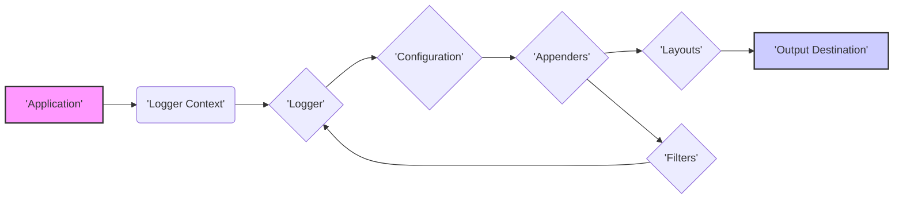
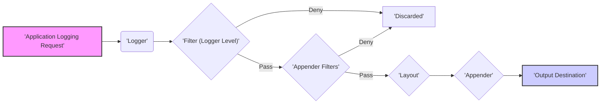

# Project Design Document: Apache Log4j 2

**Version:** 1.1
**Date:** October 26, 2023
**Author:** Gemini (AI Language Model)

## 1. Introduction

This document provides a detailed design overview of the Apache Log4j 2 project, specifically tailored for threat modeling purposes. It outlines the key architectural components, data flows, and functionalities of the logging library, with a strong emphasis on potential security implications. This document will serve as the foundation for identifying and analyzing potential threats and vulnerabilities.

## 2. Goals and Objectives

The primary goals of Apache Log4j 2 are to provide:

* **Reliable and efficient logging:** Ensuring log messages are delivered and processed effectively without significant performance overhead.
* **Flexibility and configurability:** Allowing users to customize logging behavior granularly based on their application's needs and environment.
* **Extensibility:** Enabling developers to extend the library's capabilities with custom appenders, layouts, filters, and lookups.
* **Asynchronous logging:** Improving application responsiveness by offloading logging operations to separate threads.
* **Support for various output destinations:**  Facilitating the writing of logs to diverse targets, including files, databases, network sockets, message queues, and cloud services.

## 3. High-Level Architecture

The following diagram illustrates the high-level architecture of Log4j 2, highlighting the flow of log events:

* **Application:** The software application that integrates and utilizes Log4j 2 for its logging needs. This is the source of log events.
* **Logger Context:**  Manages the hierarchy of Loggers within an application. Each application typically has one or more Logger Contexts.
* **Logger:**  The primary interface for applications to submit log messages. Loggers are obtained by name and are associated with a specific Logger Context.
* **Configuration:** Defines the rules and settings that govern the logging process, including which log messages are processed, where they are sent, and how they are formatted.
* **Appenders:**  Components responsible for delivering log events to a specific destination. Different Appender types handle different output targets.
* **Layouts:**  Format the log event data into a specific structure before it is written by an Appender.
* **Filters:**  Components that decide whether a log event should be processed further based on predefined criteria.
* **Output Destination:** The final target where log messages are stored or transmitted (e.g., a file, a database, a network service).

## 4. Detailed Design

This section provides a detailed breakdown of the key components and their interactions, with a focus on security implications.

### 4.1. Logger

* **Functionality:**
    * Provides methods for logging messages at various severity levels (e.g., TRACE, DEBUG, INFO, WARN, ERROR, FATAL).
    * Determines if a log message should be processed based on its configured logging level and the hierarchy of loggers.
    * Passes log events to the appropriate Appenders after applying relevant Filters.
* **Key Attributes:**
    * Name (used for hierarchical configuration and logger retrieval).
    * Level (the minimum severity level for which messages will be logged).
    * List of associated Appenders.
    * List of associated Filters.
* **Security Considerations:**
    * Improperly configured logging levels might expose sensitive information in lower-level logs (e.g., DEBUG logs in production).
    * The logger name itself doesn't inherently pose a security risk but can be used in configuration to target specific parts of the application.

### 4.2. Logger Context

* **Functionality:**
    * Manages the hierarchy of Loggers, allowing for fine-grained control over logging behavior in different parts of the application.
    * Provides access to Loggers by name.
    * Holds the active Configuration for the logging system.
    * Supports multiple Logger Contexts within the same application, although this is less common.
* **Key Attributes:**
    * Name.
    * Current Configuration.
    * Map of managed Loggers.
* **Security Considerations:**
    * If multiple Logger Contexts are used, ensure consistent and secure configurations across all contexts.
    * Access to modify the Logger Context or its Configuration could lead to manipulation of logging behavior.

### 4.3. Configuration

* **Functionality:**
    * Defines the entire logging behavior, including the setup of Appenders, Layouts, Filters, and Logger-Appender mappings.
    * Can be loaded from various sources:
        * Configuration files (XML, JSON, YAML).
        * Programmatic configuration through Java code.
        * Configuration through system properties or environment variables.
    * Supports runtime reconfiguration, allowing changes to logging behavior without restarting the application.
* **Key Elements:**
    * Appender definitions and configurations.
    * Logger definitions, including their levels and associated Appenders.
    * Root Logger configuration (applied to all loggers without specific configurations).
    * Filter definitions and their application to Loggers or Appenders.
    * Layout definitions and their association with Appenders.
    * Lookup definitions and their configuration.
* **Security Considerations:**
    * **Configuration File Security:** Configuration files may contain sensitive information (e.g., database credentials for `JDBCAppender`). These files must be protected with appropriate file system permissions.
    * **Remote Configuration:** If configuration is loaded from a remote source, ensure secure communication channels (e.g., HTTPS) and proper authentication.
    * **Runtime Reconfiguration:**  The ability to reconfigure at runtime can be misused by attackers if access is not properly controlled.
    * **Injection through Configuration:**  Care must be taken when incorporating external input into configuration values, especially when using Lookups within the configuration itself.

### 4.4. Appenders

* **Functionality:**
    * Responsible for writing formatted log events to a specific destination.
    * Different Appender types support various output targets.
    * Can operate synchronously or asynchronously.
    * May implement buffering or other optimizations.
* **Common Appender Types (with Security Considerations):**
    * `ConsoleAppender`: Writes to the system console. **Security:** May expose sensitive information on the console, which could be accessible to unauthorized users or processes.
    * `FileAppender`: Writes to a file on the local file system. **Security:** Ensure proper file permissions are set to restrict access to log files. Consider the risk of filling up disk space (DoS).
    * `RollingFileAppender`: Extends `FileAppender` with file rotation capabilities. **Security:** Similar file permission concerns as `FileAppender`. Ensure old log files are properly managed and secured.
    * `JDBCAppender`: Writes log events to a database. **Security:** Requires database credentials. Ensure secure storage and management of these credentials. Protect against SQL injection if log message content is directly inserted into queries (parameterized queries should be used).
    * `SocketAppender`: Sends log events over a network socket. **Security:**  Ensure secure communication protocols (e.g., TLS/SSL) are used to protect log data in transit. Validate the destination address to prevent sending logs to unintended targets.
    * `NoSQLAppender` (e.g., for MongoDB, Cassandra): Writes logs to NoSQL databases. **Security:** Requires database credentials and proper authentication. Protect against NoSQL injection vulnerabilities.
    * `KafkaAppender`: Sends log events to a Kafka topic. **Security:** Requires proper authentication and authorization to the Kafka cluster. Ensure secure communication channels.
* **Key Attributes:**
    * Name.
    * Associated Layout.
    * Associated Filters.
    * Destination-specific configuration parameters (e.g., file path, database connection string, socket address).
* **Security Considerations (General):**
    * **Credential Management:** Appenders that interact with external systems (databases, networks) require secure management of credentials.
    * **Data Transmission Security:** Appenders sending data over the network should use secure protocols.
    * **Output Validation:**  While Layouts handle formatting, Appenders should be mindful of potential injection risks if they directly incorporate log message content into output (e.g., in `JDBCAppender` without proper parameterization).
    * **Resource Exhaustion:**  Misconfigured Appenders (e.g., writing to a full disk or overwhelming a network) can lead to denial of service.

### 4.5. Layouts

* **Functionality:**
    * Formats the log event data (message, timestamp, level, etc.) into a specific output format.
    * Common layouts include `PatternLayout`, `JSONLayout`, `XMLLayout`, `CSVLayout`.
    * Allows customization of the output format using patterns or specific configurations.
* **Common Layout Types (with Security Considerations):**
    * `PatternLayout`: Uses a pattern string to define the output format. **Security:** Be cautious when including user-provided data directly in the pattern, as it could potentially be used for log injection attacks if not handled carefully.
    * `JSONLayout`: Formats the output as JSON. **Security:** Ensure proper encoding of log data to prevent injection or formatting issues in downstream systems consuming the JSON.
    * `XMLLayout`: Formats the output as XML. **Security:** Similar encoding concerns as `JSONLayout`. Be aware of potential XML External Entity (XXE) injection risks if external entities are allowed and user-controlled data is included.
    * `CSVLayout`: Formats the output as comma-separated values. **Security:** Ensure proper escaping of values to prevent CSV injection vulnerabilities if the logs are processed by applications that don't handle CSV data securely.
* **Key Attributes:**
    * Name.
    * Pattern string (for `PatternLayout`).
    * Configuration options specific to the layout type (e.g., including/excluding specific fields).
* **Security Considerations (General):**
    * **Log Injection:**  Carefully sanitize or encode log messages before including them in layouts to prevent attackers from injecting malicious content into log streams.
    * **Information Disclosure:**  Avoid including overly verbose or sensitive information in the layout format if it's not necessary.

### 4.6. Filters

* **Functionality:**
    * Decide whether a log event should be processed by an Appender or even by a Logger.
    * Can be associated with Loggers or Appenders.
    * Allow filtering based on various criteria, such as log level, message content, markers, context data (MDC/TCM), and more.
    * Filters can be combined using logical operators (e.g., AND, OR, NOT).
* **Common Filter Types (with Security Considerations):**
    * `ThresholdFilter`: Filters based on the log level. **Security:**  Can be used to prevent sensitive information from being logged at lower levels.
    * `StringMatchFilter`: Filters based on whether the log message contains a specific string. **Security:**  Can be used to filter out potentially malicious or noisy log messages. However, relying solely on string matching might be bypassed with slight variations.
    * `RegexFilter`: Filters based on a regular expression matching the log message. **Security:** Powerful but requires careful construction of regular expressions to avoid performance issues (ReDoS - Regular Expression Denial of Service) or unintended filtering.
    * `MarkerFilter`: Filters based on the presence of a specific marker attached to the log event. **Security:** Can be used to categorize and filter logs based on specific security-related events.
    * `ContextDataFilter`: Filters based on values in the Mapped Diagnostic Context (MDC) or Thread Context Map (TCM). **Security:**  Can be used to filter logs based on user sessions or other contextual information. Ensure the MDC/TCM data itself is not a source of vulnerabilities.
* **Key Attributes:**
    * Filter type.
    * Configuration options specific to the filter type (e.g., the string to match, the regular expression).
    * Result on a match (ACCEPT, DENY, NEUTRAL).
* **Security Considerations (General):**
    * **Bypass Risks:** Ensure filters are robust and cannot be easily bypassed by attackers crafting specific log messages.
    * **Performance Impact:** Complex filters, especially those using regular expressions, can impact logging performance.

### 4.7. Lookups

* **Functionality:**
    * Allow dynamic retrieval of values to be included in log messages or configurations.
    * Accessed using a syntax like `${lookup:key}`.
    * Provide access to various data sources.
* **Common Lookup Types (with Security Considerations):**
    * `env`: Accesses environment variables. **Security:**  Be cautious about logging environment variables, as they may contain sensitive information.
    * `sys`: Accesses system properties. **Security:** Similar concerns as `env`. Avoid logging sensitive system properties.
    * `jndi`: Accesses JNDI resources. **Security:**  **Major Security Risk:** This lookup was the source of the Log4Shell vulnerability (CVE-2021-44228). Unrestricted JNDI lookups can allow attackers to execute arbitrary code by pointing the lookup to a malicious remote server. **This lookup should be carefully restricted or disabled entirely.**
    * `date`: Formats the current date and time. **Security:** Generally safe.
    * `bundle`: Retrieves values from resource bundles. **Security:**  The security depends on the content of the resource bundles.
    * `main`: Accesses arguments passed to the main method. **Security:**  Be cautious about logging command-line arguments, as they may contain sensitive information.
    * `web`: Accesses web-related information in a web application (e.g., request headers). **Security:**  Log carefully, as request headers can contain sensitive data like session IDs or authorization tokens.
    * `docker`: Accesses Docker container information. **Security:**  The security depends on the sensitivity of the Docker metadata being logged.
* **Key Attributes:**
    * Lookup type.
    * Key or configuration specific to the lookup type.
* **Security Considerations (General):**
    * **Injection Vulnerabilities:** Lookups that retrieve data from external sources (especially user-controlled sources) can be exploited for injection attacks if not handled carefully. The Log4Shell vulnerability is a prime example.
    * **Information Disclosure:**  Improperly used lookups can inadvertently log sensitive information.
    * **Code Execution:**  As demonstrated by the JNDI lookup vulnerability, certain lookups can lead to remote code execution.

## 5. Key Data Flows

The primary data flow in Log4j 2 involves a logging request originating from the application and being processed through the logging pipeline:

1. **Application Logging Request:** The application calls a logging method on a `Logger` instance, providing the log message and severity level.
2. **Logger:** The `Logger` receives the log event.
3. **Filter (Logger Level):** The `Logger` checks if the log event's level meets or exceeds the `Logger`'s configured level. If not, the event is discarded.
4. **Appender Filters:** If the event passes the `Logger`'s level filter, it is passed to the associated `Appenders`. Each `Appender` may have its own `Filters`.
5. **Layout:** If the event passes the `Appender`'s filters, it is passed to the `Layout` associated with the `Appender`.
6. **Appender:** The `Layout` formats the log event, and the `Appender` writes the formatted output to the configured `Output Destination`.
7. **Output Destination:** The final destination of the log message (e.g., file, console, network).

## 6. Security Considerations (Summary)

* **Input Validation and Sanitization:**  Crucial for preventing log injection attacks, especially when using Lookups or including user-provided data in log messages.
* **Credential Management:** Securely store and manage credentials for Appenders that interact with external systems.
* **Secure Communication:** Use secure protocols (e.g., TLS/SSL) for network-based Appenders.
* **Access Control:** Restrict access to log files and configuration files.
* **Regular Updates:** Keep Log4j 2 and its dependencies up-to-date to patch known vulnerabilities.
* **Least Privilege:** Run applications with the minimum necessary permissions to reduce the impact of potential compromises.
* **Monitoring and Alerting:** Monitor log output for suspicious activity.
* **Disable Unnecessary Features:** Disable or restrict the use of potentially dangerous features like the JNDI Lookup.

## 7. Deployment Considerations

* Log4j 2 is typically deployed as a library included in the application's dependencies.
* Configuration can be managed through configuration files placed in the classpath, specified programmatically, or through other configuration mechanisms.
* Asynchronous logging can improve performance but introduces complexity in error handling and potential message loss.
* Different Appenders have specific deployment requirements (e.g., database drivers for `JDBCAppender`, network access for `SocketAppender`).

## 8. Assumptions and Constraints

* This document assumes a general understanding of logging concepts and security principles.
* The design described here reflects the core functionalities of Log4j 2. Specific implementations of Appenders, Layouts, and Filters may have their own nuances.
* This document is primarily intended for use in threat modeling and may not cover all aspects of the Log4j 2 project in exhaustive detail.

This improved design document provides a more detailed and security-focused overview of Apache Log4j 2, making it more suitable for threat modeling activities. The explicit inclusion of security considerations for each component and data flow should facilitate a more thorough analysis of potential vulnerabilities.