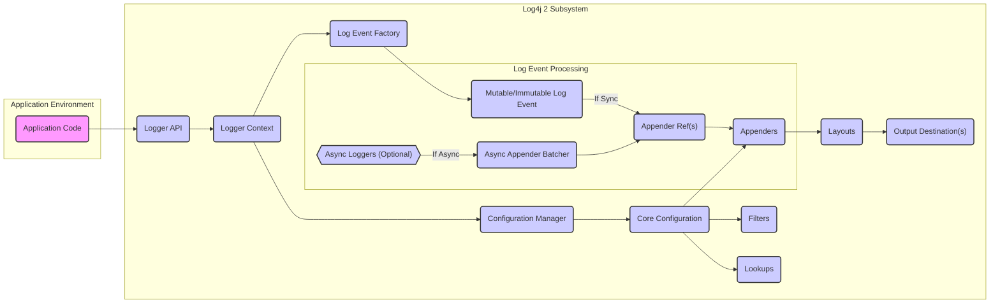

# Project Design Document: Apache Log4j 2

**Version:** 1.1
**Date:** October 26, 2023
**Author:** AI Software Architect

## 1. Introduction

This document provides an enhanced design overview of the Apache Log4j 2 project, focusing on aspects relevant to security threat modeling. It details the key architectural components, data flow, and functionalities of the logging framework, with a particular emphasis on potential security implications. This document serves as a foundational resource for identifying and mitigating potential vulnerabilities within the Log4j 2 ecosystem.

## 2. Goals and Objectives

The primary goals of Log4j 2 are to provide:

* **Reliable and efficient logging:** Ensuring log messages are captured and delivered with minimal performance impact on the application.
* **Flexible and configurable logging:** Allowing granular customization of logging behavior based on application requirements and environments.
* **Extensible architecture:** Providing well-defined interfaces for developers to extend the framework with custom appenders, layouts, filters, and lookups.
* **Asynchronous logging capabilities:** Supporting asynchronous operations to prevent logging from becoming a bottleneck in high-throughput applications.
* **Versatile output destinations:** Enabling logging to a wide range of targets, including files, databases, network services, and message queues.

## 3. System Architecture

The following diagram illustrates the high-level architecture of Log4j 2, emphasizing the flow of log events:

## 4. Data Flow and Processing

The lifecycle of a log event within Log4j 2 involves the following stages:

* **Initiation:** The application code invokes a logging method on a `Logger` instance (e.g., `logger.info("User logged in: {}")`, userId).
* **API Interaction:** The call is handled by the Log4j 2 Logger API.
* **Context Retrieval:** The API accesses the appropriate `LoggerContext`, which manages the logging configuration for the application.
* **Configuration Management:** The `ConfigurationManager` is responsible for loading, parsing, and managing the logging configuration.
* **Filter Evaluation (Pre-Appender):**  Filters configured at the logger level are evaluated to determine if the log event should proceed.
* **Log Event Creation:** A `LogEvent` object is created by the `Log Event Factory`. This object encapsulates all relevant information about the logging event, including the message, log level, timestamp, thread details, source information, and any associated exception. The event can be mutable or immutable depending on configuration.
* **Asynchronous Logging (Optional):**
    * If asynchronous logging is enabled for the logger, the `LogEvent` is passed to an `AsyncLogger`.
    * `AsyncLogger`s typically use a high-performance queue (like the LMAX Disruptor) to decouple the logging thread from the appender threads.
    * An `AsyncAppenderBatcher` consumes events from the queue and dispatches them to the appropriate appenders.
* **Synchronous Logging:**
    * If asynchronous logging is not enabled, the `LogEvent` is processed synchronously on the logging thread.
* **Appender Invocation:** The `LogEvent` is passed to the configured `Appender` instances associated with the logger. This is often done via `AppenderRef` elements in the configuration.
* **Filter Evaluation (Appender Level):** Filters configured at the appender level are evaluated.
* **Lookup Processing:** Before formatting, the log message (and potentially other parts of the log event) may undergo processing by `Lookup`s. Lookups allow dynamic values to be inserted into log messages or configuration elements. This is a powerful feature but also a potential security risk if not carefully managed.
* **Layout Formatting:** The `Appender` uses a configured `Layout` to format the `LogEvent` into the desired output format (e.g., plain text, JSON, XML).
* **Output:** The formatted log message is written to the destination managed by the `Appender` (e.g., file, console, database, network socket).

## 5. Key Components

This section provides a more detailed look at the core components of Log4j 2:

* **Logger API:** The primary interface for application code to submit log messages. It offers methods corresponding to different logging levels (TRACE, DEBUG, INFO, WARN, ERROR, FATAL).
* **Logger Context:**  Manages the hierarchy of `Logger` instances within an application. Each application typically has a single `LoggerContext`.
* **Configuration Manager:** Responsible for loading, parsing, and managing the logging configuration. It supports various configuration sources.
    * **Configuration Files:** XML (`.xml`), JSON (`.json`), and YAML (`.yaml`, `.yml`) files are commonly used. The configuration defines loggers, appenders, layouts, filters, and other settings.
    * **Programmatic Configuration:** Configuration can be built and applied programmatically using the Log4j 2 API.
    * **Default Configuration:** If no explicit configuration is found, Log4j 2 uses a default configuration.
    * **Configuration Builders:** A fluent API for constructing configurations programmatically.
* **Core Configuration:** Represents the parsed and active logging configuration, containing definitions for loggers, appenders, layouts, filters, and lookups.
* **Appenders:** Components responsible for writing log events to various destinations. Examples include:
    * `FileAppender`: Writes logs to a file, with options for rolling files based on size or time.
    * `ConsoleAppender`: Writes logs to the standard output or standard error stream.
    * `JDBCAppender`: Writes log events to a relational database.
    * `SocketAppender`: Sends log events over a network socket (TCP or UDP).
    * `NoSQLAppenders` (e.g., `MongoDbAppender`, `CassandraAppender`): Write logs to NoSQL databases.
    * `KafkaAppender`: Sends log events to an Apache Kafka topic.
    * `SMTPAppender`: Sends log events via email.
* **Layouts:** Format `LogEvent` objects into a specific output format suitable for the target destination.
    * `PatternLayout`: Uses a configurable pattern string to format log messages. This is highly flexible but can be complex and potentially vulnerable if user-controlled data is incorporated without proper sanitization.
    * `JSONLayout`: Formats log events as JSON objects.
    * `XMLLayout`: Formats log events as XML documents.
    * `CSVLayout`: Formats log events as comma-separated values.
* **Filters:** Allow conditional processing of log events, either at the logger level (before reaching appenders) or at the appender level.
    * `ThresholdFilter`: Filters based on the log level.
    * `RegexFilter`: Filters based on regular expressions matching the log message or other event attributes.
    * `ScriptFilter`: Allows filtering based on the result of an executable script.
    * `DynamicThresholdFilter`: Filters based on values in the `LogEvent` context.
* **Lookups:** Enable the dynamic retrieval and insertion of values into log messages and configuration elements. This is a powerful feature but also a significant potential security risk if not carefully controlled, as demonstrated by the historical JNDI Lookup vulnerability. Examples include:
    * `JndiLookup`: Performs JNDI lookups.
    * `DateLookup`: Inserts the current date and time.
    * `EnvironmentLookup`: Retrieves environment variables.
    * `SystemPropertiesLookup`: Retrieves system properties.
    * `Interpolator`: Allows combining multiple lookups.
* **Log Event Factory:** Creates `LogEvent` objects. Implementations can create mutable or immutable events.
* **Log Event:** Represents a single logging event, containing all the information associated with it.
* **Async Loggers:** Implement asynchronous logging, improving performance by decoupling the logging thread from the appender threads.
* **Appender Ref:**  A reference within a logger configuration that links the logger to one or more appenders.

## 6. Configuration Mechanisms (Detailed)

Log4j 2 offers several ways to configure its behavior, each with its own security implications:

* **Configuration Files (XML, JSON, YAML):**
    * These files are typically loaded from the classpath or a specified location.
    * **Security Consideration:** Ensure these files are protected from unauthorized modification, as malicious changes could redirect logs or expose sensitive information.
    * **Security Consideration:** Be cautious about including sensitive information directly in configuration files. Consider using environment variables or secure configuration management solutions.
* **Programmatic Configuration:**
    * Allows for dynamic configuration during application startup.
    * **Security Consideration:** Ensure that programmatic configuration logic is secure and does not introduce vulnerabilities.
* **Default Configuration:**
    * Used if no explicit configuration is provided. Typically logs to the console.
    * **Security Consideration:** While convenient, the default configuration might not be suitable for production environments and could expose information unintentionally.
* **Configuration Builders:**
    * A fluent API for programmatically constructing configurations.
    * **Security Consideration:** Similar to programmatic configuration, ensure the builder logic is secure.
* **Plugin System:**
    * Allows developers to create custom appenders, layouts, filters, lookups, and other components.
    * **Security Consideration:** Custom plugins represent a significant potential attack surface. Ensure that custom plugins are developed with security in mind and undergo thorough security reviews. Malicious plugins could perform arbitrary actions.

## 7. Deployment Considerations

Log4j 2 is typically deployed as a library included in an application's dependencies.

* **JAR Files:** The core functionality is provided by `log4j-core.jar` and the API by `log4j-api.jar`.
* **Configuration Location:** Configuration files are usually placed on the classpath or their location is specified through system properties or environment variables.
* **Security Consideration:** Ensure the integrity of the Log4j 2 JAR files to prevent the use of compromised versions. Use dependency management tools to manage and verify dependencies.
* **Security Consideration:** Restrict access to the directories where configuration files are stored.

## 8. Security Considerations (Detailed for Threat Modeling)

This section expands on potential security concerns, providing more specific examples relevant to threat modeling:

* **Configuration Vulnerabilities:**
    * **Information Disclosure:** Misconfigured appenders (e.g., `FileAppender` with world-readable permissions) or layouts that include sensitive data without redaction can lead to information disclosure.
    * **Log Injection:** If user-controlled data is directly included in log messages without proper sanitization, attackers might be able to inject malicious content that could be interpreted by log analysis tools or other systems consuming the logs.
    * **Denial of Service (DoS):**  Configuration that leads to excessive logging or writing to slow destinations can cause performance degradation or DoS.
* **Input Validation and Lookups:**
    * **Remote Code Execution (RCE) via Lookups (Historical):** The JNDI Lookup vulnerability (CVE-2021-44228) demonstrated how uncontrolled data in log messages, when processed by the `JndiLookup`, could lead to RCE. This highlights the critical need to sanitize or disable potentially dangerous lookups when handling untrusted input.
    * **Other Lookup Exploitation:**  Other lookups (e.g., `ScriptLookup`, `URL Lookup` if available through custom plugins) could also be exploited if they process untrusted data.
* **Dependency Vulnerabilities:**
    * Log4j 2 depends on other libraries. Vulnerabilities in these dependencies could be exploited. Regularly update Log4j 2 and its dependencies to mitigate this risk.
* **Custom Plugin Vulnerabilities:**
    * **Arbitrary Code Execution:** Malicious or poorly written custom appenders, layouts, or filters could execute arbitrary code on the server.
    * **Resource Exhaustion:** Custom plugins might have bugs that lead to resource leaks or excessive resource consumption.
* **Deserialization Issues:**
    * While less common in the core Log4j 2 functionality, custom components or specific configuration mechanisms might involve deserialization of data. If not handled securely, this could lead to deserialization vulnerabilities.
* **Network Appender Security:**
    * **Man-in-the-Middle (MITM) Attacks:** Appenders that send logs over the network (e.g., `SocketAppender`, `KafkaAppender`) are susceptible to MITM attacks if not secured with encryption (e.g., TLS/SSL).
    * **Unauthorized Access:** Ensure that network destinations for log data are properly secured to prevent unauthorized access.
* **Sensitive Data in Logs:**
    * Avoid logging sensitive information (e.g., passwords, API keys, personal data) directly in log messages. If necessary, implement redaction or masking techniques.

## 9. Assumptions and Constraints

* This document describes the general architecture and common configurations of Log4j 2. Specific implementations of appenders, layouts, and filters may have their own internal designs and security considerations.
* The focus is on aspects relevant to security threat modeling and does not cover every possible configuration option or plugin.
* It is assumed that threat modeling will be performed by individuals with a strong understanding of application security principles.

## 10. Future Considerations

* Continuously monitor for new vulnerabilities reported against Log4j 2 and its dependencies.
* Encourage the use of secure coding practices for custom plugin development.
* Promote the use of secure configuration management techniques.
* Investigate and document best practices for mitigating risks associated with different appenders and layouts.
* Provide guidance on securely handling user-controlled data within log messages.

This improved design document provides a more detailed and security-focused overview of Apache Log4j 2, making it a more effective resource for threat modeling activities.