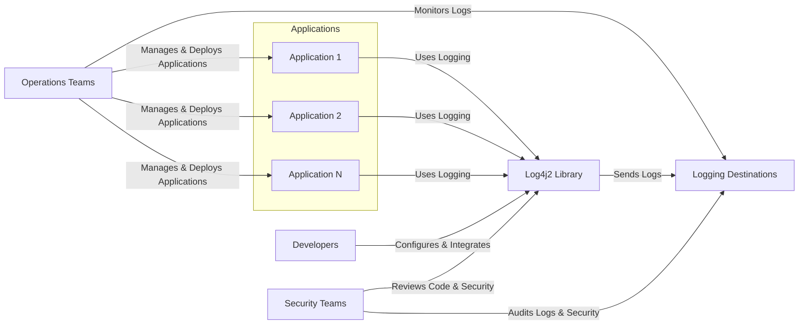

# BUSINESS POSTURE

The Apache Log4j2 project is a widely used Java logging library. Its primary business priority is to provide a reliable, performant, and flexible logging framework for Java applications. The goal is to enable developers to efficiently manage and analyze application logs, which are crucial for monitoring, debugging, security auditing, and operational intelligence.

Key business priorities for Log4j2 are:
- Reliability: Ensuring the library functions correctly and consistently under various conditions.
- Performance: Minimizing the overhead introduced by logging on application performance.
- Flexibility: Supporting diverse logging configurations, formats, and destinations.
- Community Support: Maintaining a strong and active community for contributions, bug fixes, and feature enhancements.
- Wide Adoption: Being a preferred logging solution for Java developers across different industries and project sizes.

Most important business risks that need to be addressed:
- Security Vulnerabilities: Flaws in the library that could be exploited to compromise applications using Log4j2. This is the most critical risk due to the widespread adoption of Log4j2 and the potential impact of vulnerabilities.
- Performance Issues: Inefficiencies in the logging process that could degrade application performance, especially under heavy load.
- Compatibility Problems: Issues arising from changes in Log4j2 that break compatibility with existing applications or frameworks.
- Supply Chain Risks: Compromises in the build or distribution process that could introduce malicious code into the Log4j2 library.
- Lack of Maintenance: Insufficient resources or community support to address bugs, security issues, or feature requests, leading to stagnation and decline in adoption.

# SECURITY POSTURE

Existing security controls:
- security control: Open Source Development: The project is developed in the open, allowing for community review and scrutiny of the codebase. Implemented on GitHub.
- security control: Community Review: A large community of developers and security researchers can potentially identify and report vulnerabilities. Implemented through GitHub and mailing lists.
- security control: Version Control: Using Git for version control allows for tracking changes, reverting to previous versions, and auditing code history. Implemented on GitHub.
- security control: Build Automation: Using Maven for build automation ensures consistent builds and reduces the risk of manual errors. Implemented using Apache Maven.
- security control: Dependency Management: Maven also manages dependencies, allowing for tracking and updating of external libraries. Implemented using Apache Maven.
- security control: Vulnerability Reporting Process:  The Apache Software Foundation has a process for reporting and handling security vulnerabilities. Described on Apache Security website.

Accepted risks:
- accepted risk: Open Source Vulnerabilities:  Despite community review, vulnerabilities can still be present in open source software and may be discovered after widespread adoption.
- accepted risk: Dependency Vulnerabilities: Log4j2 relies on other libraries, which may contain vulnerabilities that could indirectly affect Log4j2 users.
- accepted risk: Configuration Errors: Incorrect or insecure configurations by users can lead to security issues even if Log4j2 itself is secure.

Recommended security controls:
- security control: Static Application Security Testing (SAST): Implement automated SAST tools in the build pipeline to identify potential security vulnerabilities in the codebase.
- security control: Dependency Scanning: Integrate dependency scanning tools to identify known vulnerabilities in third-party libraries used by Log4j2.
- security control: Fuzzing: Perform fuzz testing to discover unexpected behavior and potential vulnerabilities by providing invalid or malformed inputs.
- security control: Security Code Reviews: Conduct regular security-focused code reviews by experienced security engineers.
- security control: Security Training for Developers: Provide security training to developers to promote secure coding practices.
- security control: Incident Response Plan: Develop and maintain an incident response plan specifically for security vulnerabilities in Log4j2.

Security requirements:
- Authentication: Not directly applicable to a logging library itself. Authentication is handled by the applications using Log4j2. However, if Log4j2 were to expose management interfaces or logging endpoints, authentication would be a requirement.
- Authorization: Similar to authentication, authorization is primarily the responsibility of the applications using Log4j2. Log4j2 itself might need authorization controls if it provides features like remote configuration or logging destinations that require access control.
- Input Validation: Critical for Log4j2. Logged messages and configuration inputs must be carefully validated to prevent injection attacks (e.g., Log Injection, Command Injection). Input validation should be implemented throughout the library, especially when processing user-provided data or external configuration sources.
- Cryptography:  Relevant for secure logging. Log4j2 should support encryption of log data in transit and at rest if required by users. This includes supporting secure protocols for sending logs to remote destinations and potentially encrypting log files.  Also, secure handling of cryptographic keys and sensitive configuration data within Log4j2 is important.

# DESIGN

## C4 CONTEXT



Context Diagram Elements:

- Context Diagram Element 1
  - Name: Applications
  - Type: System
  - Description: Various Java applications that utilize the Log4j2 library for logging purposes. These applications can range from web servers and microservices to desktop applications and embedded systems.
  - Responsibilities: Generate log messages using the Log4j2 API. Configure Log4j2 according to their specific logging needs.
  - Security controls: security control: Input validation of data before logging to prevent injection attacks. security control: Secure configuration management for Log4j2 settings.

- Context Diagram Element 2
  - Name: Log4j2 Library
  - Type: System
  - Description: The Apache Log4j2 logging library itself. It provides the core logging functionality, including API for logging messages, configuration management, and routing logs to various destinations.
  - Responsibilities: Receive log messages from applications. Process and format log messages. Route log messages to configured destinations. Manage logging configuration.
  - Security controls: security control: Input validation of log messages and configuration data. security control: Secure handling of sensitive configuration data (e.g., credentials). security control: Implementation of secure logging mechanisms (e.g., encryption).

- Context Diagram Element 3
  - Name: Developers
  - Type: Person
  - Description: Software developers who integrate Log4j2 into their applications. They are responsible for using the Log4j2 API correctly and configuring it appropriately.
  - Responsibilities: Integrate Log4j2 into applications. Configure Log4j2 for specific application needs. Develop custom Log4j2 plugins if required.
  - Security controls: security control: Secure coding practices when using Log4j2 API. security control: Following security guidelines for Log4j2 configuration.

- Context Diagram Element 4
  - Name: Operations Teams
  - Type: Person
  - Description: Operations teams responsible for deploying, managing, and monitoring applications that use Log4j2. They rely on logs for operational insights and troubleshooting.
  - Responsibilities: Deploy and manage applications using Log4j2. Monitor application logs for operational issues. Configure logging infrastructure.
  - Security controls: security control: Secure configuration of logging infrastructure. security control: Access control to log data. security control: Monitoring logs for security events.

- Context Diagram Element 5
  - Name: Security Teams
  - Type: Person
  - Description: Security teams responsible for ensuring the security of applications and infrastructure. They use logs for security monitoring, incident detection, and security audits.
  - Responsibilities: Review Log4j2 codebase and configurations for security vulnerabilities. Monitor logs for security incidents. Conduct security audits of applications using Log4j2.
  - Security controls: security control: Security code reviews of Log4j2. security control: Vulnerability scanning of Log4j2 and applications using it. security control: Security incident monitoring and response related to Log4j2.

- Context Diagram Element 6
  - Name: Logging Destinations
  - Type: System
  - Description: Various systems where Log4j2 sends log messages. These can include files, databases, consoles, network services (e.g., syslog, cloud logging services), and message queues.
  - Responsibilities: Receive and store log messages from Log4j2. Provide interfaces for accessing and analyzing log data.
  - Security controls: security control: Access control to log data. security control: Encryption of log data at rest and in transit. security control: Secure configuration of logging destinations. security control: Audit logging of access to log data.

## C4 CONTAINER

```mermaid
graph LR
    subgraph "Applications"
        A[Application Process]
    end
    subgraph "Log4j2 Library"
        B[Log4j2 Core Container]
        C[Log4j2 API Container]
        D[Configuration Container]
        E[Plugins Container]
    end
    F[Logging Destinations]

    A -->|Uses API calls| C
    A -->|Runtime Dependency| B
    B -->|Reads Configuration| D
    B -->|Loads Plugins| E
    B -->|Sends Logs| F
    C -->|Implementation in| B
    D -->|Configuration Files (XML, JSON, YAML, Properties)|
    E -->|Custom Appenders, Layouts, Filters, Lookups|
```

Container Diagram Elements:

- Container Diagram Element 1
  - Name: Application Process
  - Type: Container
  - Description: Represents the runtime environment of an application that uses Log4j2. This is where the application code executes and interacts with the Log4j2 library.
  - Responsibilities: Execute application logic. Instantiate and use Log4j2 Logger objects. Provide runtime environment for Log4j2.
  - Security controls: security control: Application-level security controls (authentication, authorization, input validation). security control: Secure runtime environment configuration.

- Container Diagram Element 2
  - Name: Log4j2 Core Container
  - Type: Container
  - Description: The core implementation of the Log4j2 library. It handles log message processing, routing, and interaction with configuration and plugins. Implemented in Java.
  - Responsibilities: Core logging logic. Configuration management. Plugin management. Routing logs to destinations.
  - Security controls: security control: Input validation within core logic. security control: Secure plugin loading and execution. security control: Secure handling of configuration data.

- Container Diagram Element 3
  - Name: Log4j2 API Container
  - Type: Container
  - Description: The public API of Log4j2 that applications use to interact with the logging framework. Defines interfaces and classes for logging messages. Implemented in Java interfaces and classes.
  - Responsibilities: Provide a stable and well-defined API for applications. Abstract away the internal implementation details of Log4j2.
  - Security controls: security control: API design to encourage secure usage. security control: Documentation and guidance on secure API usage.

- Container Diagram Element 4
  - Name: Configuration Container
  - Type: Container
  - Description: Handles the loading, parsing, and management of Log4j2 configuration. Supports various configuration formats (XML, JSON, YAML, Properties). Implemented in Java.
  - Responsibilities: Load configuration from files or programmatically. Parse configuration data. Provide configuration data to the Core Container.
  - Security controls: security control: Secure parsing of configuration files to prevent injection attacks. security control: Validation of configuration data. security control: Secure storage and access to configuration files.

- Container Diagram Element 5
  - Name: Plugins Container
  - Type: Container
  - Description: Manages Log4j2 plugins, such as Appenders, Layouts, Filters, and Lookups. Allows extending Log4j2 functionality. Implemented in Java with plugin mechanism.
  - Responsibilities: Load and manage plugins. Provide plugin extension points. Ensure plugin compatibility.
  - Security controls: security control: Secure plugin loading mechanism to prevent malicious plugins. security control: Plugin validation and sandboxing (if feasible). security control: Documentation and guidelines for secure plugin development.

- Container Diagram Element 6
  - Name: Logging Destinations
  - Type: External System
  - Description: External systems where Log4j2 sends logs. Examples include file systems, databases, network services, cloud logging platforms.
  - Responsibilities: Receive and store log messages. Provide access to log data.
  - Security controls: security control: Destination-specific security controls (e.g., access control, encryption, network security). security control: Secure communication protocols for network destinations.

## DEPLOYMENT

Log4j2 is a library and is deployed as part of the applications that use it. The deployment architecture of Log4j2 is therefore dependent on the deployment architecture of the applications.  Possible deployment scenarios include:

- Virtual Machines: Applications and Log4j2 deployed on virtual machines in a data center or cloud environment.
- Containerized Environments (e.g., Docker, Kubernetes): Applications and Log4j2 packaged in containers and deployed in container orchestration platforms.
- Serverless Environments (e.g., AWS Lambda, Azure Functions): Applications and Log4j2 deployed as serverless functions.
- On-Premise Servers: Applications and Log4j2 deployed on physical servers in an on-premise data center.

Let's consider a common deployment scenario: Containerized Environment (Kubernetes).

```mermaid
graph LR
    subgraph "Kubernetes Cluster"
        subgraph "Nodes"
            subgraph "Node 1"
                A[Pod: Application 1]
            end
            subgraph "Node 2"
                B[Pod: Application 2]
            end
        end
        C[Logging Service (e.g., Elasticsearch, Loki)]
    end

    D[Log4j2 Library (within Pods)]

    A -->|Uses Logging| D
    B -->|Uses Logging| D
    D -->|Sends Logs| C
```

Deployment Diagram Elements (Containerized Environment - Kubernetes):

- Deployment Diagram Element 1
  - Name: Kubernetes Cluster
  - Type: Environment
  - Description: A Kubernetes cluster providing the container orchestration platform for deploying and managing applications.
  - Responsibilities: Orchestrate container deployment and management. Provide networking and storage infrastructure.
  - Security controls: security control: Kubernetes RBAC for access control. security control: Network policies for network segmentation. security control: Security audits of Kubernetes configurations. security control: Container image security scanning.

- Deployment Diagram Element 2
  - Name: Nodes
  - Type: Infrastructure
  - Description: Worker nodes in the Kubernetes cluster where application pods are deployed.
  - Responsibilities: Run container workloads. Provide compute resources.
  - Security controls: security control: Operating system hardening. security control: Security monitoring on nodes. security control: Regular patching of nodes.

- Deployment Diagram Element 3
  - Name: Pod: Application 1 & 2
  - Type: Container
  - Description: Kubernetes pods containing instances of applications that use Log4j2. Each pod encapsulates one or more application containers and the Log4j2 library.
  - Responsibilities: Run application code. Utilize Log4j2 for logging.
  - Security controls: security control: Container security best practices. security control: Least privilege for container processes. security control: Resource limits for containers. security control: Application-level security controls within containers.

- Deployment Diagram Element 4
  - Name: Log4j2 Library (within Pods)
  - Type: Software
  - Description: Instances of the Log4j2 library embedded within each application pod.
  - Responsibilities: Provide logging functionality within the application pods.
  - Security controls: security control: Inherits security controls from the application and container environment.

- Deployment Diagram Element 5
  - Name: Logging Service (e.g., Elasticsearch, Loki)
  - Type: System
  - Description: An external logging service used to aggregate, store, and analyze logs from applications. Examples include Elasticsearch, Loki, Splunk, cloud-based logging services.
  - Responsibilities: Aggregate logs from multiple sources. Store and index log data. Provide query and analysis capabilities for logs.
  - Security controls: security control: Access control to logging service. security control: Encryption of log data at rest and in transit within the logging service. security control: Audit logging of access to log data within the logging service. security control: Secure configuration of the logging service.

## BUILD

```mermaid
graph LR
    A[Developer] -->|Code Changes, Commit, Push| B(GitHub Repository);
    B -->|Webhook, Trigger| C{CI/CD Pipeline (GitHub Actions)};
    C -->|Checkout Code, Build, Test, SAST, Dependency Scan| D[Build Environment];
    D -->|Build Artifacts (JARs)| E[Artifact Repository (Maven Central)];
    E -->|Download Dependency| F[Application Build Process];
    F -->|Include Log4j2 JAR| G[Application Artifact];
```

Build Process Diagram Elements:

- Build Process Element 1
  - Name: Developer
  - Type: Person
  - Description: Software developers who contribute code to the Log4j2 project.
  - Responsibilities: Write code, commit changes, and push to the GitHub repository.
  - Security controls: security control: Developer workstations security. security control: Code review process. security control: Secure coding practices. security control: Access control to the GitHub repository.

- Build Process Element 2
  - Name: GitHub Repository
  - Type: System
  - Description: The source code repository for the Log4j2 project hosted on GitHub.
  - Responsibilities: Store source code, track changes, manage versions.
  - Security controls: security control: Access control to the repository (GitHub permissions). security control: Audit logging of repository access and changes. security control: Branch protection rules.

- Build Process Element 3
  - Name: CI/CD Pipeline (GitHub Actions)
  - Type: System
  - Description: Automated CI/CD pipeline using GitHub Actions to build, test, and publish Log4j2.
  - Responsibilities: Automate build process. Run tests. Perform security checks (SAST, dependency scanning). Publish build artifacts.
  - Security controls: security control: Secure configuration of CI/CD pipeline. security control: Access control to CI/CD pipeline configurations and secrets. security control: Security scanning tools integration (SAST, dependency scanning). security control: Build environment security hardening.

- Build Process Element 4
  - Name: Build Environment
  - Type: Environment
  - Description: The environment where the Log4j2 build process is executed, typically within GitHub Actions runners.
  - Responsibilities: Provide environment for building and testing Log4j2. Execute build scripts and security checks.
  - Security controls: security control: Hardened build environment. security control: Regularly updated build tools and dependencies. security control: Isolation of build environments.

- Build Process Element 5
  - Name: Artifact Repository (Maven Central)
  - Type: System
  - Description: Maven Central repository where Log4j2 JAR files are published and distributed.
  - Responsibilities: Host and distribute Log4j2 JAR artifacts. Provide versioning and dependency management.
  - Security controls: security control: Secure artifact publishing process. security control: Integrity checks for published artifacts (signatures, checksums). security control: Access control to publishing process.

- Build Process Element 6
  - Name: Application Build Process
  - Type: Process
  - Description: The build process of applications that depend on Log4j2.
  - Responsibilities: Build applications. Download Log4j2 JARs as dependencies from Maven Central. Package Log4j2 JARs with application artifacts.
  - Security controls: security control: Dependency management practices. security control: Verification of downloaded dependencies (checksums, signatures).

- Build Process Element 7
  - Name: Build Artifacts (JARs)
  - Type: Software
  - Description: JAR files produced by the Log4j2 build process, containing the compiled Log4j2 library.
  - Responsibilities: Contain the compiled Log4j2 library. Be distributed to users via Maven Central.
  - Security controls: security control: Signed JAR files to ensure integrity and authenticity. security control: Regular security scanning of build artifacts.

# RISK ASSESSMENT

Critical business process we are trying to protect:
- Application Logging and Monitoring:  Reliable and secure logging is critical for application monitoring, debugging, security incident detection, and compliance.  Disruption or compromise of logging can severely impact operations and security posture.

Data we are trying to protect and their sensitivity:
- Log Data: Log data can contain sensitive information depending on what is logged by applications. This can include:
    - Personally Identifiable Information (PII): Usernames, IP addresses, email addresses, session IDs, etc.
    - Application Secrets: API keys, passwords (if logged incorrectly), internal system details.
    - Business Sensitive Data: Transaction details, financial information, confidential business logic.
    - Operational Data: System performance metrics, error messages, debugging information.

Sensitivity of log data varies greatly depending on the application and the specific data being logged.  It can range from low sensitivity (e.g., basic application events) to high sensitivity (e.g., logs containing PII or financial data).  The potential impact of unauthorized access, modification, or loss of log data can include:
- Privacy breaches and regulatory non-compliance.
- Security incidents going undetected.
- Loss of business intelligence and operational insights.
- Reputational damage.

# QUESTIONS & ASSUMPTIONS

Questions:
- What are the specific compliance requirements for applications using Log4j2 (e.g., GDPR, HIPAA, PCI DSS)? This will influence the required security controls for logging and log data protection.
- What are the typical logging destinations used by applications relying on Log4j2? Understanding the destinations will help assess the security risks associated with log storage and transmission.
- Are there specific performance requirements for logging in typical use cases? Performance considerations might influence the choice of security controls, especially those that add overhead.
- What is the expected threat model for applications using Log4j2? Understanding the threat model will help prioritize security controls and risk mitigation strategies.

Assumptions:
- Log4j2 is intended to be used in a wide variety of Java applications, with varying security requirements.
- Security is a high priority for the Log4j2 project, given its widespread use and potential impact of vulnerabilities.
- Users of Log4j2 are responsible for configuring and using the library securely within their applications and environments.
- The Apache Software Foundation provides a reasonable level of security oversight and vulnerability management for the Log4j2 project.
- The build and release process for Log4j2 aims to ensure the integrity and authenticity of distributed artifacts.