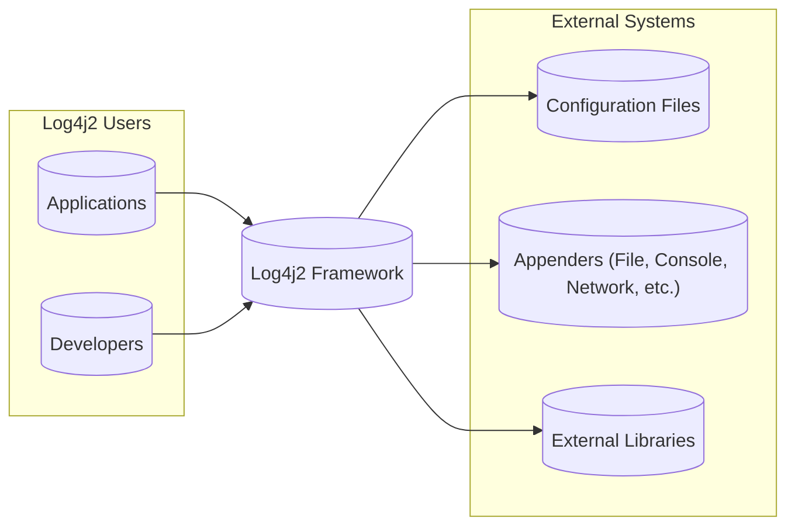
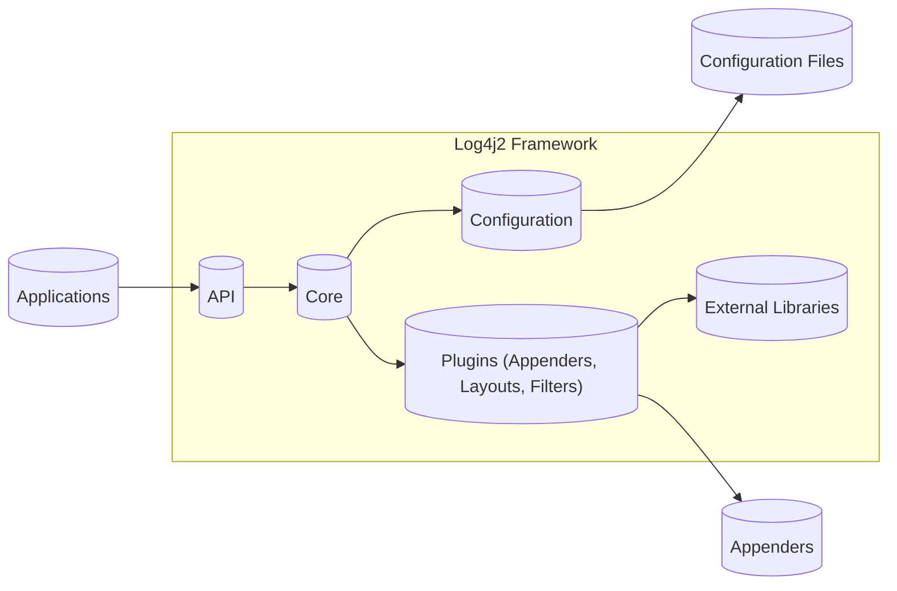
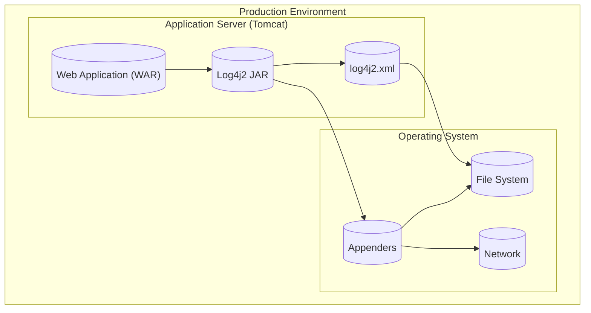
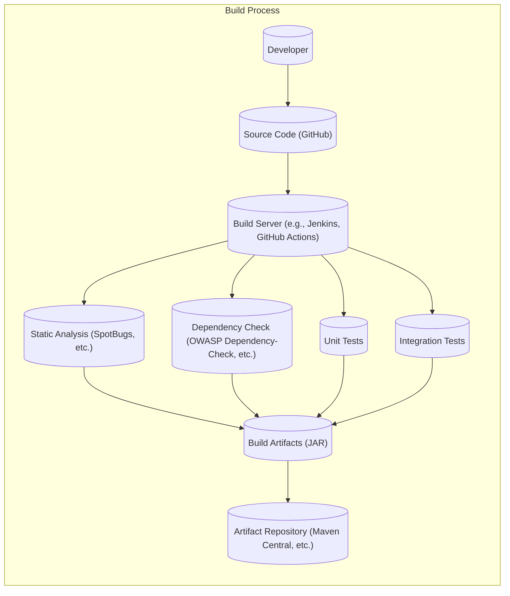

# BUSINESS POSTURE

Business Priorities and Goals:

*   Provide a robust, fast, and reliable logging framework for Java applications.
*   Maintain backward compatibility with existing logging configurations and APIs where possible.
*   Offer flexible configuration options to suit various deployment environments and logging needs.
*   Support a wide range of logging destinations (appenders) and formats (layouts).
*   Enable asynchronous logging to minimize performance impact on applications.
*   Provide extensibility points for custom components (plugins).
*   Ensure the framework itself is secure and does not introduce vulnerabilities into applications.
*   Maintain an active and responsive open-source community.

Most Important Business Risks:

*   Security vulnerabilities within the logging framework that could be exploited to compromise applications or systems. (e.g., remote code execution, denial of service).
*   Performance bottlenecks in the logging framework that could negatively impact application performance.
*   Compatibility issues with different Java versions, application servers, or other libraries.
*   Complexity of configuration that could lead to misconfigurations and logging failures.
*   Lack of support for specific logging needs or integrations.
*   Reputational damage due to security incidents or major bugs.

# SECURITY POSTURE

Existing Security Controls:

*   security control: Secure development practices, including code reviews, static analysis (as evident from the project's use of tools like FindBugs/SpotBugs, though specific configurations need verification). Implemented in development process.
*   security control: Input validation and sanitization in configuration parsing and message processing (though the extent and effectiveness need detailed review). Implemented in code.
*   security control: Use of dependency management tools to track and update third-party libraries (Maven). Implemented in build process.
*   security control: Regular releases and updates to address bug fixes and security vulnerabilities. Implemented in release process.
*   security control: Community involvement in identifying and reporting issues. Implemented in community engagement.

Accepted Risks:

*   accepted risk: Reliance on third-party libraries, which may introduce their own vulnerabilities.
*   accepted risk: Potential for misconfiguration by users, leading to logging failures or information disclosure (though the framework should strive to minimize this risk through secure defaults and clear documentation).
*   accepted risk: Complexity of the codebase, which increases the risk of undiscovered vulnerabilities.

Recommended Security Controls:

*   security control: Implement a comprehensive security fuzzing strategy to proactively identify vulnerabilities in input handling and message processing.
*   security control: Conduct regular penetration testing by security experts to assess the framework's resilience to attacks.
*   security control: Establish a clear and responsive security vulnerability disclosure program.
*   security control: Integrate Software Composition Analysis (SCA) tools into the build process to automatically identify known vulnerabilities in dependencies.
*   security control: Implement Content Security Policy (CSP) or similar mechanisms if the framework is used in web application contexts to mitigate XSS risks.
*   security control: Provide clear and concise security documentation, including best practices for secure configuration and deployment.
*   security control: Consider using a Software Bill of Materials (SBOM) to provide transparency about the framework's components and dependencies.

Security Requirements:

*   Authentication: Not directly applicable to the core logging framework, but authentication may be relevant for remote appenders (e.g., sending logs to a centralized logging service).
*   Authorization: Not directly applicable to the core logging framework, but authorization may be relevant for controlling access to configuration files or management interfaces.
*   Input Validation:
    *   Strictly validate and sanitize all input from configuration files, environment variables, and application-provided log messages.
    *   Implement whitelisting or strong pattern matching for allowed characters and formats in log messages and configuration values.
    *   Reject or escape potentially dangerous characters or sequences that could be used for injection attacks.
*   Cryptography:
    *   If sensitive data is logged, provide options for encryption at rest (e.g., encrypting log files) and in transit (e.g., using TLS for remote appenders).
    *   Use strong, well-vetted cryptographic algorithms and libraries.
    *   Implement secure key management practices.
    *   Avoid logging sensitive data like passwords, API keys, or personal data unless absolutely necessary and properly protected.
*   Other:
    *   Follow the principle of least privilege: The logging framework should run with the minimum necessary permissions.
    *   Regularly review and update dependencies to address known vulnerabilities.
    *   Provide mechanisms for auditing logging activity (e.g., logging framework's own internal logs).

# DESIGN

## C4 CONTEXT

Element Descriptions:

*   Element:
    *   Name: Developers
    *   Type: Person
    *   Description: Software developers who integrate and configure Log4j2 in their applications.
    *   Responsibilities: Configure Log4j2, write logging statements in code, maintain logging configurations.
    *   Security controls: Follow secure coding practices, avoid logging sensitive data without proper protection.

*   Element:
    *   Name: Applications
    *   Type: Software System
    *   Description: Java applications that utilize Log4j2 for logging.
    *   Responsibilities: Generate log events, interact with the Log4j2 API.
    *   Security controls: Implement application-level security controls, avoid passing untrusted data directly to logging methods.

*   Element:
    *   Name: Log4j2 Framework
    *   Type: Software System
    *   Description: The core Log4j2 logging library.
    *   Responsibilities: Process log events, apply configurations, route events to appenders.
    *   Security controls: Input validation, secure configuration parsing, secure handling of external libraries, regular security updates.

*   Element:
    *   Name: Configuration Files
    *   Type: External System
    *   Description: Files (XML, JSON, YAML, properties) that define Log4j2's configuration.
    *   Responsibilities: Store logging configuration settings (appenders, layouts, loggers, filters).
    *   Security controls: Secure file permissions, input validation in configuration parsing, avoid storing sensitive data in configuration files without encryption.

*   Element:
    *   Name: Appenders
    *   Type: External System
    *   Description: Output destinations for log events (e.g., file, console, network socket, database).
    *   Responsibilities: Receive and store/display log events.
    *   Security controls: Secure communication protocols (e.g., TLS for network appenders), access controls for log files and databases, encryption at rest for sensitive logs.

*   Element:
    *   Name: External Libraries
    *   Type: External System
    *   Description: Third-party libraries used by Log4j2 (e.g., for specific appenders or features).
    *   Responsibilities: Provide functionality used by Log4j2.
    *   Security controls: Regular dependency updates, vulnerability scanning, use of trusted libraries.

## C4 CONTAINER

Element Descriptions:

*   Element:
    *   Name: API
    *   Type: Container
    *   Description: The public API exposed to applications for logging.
    *   Responsibilities: Provide methods for creating loggers and logging events.
    *   Security controls: Input validation, API rate limiting (if applicable).

*   Element:
    *   Name: Core
    *   Type: Container
    *   Description: The core logging engine.
    *   Responsibilities: Process log events, manage loggers, apply filters, route events to appenders.
    *   Security controls: Secure event handling, thread safety, protection against denial-of-service attacks.

*   Element:
    *   Name: Configuration
    *   Type: Container
    *   Description: Handles loading and parsing of configuration files.
    *   Responsibilities: Read configuration files, create and configure logging components.
    *   Security controls: Secure configuration parsing, input validation, protection against injection attacks.

*   Element:
    *   Name: Plugins (Appenders, Layouts, Filters)
    *   Type: Container
    *   Description: Extensible components that handle specific logging tasks.
    *   Responsibilities: Format log events (layouts), write events to destinations (appenders), filter events (filters).
    *   Security controls: Secure coding practices for plugins, input validation, secure communication with external systems.

*   Element:
    *   Name: Applications
    *   Type: External System
    *   Description: Java applications using the Log4j2 API.
    *   Responsibilities: Generate log messages.
    *   Security controls: Application-level security.

*   Element:
    *   Name: Configuration Files
    *   Type: External System
    *   Description: Files containing Log4j2 configuration.
    *   Responsibilities: Store configuration settings.
    *   Security controls: File permissions, secure storage.

*   Element:
    *   Name: Appenders
    *   Type: External System
    *   Description: Log output destinations.
    *   Responsibilities: Write log data to files, consoles, databases, etc.
    *   Security controls: Secure communication, access controls.

*   Element:
    *   Name: External Libraries
    *   Type: External System
    *   Description: Libraries used by Log4j2 plugins.
    *   Responsibilities: Provide functionality to plugins.
    *   Security controls: Dependency management, vulnerability scanning.

## DEPLOYMENT

Possible Deployment Solutions:

1.  Embedded within a standalone Java application (JAR).
2.  Deployed as part of a web application (WAR) within an application server (e.g., Tomcat, Jetty).
3.  Used in a serverless environment (e.g., AWS Lambda).
4.  Included in a containerized application (e.g., Docker).

Chosen Deployment Solution (Example: Web Application in Tomcat):

Element Descriptions:

*   Element:
    *   Name: Web Application (WAR)
    *   Type: Deployment Node
    *   Description: The web application that uses Log4j2.
    *   Responsibilities: Run the application logic.
    *   Security controls: Web application security controls (e.g., OWASP Top 10).

*   Element:
    *   Name: Log4j2 JAR
    *   Type: Deployment Node
    *   Description: The Log4j2 library packaged as a JAR file.
    *   Responsibilities: Provide logging functionality.
    *   Security controls: Secure build process, dependency management.

*   Element:
    *   Name: log4j2.xml
    *   Type: Deployment Node
    *   Description: The Log4j2 configuration file.
    *   Responsibilities: Store logging configuration.
    *   Security controls: Secure file permissions, input validation.

*   Element:
    *   Name: Application Server (Tomcat)
    *   Type: Deployment Node
    *   Description: The Tomcat application server.
    *   Responsibilities: Host and run the web application.
    *   Security controls: Application server security hardening.

*   Element:
    *   Name: File System
    *   Type: Deployment Node
    *   Description: The server's file system.
    *   Responsibilities: Store configuration files and log files.
    *   Security controls: File system permissions, encryption at rest.

*   Element:
    *   Name: Network
    *   Type: Deployment Node
    *   Description: The network.
    *   Responsibilities: Facilitate communication with remote appenders.
    *   Security controls: Network security controls (firewalls, TLS).

*   Element:
    *   Name: Appenders
    *   Type: Deployment Node
    *   Description: Log output destinations.
    *   Responsibilities: Write log data.
    *   Security controls: Secure communication, access controls.

## BUILD

Build Process Description:

1.  Developers commit code to the GitHub repository.
2.  A build server (e.g., Jenkins, GitHub Actions) triggers a build.
3.  Static analysis tools (e.g., SpotBugs) are run to identify potential code quality and security issues.
4.  Dependency checking tools (e.g., OWASP Dependency-Check) are used to scan for known vulnerabilities in dependencies.
5.  Unit tests and integration tests are executed to verify the functionality of the code.
6.  If all checks and tests pass, build artifacts (JAR files) are created.
7.  The artifacts are published to an artifact repository (e.g., Maven Central).

Security Controls:

*   security control: Use of a build server for automated builds and consistent build environment.
*   security control: Static analysis to identify potential code vulnerabilities.
*   security control: Dependency checking to identify known vulnerabilities in third-party libraries.
*   security control: Unit and integration tests to ensure code quality and prevent regressions.
*   security control: Use of a trusted artifact repository to distribute the built artifacts.
*   security control: Code signing of the artifacts to ensure authenticity and integrity. (Recommended)
*   security control: Software Composition Analysis (SCA) to identify and manage open-source components and their licenses. (Recommended)
*   security control: Software Bill of Materials (SBOM) generation to provide a list of all components in the software. (Recommended)

# RISK ASSESSMENT

Critical Business Processes to Protect:

*   Application logging: Ensuring that applications can reliably log events for debugging, monitoring, and auditing purposes.
*   Security auditing: Providing accurate and complete logs for security investigations and compliance reporting.
*   Application stability: Preventing logging failures from causing application crashes or performance degradation.

Data to Protect and Sensitivity:

*   Log messages: Sensitivity varies greatly depending on the application and the data being logged. Can range from low (debug messages) to extremely high (sensitive personal data, credentials).
*   Configuration files: May contain sensitive information such as database credentials or API keys if not properly secured. Sensitivity: High.
*   Internal Log4j2 logs: May contain information about the internal workings of the logging framework, potentially revealing vulnerabilities or configuration details. Sensitivity: Medium.

# QUESTIONS & ASSUMPTIONS

Questions:

*   What specific static analysis tools and configurations are used?
*   What is the process for handling security vulnerabilities reported by the community or discovered internally?
*   What are the specific security considerations for different appenders (e.g., network appenders, database appenders)?
*   Are there any specific compliance requirements (e.g., GDPR, HIPAA) that need to be considered?
*   What is the process for reviewing and approving changes to the codebase, especially security-sensitive changes?
*   What is the current test coverage, and are there plans to improve it?
*   Are there any known limitations or weaknesses in the current security posture?
*   How are secrets (e.g., passwords, API keys) managed if they are needed for appender configurations?
*   What is the long-term roadmap for security enhancements?

Assumptions:

*   BUSINESS POSTURE: The project prioritizes security and is committed to addressing vulnerabilities promptly.
*   SECURITY POSTURE: Secure coding practices are followed, but there may be areas for improvement.
*   DESIGN: The design is modular and extensible, allowing for the addition of new features and security controls. The provided diagrams are accurate high-level representations, but further detail may be needed for specific components.
*   DEPLOYMENT: The deployment environment is reasonably secure, but specific security configurations may vary.
*   BUILD: The build process includes some security checks, but additional measures (e.g., SCA, SBOM) are recommended.