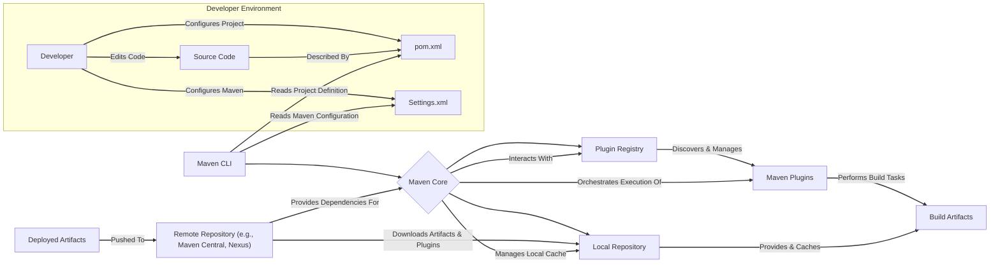
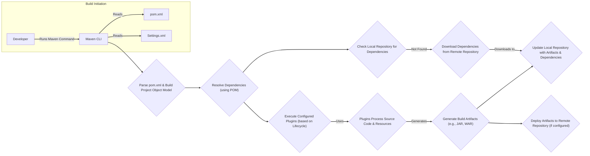

# Project Design Document: Apache Maven

**Version:** 1.1
**Date:** October 26, 2023
**Author:** AI Software Architect

## 1. Introduction

This document provides an enhanced and detailed design overview of the Apache Maven project. It elaborates on the system's architecture, key components, data flow, and security considerations, building upon the previous version. This document serves as a more robust foundation for subsequent threat modeling activities.

## 2. Project Goals and Objectives

*   To serve as a comprehensive software project management and comprehension tool.
*   To offer a standardized and declarative way to describe and build projects.
*   To provide a uniform and extensible build system across different project types.
*   To offer high-quality, readily accessible project information (dependencies, reports, etc.).
*   To provide clear guidelines and promote best practices in software development.
*   To facilitate transparent and seamless migration to new features and versions.

## 3. High-Level Architecture

**Description:**

*   **Developer Environment:** Represents the environment where developers work.
    *   **Developer:** The individual interacting with Maven to build and manage projects.
    *   **Source Code:** The project's source code files, the primary input for the build process.
    *   **pom.xml:** The core Project Object Model file, declaratively defining the project's configuration, dependencies, and build process.
    *   **Settings.xml:** An optional configuration file for customizing Maven's runtime behavior, including repository locations and server credentials.
*   **Maven CLI:** The command-line interface (`mvn`) used by developers to invoke Maven commands and manage the build lifecycle.
*   **Maven Core:** The central engine of Maven, responsible for interpreting the `pom.xml`, managing dependencies, orchestrating plugin execution, and managing repositories.
*   **Plugin Registry:**  A logical component within Maven Core that keeps track of available Maven plugins and their metadata.
*   **Local Repository:** A directory on the developer's machine (typically `~/.m2/repository`) that serves as a cache for downloaded artifacts and plugins, improving build speed.
*   **Maven Plugins:** Reusable, modular components that perform specific build tasks, such as compilation, testing, packaging, and deployment.
*   **Build Artifacts:** The output of the Maven build process, such as JAR, WAR, or EAR files, representing the compiled and packaged application or library.
*   **Remote Repository:**  Network-accessible repositories (e.g., Maven Central, private Nexus repositories) where artifacts and plugins are stored and shared.
*   **Deployed Artifacts:**  The final build artifacts that have been successfully deployed to a target environment or repository.

## 4. Detailed Component Architecture

This section provides a more granular view of the key components within the Maven Core and their interactions.

*   **Maven Core Components:**
    *   **Lifecycle Manager:** Defines and manages the standard build lifecycles (e.g., `clean`, `compile`, `test`, `package`, `install`, `deploy`) and their phases.
    *   **Dependency Resolver:**  Analyzes the project's dependencies (direct and transitive) declared in the `pom.xml` and resolves them by locating and downloading the required artifacts from repositories.
    *   **Plugin Manager:**  Discovers, downloads, manages the lifecycle of, and executes Maven plugins based on the project's configuration and the invoked build lifecycle phases.
    *   **Repository Manager:**  Handles interactions with both the local and remote repositories, including downloading artifacts and plugins, and potentially deploying artifacts.
    *   **Settings Reader:**  Parses the `settings.xml` file to configure Maven's runtime behavior, such as proxy settings, repository locations, and server authentication details.
    *   **Project Builder:**  Reads and parses the `pom.xml` file (and potentially parent POMs) to construct the in-memory Project Object Model, representing the project's structure and configuration.
    *   **Extension Manager:**  Allows for extending Maven's core functionality through extensions, which can hook into various parts of the build process.

*   **Common Maven Plugins:**
    *   `maven-compiler-plugin`: Compiles Java source code into bytecode.
    *   `maven-surefire-plugin`: Executes unit tests.
    *   `maven-jar-plugin`: Packages compiled code and resources into a JAR file.
    *   `maven-war-plugin`: Packages web applications into a WAR file.
    *   `maven-deploy-plugin`: Deploys generated artifacts to a remote repository.
    *   `maven-install-plugin`: Installs generated artifacts into the local repository.
    *   `maven-clean-plugin`: Deletes build output directories.
    *   Various reporting plugins (e.g., `maven-javadoc-plugin`, `maven-site-plugin`).

*   **Repository Types:**
    *   **Local Repository:**  A file system directory acting as a cache.
    *   **Remote Repositories:**
        *   **Public Repositories:**  Openly accessible repositories like Maven Central.
        *   **Private/Corporate Repositories:**  Internal repositories managed by organizations (e.g., using Nexus, Artifactory).
        *   **Snapshot Repositories:**  Repositories hosting development or pre-release versions of artifacts.
        *   **Plugin Repositories:**  Repositories specifically for hosting Maven plugins.

## 5. Data Flow

The following diagram provides a more detailed illustration of the data flow during a typical Maven build process.

**Description:**

1. **Build Initiation:** The developer initiates the build process by executing a Maven command (e.g., `mvn clean install`) through the Maven CLI.
2. **Parse pom.xml & Build Project Object Model:** Maven Core reads and parses the `pom.xml` file and constructs an in-memory representation of the project, including its dependencies, build configuration, and plugins.
3. **Resolve Dependencies (using POM):** The Dependency Resolver analyzes the project's dependencies declared in the `pom.xml`.
4. **Check Local Repository for Dependencies:** Maven checks the local repository to see if the required dependencies are already present.
5. **Download Dependencies from Remote Repository:** If dependencies are not found locally, Maven downloads them from the configured remote repositories (as specified in `pom.xml` or `settings.xml`).
6. **Execute Configured Plugins (based on Lifecycle):** Maven Core determines the plugins that need to be executed based on the invoked build lifecycle phases and the plugin configurations in the `pom.xml`.
7. **Plugins Process Source Code & Resources:**  Plugins perform their designated tasks, such as compiling source code, processing resources, and running tests.
8. **Generate Build Artifacts (e.g., JAR, WAR):** Plugins like the `maven-jar-plugin` or `maven-war-plugin` package the compiled code and resources into the final build artifacts.
9. **Update Local Repository with Artifacts & Dependencies:** Downloaded dependencies and generated artifacts are stored in the local repository for future use.
10. **Deploy Artifacts to Remote Repository (if configured):** If the `deploy` phase is invoked or configured, the `maven-deploy-plugin` uploads the final artifacts to a specified remote repository.

## 6. Security Considerations

This section expands on the security considerations relevant to Maven, providing more detail and context.

*   **Dependency Management Vulnerabilities:**
    *   **Risk:** Inclusion of dependencies with known security vulnerabilities can directly expose the project to those vulnerabilities. Transitive dependencies exacerbate this risk.
    *   **Mitigation:**
        *   Utilize dependency scanning tools (e.g., OWASP Dependency-Check, Snyk) to identify vulnerable dependencies.
        *   Regularly update dependencies to their latest secure versions.
        *   Implement dependency management policies and enforce them through tools.
        *   Consider using a Software Bill of Materials (SBOM) to track dependencies.
*   **Maven Plugin Security:**
    *   **Risk:** Malicious or compromised Maven plugins can execute arbitrary code during the build process, potentially compromising the build environment or injecting malicious code into the artifacts.
    *   **Mitigation:**
        *   Only use plugins from trusted and reputable sources.
        *   Verify plugin integrity using checksums or signatures.
        *   Implement controls to restrict the use of untrusted plugins.
        *   Regularly audit the plugins used in the project.
*   **Remote Repository Security:**
    *   **Risk:** Compromised remote repositories can serve malicious artifacts or plugins, leading to supply chain attacks.
    *   **Mitigation:**
        *   Use secure protocols (HTTPS) for accessing remote repositories.
        *   Utilize repository managers with security features like vulnerability scanning, access control, and artifact signing verification.
        *   Implement artifact verification mechanisms.
*   **Build Process Integrity:**
    *   **Risk:** Tampering with the build process can lead to the creation of compromised artifacts without the developers' knowledge.
    *   **Mitigation:**
        *   Secure the build environment and restrict access to build servers and configurations.
        *   Implement version control for `pom.xml` and other build-related files.
        *   Use immutable build environments (e.g., containers).
        *   Implement build provenance mechanisms.
*   **Sensitive Information in Configuration:**
    *   **Risk:** `settings.xml` can contain sensitive information like repository credentials, which, if exposed, can lead to unauthorized access.
    *   **Mitigation:**
        *   Avoid storing plain text passwords in `settings.xml`. Use encrypted passwords with the Maven Master Password.
        *   Secure the `settings.xml` file and restrict access.
        *   Do not commit `settings.xml` containing sensitive information to version control.
        *   Consider using secure credential management solutions.
*   **POM Tampering:**
    *   **Risk:** Malicious modification of the `pom.xml` can introduce vulnerable dependencies, alter the build process, or inject malicious code.
    *   **Mitigation:**
        *   Implement strict access control for `pom.xml` files.
        *   Use version control and code review processes for changes to `pom.xml`.
        *   Consider using digital signatures for `pom.xml` files.
*   **Supply Chain Security:**
    *   **Risk:** Vulnerabilities can be introduced at any point in the software supply chain, from dependencies to build tools.
    *   **Mitigation:**
        *   Adopt a holistic approach to supply chain security.
        *   Implement practices like dependency pinning to ensure consistent builds.
        *   Strive for reproducible builds to verify the integrity of the build process.
        *   Utilize SBOMs to understand the components within the software.

## 7. Key Dependencies

Maven relies on several core technologies and libraries:

*   **Java Development Kit (JDK):**  Maven is a Java-based tool and requires a JDK to execute. The specific version requirements may vary depending on the Maven version.
*   **Apache Plexus:** A lightweight component container framework used extensively within Maven for managing its internal components and plugins.
*   **SLF4j (Simple Logging Facade for Java) and Logback:** Logging frameworks used by Maven for internal logging and providing information about the build process.
*   **Apache Commons CLI:** A library for parsing command-line options, used by the Maven CLI.
*   **Maven Resolver:**  The library responsible for dependency resolution and management within Maven.
*   **HTTP Client Libraries (e.g., Apache HttpClient):** Used for interacting with remote repositories over HTTP/HTTPS.

## 8. Deployment Model

Maven itself is not typically "deployed" as a running application. Instead, it's a build tool used in various deployment contexts:

*   **Local Development Environments:** Installed on developer workstations to build and test projects locally.
*   **Continuous Integration/Continuous Deployment (CI/CD) Pipelines:** A core component in automated build and deployment pipelines, executed on CI/CD servers (e.g., Jenkins, GitLab CI, GitHub Actions).
*   **Build Servers:** Dedicated servers configured solely for performing software builds using Maven.
*   **Containerized Environments:** Maven can be used within Docker containers for building applications in isolated and reproducible environments.
*   **Repository Managers:** Maven interacts with repository managers (like Nexus or Artifactory), which are deployed as standalone applications to manage and proxy artifacts.

## 9. Future Considerations

*   **Enhanced Security Features:**  Further integration with advanced security scanning tools and potentially built-in mechanisms for verifying plugin integrity and dependency security.
*   **Improved Build Performance:**  Ongoing efforts to optimize build times through caching, parallelization, and other techniques.
*   **Better Support for Modern Build Paradigms:**  Adapting to and integrating with newer build technologies and approaches, such as cloud-native builds.
*   **More Granular Plugin Permissions:**  Potentially introducing a more fine-grained permission model for Maven plugins to limit their access to system resources.
*   **Standardized SBOM Generation:**  Native support for generating Software Bills of Materials as part of the build process.
*   **Improved Error Reporting and Debugging:**  Enhancements to provide more informative error messages and debugging capabilities.
