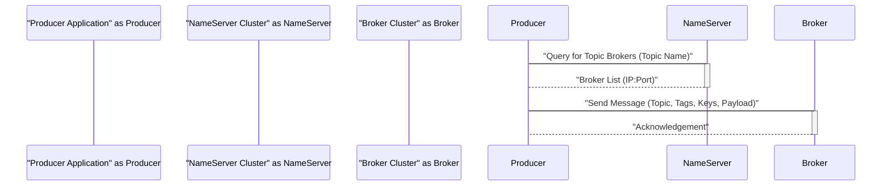
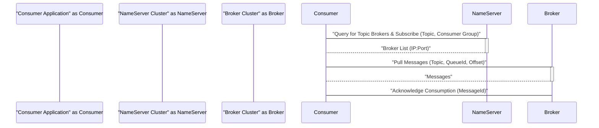
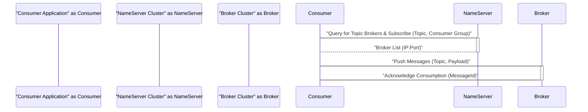

# Project Design Document: Apache RocketMQ

**Version:** 1.1
**Date:** October 26, 2023
**Author:** AI Software Architect

## 1. Introduction

This document provides an enhanced and detailed design overview of Apache RocketMQ, a distributed messaging and streaming platform. It aims to meticulously capture the key architectural components, their interactions, and data flows within the system, with a strong emphasis on aspects relevant to security considerations. This document will serve as the foundational artifact for subsequent threat modeling activities. It builds upon the previous version by adding more granular details and explicitly linking design elements to potential security implications.

## 2. System Overview

Apache RocketMQ is a distributed, open-source message broker engineered for high performance, high availability, and scalability. It facilitates asynchronous communication patterns in distributed systems, enabling decoupled architectures. The core components of RocketMQ are designed to work cohesively, ensuring the reliable and ordered delivery of messages between producers and consumers.

### 2.1. Key Components

*   **Producer:** An application instance that generates and sends messages to the RocketMQ broker. Producers are responsible for determining the target topic and formatting the message.
*   **Consumer:** An application instance that subscribes to specific topics and receives messages from the RocketMQ broker. Consumers belong to consumer groups, which dictate how messages are distributed.
*   **NameServer:** A lightweight, stateless service discovery component that maintains a registry of broker metadata. It provides routing information to producers, consumers, and brokers, enabling them to locate each other.
*   **Broker:** The central component responsible for the acceptance, storage, and delivery of messages. Brokers are organized into master-slave groups to ensure high availability and data redundancy. Each broker manages multiple queues.
*   **Topic:** A logical namespace or category used to classify messages. Producers publish messages to a specific topic, and consumers subscribe to topics to receive relevant messages.
*   **Queue (Message Queue):** A physical storage unit within a broker that holds messages for a specific topic. A topic can be distributed across multiple queues residing on different brokers to enhance throughput.
*   **Message:** The fundamental unit of data exchanged between producers and consumers. It comprises a payload (the actual data) and associated metadata (e.g., message ID, topic, tags, keys).
*   **Consumer Group:** A logical grouping of multiple consumer instances that share a subscription to a topic. RocketMQ ensures that each message is delivered to only one consumer within a given consumer group.

### 2.2. High-Level Architecture Diagram

```mermaid
flowchart TD
    subgraph "Producer Application"
        A("Producer")
    end
    subgraph "NameServer Cluster"
        B("NameServer 1")
        C("NameServer 2")
        D("NameServer N")
    end
    subgraph "Broker Cluster"
        subgraph "Broker Group 1"
            E("Broker Master 1")
            F("Broker Slave 1")
        end
        subgraph "Broker Group 2"
            G("Broker Master 2")
            H("Broker Slave 2")
        end
        I("Broker Master M")
        J("Broker Slave M")
    end
    subgraph "Consumer Application"
        K("Consumer")
    end

    A -- "Queries Broker Info" --> B
    A -- "Queries Broker Info" --> C
    A -- "Queries Broker Info" --> D
    A -- "Sends Message" --> E
    A -- "Sends Message" --> G
    A -- "Sends Message" --> I

    K -- "Queries Broker Info & Subscribes" --> B
    K -- "Queries Broker Info & Subscribes" --> C
    K -- "Queries Broker Info & Subscribes" --> D
    K -- "Receives Messages" --> E
    K -- "Receives Messages" --> G
    K -- "Receives Messages" --> I

    F -- "Replicates Data" --> E
    H -- "Replicates Data" --> G
    J -- "Replicates Data" --> I

    B -- "Syncs Data" -- C
    B -- "Syncs Data" -- D
    C -- "Syncs Data" -- D
```

## 3. Detailed Design

This section provides a deeper dive into the interactions and data flows between the core components, highlighting aspects relevant to security analysis.

### 3.1. Message Publishing Process

1. **Producer Broker Discovery:** The producer initiates the process by querying the NameServer cluster to locate the active broker(s) responsible for the target topic.
    *   The producer sends a request, typically over TCP, to one or more NameServer instances. This request includes the target topic name.
    *   The NameServer responds with a list of available broker addresses (IP and port). This information is crucial for the producer to establish a connection.
    *   **Security Relevance:**  Spoofing attacks on the NameServer could lead to producers sending messages to malicious brokers. Lack of authentication between producer and NameServer could facilitate this.
2. **Message Transmission:** The producer selects a broker from the provided list and transmits the message.
    *   The producer establishes a persistent TCP connection with the chosen broker.
    *   The message, containing the topic, optional tags and keys, and the message payload, is serialized (typically using a binary format) and sent over the established connection.
    *   **Security Relevance:**  Man-in-the-middle attacks could intercept or modify messages during transmission. Lack of encryption (e.g., TLS) exposes message content.
3. **Broker Message Handling and Storage:** The broker receives the message and persists it.
    *   The broker validates the message format and topic.
    *   The message is appended to one or more designated queue files on the broker's local storage. The storage mechanism typically involves sequential writes to disk for performance.
    *   For topics configured with replication, the master broker synchronously or asynchronously replicates the message to its slave broker(s).
    *   **Security Relevance:**  Unauthorized access to the broker's storage could lead to data breaches or tampering. Insufficient access controls on the broker's file system are a risk.
4. **Acknowledgement to Producer:** The broker sends an acknowledgment back to the producer, confirming successful receipt and storage of the message.
    *   This acknowledgement is crucial for ensuring at-least-once delivery semantics.
    *   **Security Relevance:**  Spoofing of acknowledgements could disrupt message delivery guarantees.

### 3.2. Message Consumption Process

1. **Consumer Broker Discovery and Subscription:** The consumer discovers the brokers responsible for the desired topic and registers its subscription details.
    *   The consumer queries the NameServer(s) to get the list of brokers hosting the target topic.
    *   The consumer then establishes a connection with one or more of these brokers and sends a subscription request. This request includes the topic name, consumer group, and optional message selectors (e.g., tags, SQL expressions).
    *   **Security Relevance:**  Similar to producers, consumers are vulnerable to NameServer spoofing. Unauthorized subscriptions could lead to information leakage.
2. **Message Retrieval (Pull or Push):** Consumers retrieve messages from the brokers based on their configured consumption model.
    *   **Pull Model:** The consumer actively sends pull requests to the broker, specifying the number of messages to retrieve. The broker responds with available messages.
        *   **Security Relevance:**  Denial-of-service attacks could be launched by a malicious consumer repeatedly pulling large numbers of messages.
    *   **Push Model:** The broker maintains an open connection with the consumer and proactively pushes new messages as they arrive for the subscribed topic.
        *   **Security Relevance:**  Compromised brokers could push malicious or unauthorized messages to consumers.
3. **Message Processing:** The consumer receives the message and performs the necessary processing logic.
4. **Consumption Acknowledgement:** After successfully processing a message, the consumer sends an acknowledgement back to the broker.
    *   This acknowledgement informs the broker that the message can be marked as consumed and potentially removed from the queue (depending on the message retention policy).
    *   **Security Relevance:**  Failure to acknowledge messages can lead to redelivery loops. Malicious consumers could intentionally not acknowledge messages to disrupt processing.

### 3.3. NameServer Functionality

1. **Broker Registration and Heartbeats:** Brokers periodically register their presence and health status with the NameServer cluster.
    *   Brokers send registration information (address, supported topics, etc.) and regular heartbeat signals to all configured NameServers.
    *   **Security Relevance:**  Spoofed broker registrations could mislead producers and consumers. Lack of authentication allows unauthorized brokers to register.
2. **Metadata Storage and Management:** NameServers maintain an in-memory registry of broker metadata, including topic-to-broker mappings and broker health information.
    *   This metadata is crucial for routing messages and managing the overall cluster state.
    *   **Security Relevance:**  Compromise of a NameServer could disrupt the entire messaging system by providing incorrect routing information.
3. **Client Information Retrieval:** Producers and consumers query the NameServer(s) to obtain information about available brokers and their capabilities.
4. **Health Monitoring:** NameServers monitor the health of registered brokers by tracking heartbeat signals. Brokers that fail to send heartbeats are marked as inactive.
5. **Routing Information Provision:** NameServers provide routing information to clients, enabling them to establish connections with the appropriate brokers for message sending and consumption.

### 3.4. Broker Internals

1. **Message Storage Mechanisms:** Brokers employ persistent storage mechanisms, typically involving sequential writes to commit log files.
    *   Index files are maintained to facilitate efficient message retrieval based on message keys or offsets.
    *   **Security Relevance:**  Insufficient permissions on storage directories could allow unauthorized access to message data.
2. **Queue Management:** Brokers manage multiple queues per topic to distribute the message load and enhance parallelism.
3. **Replication Strategies:** Master brokers replicate messages to their slave brokers to ensure data durability and high availability.
    *   Replication can be synchronous (strong consistency) or asynchronous (higher performance).
    *   **Security Relevance:**  Unsecured replication channels could expose message data in transit between brokers.
4. **Message Filtering and Selection:** Brokers can filter messages based on tags or SQL expressions defined in consumer subscriptions, reducing the amount of data transferred to consumers.
5. **Transaction Management:** RocketMQ supports distributed transactions, allowing producers to send messages within the scope of a transaction that can be either committed or rolled back.

## 4. Data Flow Diagrams

### 4.1. Message Publishing Data Flow



### 4.2. Message Consumption Data Flow (Pull Model)



### 4.3. Message Consumption Data Flow (Push Model)



## 5. Security Considerations (Detailed)

This section expands on the initial security considerations, providing more specific examples of potential threats and vulnerabilities.

*   **Authentication and Authorization:**
    *   **Threats:** Unauthorized producers could publish malicious or spam messages. Unauthorized consumers could subscribe to sensitive topics, leading to data breaches.
    *   **Considerations:** Explore mechanisms for authenticating producers and consumers (e.g., API keys, client certificates). Implement fine-grained authorization controls based on topics and actions.
*   **Message Confidentiality (In Transit and At Rest):**
    *   **Threats:** Sensitive message data could be intercepted during transmission or accessed from persistent storage.
    *   **Considerations:** Enforce TLS/SSL for all network communication between components. Implement encryption at rest for message data stored on brokers. Consider end-to-end encryption of message payloads.
*   **Message Integrity:**
    *   **Threats:** Messages could be tampered with during transmission or storage.
    *   **Considerations:** Utilize message signing or hashing mechanisms to ensure message integrity. Implement secure storage practices to prevent unauthorized modification of stored messages.
*   **Broker Security:**
    *   **Threats:** Compromised brokers could lead to data loss, data breaches, or the injection of malicious messages.
    *   **Considerations:** Harden broker operating systems and applications. Implement strong access controls and regular security patching. Monitor broker logs for suspicious activity.
*   **NameServer Security:**
    *   **Threats:** A compromised NameServer could disrupt the entire messaging system by providing incorrect routing information or by being taken offline (DoS).
    *   **Considerations:** Secure access to NameServer nodes. Implement redundancy and failover mechanisms for NameServers. Consider using a secure protocol for communication with NameServers.
*   **Network Security:**
    *   **Threats:** Network-based attacks (e.g., eavesdropping, man-in-the-middle) could compromise message confidentiality and integrity.
    *   **Considerations:** Implement network segmentation and firewalls to restrict access to RocketMQ components. Enforce the use of secure network protocols (TLS/SSL).
*   **Access Control (Administrative):**
    *   **Threats:** Unauthorized access to administrative functionalities could lead to misconfiguration, data deletion, or service disruption.
    *   **Considerations:** Implement strong authentication and authorization for administrative interfaces and tools. Restrict access to sensitive configuration files.
*   **Data at Rest Encryption:**
    *   **Threats:**  Unauthorized access to the broker's underlying storage could expose sensitive message data.
    *   **Considerations:** Implement encryption of the message commit logs and index files on the brokers. Use robust key management practices.
*   **TLS/SSL Configuration:**
    *   **Threats:** Weak or improperly configured TLS/SSL could be vulnerable to attacks.
    *   **Considerations:** Enforce strong cipher suites and protocols. Properly manage TLS certificates and ensure they are regularly renewed.

## 6. Assumptions and Constraints

*   The underlying network infrastructure is assumed to be reasonably secure.
*   Standard operating system and application security best practices are followed for all RocketMQ components.
*   This design document focuses on the core functional and security aspects of RocketMQ. Deployment-specific security configurations and operational procedures are considered out of scope for this version.
*   Specific cryptographic algorithms and authentication protocols are not explicitly defined here but will be considered during the threat modeling and subsequent implementation phases.

## 7. Future Considerations

*   Integration with external authentication and authorization providers (e.g., LDAP, OAuth 2.0).
*   Implementation of robust auditing and logging mechanisms for security-related events.
*   Detailed guidelines and best practices for secure deployment and operation of RocketMQ.
*   Exploration of advanced security features such as message-level encryption and access control.

This enhanced design document provides a more detailed and security-focused overview of Apache RocketMQ. The granular descriptions of components, interactions, and data flows, coupled with the expanded security considerations, will facilitate a more comprehensive and effective threat modeling exercise.
