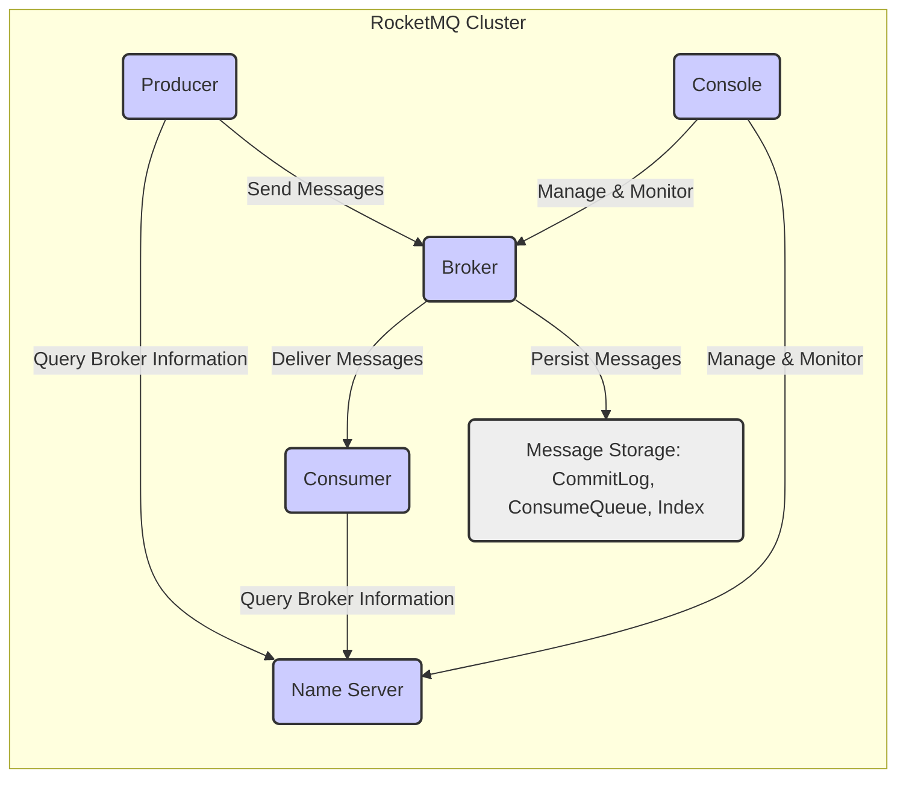
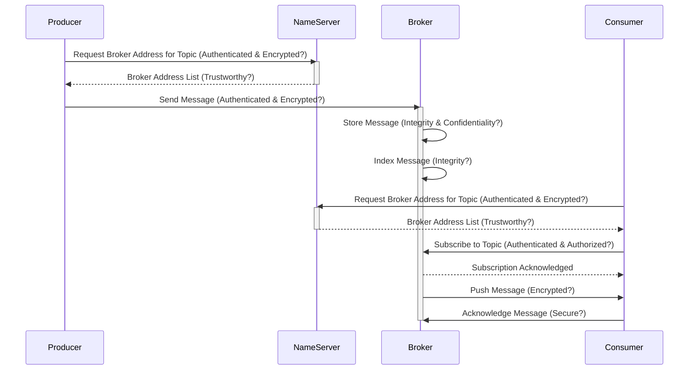

## Project Design Document: Apache RocketMQ (Improved)

**1. Introduction**

This document provides an enhanced architectural design overview of Apache RocketMQ, a distributed messaging and streaming platform. This document is specifically tailored to serve as a robust foundation for subsequent threat modeling activities. It meticulously outlines the key components, their interactions, and the data flow within the system, with a heightened focus on security-relevant aspects.

**2. Goals**

The primary goals of this design document are to:

*   Provide a detailed and clear description of the architecture of Apache RocketMQ.
*   Thoroughly identify the major components and their specific responsibilities, including security-related functions.
*   Illustrate the data flow within the system, highlighting potential points of vulnerability.
*   Detail key technologies and deployment considerations, emphasizing security implications.
*   Serve as a comprehensive and accurate basis for identifying potential security vulnerabilities and attack vectors during threat modeling.

**3. High-Level Architecture**

Apache RocketMQ employs a distributed architecture comprising several interacting components. The core components are:

*   **Name Server:** A lightweight, highly available service discovery and routing information provider for Brokers. It also plays a role in load balancing.
*   **Broker:** The central component responsible for receiving, storing, and delivering messages. It manages message queues and handles various message delivery semantics.
*   **Producer:** An application that creates and sends messages to the Broker.
*   **Consumer:** An application that subscribes to and receives messages from the Broker.
*   **Console (Optional):** A web-based management interface providing monitoring and administrative capabilities for the RocketMQ cluster.

**4. Detailed Component Descriptions**

*   **Name Server:**
    *   **Functionality:** Maintains real-time routing information about Brokers, including their network addresses and the topics they serve. Facilitates load balancing by providing Producers and Consumers with a list of available Brokers. Monitors Broker health through heartbeat mechanisms.
    *   **Security Considerations:** A compromised Name Server could lead to incorrect routing, potentially causing message delivery failures or redirection to malicious Brokers. Access control to the Name Server is crucial.
    *   **Deployment:** Typically deployed as a cluster (multiple instances) for high availability, mitigating single points of failure. Communication uses a lightweight protocol, which needs to be secured.

*   **Broker:**
    *   **Functionality:** Receives messages from Producers, persistently stores them, manages message queues for different topics and consumer groups, and pushes messages to subscribed Consumers. Supports various message delivery semantics (e.g., at-least-once, exactly-once). Handles message filtering, routing, replay, and dead-letter queues.
    *   **Internal Components:**
        *   **CommitLog:** The primary storage for all messages, written sequentially for high throughput. Security considerations include protecting the integrity and confidentiality of the stored messages.
        *   **ConsumeQueue:** An index structure that organizes messages by topic and queue, enabling efficient message retrieval for Consumers.
        *   **Index Files:** Provide an additional indexing mechanism based on message keys, further optimizing message lookup.
    *   **High Availability:** Can be deployed in:
        *   **Master-Slave Mode:**  A master Broker handles read and write operations, while a slave replicates data from the master for failover. Security considerations involve ensuring secure replication and preventing unauthorized access to both master and slave.
        *   **Dledger Mode (Raft-based):**  A group of Brokers forms a Raft consensus group, ensuring strong data consistency and automatic leader election in case of failures. Security considerations include securing inter-broker communication and protecting against quorum disruption.
    *   **Security Considerations:** Brokers are the primary target for attacks aimed at disrupting message flow, stealing or modifying messages. Secure storage, access control, and secure communication are paramount.

*   **Producer:**
    *   **Functionality:** Creates and sends messages to specific topics. Resolves Broker addresses from the Name Server. Supports various message types (e.g., normal, transactional, scheduled). Handles message sending retries and error handling. Can be configured with different message sending strategies (e.g., synchronous, asynchronous, one-way).
    *   **Security Considerations:**  Compromised Producers could send malicious or unauthorized messages. Proper authentication and authorization of Producers are essential. Secure storage of Producer credentials is also important.

*   **Consumer:**
    *   **Functionality:** Subscribes to specific topics or tags to receive messages. Resolves Broker addresses from the Name Server. Receives messages pushed by the Broker. Manages message consumption offsets. Supports different consumption modes (e.g., clustering, broadcasting). Handles message processing and acknowledgments.
    *   **Security Considerations:** Unauthorized Consumers could potentially access sensitive information. Proper authentication and authorization of Consumers are crucial. Consumers should also be protected from receiving malicious messages.

*   **Console:**
    *   **Functionality:** Provides a web interface for monitoring the RocketMQ cluster's health and performance. Allows viewing Broker status, topic information, consumer groups, and message statistics. Offers tools for managing topics, consumer groups, and other configurations. Interacts with the Name Server and Brokers via management APIs.
    *   **Security Considerations:** The Console provides administrative access to the RocketMQ cluster. It is a critical component from a security perspective and requires strong authentication, authorization, and protection against common web vulnerabilities (e.g., XSS, CSRF). Access should be restricted to authorized personnel only.

**5. Data Flow (with Security Considerations)**

The typical message flow in RocketMQ, along with associated security considerations, involves the following steps:

1. **Producer Startup:** The Producer starts and connects to the Name Server (potentially over an unsecured network). **Security Consideration:** Ensure the connection to the Name Server is authenticated and potentially encrypted to prevent eavesdropping or man-in-the-middle attacks.
2. **Broker Discovery:** The Producer requests Broker addresses for the target topic from the Name Server. **Security Consideration:** The Name Server must provide accurate and trustworthy information. A compromised Name Server could direct Producers to malicious Brokers.
3. **Message Sending:** The Producer sends a message to a selected Broker (typically over TCP). **Security Consideration:** This communication channel should be encrypted (e.g., using TLS/SSL) to protect the message content and prevent tampering. Producer authentication is crucial here.
4. **Broker Reception and Storage:** The Broker receives the message and persists it in its local storage (CommitLog). **Security Consideration:** The integrity and confidentiality of the stored messages must be ensured. Access control to the storage system is vital. Encryption at rest can be considered.
5. **Message Indexing:** The Broker creates indexes (ConsumeQueue and Index files) to facilitate efficient message retrieval. **Security Consideration:** The integrity of these index structures is important for ensuring correct message delivery.
6. **Consumer Startup:** The Consumer starts and connects to the Name Server (similar security considerations as Producer startup).
7. **Broker Discovery:** The Consumer requests Broker addresses for the subscribed topic from the Name Server (similar security considerations as Producer discovery).
8. **Subscription:** The Consumer registers its subscription information with the Broker. **Security Consideration:** Broker needs to authenticate and authorize the Consumer's subscription request to prevent unauthorized access to topics.
9. **Message Delivery:** The Broker pushes messages matching the Consumer's subscription to the Consumer (typically over TCP). **Security Consideration:** This communication channel should also be encrypted to protect message confidentiality and integrity.
10. **Message Consumption:** The Consumer processes the received message. **Security Consideration:** Consumers should be designed to handle potentially malicious messages gracefully and avoid vulnerabilities in their processing logic.
11. **Acknowledgment:** The Consumer sends an acknowledgment to the Broker. **Security Consideration:** The acknowledgment mechanism should be secure to prevent replay attacks or denial-of-service by forging acknowledgments.
12. **Offset Management:** The Broker tracks the consumption offset for each consumer group. **Security Consideration:**  Protecting the integrity of offset information is important to ensure correct message delivery and prevent message loss or duplication.

**6. Key Technologies (with Security Implications)**

*   **Programming Language (Java):**  Security vulnerabilities in the Java runtime environment or RocketMQ's Java code can be exploited. Regular security patching is crucial.
*   **Networking (TCP/IP):**  Susceptible to network-level attacks. Implementing TLS/SSL for communication is essential. Proper firewall configuration is also necessary.
*   **Persistence (Local File System):**  Requires appropriate file system permissions and potentially encryption at rest to protect message data.
*   **Messaging Protocol (Custom Binary):** While potentially efficient, custom protocols can have undiscovered vulnerabilities. Secure implementation and potentially encryption are important.
*   **Concurrency (Multi-threading, Asynchronous I/O):**  Improper handling of concurrency can lead to race conditions and other vulnerabilities.
*   **Distributed Coordination (Name Server, Dledger/Raft):** The security of these coordination mechanisms is critical for the overall system's security and availability.

**7. Deployment Model (and Security Considerations)**

Apache RocketMQ's deployment model significantly impacts its security posture:

*   **Standalone Mode:**  Suitable for development but offers minimal redundancy and limited security. A single point of failure.
*   **Master-Slave Mode:** Improves availability but requires secure replication between master and slave. Access control to both instances is crucial.
*   **Dledger Mode:** Provides stronger consistency and fault tolerance through Raft consensus. Secure inter-broker communication and protection against quorum disruption are vital.
*   **Cloud Deployment:** Offers scalability and flexibility but introduces cloud-specific security considerations, such as securing access to cloud resources (e.g., VMs, storage), network configurations (VPCs, security groups), and identity and access management (IAM). Containerization (Docker, Kubernetes) adds another layer of security considerations related to image security and container orchestration.

**8. Security Considerations (Detailed)**

This section provides a more detailed breakdown of security considerations for threat modeling:

*   **Authentication and Authorization:**
    *   **Producer Authentication:** How are Producers verified before sending messages? (e.g., API keys, certificates, mutual TLS).
    *   **Consumer Authentication:** How are Consumers verified before subscribing to topics?
    *   **Topic-Level Authorization:** How is access to specific topics controlled for Producers and Consumers?
    *   **Consumer Group Authorization:** How is access to consumer groups managed?
    *   **Console Authentication and Authorization:** How is access to the management console secured? (e.g., username/password, multi-factor authentication, role-based access control).

*   **Data Confidentiality and Integrity:**
    *   **Message Encryption in Transit:** Is message data encrypted during transmission between components (Producer-Broker, Broker-Consumer, etc.)? (e.g., TLS/SSL).
    *   **Message Encryption at Rest:** Is message data encrypted when stored on the Broker's disk?
    *   **Message Integrity Protection:** Are there mechanisms to ensure that messages are not tampered with during transit or storage? (e.g., message signing, checksums).

*   **Network Security:**
    *   **Network Segmentation:** Is the RocketMQ cluster isolated within a secure network segment?
    *   **Firewall Rules:** Are appropriate firewall rules in place to restrict access to RocketMQ ports and components?
    *   **Intrusion Detection/Prevention Systems (IDS/IPS):** Are there systems in place to detect and prevent malicious network activity?

*   **Availability and Resilience:**
    *   **Denial of Service (DoS) Protection:** Are there mechanisms to prevent or mitigate DoS attacks against RocketMQ components? (e.g., rate limiting, resource quotas).
    *   **Fault Tolerance:** How does the system handle component failures (Name Server, Broker)? Are there automatic failover mechanisms?

*   **Access Control and Management:**
    *   **Administrative Access Control:** Who has administrative privileges to manage the RocketMQ cluster?
    *   **Configuration Management:** How are configuration changes managed and audited?
    *   **Security Auditing:** Are security-related events logged and auditable?

*   **Dependencies and Third-Party Libraries:**
    *   **Vulnerability Management:** Are dependencies and third-party libraries regularly scanned for known vulnerabilities?
    *   **Secure Supply Chain:** Are measures in place to ensure the integrity of dependencies?

*   **Operational Security:**
    *   **Secure Deployment Practices:** Are secure deployment practices followed?
    *   **Regular Security Updates:** Are RocketMQ and its dependencies kept up-to-date with security patches?
    *   **Security Monitoring:** Is the RocketMQ cluster actively monitored for security threats and anomalies?

This enhanced design document provides a more comprehensive and security-focused understanding of the Apache RocketMQ architecture. This detailed information will be invaluable for conducting a thorough threat modeling exercise to identify potential security risks, prioritize vulnerabilities, and develop effective mitigation strategies.