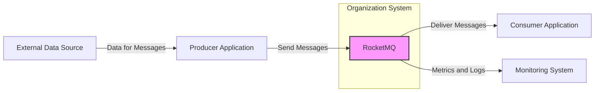
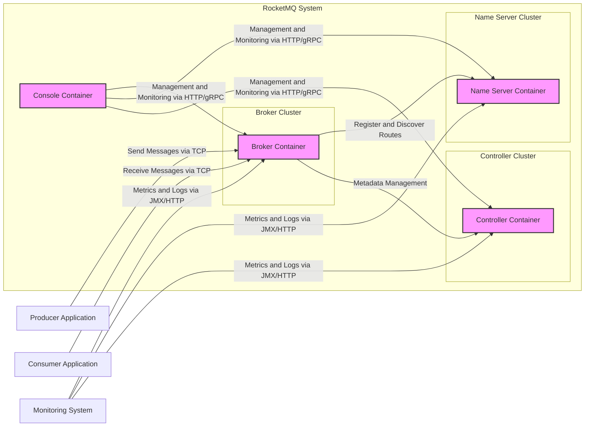
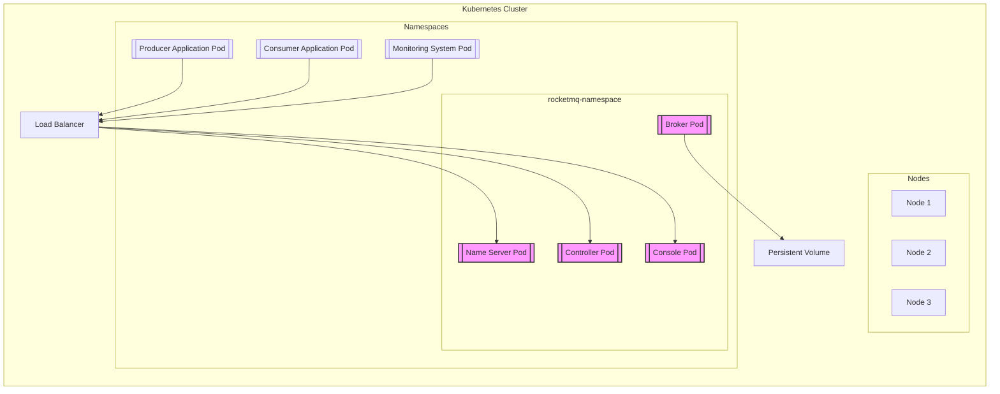

# BUSINESS POSTURE

RocketMQ is a distributed messaging and streaming platform. The primary business goal for adopting RocketMQ is to enable reliable, scalable, and high-performance asynchronous communication between different components of a distributed system. This is crucial for building microservices architectures, event-driven systems, and real-time data processing pipelines.

Business Priorities and Goals:
- Enable asynchronous communication between services.
- Decouple system components to improve resilience and scalability.
- Facilitate event-driven architectures.
- Support high-throughput and low-latency message delivery.
- Ensure message reliability and durability.
- Provide message filtering and routing capabilities.
- Support stream processing applications.

Business Risks:
- Data loss or corruption during message transmission or storage.
- Unauthorized access to messages and message queues.
- System unavailability due to failures or attacks.
- Performance bottlenecks impacting message delivery latency and throughput.
- Complexity in managing and operating a distributed messaging system.
- Vendor lock-in if relying heavily on specific RocketMQ features without considering alternatives.
- Compliance risks related to data privacy and security if sensitive data is transmitted or stored in messages.

# SECURITY POSTURE

Existing Security Controls:
- security control Access Control Lists (ACLs) for topic and group level authorization (described in RocketMQ documentation).
- security control TLS encryption for network communication (described in RocketMQ documentation).
- security control Message filtering and routing to control message flow (described in RocketMQ documentation).
- security control Pluggable authentication and authorization mechanisms (described in RocketMQ documentation).

Accepted Risks:
- accepted risk Reliance on users to properly configure and manage security features.
- accepted risk Potential vulnerabilities in third-party dependencies.
- accepted risk Risk of misconfiguration leading to security breaches.
- accepted risk Insider threats with access to RocketMQ infrastructure.

Recommended Security Controls:
- security control Implement robust input validation and sanitization for message payloads to prevent injection attacks.
- security control Regularly perform security audits and penetration testing to identify and address vulnerabilities.
- security control Implement security scanning in the CI/CD pipeline to detect vulnerabilities in code and dependencies.
- security control Use a secrets management system to securely store and manage sensitive credentials.
- security control Implement monitoring and alerting for security events and anomalies.
- security control Follow security best practices for infrastructure and operating system hardening.
- security control Implement data encryption at rest for message storage.

Security Requirements:
- Authentication:
  - Requirement: Securely authenticate clients (producers and consumers) connecting to RocketMQ brokers.
  - Requirement: Support various authentication mechanisms (e.g., username/password, certificates, OAuth).
  - Requirement: Centralized authentication management and integration with existing identity providers.
- Authorization:
  - Requirement: Implement fine-grained authorization to control access to topics, groups, and operations.
  - Requirement: Role-Based Access Control (RBAC) to manage permissions based on user roles.
  - Requirement: Policy enforcement to ensure only authorized clients can produce and consume messages.
- Input Validation:
  - Requirement: Validate message payloads to prevent injection attacks and data corruption.
  - Requirement: Sanitize input data to remove potentially harmful content.
  - Requirement: Implement schema validation for messages to ensure data integrity.
- Cryptography:
  - Requirement: Encrypt network communication between clients and brokers using TLS.
  - Requirement: Support encryption at rest for message storage to protect sensitive data.
  - Requirement: Consider message-level encryption for end-to-end security.
  - Requirement: Securely manage cryptographic keys and certificates.

# DESIGN

## C4 CONTEXT



Context Diagram Elements:

- Name: RocketMQ
  - Type: Software System
  - Description: Apache RocketMQ is a distributed messaging and streaming platform. It acts as a central message broker, facilitating asynchronous communication between producer and consumer applications.
  - Responsibilities:
    - Receiving messages from producer applications.
    - Storing messages reliably.
    - Routing messages to consumer applications based on topics and subscriptions.
    - Providing message delivery guarantees.
    - Managing message queues and topics.
    - Exposing monitoring and management interfaces.
  - Security controls:
    - security control Access Control Lists (ACLs) for topic and group level authorization.
    - security control TLS encryption for network communication.
    - security control Pluggable authentication and authorization mechanisms.
    - security control Input validation and sanitization for internal processing.
    - security control Logging and auditing of security-related events.

- Name: Producer Application
  - Type: Software System
  - Description: Applications that send messages to RocketMQ. These can be microservices, backend systems, or any application that needs to publish events or data.
  - Responsibilities:
    - Generating and sending messages to RocketMQ topics.
    - Handling message sending errors and retries.
    - Implementing authentication and authorization when connecting to RocketMQ.
    - Serializing data into message payloads.
  - Security controls:
    - security control Authentication to RocketMQ brokers.
    - security control Authorization to publish to specific topics.
    - security control Input validation and sanitization of data before sending as messages.
    - security control TLS encryption for communication with RocketMQ.

- Name: Consumer Application
  - Type: Software System
  - Description: Applications that receive and process messages from RocketMQ. These can be microservices, data processing pipelines, or any application that needs to react to events or consume data.
  - Responsibilities:
    - Subscribing to RocketMQ topics and groups.
    - Receiving and processing messages from RocketMQ.
    - Handling message processing errors and acknowledgements.
    - Implementing authentication and authorization when connecting to RocketMQ.
    - Deserializing message payloads.
  - Security controls:
    - security control Authentication to RocketMQ brokers.
    - security control Authorization to subscribe to specific topics and groups.
    - security control Input validation and sanitization of received messages.
    - security control TLS encryption for communication with RocketMQ.

- Name: Monitoring System
  - Type: Software System
  - Description: A system used to monitor the health and performance of RocketMQ, including brokers, topics, and consumer groups. Examples include Prometheus, Grafana, or in-house monitoring solutions.
  - Responsibilities:
    - Collecting metrics and logs from RocketMQ brokers and components.
    - Visualizing performance data and identifying anomalies.
    - Alerting on critical issues and performance degradation.
    - Providing dashboards for operational insights.
  - Security controls:
    - security control Access control to monitoring dashboards and data.
    - security control Secure communication channels for collecting metrics and logs.
    - security control Audit logging of access to monitoring data.

- Name: External Data Source
  - Type: External System
  - Description: External systems that provide data used by producer applications to create messages. This could be databases, APIs, or other data sources.
  - Responsibilities:
    - Providing data to producer applications.
    - Ensuring data integrity and availability.
  - Security controls:
    - security control Access control to data sources.
    - security control Data encryption in transit and at rest.
    - security control Authentication and authorization for data access.

## C4 CONTAINER



Container Diagram Elements:

- Name: Broker Container
  - Type: Container (Java Application)
  - Description: The core component of RocketMQ, responsible for message storage, routing, and delivery. Brokers are organized in a cluster for high availability and scalability.
  - Responsibilities:
    - Receiving messages from producers.
    - Storing messages in persistent storage (e.g., disk).
    - Routing messages to consumers based on subscriptions.
    - Managing message queues and topics.
    - Handling message delivery guarantees (e.g., at-least-once, exactly-once).
    - Providing APIs for producers and consumers to interact.
  - Security controls:
    - security control Access Control Lists (ACLs) enforced at the broker level.
    - security control TLS encryption for network communication with producers and consumers.
    - security control Authentication and authorization of producers and consumers.
    - security control Input validation and sanitization of message payloads.
    - security control Data encryption at rest for message storage.
    - security control Rate limiting and traffic shaping to prevent denial-of-service attacks.

- Name: Name Server Container
  - Type: Container (Java Application)
  - Description: Provides lightweight routing information about brokers. Name servers maintain topic-route information and provide service discovery for producers and consumers.
  - Responsibilities:
    - Maintaining topic-route information, mapping topics to brokers.
    - Providing service discovery for producers and consumers to locate brokers.
    - Handling broker registration and unregistration.
    - Performing health checks on brokers.
  - Security controls:
    - security control Access control to name server APIs.
    - security control TLS encryption for communication with brokers, producers, consumers, and console.
    - security control Authentication and authorization for administrative operations.
    - security control Rate limiting to prevent denial-of-service attacks.

- Name: Controller Container
  - Type: Container (Java Application)
  - Description:  Manages cluster metadata and performs cluster management operations. It is responsible for tasks like broker assignment, cluster topology management, and ensuring data consistency across the cluster.
  - Responsibilities:
    - Managing cluster metadata.
    - Broker assignment and load balancing.
    - Cluster topology management.
    - Ensuring data consistency and replication across brokers.
    - Handling cluster failover and recovery.
  - Security controls:
    - security control Access control to controller APIs.
    - security control TLS encryption for communication with brokers, name servers, and console.
    - security control Authentication and authorization for administrative operations.
    - security control Role-Based Access Control (RBAC) for cluster management operations.

- Name: Console Container
  - Type: Container (Web Application)
  - Description: A web-based management console for RocketMQ. It provides a user interface for monitoring, configuring, and managing RocketMQ clusters.
  - Responsibilities:
    - Providing a user interface for monitoring cluster status and metrics.
    - Allowing administrators to manage topics, groups, and brokers.
    - Configuring security settings and access control.
    - Performing administrative operations like cluster scaling and maintenance.
  - Security controls:
    - security control Authentication and authorization for console access.
    - security control HTTPS for secure communication with users.
    - security control Role-Based Access Control (RBAC) for console users.
    - security control Input validation and sanitization for user inputs.
    - security control Audit logging of user actions in the console.
    - security control Protection against common web application vulnerabilities (e.g., XSS, CSRF).

## DEPLOYMENT

Deployment Architecture Option: Cloud-based Kubernetes Cluster



Deployment Diagram Elements (Kubernetes Deployment):

- Name: Kubernetes Cluster
  - Type: Infrastructure
  - Description: A managed Kubernetes cluster in a cloud environment (e.g., AWS EKS, Google GKE, Azure AKS). Provides the orchestration platform for deploying and managing RocketMQ components and applications.
  - Responsibilities:
    - Providing container orchestration and management.
    - Ensuring high availability and scalability of deployed applications.
    - Managing networking, storage, and compute resources.
    - Providing security features like network policies and RBAC.
  - Security controls:
    - security control Kubernetes RBAC for access control within the cluster.
    - security control Network policies to isolate namespaces and pods.
    - security control Secrets management for storing sensitive credentials.
    - security control Regular security patching and updates of Kubernetes components.
    - security control Monitoring and logging of Kubernetes cluster events.

- Name: Node 1, Node 2, Node 3
  - Type: Compute Instance (Virtual Machine)
  - Description: Worker nodes in the Kubernetes cluster where pods are scheduled and run.
  - Responsibilities:
    - Running containerized applications (pods).
    - Providing compute resources (CPU, memory, storage).
    - Ensuring node security and stability.
  - Security controls:
    - security control Operating system hardening and security configurations.
    - security control Regular security patching and updates of the operating system and node components.
    - security control Network security controls (firewalls, security groups) to restrict access to nodes.
    - security control Monitoring and logging of node activities.

- Name: Broker Pod, Name Server Pod, Controller Pod, Console Pod
  - Type: Containerized Application (Pods)
  - Description: Kubernetes pods encapsulating RocketMQ Broker, Name Server, Controller, and Console containers respectively. Pods are the smallest deployable units in Kubernetes.
  - Responsibilities:
    - Running RocketMQ containers.
    - Managing container lifecycle within the pod.
    - Providing network identity and storage volumes to containers.
  - Security controls:
    - security control Container image scanning for vulnerabilities.
    - security control Least privilege principle for container runtime.
    - security control Resource limits and quotas to prevent resource exhaustion.
    - security control Network policies to control network traffic to and from pods.

- Name: Producer Application Pod, Consumer Application Pod, Monitoring System Pod
  - Type: Containerized Application (Pods)
  - Description: Kubernetes pods encapsulating producer applications, consumer applications, and monitoring system.
  - Responsibilities:
    - Running application containers.
    - Interacting with RocketMQ services.
  - Security controls:
    - security control Application-level security controls (authentication, authorization, input validation).
    - security control Secure coding practices.
    - security control Regular security scanning and testing of applications.

- Name: Load Balancer
  - Type: Network Service
  - Description: A cloud load balancer that distributes traffic to RocketMQ Name Server, Controller, and Console services, and potentially to Brokers for client connections depending on the setup.
  - Responsibilities:
    - Distributing incoming traffic across multiple instances of RocketMQ services.
    - Providing high availability and fault tolerance.
    - Terminating TLS connections (optional).
  - Security controls:
    - security control TLS termination and encryption.
    - security control Access control lists to restrict access to the load balancer.
    - security control DDoS protection.
    - security control Regular security audits and vulnerability assessments.

- Name: Persistent Volume
  - Type: Storage Service
  - Description: Persistent storage volumes used by RocketMQ Broker pods to store message data persistently. Cloud-based persistent volumes (e.g., AWS EBS, Google Persistent Disk, Azure Disk).
  - Responsibilities:
    - Providing persistent storage for message data.
    - Ensuring data durability and availability.
    - Managing storage performance and scalability.
  - Security controls:
    - security control Data encryption at rest for persistent volumes.
    - security control Access control lists to restrict access to storage volumes.
    - security control Regular backups and disaster recovery mechanisms.

## BUILD

```mermaid
flowchart LR
    A[Developer] --> B{Code Changes};
    B --> C[GitHub Repository];
    C --> D[GitHub Actions CI];
    D -->|Build & Test| E[Build Artifacts];
    E --> F[Container Registry];
    F --> G[Kubernetes Cluster];
    D -->|Security Scans (SAST/DAST)| H{Security Scan Results};
    H -- Yes --> I[Notify & Block];
    H -- No --> E;

    style D fill:#f9f,stroke:#333,stroke-width:2px
    style E fill:#f9f,stroke:#333,stroke-width:2px
    style F fill:#f9f,stroke:#333,stroke-width:2px
```

Build Process Diagram Elements:

- Name: Developer
  - Type: Human Role
  - Description: Software developers who write and modify the RocketMQ codebase.
  - Responsibilities:
    - Writing and committing code changes.
    - Performing local testing and code reviews.
    - Adhering to secure coding practices.
  - Security controls:
    - security control Code review process to identify potential security vulnerabilities.
    - security control Secure development training for developers.
    - security control Access control to code repositories.

- Name: Code Changes
  - Type: Data
  - Description: Modifications to the RocketMQ source code.
  - Responsibilities:
    - Representing the changes made to the codebase.
  - Security controls:
    - security control Version control system (Git) to track changes and revisions.
    - security control Branching strategy to isolate development and release branches.

- Name: GitHub Repository
  - Type: Code Repository
  - Description: The GitHub repository hosting the RocketMQ source code.
  - Responsibilities:
    - Storing and managing the codebase.
    - Providing version control and collaboration features.
  - Security controls:
    - security control Access control to the repository (authentication and authorization).
    - security control Audit logging of repository activities.
    - security control Branch protection rules to enforce code review and security checks.

- Name: GitHub Actions CI
  - Type: CI/CD System
  - Description: GitHub Actions workflows configured to automate the build, test, and security scanning processes for RocketMQ.
  - Responsibilities:
    - Automating the build process.
    - Running unit and integration tests.
    - Performing security scans (SAST/DAST).
    - Building and publishing container images.
  - Security controls:
    - security control Secure configuration of CI/CD pipelines.
    - security control Secrets management for storing CI/CD credentials.
    - security control Integration of security scanning tools (SAST, DAST, dependency scanning).
    - security control Audit logging of CI/CD pipeline executions.

- Name: Build Artifacts
  - Type: Software Artifacts
  - Description: Compiled code, packaged binaries, and container images produced by the build process.
  - Responsibilities:
    - Representing the build output ready for deployment.
  - Security controls:
    - security control Signing of build artifacts to ensure integrity and authenticity.
    - security control Storage of build artifacts in secure repositories.

- Name: Container Registry
  - Type: Artifact Repository
  - Description: A container registry (e.g., Docker Hub, Google Container Registry, AWS ECR) used to store and manage RocketMQ container images.
  - Responsibilities:
    - Storing and distributing container images.
    - Providing access control to container images.
    - Scanning container images for vulnerabilities.
  - Security controls:
    - security control Access control to the container registry.
    - security control Container image scanning for vulnerabilities.
    - security control Image signing and verification.
    - security control Audit logging of registry activities.

- Name: Kubernetes Cluster
  - Type: Deployment Environment
  - Description: The target Kubernetes cluster where RocketMQ is deployed from the container registry.
  - Responsibilities:
    - Deploying and running RocketMQ containers.
  - Security controls:
    - security control Kubernetes security controls (RBAC, network policies, etc.).
    - security control Secure deployment practices.

- Name: Security Scan Results
  - Type: Data
  - Description: Output from security scanning tools (SAST/DAST) indicating potential vulnerabilities.
  - Responsibilities:
    - Providing feedback on code security.
    - Triggering alerts and blocking deployments if critical vulnerabilities are found.
  - Security controls:
    - security control Secure storage and management of security scan results.
    - security control Automated analysis and reporting of security findings.

- Name: Notify & Block
  - Type: Automated Process
  - Description: Automated process to notify developers and security teams about security vulnerabilities and potentially block the build pipeline if critical issues are found.
  - Responsibilities:
    - Alerting stakeholders about security issues.
    - Enforcing security gates in the build pipeline.
  - Security controls:
    - security control Secure notification channels.
    - security control Properly configured security gates and thresholds.

# RISK ASSESSMENT

Critical Business Processes:
- Asynchronous communication between microservices.
- Real-time event processing and streaming data pipelines.
- Order processing and transaction management.
- Application monitoring and alerting.
- Data ingestion and distribution.

Data to Protect and Sensitivity:
- Messages:
  - Sensitivity: Can vary depending on the application. Messages might contain sensitive business data, personal information, financial transactions, or operational data.
  - Protection: Confidentiality, integrity, and availability of messages are critical. Encryption in transit and at rest, access control, and data loss prevention measures are important.
- Configuration Data:
  - Sensitivity: High. Configuration data includes access credentials, security settings, and cluster configurations.
  - Protection: Confidentiality and integrity are crucial. Secure storage and access control are necessary.
- Monitoring and Logging Data:
  - Sensitivity: Medium to Low. Monitoring and logging data can contain operational information and potentially some user activity details.
  - Protection: Integrity and availability are important for operational visibility and security auditing. Access control to monitoring data is needed.

# QUESTIONS & ASSUMPTIONS

Questions:
- What are the specific compliance requirements for the project (e.g., GDPR, HIPAA, PCI DSS)?
- What is the expected message volume and throughput for RocketMQ?
- What are the specific performance and latency requirements?
- What are the disaster recovery and business continuity requirements?
- What are the existing security policies and standards within the organization?
- What are the preferred authentication and authorization mechanisms?
- Is message-level encryption required for end-to-end security?
- What is the budget and timeline for implementing security controls?

Assumptions:
- The organization prioritizes security and is willing to invest in implementing necessary security controls.
- The deployment environment is a cloud-based Kubernetes cluster.
- Standard security best practices for software development and operations are followed.
- The team has expertise in operating and securing distributed systems and Kubernetes.
- The organization has existing monitoring and logging infrastructure that can be integrated with RocketMQ.
- TLS encryption is mandatory for all network communication.
- Access control lists (ACLs) will be used for authorization within RocketMQ.
- Input validation and sanitization will be implemented for message payloads.
- Regular security audits and penetration testing will be conducted.