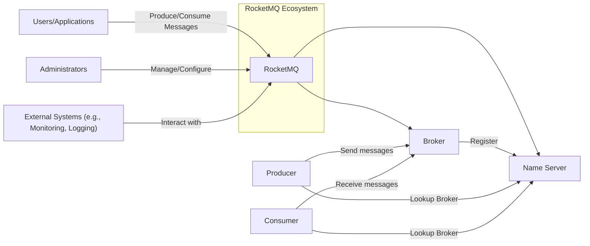
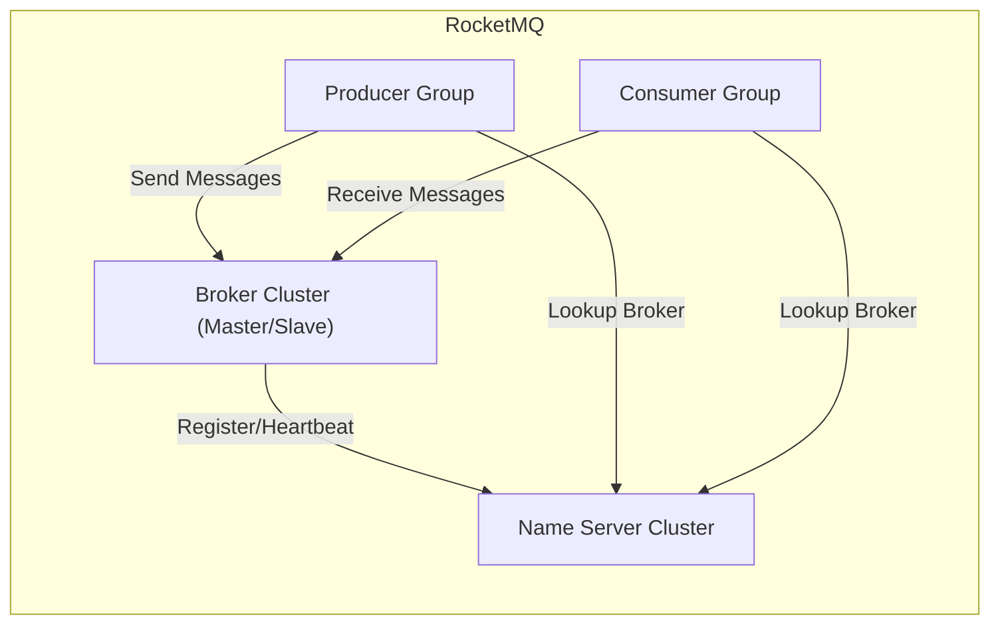
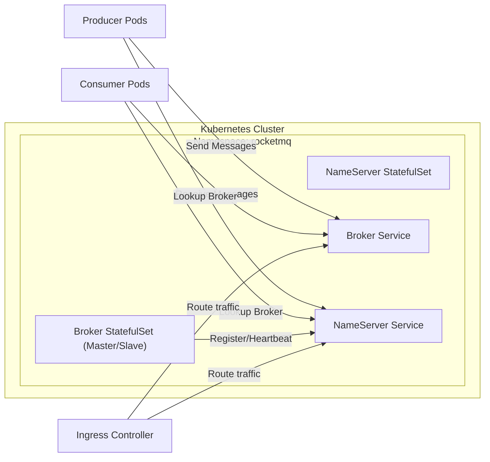
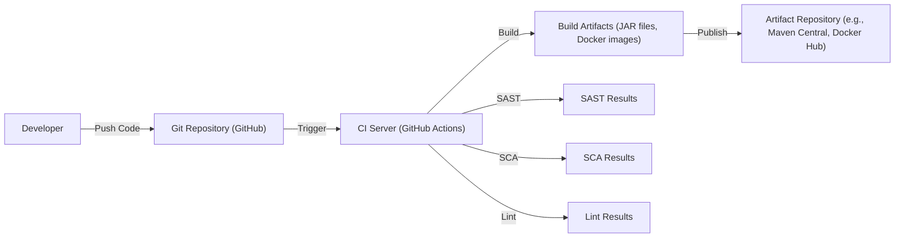

# BUSINESS POSTURE

Business Priorities and Goals:

*   Provide a reliable, scalable, and high-performance message queue system.
*   Support a variety of messaging patterns, including publish-subscribe, point-to-point, and request-reply.
*   Ensure high availability and fault tolerance.
*   Offer features like message ordering, transaction support, and scheduled delivery.
*   Maintain a vibrant open-source community and ecosystem.
*   Be a viable alternative to other message queue systems like Kafka and RabbitMQ.

Most Important Business Risks:

*   Data loss or corruption due to system failures or vulnerabilities.
*   Service unavailability impacting dependent applications.
*   Unauthorized access to sensitive messages.
*   Performance bottlenecks hindering message throughput.
*   Complexity in deployment and management.
*   Lack of adoption or community support.

# SECURITY POSTURE

Existing Security Controls:

*   security control: Authentication using AccessKey and SecretKey pairs (implied in documentation and code).
*   security control: Authorization based on ACLs (Access Control Lists) to restrict access to topics and consumer groups (mentioned in documentation).
*   security control: TLS/SSL encryption for secure communication between clients and brokers (configurable option, mentioned in documentation).
*   security control: Integration with external authentication systems like LDAP or Kerberos (mentioned as a potential feature).
*   security control: Basic input validation to prevent malformed requests (implied, common practice).

Accepted Risks:

*   accepted risk: Reliance on community contributions for security audits and vulnerability patching.
*   accepted risk: Potential for misconfiguration of security features (ACLs, TLS) leading to vulnerabilities.
*   accepted risk: Limited built-in protection against sophisticated attacks like DDoS.
*   accepted risk: The complexity of the system may introduce unforeseen security vulnerabilities.

Recommended Security Controls:

*   Implement comprehensive auditing and logging of all security-relevant events.
*   Provide detailed security documentation and best practices guides.
*   Establish a clear vulnerability disclosure and response process.
*   Integrate with security monitoring and alerting systems.
*   Offer more granular access control options.
*   Implement rate limiting and throttling to mitigate DDoS attacks.
*   Regularly conduct security assessments and penetration testing.
*   Consider adding support for message encryption at rest.

Security Requirements:

*   Authentication:
    *   Strong authentication mechanisms must be used to verify the identity of clients (producers and consumers) and administrative users.
    *   Support for multi-factor authentication should be considered.
    *   Integration with existing enterprise identity providers (LDAP, Active Directory, etc.) should be supported.
*   Authorization:
    *   Fine-grained access control must be enforced to restrict access to topics, consumer groups, and administrative functions.
    *   The principle of least privilege should be applied.
    *   ACLs should be easily manageable and auditable.
*   Input Validation:
    *   All input from clients must be strictly validated to prevent injection attacks and other vulnerabilities.
    *   Message payloads should be validated against predefined schemas where applicable.
*   Cryptography:
    *   TLS/SSL must be used to encrypt all communication between clients and brokers.
    *   Strong ciphers and protocols should be enforced.
    *   Key management practices must be secure.
    *   Consider encrypting messages at rest.

# DESIGN

## C4 CONTEXT

Context Diagram Element List:

*   Element:
    *   Name: User/Applications
    *   Type: External Entity
    *   Description: Applications or users that interact with RocketMQ to send or receive messages.
    *   Responsibilities: Produce messages to topics, consume messages from topics.
    *   Security controls: Authentication, Authorization, TLS/SSL encryption.

*   Element:
    *   Name: Administrators
    *   Type: External Entity
    *   Description: Users responsible for managing and configuring the RocketMQ cluster.
    *   Responsibilities: Deploy, configure, monitor, and maintain the RocketMQ system.
    *   Security controls: Strong authentication, Role-Based Access Control (RBAC), Audit logging.

*   Element:
    *   Name: External Systems
    *   Type: External System
    *   Description: Systems that interact with RocketMQ for monitoring, logging, or other purposes.
    *   Responsibilities: Collect metrics, logs, and other data from RocketMQ.
    *   Security controls: Secure communication channels, Authentication, Authorization.

*   Element:
    *   Name: RocketMQ
    *   Type: System
    *   Description: The core RocketMQ message queue system.
    *   Responsibilities: Store, route, and deliver messages.
    *   Security controls: Authentication, Authorization, TLS/SSL encryption, ACLs, Input validation.

*   Element:
    *   Name: Name Server
    *   Type: Internal Component
    *   Description: Provides routing information for brokers and clients.
    *   Responsibilities: Maintain metadata about brokers and topics, handle broker registration, provide lookup services for producers and consumers.
    *   Security controls: Authentication, Authorization, TLS/SSL encryption.

*   Element:
    *   Name: Broker
    *   Type: Internal Component
    *   Description: Stores and manages messages.
    *   Responsibilities: Receive messages from producers, store messages persistently, deliver messages to consumers.
    *   Security controls: Authentication, Authorization, TLS/SSL encryption, ACLs, Input validation, Data storage security.

*   Element:
    *   Name: Producer
    *   Type: Internal Component
    *   Description: Sends messages to brokers.
    *   Responsibilities: Connect to brokers, send messages to specific topics.
    *   Security controls: Authentication, Authorization, TLS/SSL encryption.

*   Element:
    *   Name: Consumer
    *   Type: Internal Component
    *   Description: Receives messages from brokers.
    *   Responsibilities: Connect to brokers, subscribe to topics, receive and process messages.
    *   Security controls: Authentication, Authorization, TLS/SSL encryption.

## C4 CONTAINER

Container Diagram Element List:

*   Element:
    *   Name: Name Server Cluster
    *   Type: Container (Cluster)
    *   Description: A cluster of Name Servers for high availability and fault tolerance.
    *   Responsibilities: Maintain metadata about brokers and topics, handle broker registration, provide lookup services for producers and consumers.
    *   Security controls: Authentication, Authorization, TLS/SSL encryption, Internal network security.

*   Element:
    *   Name: Broker Cluster (Master/Slave)
    *   Type: Container (Cluster)
    *   Description: A cluster of Brokers, with master-slave replication for high availability and data redundancy.
    *   Responsibilities: Receive messages from producers, store messages persistently, deliver messages to consumers, replicate data between master and slave brokers.
    *   Security controls: Authentication, Authorization, TLS/SSL encryption, ACLs, Input validation, Data storage security, Internal network security.

*   Element:
    *   Name: Producer Group
    *   Type: Container (Logical Group)
    *   Description: A group of producers that send messages to the same topic.
    *   Responsibilities: Connect to brokers, send messages to specific topics.
    *   Security controls: Authentication, Authorization, TLS/SSL encryption.

*   Element:
    *   Name: Consumer Group
    *   Type: Container (Logical Group)
    *   Description: A group of consumers that subscribe to the same topic and share the message load.
    *   Responsibilities: Connect to brokers, subscribe to topics, receive and process messages.
    *   Security controls: Authentication, Authorization, TLS/SSL encryption.

## DEPLOYMENT

Possible Deployment Solutions:

1.  Bare-metal deployment: Deploying RocketMQ directly on physical servers.
2.  Virtual machine deployment: Deploying RocketMQ on virtual machines (e.g., using cloud providers like AWS EC2, Azure VMs, or Google Compute Engine).
3.  Containerized deployment: Deploying RocketMQ using Docker containers, potentially orchestrated with Kubernetes.
4.  Hybrid deployment: A combination of the above, where some components might be on-premises and others in the cloud.

Chosen Solution (Containerized Deployment with Kubernetes):

Deployment Diagram Element List:

*   Element:
    *   Name: Kubernetes Cluster
    *   Type: Infrastructure Node
    *   Description: The Kubernetes cluster where RocketMQ is deployed.
    *   Responsibilities: Orchestrate and manage the RocketMQ containers.
    *   Security controls: Kubernetes RBAC, Network Policies, Pod Security Policies, Secrets management.

*   Element:
    *   Name: Namespace: rocketmq
    *   Type: Logical Grouping
    *   Description: A Kubernetes namespace to isolate the RocketMQ deployment.
    *   Responsibilities: Provide a scope for names and resources related to RocketMQ.
    *   Security controls: Kubernetes RBAC, Network Policies.

*   Element:
    *   Name: NameServer StatefulSet
    *   Type: Kubernetes StatefulSet
    *   Description: A StatefulSet to manage the Name Server pods.
    *   Responsibilities: Ensure stable network identities and persistent storage for Name Servers.
    *   Security controls: Kubernetes RBAC, Network Policies, Pod Security Policies.

*   Element:
    *   Name: Broker StatefulSet (Master/Slave)
    *   Type: Kubernetes StatefulSet
    *   Description: A StatefulSet to manage the Broker pods (master and slave).
    *   Responsibilities: Ensure stable network identities and persistent storage for Brokers, manage master-slave replication.
    *   Security controls: Kubernetes RBAC, Network Policies, Pod Security Policies.

*   Element:
    *   Name: Broker Service
    *   Type: Kubernetes Service
    *   Description: A Kubernetes Service to expose the Broker pods.
    *   Responsibilities: Provide a stable endpoint for producers and consumers to connect to the Brokers.
    *   Security controls: Kubernetes RBAC, Network Policies.

*   Element:
    *   Name: NameServer Service
    *   Type: Kubernetes Service
    *   Description:  A Kubernetes Service to expose the NameServer pods.
    *   Responsibilities: Provide a stable endpoint for producers, consumers and brokers to connect to the NameServers.
    *   Security controls: Kubernetes RBAC, Network Policies.

*   Element:
    *   Name: Producer Pods
    *   Type: Kubernetes Pod
    *   Description: Pods running producer applications.
    *   Responsibilities: Send messages to the Broker Service.
    *   Security controls: Authentication, Authorization, TLS/SSL encryption (configured in the producer application).

*   Element:
    *   Name: Consumer Pods
    *   Type: Kubernetes Pod
    *   Description: Pods running consumer applications.
    *   Responsibilities: Receive messages from the Broker Service.
    *   Security controls: Authentication, Authorization, TLS/SSL encryption (configured in the consumer application).

*   Element:
    *   Name: Ingress Controller
    *   Type: Kubernetes Ingress
    *   Description: Ingress controller to manage external access to services.
    *   Responsibilities: Route external traffic to NameServer and Broker services.
    *   Security controls: TLS termination, Authentication, Authorization.

## BUILD

Build Process Description:

1.  Developers write code and push it to the GitHub repository.
2.  GitHub Actions (or a similar CI/CD system) is triggered by the push.
3.  The CI server checks out the code.
4.  The CI server builds the project (e.g., using Maven).
5.  Static Application Security Testing (SAST) tools are run to analyze the code for vulnerabilities.
6.  Software Composition Analysis (SCA) tools are run to identify vulnerabilities in dependencies.
7.  Linters are used to enforce code style and identify potential issues.
8.  If all checks pass, the build artifacts (JAR files, Docker images) are created.
9.  The build artifacts are published to an artifact repository (e.g., Maven Central for JAR files, Docker Hub for Docker images).

Security Controls in Build Process:

*   security control: SAST (Static Application Security Testing): Use tools like FindBugs, PMD, or SonarQube to analyze the code for vulnerabilities.
*   security control: SCA (Software Composition Analysis): Use tools like OWASP Dependency-Check or Snyk to identify vulnerabilities in third-party libraries.
*   security control: Linting: Use linters to enforce code style and identify potential errors.
*   security control: Build Automation: Use a CI/CD system (GitHub Actions, Jenkins, etc.) to automate the build process and ensure consistency.
*   security control: Artifact Signing: Sign the build artifacts to ensure their integrity and authenticity.
*   security control: Supply Chain Security: Use signed commits, verify dependencies, and use trusted artifact repositories.

# RISK ASSESSMENT

Critical Business Processes to Protect:

*   Message delivery: Ensuring messages are delivered reliably and in a timely manner.
*   Message ordering: Maintaining the order of messages where required.
*   Data integrity: Preventing data loss or corruption.
*   Service availability: Maintaining high availability of the RocketMQ service.

Data to Protect and Sensitivity:

*   Message content: The sensitivity of the message content depends on the specific application using RocketMQ. It could range from non-sensitive operational data to highly sensitive personal or financial information.
*   Metadata (topics, consumer groups, etc.): Moderately sensitive, as it could reveal information about the application architecture and communication patterns.
*   Access credentials (AccessKey, SecretKey): Highly sensitive, as they grant access to the RocketMQ system.
*   Configuration data: Moderately sensitive, as it could expose vulnerabilities if misconfigured.

# QUESTIONS & ASSUMPTIONS

Questions:

*   What are the specific compliance requirements (e.g., GDPR, HIPAA, PCI DSS) that apply to the systems using RocketMQ?
*   What are the expected message throughput and latency requirements?
*   What is the expected message size distribution?
*   What are the existing security policies and procedures of the organization?
*   What is the level of expertise of the operations team in managing message queue systems?
*   Are there any specific threat models or attack scenarios that are of particular concern?
*   What level of monitoring and alerting is currently in place?
*   What is the disaster recovery plan for the RocketMQ system?

Assumptions:

*   BUSINESS POSTURE: The organization prioritizes reliability, scalability, and performance. The organization has a moderate risk appetite.
*   SECURITY POSTURE: The organization has basic security controls in place, but there is room for improvement. The organization is willing to invest in security enhancements.
*   DESIGN: The deployment will be containerized using Kubernetes. The build process will be automated using GitHub Actions. The system will be used in a production environment with moderate to high message volume.