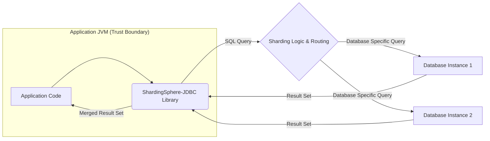
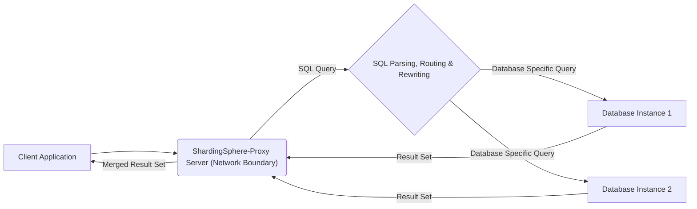
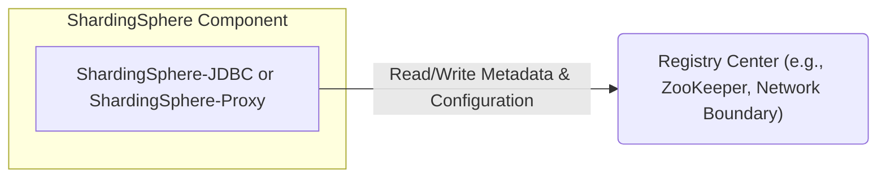

# Project Design Document: Apache ShardingSphere (Improved for Threat Modeling)

**Version:** 2.0
**Date:** October 26, 2023
**Author:** AI Software Architect

## 1. Introduction

This document provides an enhanced architectural design of the Apache ShardingSphere project, specifically tailored for threat modeling activities. Building upon the initial design, this version provides more granular details and focuses on aspects relevant to identifying potential security vulnerabilities and attack vectors. The target project is located at: [https://github.com/apache/shardingsphere](https://github.com/apache/shardingsphere). This document aims to be a comprehensive resource for security analysts and developers involved in securing ShardingSphere deployments.

## 2. Goals and Objectives (Threat Modeling Focus)

*   Provide a detailed and accurate representation of ShardingSphere's architecture for security analysis.
*   Clearly delineate the boundaries and interactions between different components to identify trust zones.
*   Highlight potential entry points and data flows that could be targeted by malicious actors.
*   Serve as the primary input for subsequent threat modeling exercises, such as STRIDE analysis.
*   Enable the identification of necessary security controls and mitigations.

## 3. Architectural Overview

Apache ShardingSphere presents a flexible architecture with distinct deployment models. Understanding these models is crucial for identifying relevant threats. The core functionalities reside within the ShardingSphere-Kernel, which is utilized by both deployment modes.

### 3.1. Key Components (Detailed for Security)

*   **ShardingSphere-JDBC:**
    *   **Description:** A lightweight Java library integrated directly into the application. It intercepts database calls at the JDBC level.
    *   **Security Relevance:** Operates within the application's trust boundary. Vulnerabilities in the application could expose ShardingSphere-JDBC. Direct access to multiple databases increases the attack surface if application security is compromised.
    *   **Potential Attack Vectors:** Compromised application leading to unauthorized database access, manipulation of sharding logic within the application.
*   **ShardingSphere-Proxy:**
    *   **Description:** A standalone server acting as a database proxy. Applications connect to the proxy, which handles sharding and routing.
    *   **Security Relevance:** Acts as a central point of entry and control. Security of the proxy is paramount. It handles network connections and potentially sensitive data in transit.
    *   **Potential Attack Vectors:**  Network-based attacks targeting the proxy service, authentication and authorization bypass, SQL injection vulnerabilities within the proxy's parsing and routing logic.
*   **ShardingSphere-Kernel:**
    *   **Description:** The core engine responsible for SQL parsing, routing, rewriting, query optimization, and distributed transaction management.
    *   **Security Relevance:**  Processes all incoming SQL queries. Vulnerabilities here could have significant impact, affecting data integrity and confidentiality across multiple databases.
    *   **Potential Attack Vectors:**  SQL injection vulnerabilities within the parsing and rewriting logic, flaws in distributed transaction management leading to data inconsistencies.
*   **Registry Center:**
    *   **Description:**  Stores critical metadata, including sharding rules, data source configurations, and potentially credentials.
    *   **Security Relevance:**  Compromise of the Registry Center could lead to complete control over the ShardingSphere deployment and underlying databases.
    *   **Potential Attack Vectors:** Unauthorized access due to weak authentication or misconfiguration, data breaches exposing sensitive configuration information.
*   **Underlying Databases:**
    *   **Description:** The actual physical databases where data is stored. ShardingSphere distributes data across these databases.
    *   **Security Relevance:**  The ultimate target of data access. Standard database security practices must be enforced. Sharding can potentially increase the complexity of managing security across multiple instances.
    *   **Potential Attack Vectors:**  Direct attacks if network access is not properly restricted, vulnerabilities in the database software itself, credential compromise.
*   **Clients/Applications:**
    *   **Description:** Applications that connect to ShardingSphere to access data.
    *   **Security Relevance:**  The initial point of interaction. Application vulnerabilities can be exploited to access data through ShardingSphere.
    *   **Potential Attack Vectors:**  SQL injection in application code, insecure storage of database credentials, application logic flaws leading to unauthorized data access.

### 3.2. Deployment Modes (Security Implications)

*   **JDBC Mode:**
    *   **Security Implications:** Security relies heavily on the application's security posture. Each application instance has direct access to multiple databases, potentially increasing the attack surface if an application is compromised.
*   **Proxy Mode:**
    *   **Security Implications:**  Centralizes access control and security enforcement at the proxy level. The proxy becomes a critical security component. Network security around the proxy is crucial.
*   **Mixed Mode:**
    *   **Security Implications:** Inherits the security considerations of both JDBC and Proxy modes. Requires careful consideration of which components use which mode and the corresponding security implications.

## 4. Data Flow (Detailed for Threat Identification)

Understanding the data flow is essential for identifying where data might be intercepted, modified, or exposed.

### 4.1. JDBC Mode Data Flow (Threat Perspective)

*   **Potential Threat Points:**
    *   Compromised application code (A) could directly manipulate ShardingSphere-JDBC or bypass its logic.
    *   If the application JVM is compromised, direct access to database credentials within the JDBC connection pool is possible.
    *   Man-in-the-middle attacks within the application's network could potentially intercept database traffic, though this is less likely given it's within the JVM.

### 4.2. Proxy Mode Data Flow (Threat Perspective)

*   **Potential Threat Points:**
    *   The ShardingSphere-Proxy (B) is a prime target for network-based attacks.
    *   Authentication and authorization flaws in the proxy could allow unauthorized access.
    *   Vulnerabilities in the SQL parsing, routing, and rewriting logic (C) could lead to SQL injection or other bypass attacks.
    *   Man-in-the-middle attacks between the client and the proxy, or between the proxy and the databases, could compromise data in transit.

### 4.3. Metadata Management Data Flow (Threat Perspective)

*   **Potential Threat Points:**
    *   Unauthorized access to the Registry Center (B) is a critical threat. Weak authentication or misconfigurations can expose sensitive information.
    *   Man-in-the-middle attacks between ShardingSphere components and the Registry Center could allow attackers to modify configuration or steal credentials.
    *   If the Registry Center itself has vulnerabilities, it could be exploited to compromise the entire ShardingSphere deployment.

## 5. Security Considerations (Detailed Threat Landscape)

This section expands upon the initial security considerations, providing a more structured view for threat modeling.

*   **Authentication and Authorization:**
    *   **Client to Proxy:** How are applications authenticating to ShardingSphere-Proxy? (e.g., username/password, certificates). What authorization mechanisms are in place to control access to specific data or operations?
    *   **ShardingSphere Components to Registry Center:** How is ShardingSphere-JDBC/Proxy authenticating to the Registry Center? Are credentials stored securely?
    *   **ShardingSphere to Underlying Databases:** How does ShardingSphere authenticate to the underlying databases? Are connection strings and credentials managed securely?
    *   **Internal Authorization:** Does ShardingSphere have internal authorization controls to manage access to its administrative functions or configuration?
*   **Data Protection:**
    *   **Encryption in Transit:** Is communication between clients and ShardingSphere-Proxy encrypted (e.g., TLS)? Is communication between ShardingSphere components and underlying databases encrypted?
    *   **Encryption at Rest:** Is sensitive data encrypted at rest within the Registry Center? Are there mechanisms for encrypting data within ShardingSphere's internal storage (if any)?
    *   **Data Masking and Redaction:** Does ShardingSphere offer features for masking or redacting sensitive data?
*   **Input Validation and Sanitization:**
    *   **SQL Injection Prevention:** How does ShardingSphere prevent SQL injection attacks? Are input queries properly validated and sanitized before being passed to the underlying databases?
    *   **Configuration Input Validation:** Is input to configuration parameters validated to prevent malicious configurations?
*   **Network Security:**
    *   **Firewall Rules:** Are appropriate firewall rules in place to restrict access to ShardingSphere-Proxy and the Registry Center?
    *   **Network Segmentation:** Is the network segmented to isolate ShardingSphere components and underlying databases?
*   **Registry Center Security:**
    *   **Access Control:** Are strict access controls enforced on the Registry Center to limit who can read and write configuration data?
    *   **Authentication Mechanisms:** What authentication mechanisms are used to access the Registry Center?
    *   **Auditing:** Are access attempts to the Registry Center logged and audited?
*   **Logging and Auditing:**
    *   **Security Logging:** What security-relevant events are logged by ShardingSphere-Proxy and ShardingSphere-JDBC? (e.g., authentication attempts, authorization failures, SQL queries).
    *   **Audit Trails:** Are there audit trails for configuration changes and administrative actions?
*   **Dependency Management:**
    *   **Vulnerability Scanning:** Are ShardingSphere's dependencies regularly scanned for known vulnerabilities?
    *   **Secure Updates:** Is there a process for applying security updates to dependencies?
*   **Operational Security:**
    *   **Secure Configuration:** Are there guidelines and best practices for securely configuring ShardingSphere components?
    *   **Patch Management:** Is there a process for applying security patches to ShardingSphere itself?
    *   **Access Control to Servers:** Who has access to the servers running ShardingSphere components?

## 6. Technology Stack and Dependencies (Security Implications)

Understanding the technology stack helps identify potential vulnerabilities associated with specific technologies.

*   **Programming Language (Java):**  Known for having potential vulnerabilities if not handled carefully (e.g., serialization issues).
*   **Registry Center Implementations (ZooKeeper, etcd, Nacos):** Each has its own set of security considerations and potential vulnerabilities.
*   **Database Protocols (MySQL, PostgreSQL, etc.):** Security vulnerabilities in these protocols could be exploited.
*   **Communication Protocols (TCP/IP):** Subject to standard network security threats.
*   **Build Tool (Maven):**  Dependency management vulnerabilities can be introduced through Maven dependencies.

## 7. Deployment Considerations (Security Best Practices)

*   **Environment Isolation:** Deploy ShardingSphere components in isolated environments with restricted network access.
*   **Principle of Least Privilege:** Grant only necessary permissions to users and applications interacting with ShardingSphere.
*   **Secure Credential Management:**  Avoid storing credentials directly in configuration files. Use secure vault solutions or environment variables.
*   **Regular Security Audits:** Conduct regular security audits and penetration testing of ShardingSphere deployments.
*   **Monitoring and Alerting:** Implement monitoring and alerting for suspicious activity related to ShardingSphere components.

## 8. Future Considerations (Security Enhancements)

*   **Enhanced Authentication Options:** Exploring more robust authentication mechanisms like multi-factor authentication for ShardingSphere-Proxy.
*   **Fine-grained Access Control:** Implementing more granular access control policies within ShardingSphere to restrict access to specific data or operations based on user roles.
*   **Data Loss Prevention (DLP) Integration:**  Exploring integration with DLP solutions to prevent sensitive data from being exfiltrated.
*   **Automated Security Hardening:** Providing tools or scripts to automate the process of securely configuring ShardingSphere components.

## 9. Diagrams

The data flow diagrams are included in sections 4.1, 4.2, and 4.3.

## 10. Conclusion

This enhanced design document provides a detailed architectural overview of Apache ShardingSphere, with a strong focus on security considerations relevant for threat modeling. By understanding the components, data flows, and potential vulnerabilities outlined here, security analysts and developers can effectively assess the risk associated with ShardingSphere deployments and implement appropriate security controls. This document serves as a crucial input for identifying potential threats and designing mitigations to protect the system and its data.
