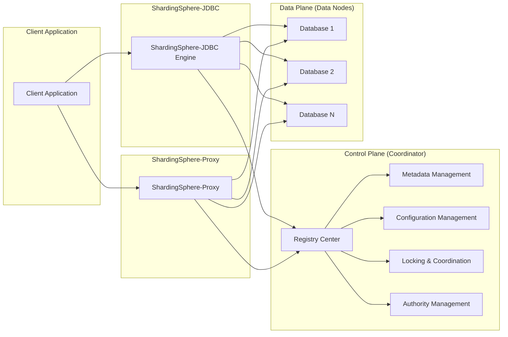
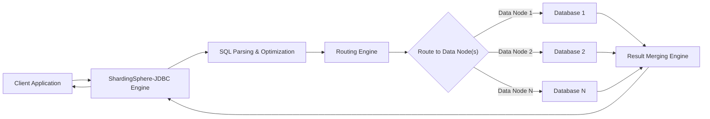
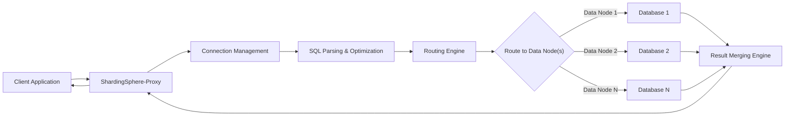

## Project Design Document: Apache ShardingSphere (Improved)

**1. Introduction**

This document provides an enhanced and detailed design overview of the Apache ShardingSphere project, intended to serve as a robust foundation for subsequent threat modeling activities. It meticulously outlines the key architectural components, data flows, and deployment models, facilitating the identification of potential security vulnerabilities and the design of appropriate mitigation strategies. This document aims for clarity and precision to ensure effective threat analysis.

**2. Project Overview**

Apache ShardingSphere is an open-source ecosystem designed to transform any existing database into a distributed database system. It offers functionalities such as data sharding, elastic scaling, distributed transaction management, and data encryption. ShardingSphere provides two primary products, catering to different architectural needs:

*   **ShardingSphere-JDBC:** A lightweight, client-side Java framework that augments the capabilities of standard JDBC drivers. It operates within the application's process, directly interacting with data sources.
*   **ShardingSphere-Proxy:** A standalone database proxy server that intercepts and manages database requests. It operates as an independent service, accepting connections via standard database protocols.

Both ShardingSphere-JDBC and ShardingSphere-Proxy offer the same core functionalities and feature set, allowing users to choose the deployment model that best suits their architectural requirements.

**3. Architectural Overview**

ShardingSphere's architecture is structured in a layered manner, promoting separation of concerns and modularity. The core components interact to provide a comprehensive distributed database solution.

**4. Component Details**

This section provides a detailed description of the key components within the ShardingSphere architecture, highlighting their functionalities and security-relevant aspects:

*   **Client Application:** The application initiating database interactions. It connects to ShardingSphere either through the JDBC driver or via the Proxy.
*   **ShardingSphere-JDBC Engine:**
    *   A Java library seamlessly integrated into the application.
    *   Intercepts standard JDBC calls, transparently applying sharding, routing, rewriting, and other distributed database logic.
    *   Manages direct connections to the underlying data nodes, handling connection pooling and resource management.
    *   Security considerations include the application's own security posture and the secure management of database credentials within the application.
*   **ShardingSphere-Proxy:**
    *   A standalone, stateless server acting as a database intermediary.
    *   Accepts database connections using standard protocols (e.g., MySQL, PostgreSQL).
    *   Receives SQL statements, performs parsing, optimization, routing, and execution across the appropriate data nodes.
    *   Aggregates and merges results from multiple data nodes before returning them to the client.
    *   Security considerations include securing the proxy server itself, managing access control to the proxy, and ensuring secure communication channels.
*   **Control Plane (Coordinator):** Responsible for managing the distributed database environment and ensuring consistency and governance.
    *   **Registry Center:** A distributed coordination service (e.g., Apache ZooKeeper, etcd, Consul) crucial for:
        *   Centralized storage of metadata, including sharding rules, topology information, and data source configurations.
        *   Service discovery for ShardingSphere-Proxy instances, enabling load balancing and high availability.
        *   Coordination and synchronization between different ShardingSphere components, ensuring consistent state across the distributed system.
        *   Security considerations involve securing access to the registry center, as it holds sensitive configuration data. Compromise of the registry center can lead to a compromise of the entire ShardingSphere deployment.
    *   **Metadata Management:** Responsible for maintaining the logical schema and metadata of the distributed database, abstracting away the physical sharding details.
    *   **Configuration Management:** Handles the loading, validation, and management of ShardingSphere's configuration, including sharding strategies, data source definitions, and rule configurations. Secure configuration management is vital to prevent unauthorized modifications.
    *   **Locking & Coordination:** Provides distributed locking mechanisms to ensure data consistency during distributed transactions, schema changes, and other critical operations. This prevents race conditions and data corruption in a distributed environment.
    *   **Authority Management:** Manages user authentication and authorization for accessing and managing the ShardingSphere cluster, particularly relevant for ShardingSphere-Proxy. This component controls who can connect to the proxy and what operations they are permitted to perform.
*   **Data Plane (Data Nodes):** The actual underlying database instances (e.g., MySQL, PostgreSQL, SQL Server) that store the sharded data. Security of these nodes is paramount and should follow standard database security best practices.

**5. Data Flow**

The data flow within ShardingSphere differs slightly depending on the chosen deployment model (JDBC or Proxy).

**5.1. Data Flow with ShardingSphere-JDBC:**

*   The client application initiates a database operation by sending a SQL statement through the ShardingSphere-JDBC driver.
*   The ShardingSphere-JDBC Engine intercepts the SQL statement and performs parsing and optimization.
*   The Routing Engine determines the target data node(s) based on the sharding rules and the SQL statement.
*   The engine executes the SQL statement on the identified data nodes.
*   The Result Merging Engine gathers the results from the relevant data nodes and merges them into a single result set.
*   The merged result is returned to the client application.

**5.2. Data Flow with ShardingSphere-Proxy:**

*   The client application establishes a connection to the ShardingSphere-Proxy using a standard database protocol.
*   The client application sends a SQL statement to the proxy.
*   The Connection Management component handles the connection lifecycle.
*   The SQL Parsing & Optimization component parses and optimizes the incoming SQL statement.
*   The Routing Engine determines the target data node(s) based on the sharding rules.
*   The proxy forwards the SQL statement to the appropriate data nodes.
*   The Result Merging Engine collects and merges the results from the data nodes.
*   The merged result is sent back to the client application.

**6. Security Considerations (Detailed)**

This section expands on the initial security considerations, providing more specific details and potential attack vectors:

*   **Authentication and Authorization:**
    *   **ShardingSphere-Proxy Authentication:**  How are clients authenticated when connecting to the ShardingSphere-Proxy?  Mechanisms might include username/password, certificate-based authentication, or integration with external authentication providers (e.g., LDAP, Kerberos). Weak authentication mechanisms or default credentials pose a significant risk.
    *   **Data Node Authentication:** How does ShardingSphere authenticate to the underlying data nodes? Secure storage and management of data node credentials are crucial.
    *   **Authorization:** How are user permissions managed within ShardingSphere? Does it support granular access control based on roles or privileges? Lack of proper authorization can lead to unauthorized data access or modification.
*   **Data Encryption:**
    *   **Transit Encryption:** Is communication between the client and ShardingSphere (both JDBC and Proxy) encrypted (e.g., using TLS/SSL)? Unencrypted communication exposes sensitive data to interception.
    *   **At-Rest Encryption:** Is data encrypted at rest in the underlying databases? ShardingSphere can integrate with database-level encryption mechanisms.
    *   **Encryption Features within ShardingSphere:** ShardingSphere offers data encryption and decryption features. How are encryption keys managed and protected? Weak key management can negate the benefits of encryption.
    *   **Data Masking and Tokenization:** Does ShardingSphere offer capabilities for masking or tokenizing sensitive data? This can help protect data in non-production environments or when sharing data with third parties.
*   **Injection Attacks:**
    *   **SQL Injection:** How does ShardingSphere prevent SQL injection attacks? Input validation, parameterized queries, and escaping are essential. Vulnerabilities in the parsing and rewriting logic could introduce injection risks.
    *   **Other Injection Vectors:** Are there other potential injection points, such as through configuration parameters or management interfaces?
*   **Configuration Security:**
    *   **Secure Storage:** How is the ShardingSphere configuration stored (e.g., in files, the registry center)? Is it encrypted and protected from unauthorized access?
    *   **Access Control:** Who has the authority to modify the ShardingSphere configuration? Improperly managed access can lead to malicious configuration changes.
*   **Registry Center Security:**
    *   **Access Control:** How is access to the Registry Center secured? Authentication and authorization are critical to prevent unauthorized access and modification of metadata.
    *   **Data Integrity:** How is the integrity of the data in the Registry Center ensured? Tampering with the registry can have severe consequences for the ShardingSphere cluster.
*   **Communication Security:**
    *   **Inter-Component Communication:** Is communication between ShardingSphere components (e.g., Proxy and Registry Center) secured?
*   **Dependency Vulnerabilities:**
    *   **Third-Party Libraries:** What are the security implications of the dependencies used by ShardingSphere? Regular vulnerability scanning and patching are necessary.
*   **Denial of Service (DoS):**
    *   **Resource Exhaustion:** How resilient is ShardingSphere to DoS attacks that attempt to exhaust resources (e.g., connection limits, CPU, memory)?
    *   **Rate Limiting:** Are there any rate limiting mechanisms in place to prevent abuse?
*   **Logging and Auditing:**
    *   **Audit Trails:** Does ShardingSphere provide sufficient logging and auditing capabilities to track user activity and security-related events?
    *   **Log Security:** How are logs stored and protected from unauthorized access or modification?
*   **Management Interfaces:**
    *   **Secure Access:** How are management interfaces (e.g., command-line tools, web UIs) secured? Strong authentication and authorization are essential.

**7. Deployment Model**

The chosen deployment model significantly impacts the security considerations for ShardingSphere:

*   **ShardingSphere-JDBC as a Library:** Security is heavily reliant on the security posture of the application itself. Vulnerabilities in the application can directly expose ShardingSphere and the underlying data. Secure coding practices and robust application security measures are crucial.
*   **ShardingSphere-Proxy as a Standalone Service:** Requires securing the proxy server infrastructure, including network security (firewalls, intrusion detection), operating system hardening, and secure access controls. The proxy becomes a central point of security enforcement.
*   **Cloud Deployments (e.g., AWS, Azure, GCP):** Security is a shared responsibility between the user and the cloud provider. Leveraging cloud-native security services (e.g., network security groups, IAM roles, encryption services) is essential. Proper configuration of cloud resources is critical.
*   **Containerized Deployments (e.g., Docker, Kubernetes):** Requires securing the container images, the container runtime environment, and the orchestration platform. Vulnerabilities in container images or misconfigurations in the orchestration platform can introduce security risks.

**8. Technologies Used**

*   **Core Language:** Java
*   **Supported Database Protocols:** MySQL, PostgreSQL, SQL Server, Oracle (via plugins), and others.
*   **Distributed Coordination Services:** Apache ZooKeeper, etcd, Consul.
*   **Build and Dependency Management:** Apache Maven.
*   **Testing Frameworks:** JUnit, Mockito.
*   **Configuration Formats:** YAML, Properties.

**9. Future Considerations**

This design document reflects the current architecture of Apache ShardingSphere. Future developments and enhancements may introduce new security considerations and require updates to this document and the subsequent threat model. Areas of future focus might include:

*   Enhanced security features and integrations.
*   Support for new database protocols and technologies.
*   Changes in the deployment landscape (e.g., more serverless deployments).

This improved design document provides a more comprehensive and detailed overview of Apache ShardingSphere, specifically tailored for effective threat modeling. The enhanced descriptions and expanded security considerations aim to facilitate a thorough analysis of potential vulnerabilities and the development of robust security mitigations.