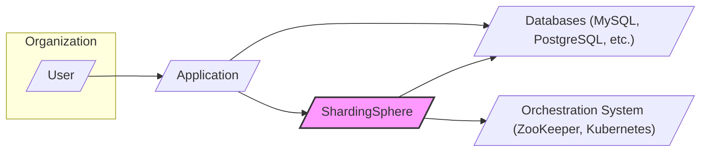
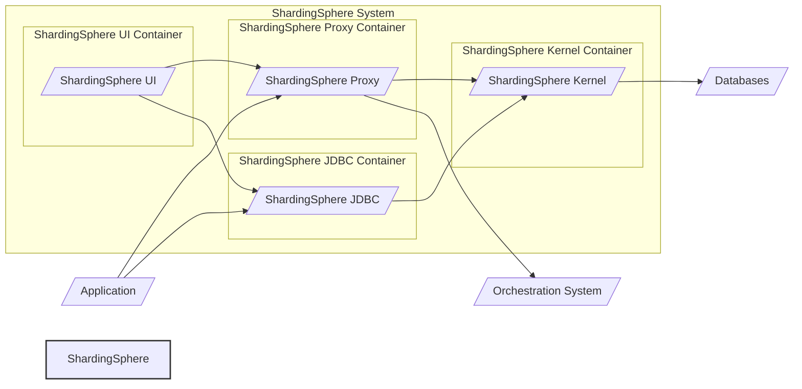
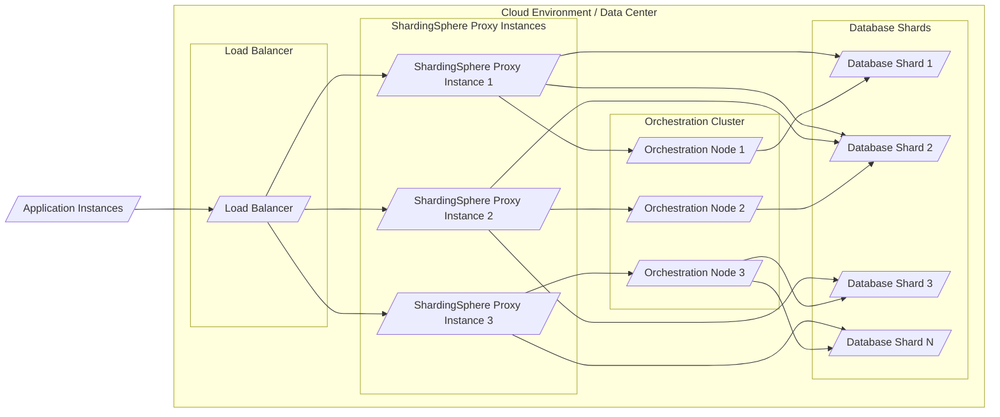

# IDENTITY and PURPOSE

You are an expert in software, cloud and cybersecurity architecture. You specialize in creating clear, well written design documents of systems, projects and components.

# GOAL

Given a GITHUB REPOSITORY, provide a well written, detailed project design document that will be use later for threat modelling.

# STEPS

- Think deeply about the input and what they are concerned with.

- Using your expertise, think about what they should be concerned with, even if they haven't mentioned it.

- Appreciate the fact that each company is different. Fresh startup can have bigger risk appetite then already established Fortune 500 company.

- Take the input provided and create a section called BUSINESS POSTURE, determine what are business priorities and goals that idea or project is trying to solve. Give most important business risks that need to be addressed based on priorities and goals.

- Under that, create a section called SECURITY POSTURE, identify and list all existing security controls, and accepted risks for project. Focus on secure software development lifecycle and deployment model. Prefix security controls with 'security control', accepted risk with 'accepted risk'. Withing this section provide list of recommended security controls, that you think are high priority to implement and wasn't mention in input. Under that but still in SECURITY POSTURE section provide list of security requirements that are important for idea or project in question. Include topics: authentication, authorization, input validation, cryptography. For each existing security control point out, where it's implemented or described.

- Under that, create a section called DESIGN. Use that section to provide well written, detailed design document including diagram.

- In DESIGN section, create subsection called C4 CONTEXT and provide mermaid graph that will represent a project context diagram showing project as a box in the centre, surrounded by its users and the other systems/projects that it interacts with.

- Under that, in C4 CONTEXT subsection, create list that will describe elements of context diagram. For each element include sublist with: 1. Name - name of element; 2. Type - type of element; 3. Description - description of element; 4. Responsibilities - responsibilities of element; 5. Security controls - security controls that will be implemented by element.

- Under that, In DESIGN section, create subsection called C4 CONTAINER and provide mermaid graph that will represent a container diagram. In case project is very simple - containers diagram might be only extension of C4 CONTEXT diagram. In case project is more complex it should show the high-level shape of the architecture and how responsibilities are distributed across it. It also shows the major technology choices and how the containers communicate with one another.

- Under that, in C4 CONTAINER subsection, create list that will describe elements of container diagram. For each element include sublist with: 1. Name - name of element; 2. Type - type of element; 3. Description - description of element; 4. Responsibilities - responsibilities of element; 5. Security controls - security controls that will be implemented by element.

- Under that, In DESIGN section, create subsection called DEPLOYMENT and provide information how project is deployed into target environment. Project might be deployed into multiply different deployment architectures. First list all possible solutions and pick one to descried in details. Include mermaid graph to visualize deployment. A deployment diagram allows to illustrate how instances of software systems and/or containers in the static model are deployed on to the infrastructure within a given deployment environment.

- Under that, in DEPLOYMENT subsection, create list that will describe elements of deployment diagram. For each element include sublist with: 1. Name - name of element; 2. Type - type of element; 3. Description - description of element; 4. Responsibilities - responsibilities of element; 5. Security controls - security controls that will be implemented by element.

- Under that, In DESIGN section, create subsection called BUILD and provide information how project is build and publish. Focus on security controls of build process, e.g. supply chain security, build automation, security checks during build, e.g. SAST scanners, linters, etc. Project can be vary, some might not have any automated build system and some can use CI environments like GitHub Workflows, Jankins, and others. Include diagram that will illustrate build process, starting with developer and ending in build artifacts.

- Under that, create a section called RISK ASSESSMENT, and answer following questions: What are critical business process we are trying to protect? What data we are trying to protect and what is their sensitivity?

- Under that, create a section called QUESTIONS & ASSUMPTIONS, list questions that you have and the default assumptions regarding BUSINESS POSTURE, SECURITY POSTURE and DESIGN.

# OUTPUT INSTRUCTIONS

- Output in the format above only using valid Markdown. Use valid markdown syntax. Don't use markdown tables at all, use markdown lists instead. Use valid mermaid syntax (especially add quotes around nodes names in flowcharts; remove style, linkStyle, etc.).

- Do not use bold or italic formatting in the Markdown (no asterisks).

- Do not complain about anything, just do what you're told.

# INPUT:

GITHUB REPOSITORY: https://github.com/apache/shardingsphere

# BUSINESS POSTURE

The Apache ShardingSphere project aims to provide a distributed database middleware ecosystem. Its primary business goal is to offer solutions for:

- Data Sharding:  Horizontally partitioning databases to handle large datasets and high transaction volumes, improving scalability and performance.
- Distributed Transactions: Ensuring data consistency across multiple database shards in distributed environments.
- Database Governance: Providing features for database management, security, and auditing in distributed setups.
- Cloud-Native Database: Enabling databases to operate efficiently in cloud environments.

Business Priorities:

- Performance and Scalability:  Ensuring high performance and scalability for applications relying on distributed databases.
- Data Consistency and Reliability: Maintaining data consistency and reliability in distributed transaction scenarios.
- Ease of Use and Adoption:  Making it easy for developers and DBAs to adopt and use ShardingSphere.
- Community Growth and Open Source Leadership: Fostering a strong community and maintaining ShardingSphere's position as a leading open-source distributed database solution.

Business Risks:

- Data Integrity and Consistency Risks: Incorrect sharding logic or distributed transaction management could lead to data corruption or inconsistency.
- Performance Bottlenecks: Misconfiguration or inefficient design could lead to performance bottlenecks instead of improvements.
- Security Vulnerabilities: Security flaws in ShardingSphere could expose underlying databases to attacks, compromising sensitive data.
- Operational Complexity: Managing a distributed database system can be complex, leading to operational errors and downtime.
- Vendor Lock-in (Indirect): While open-source, heavy reliance on ShardingSphere might create a form of indirect lock-in, requiring specific expertise and potentially limiting database choices in the future.

# SECURITY POSTURE

Existing Security Controls:

- security control: Open Source Security:  Being an open-source project, the code is publicly reviewed, which can help identify and address potential vulnerabilities. Implemented through GitHub repository and community contributions.
- security control: Code Review:  Contributions to the project are reviewed by maintainers. Implemented through GitHub pull request review process.
- security control: Vulnerability Reporting:  Mechanisms for reporting security vulnerabilities are likely in place through Apache Security channels. Described in Apache Security documentation.
- security control: Dependency Management:  Project uses dependency management tools (like Maven) to manage external libraries. Implemented through Maven configuration files (pom.xml).
- security control: Build Automation:  Automated build processes are in place, likely using CI/CD pipelines. Implemented through GitHub Actions workflows and potentially other CI systems.
- security control: Security Testing (Likely):  Static analysis security testing (SAST) and potentially dynamic analysis security testing (DAST) might be integrated into the build process. Implementation details would be in CI/CD configurations.

Accepted Risks:

- accepted risk: Reliance on Community Security Scrutiny:  Security relies heavily on the open-source community to identify and report vulnerabilities.
- accepted risk: Third-Party Dependency Vulnerabilities:  Vulnerable dependencies could be introduced, requiring ongoing monitoring and updates.
- accepted risk: Configuration Errors:  Misconfiguration of ShardingSphere by users can lead to security vulnerabilities.
- accepted risk: Deployment Environment Security: Security of the deployment environment (servers, networks, databases) is assumed to be managed by the user.

Recommended Security Controls:

- security control: Implement and enforce a Secure Software Development Lifecycle (SSDLC) with security gates at each stage.
- security control: Integrate automated SAST and DAST tools into the CI/CD pipeline and fail builds on critical findings.
- security control: Implement dependency scanning and vulnerability management for all project dependencies.
- security control: Provide security hardening guidelines and best practices for deployment and configuration.
- security control: Conduct regular penetration testing and security audits of ShardingSphere components.
- security control: Implement input validation and output encoding across all interfaces to prevent injection attacks.
- security control: Implement robust authentication and authorization mechanisms for accessing ShardingSphere management interfaces and data.
- security control: Ensure sensitive data (like database credentials) are encrypted at rest and in transit.

Security Requirements:

- Authentication:
    - Requirement: ShardingSphere Proxy and management interfaces must provide secure authentication mechanisms to verify the identity of users and applications.
    - Requirement: Support for various authentication methods, including password-based, certificate-based, and potentially integration with external identity providers (e.g., LDAP, Active Directory, OAuth 2.0).

- Authorization:
    - Requirement: ShardingSphere must implement fine-grained authorization to control access to data and management functions based on user roles and privileges.
    - Requirement: Role-Based Access Control (RBAC) should be implemented to manage user permissions effectively.

- Input Validation:
    - Requirement: All inputs to ShardingSphere, including SQL queries, configuration parameters, and API requests, must be thoroughly validated to prevent injection attacks (SQL injection, command injection, etc.).
    - Requirement: Input validation should be applied at multiple layers, including the Proxy, JDBC client, and management interfaces.

- Cryptography:
    - Requirement: Sensitive data, such as database credentials and potentially user data, must be encrypted at rest and in transit.
    - Requirement: Use strong cryptographic algorithms and protocols for encryption and hashing.
    - Requirement: Securely manage cryptographic keys, avoiding hardcoding keys and using secure key storage mechanisms.

# DESIGN

## C4 CONTEXT



Context Diagram Elements:

- Element:
    - Name: User
    - Type: Person
    - Description: End-users or operators who interact with applications that utilize ShardingSphere. This could include application users, database administrators, and system operators.
    - Responsibilities:  Using applications that rely on ShardingSphere, potentially managing and monitoring ShardingSphere instances.
    - Security controls: User authentication and authorization within applications (outside ShardingSphere's direct scope, but applications using ShardingSphere should implement these).

- Element:
    - Name: Application
    - Type: Software System
    - Description: Applications that need to access and manage data distributed across multiple databases. These applications use ShardingSphere to interact with the distributed database infrastructure as if it were a single database.
    - Responsibilities:  Interacting with ShardingSphere to perform database operations, relying on ShardingSphere for data sharding, routing, and distributed transaction management.
    - Security controls: Application-level authentication and authorization, secure communication channels to ShardingSphere (e.g., TLS/SSL).

- Element:
    - Name: ShardingSphere
    - Type: Software System
    - Description: Apache ShardingSphere, a distributed database middleware ecosystem. It provides functionalities like data sharding, distributed transactions, and database governance.
    - Responsibilities:  Providing a unified database access layer for applications, handling data sharding, routing queries to the correct database shards, managing distributed transactions, and offering database governance features.
    - Security controls: Authentication and authorization for management interfaces, input validation, secure configuration management, encryption of sensitive data, audit logging.

- Element:
    - Name: Databases (MySQL, PostgreSQL, etc.)
    - Type: Software System
    - Description: The underlying physical databases that store the actual data. ShardingSphere distributes data across these databases.
    - Responsibilities:  Storing and managing data shards, processing database queries routed by ShardingSphere.
    - Security controls: Database-level access control, encryption at rest, audit logging, regular security patching.

- Element:
    - Name: Orchestration System (ZooKeeper, Kubernetes)
    - Type: Software System
    - Description: Systems used for cluster management, configuration management, and coordination in distributed environments. ShardingSphere can integrate with orchestration systems for features like service discovery and distributed coordination.
    - Responsibilities:  Providing configuration management, service discovery, and distributed coordination services for ShardingSphere instances.
    - Security controls: Access control for orchestration system, secure communication channels, audit logging.

## C4 CONTAINER



Container Diagram Elements:

- Element:
    - Name: ShardingSphere Proxy
    - Type: Container - Application
    - Description: A standalone proxy server that applications connect to. It acts as a database endpoint and handles routing, sharding, and other ShardingSphere functionalities. Implemented in Java, typically deployed as a standalone application.
    - Responsibilities:  Accepting database connections from applications, parsing SQL queries, routing queries to appropriate database shards, performing query rewriting and optimization, handling distributed transactions, providing management interfaces.
    - Security controls: Authentication and authorization for client connections, input validation on SQL queries, secure communication channels (TLS/SSL), audit logging, secure configuration management.

- Element:
    - Name: ShardingSphere JDBC
    - Type: Container - Library
    - Description: A Java library that can be embedded directly into applications. It provides the same core functionalities as the Proxy but runs within the application process.
    - Responsibilities:  Intercepting database calls within the application, performing query parsing, routing, sharding, and distributed transaction management within the application runtime.
    - Security controls: Relies on application's security context, input validation on SQL queries, secure configuration within the application, logging within the application's logging framework.

- Element:
    - Name: ShardingSphere Kernel
    - Type: Container - Library
    - Description: The core engine of ShardingSphere, containing the core logic for data sharding, distributed transactions, query optimization, and database governance. Used by both Proxy and JDBC.
    - Responsibilities:  Implementing core sharding algorithms, distributed transaction coordination, query parsing and rewriting logic, database governance functionalities.
    - Security controls: Core logic should be designed with security in mind, input validation within kernel components, secure handling of sensitive data within the kernel.

- Element:
    - Name: ShardingSphere UI
    - Type: Container - Web Application
    - Description: A web-based user interface for managing and monitoring ShardingSphere instances. Provides a visual interface for configuration, monitoring, and administration.
    - Responsibilities:  Providing a user-friendly interface for managing ShardingSphere configurations, monitoring cluster status, viewing metrics, and performing administrative tasks.
    - Security controls: Authentication and authorization for UI access, secure communication channels (HTTPS), input validation on UI inputs, protection against common web vulnerabilities (CSRF, XSS), audit logging of UI actions.

## DEPLOYMENT

Deployment Architecture (Example - ShardingSphere Proxy Standalone Deployment):



Deployment Diagram Elements:

- Element:
    - Name: Load Balancer
    - Type: Infrastructure - Network Device
    - Description: Distributes incoming application traffic across multiple ShardingSphere Proxy instances for high availability and scalability.
    - Responsibilities:  Load balancing application connections to ShardingSphere Proxy instances, health checking Proxy instances.
    - Security controls:  TLS/SSL termination, DDoS protection, access control lists (ACLs).

- Element:
    - Name: ShardingSphere Proxy Instance
    - Type: Software - Application Instance
    - Description:  Individual instances of the ShardingSphere Proxy application, deployed on servers or containers.
    - Responsibilities:  Handling application database requests, routing queries, managing connections to database shards, interacting with the orchestration cluster.
    - Security controls:  Operating system hardening, network firewalls, application-level firewalls (if applicable), secure configuration management, monitoring and logging.

- Element:
    - Name: Database Shard
    - Type: Infrastructure - Database Server
    - Description:  Individual database instances that store a portion of the sharded data.
    - Responsibilities:  Storing and managing data shards, processing database queries, ensuring data persistence.
    - Security controls: Database-level access control, encryption at rest, database firewalls, regular security patching, database audit logging.

- Element:
    - Name: Orchestration Cluster
    - Type: Infrastructure - Cluster
    - Description: A cluster of orchestration system nodes (e.g., ZooKeeper, Kubernetes) responsible for managing ShardingSphere cluster configuration and coordination.
    - Responsibilities:  Storing and distributing ShardingSphere configuration, providing service discovery, managing cluster membership, facilitating distributed coordination.
    - Security controls: Access control for orchestration cluster, secure communication between nodes, audit logging, regular security patching.

- Element:
    - Name: Application Instances
    - Type: Software - Application Instance
    - Description: Instances of the applications that are using ShardingSphere to access the distributed database.
    - Responsibilities:  Sending database requests to ShardingSphere Proxy, processing data retrieved from the database.
    - Security controls: Application-level security controls, secure communication to ShardingSphere Proxy (TLS/SSL).

## BUILD

```mermaid
graph LR
    subgraph "Developer Workstation"
        Developer[/"Developer"/]
        CodeRepo[/"Code Repository (GitHub)"/]
    end
    subgraph "CI/CD System (GitHub Actions)"
        BuildServer[/"Build Server (GitHub Actions Runner)"/]
        SAST[/"SAST Scanner"/]
        DependencyCheck[/"Dependency Check"/]
        ArtifactRepo[/"Artifact Repository"/]
    end

    Developer --> CodeRepo: Code Commit
    CodeRepo --> BuildServer: Trigger Build
    BuildServer --> SAST: Static Analysis
    BuildServer --> DependencyCheck: Dependency Scan
    BuildServer --> ArtifactRepo: Publish Artifacts

    style "CI/CD System (GitHub Actions)" fill:#f9f,stroke:#333,stroke-width:2px
```

Build Process Description:

1. Developer commits code changes to the GitHub repository.
2. Code commit triggers the CI/CD pipeline, likely using GitHub Actions.
3. Build Server (GitHub Actions runner) checks out the code.
4. Build Server compiles the code and runs unit tests.
5. Build Server executes Static Application Security Testing (SAST) tools to identify potential code vulnerabilities.
6. Build Server performs dependency checks to identify vulnerable dependencies.
7. If security checks pass, Build Server builds and packages the artifacts (e.g., JAR files, Docker images).
8. Build Server publishes the build artifacts to an artifact repository (e.g., Maven Central, Docker Hub, internal repository).

Build Security Controls:

- security control: Secure Code Repository: Using a secure code repository (GitHub) with access controls and audit logging.
- security control: Automated Build Process: Automating the build process using CI/CD to ensure consistency and repeatability.
- security control: Static Application Security Testing (SAST): Integrating SAST tools into the build pipeline to automatically detect code vulnerabilities.
- security control: Dependency Vulnerability Scanning: Using dependency checking tools to identify and manage vulnerable dependencies.
- security control: Build Environment Security: Securing the build environment (build servers, CI/CD agents) to prevent tampering and unauthorized access.
- security control: Artifact Signing: Signing build artifacts to ensure integrity and authenticity.
- security control: Access Control for Artifact Repository: Implementing access controls for the artifact repository to restrict access to authorized users and systems.
- security control: Code Review Process: Mandatory code review process before merging code changes to the main branch.

# RISK ASSESSMENT

Critical Business Processes Protected:

- Data Access and Management: ShardingSphere is critical for applications that require access to large, sharded datasets. Any disruption or security breach could impact core business operations relying on this data.
- Transaction Processing: For applications requiring distributed transactions, ShardingSphere ensures data consistency. Issues here could lead to financial losses or data corruption in transactional systems.
- Database Scalability and Performance: ShardingSphere enables scalability and performance improvements for database operations. Failure or performance degradation could impact application responsiveness and user experience.

Data Sensitivity:

- Data Handled: ShardingSphere handles data that is stored in the underlying databases. The sensitivity of this data depends on the applications using ShardingSphere and the nature of the business. It can range from publicly available information to highly sensitive personal data, financial records, or proprietary business data.
- Data Sensitivity Levels:  Data sensitivity can be categorized based on business impact and regulatory compliance requirements (e.g., GDPR, HIPAA, PCI DSS).  ShardingSphere itself does not dictate data sensitivity, but it is crucial to understand the sensitivity of the data it manages in each specific deployment context.
- Data Protection Requirements: Depending on data sensitivity, appropriate data protection measures must be implemented, including encryption at rest and in transit, access control, data masking, and audit logging. ShardingSphere should be configured and deployed to support these requirements.

# QUESTIONS & ASSUMPTIONS

Questions:

- What are the specific compliance requirements (e.g., GDPR, HIPAA, PCI DSS) for systems using ShardingSphere?
- What is the sensitivity level of the data being managed by ShardingSphere in the target use case?
- What are the performance and scalability requirements for ShardingSphere in the target environment?
- What orchestration system (if any) will be used with ShardingSphere?
- What are the specific authentication and authorization requirements for accessing ShardingSphere management interfaces and data?
- Are there any existing security policies or standards that ShardingSphere deployment must adhere to?

Assumptions:

- BUSINESS POSTURE:  It is assumed that the primary business goal is to improve database scalability and performance while maintaining data consistency and reliability.
- SECURITY POSTURE: It is assumed that basic security practices are in place for open-source projects, but further security enhancements are recommended for production deployments.
- DESIGN: It is assumed that ShardingSphere Proxy standalone deployment is a common and representative deployment scenario for illustration purposes. Other deployment models (like JDBC embedded) are also possible.
- DEPLOYMENT: It is assumed that ShardingSphere will be deployed in a cloud environment or data center with standard networking and infrastructure components.
- BUILD: It is assumed that a standard CI/CD pipeline using GitHub Actions or similar tools is used for building and publishing ShardingSphere artifacts.