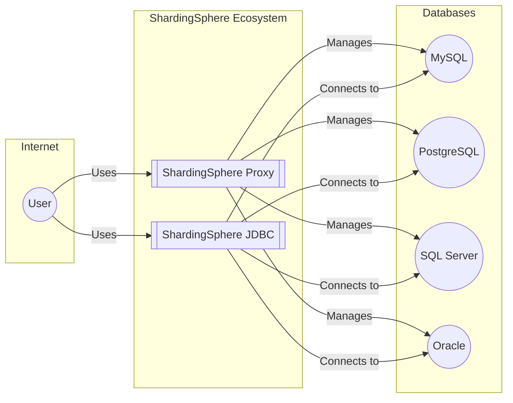
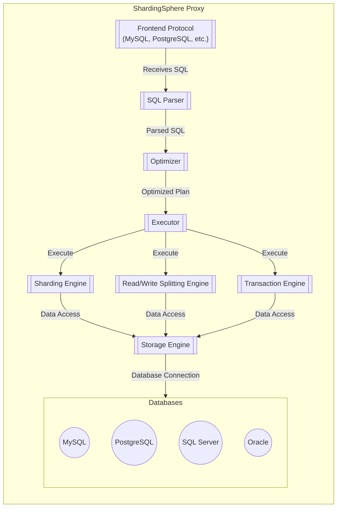
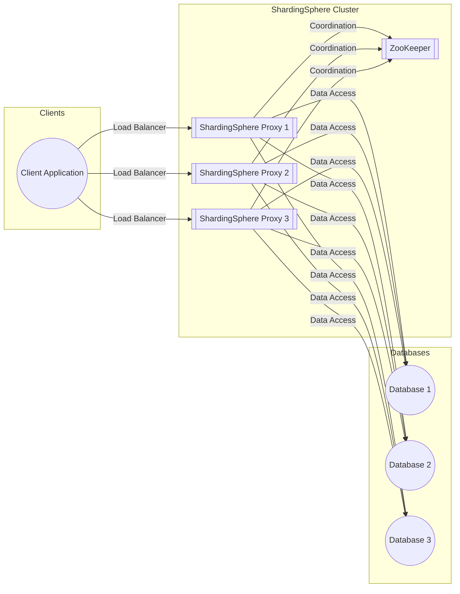
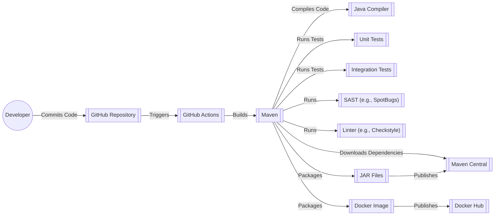

Okay, let's dive into creating a design document for Apache ShardingSphere, keeping in mind its purpose and potential security considerations.

# BUSINESS POSTURE

Apache ShardingSphere is a distributed database middleware ecosystem.  It's designed to enhance existing databases (like MySQL, PostgreSQL, SQL Server, Oracle, etc.) with features like data sharding, read/write splitting, distributed transactions, and data encryption, without requiring significant application code changes.  It positions itself as a "Database Plus" concept, aiming to bridge the gap between databases and applications in a distributed environment.

Business Priorities:

*   Scalability: Enable applications to handle massive datasets and high transaction volumes by distributing data and load across multiple database instances.
*   Performance: Improve database query performance through read/write splitting and optimized routing.
*   Availability: Enhance database availability by providing failover mechanisms and reducing single points of failure.
*   Flexibility: Support various database systems and deployment models (standalone, clustered, cloud-native).
*   Ease of Use: Minimize the complexity of managing a distributed database system for application developers.
*   Cost-Effectiveness: Optimize resource utilization and potentially reduce infrastructure costs compared to monolithic database setups.
*   Data Security: Provide features for data encryption and access control in a distributed environment.

Business Risks:

*   Data Consistency Issues: Incorrectly configured sharding or distributed transactions could lead to data inconsistencies, potentially impacting business operations and financial reporting.
*   Operational Complexity: Managing a distributed database system is inherently more complex than a single instance, increasing the risk of misconfiguration and operational errors.
*   Security Vulnerabilities:  If not properly secured, ShardingSphere itself could become a point of attack, potentially exposing sensitive data across multiple database instances.  This includes vulnerabilities in the middleware itself, as well as misconfigurations.
*   Vendor Lock-in (to a degree): While ShardingSphere supports multiple databases, adopting it introduces a dependency on the framework, which could impact future migration options.
*   Performance Bottlenecks:  If sharding or routing is not optimized, performance could be worse than a well-tuned single-instance database.
*   Data Loss: Failure of multiple database nodes, combined with inadequate backup/recovery procedures, could lead to data loss.

# SECURITY POSTURE

Existing Security Controls (based on the GitHub repository and documentation):

*   security control: Authentication: ShardingSphere supports various authentication mechanisms, including username/password, and integration with existing database authentication systems. It also supports pluggable authentication providers. Described in documentation and configuration files.
*   security control: Authorization: ShardingSphere provides role-based access control (RBAC) to manage user permissions on different database resources (shards, tables, etc.).  This is configurable and can be integrated with existing database authorization mechanisms. Described in documentation and configuration files.
*   security control: Data Encryption: ShardingSphere offers data encryption features, including transparent data encryption (TDE) and column-level encryption. This helps protect sensitive data at rest and in transit. Described in documentation and configuration files.
*   security control: SQL Parsing and Rewriting: ShardingSphere parses and rewrites SQL queries to route them to the appropriate database shards. This process can include security checks to prevent unauthorized access or malicious SQL injection. Implemented in core code.
*   security control: Auditing: ShardingSphere can be configured to log database operations, providing an audit trail for security monitoring and compliance. Described in documentation and configuration files.
*   security control: Firewall/Network Security: While not directly part of ShardingSphere, deployment typically involves network security measures (firewalls, security groups) to control access to the ShardingSphere proxy and database instances. Implemented in deployment environment.
*   security control: Secure Communication: Supports TLS/SSL for secure communication between the application, ShardingSphere proxy, and database instances. Described in documentation and configuration files.

Accepted Risks:

*   accepted risk: Complexity of Configuration: The extensive configuration options of ShardingSphere introduce a risk of misconfiguration, potentially leading to security vulnerabilities or data inconsistencies.
*   accepted risk: Reliance on Underlying Database Security: ShardingSphere builds upon the security features of the underlying databases.  Weaknesses in the database security configuration will impact the overall security posture.
*   accepted risk: Potential for New Attack Vectors: As a middleware component, ShardingSphere introduces a new layer in the architecture, which could potentially be targeted by attackers.
*   accepted risk: Supply Chain Security: Dependencies on third-party libraries introduce a risk of supply chain attacks.

Recommended Security Controls:

*   security control: Implement a robust secrets management solution (e.g., HashiCorp Vault, AWS Secrets Manager) to securely store and manage database credentials, encryption keys, and other sensitive configuration data.
*   security control: Regularly conduct penetration testing and vulnerability scanning to identify and address potential security weaknesses in the ShardingSphere deployment.
*   security control: Implement a comprehensive monitoring and alerting system to detect and respond to suspicious activity or security incidents.
*   security control: Enforce strong password policies and multi-factor authentication (MFA) for all users accessing ShardingSphere and the underlying databases.
*   security control: Implement a robust input validation and sanitization mechanism to prevent SQL injection and other code injection attacks.
*   security control: Regularly update ShardingSphere and all its dependencies to the latest versions to patch known vulnerabilities.
*   security control: Implement a least privilege access control model, granting users only the minimum necessary permissions to perform their tasks.

Security Requirements:

*   Authentication:
    *   Support for strong authentication mechanisms (e.g., password policies, MFA).
    *   Integration with existing identity providers (e.g., LDAP, Active Directory).
    *   Secure storage and management of user credentials.
*   Authorization:
    *   Fine-grained access control to database resources (shards, tables, columns).
    *   Role-based access control (RBAC) with customizable roles and permissions.
    *   Support for dynamic authorization based on user attributes or context.
*   Input Validation:
    *   Strict validation of all SQL queries and user inputs to prevent SQL injection.
    *   Parameterized queries or prepared statements to prevent SQL injection.
    *   Whitelist-based validation of allowed SQL commands and patterns.
*   Cryptography:
    *   Support for strong encryption algorithms (e.g., AES-256) for data at rest and in transit.
    *   Secure key management practices, including key rotation and access control.
    *   Compliance with relevant data security standards (e.g., PCI DSS, HIPAA).
    *   Transparent data encryption (TDE) for ease of use.
    *   Column-level encryption for granular control over sensitive data.

# DESIGN

## C4 CONTEXT

Element Descriptions:

*   Element:
    *   Name: User
    *   Type: Person
    *   Description: Represents a user or application interacting with the ShardingSphere ecosystem.
    *   Responsibilities: Initiates database requests, provides input, receives data.
    *   Security controls: Authentication, Authorization (managed by ShardingSphere or underlying databases).

*   Element:
    *   Name: ShardingSphere Proxy
    *   Type: Software System
    *   Description: A standalone proxy server that acts as a database server, handling client connections and routing queries to the appropriate database instances.
    *   Responsibilities: SQL parsing, routing, rewriting, result merging, data sharding, read/write splitting, distributed transaction management, data encryption.
    *   Security controls: Authentication, Authorization, Data Encryption, SQL Parsing and Rewriting, Auditing, Secure Communication.

*   Element:
    *   Name: ShardingSphere JDBC
    *   Type: Software System
    *   Description: A JDBC driver that integrates directly with applications, providing sharding and other features transparently.
    *   Responsibilities: SQL parsing, routing, rewriting, result merging, data sharding, read/write splitting, distributed transaction management, data encryption (similar to Proxy, but embedded in the application).
    *   Security controls: Authentication, Authorization, Data Encryption, SQL Parsing and Rewriting, Secure Communication.

*   Element:
    *   Name: MySQL
    *   Type: Database System
    *   Description: A relational database instance managed by ShardingSphere.
    *   Responsibilities: Storing and retrieving data.
    *   Security controls: Relies on its own security mechanisms (authentication, authorization, encryption) and network security.

*   Element:
    *   Name: PostgreSQL
    *   Type: Database System
    *   Description: A relational database instance managed by ShardingSphere.
    *   Responsibilities: Storing and retrieving data.
    *   Security controls: Relies on its own security mechanisms (authentication, authorization, encryption) and network security.

*   Element:
    *   Name: SQL Server
    *   Type: Database System
    *   Description: A relational database instance managed by ShardingSphere.
    *   Responsibilities: Storing and retrieving data.
    *   Security controls: Relies on its own security mechanisms (authentication, authorization, encryption) and network security.

*   Element:
    *   Name: Oracle
    *   Type: Database System
    *   Description: A relational database instance managed by ShardingSphere.
    *   Responsibilities: Storing and retrieving data.
    *   Security controls: Relies on its own security mechanisms (authentication, authorization, encryption) and network security.

## C4 CONTAINER

Element Descriptions:

*   Element:
    *   Name: Frontend Protocol
    *   Type: Component
    *   Description: Handles network communication with clients using database-specific protocols (e.g., MySQL, PostgreSQL).
    *   Responsibilities: Accepting connections, receiving SQL queries, sending results.
    *   Security controls: Secure Communication (TLS/SSL), Authentication.

*   Element:
    *   Name: SQL Parser
    *   Type: Component
    *   Description: Parses SQL queries into an Abstract Syntax Tree (AST).
    *   Responsibilities: Lexical analysis, syntax analysis, semantic analysis.
    *   Security controls: Input Validation (initial stage).

*   Element:
    *   Name: Optimizer
    *   Type: Component
    *   Description: Optimizes the execution plan for the parsed SQL query.
    *   Responsibilities: Query rewriting, routing optimization, sharding key extraction.
    *   Security controls: Authorization (checking access permissions).

*   Element:
    *   Name: Executor
    *   Type: Component
    *   Description: Executes the optimized query plan.
    *   Responsibilities: Coordinating execution across different engines (sharding, read/write splitting, transaction).
    *   Security controls: None directly, relies on other components.

*   Element:
    *   Name: Sharding Engine
    *   Type: Component
    *   Description: Handles data sharding logic.
    *   Responsibilities: Routing queries to the correct shards, merging results from multiple shards.
    *   Security controls: Authorization (shard-level access control).

*   Element:
    *   Name: Read/Write Splitting Engine
    *   Type: Component
    *   Description: Handles read/write splitting logic.
    *   Responsibilities: Routing read queries to read replicas, write queries to the primary database.
    *   Security controls: None directly, relies on configuration and database setup.

*   Element:
    *   Name: Transaction Engine
    *   Type: Component
    *   Description: Manages distributed transactions.
    *   Responsibilities: Ensuring data consistency across multiple database instances.
    *   Security controls: None directly, relies on underlying database transaction mechanisms and configuration.

*   Element:
    *   Name: Storage Engine
    *   Type: Component
    *   Description: Manages connections to the underlying database instances.
    *   Responsibilities: Establishing connections, executing queries, retrieving results.
    *   Security controls: Secure Communication (TLS/SSL), Authentication (to databases).

*   Element:
    *   Name: MySQL, PostgreSQL, SQL Server, Oracle
    *   Type: Database System
    *   Description:  (Same as in Context Diagram)
    *   Responsibilities: (Same as in Context Diagram)
    *   Security controls: (Same as in Context Diagram)

## DEPLOYMENT

Possible Deployment Solutions:

1.  Standalone: ShardingSphere Proxy deployed as a single instance. Simplest, but a single point of failure.
2.  Clustered (using ZooKeeper, etcd, or similar): Multiple ShardingSphere Proxy instances managed by a coordination service. Provides high availability and scalability.
3.  Cloud-Native (Kubernetes): ShardingSphere Proxy deployed as a containerized application within a Kubernetes cluster. Leverages Kubernetes features for scaling, resilience, and management.
4.  ShardingSphere-on-Cloud (using cloud provider's managed services): Utilizing cloud-specific services (e.g., AWS RDS Proxy, Azure Database services) in conjunction with ShardingSphere.

Chosen Solution (for detailed description): Clustered (using ZooKeeper)

Element Descriptions:

*   Element:
    *   Name: Client Application
    *   Type: Software System
    *   Description: The application that connects to the ShardingSphere cluster.
    *   Responsibilities: Initiating database requests.
    *   Security controls: Authentication (to ShardingSphere).

*   Element:
    *   Name: ZooKeeper
    *   Type: Software System
    *   Description: A distributed coordination service used for managing the ShardingSphere Proxy cluster.
    *   Responsibilities: Service discovery, configuration management, leader election, distributed locking.
    *   Security controls: Access control (ZooKeeper ACLs), secure communication (TLS/SSL).

*   Element:
    *   Name: ShardingSphere Proxy 1, 2, 3
    *   Type: Software System Instance
    *   Description: Instances of the ShardingSphere Proxy.
    *   Responsibilities: (Same as in Container Diagram)
    *   Security controls: (Same as in Container Diagram)

*   Element:
    *   Name: Database 1, 2, 3
    *   Type: Database System Instance
    *   Description: Instances of the underlying database (e.g., MySQL, PostgreSQL).
    *   Responsibilities: Storing and retrieving data.
    *   Security controls: Relies on its own security mechanisms and network security.

## BUILD

The build process for ShardingSphere involves several steps, from source code to deployable artifacts.  It leverages Apache Maven as the build tool and GitHub Actions for CI/CD.

Security Controls in Build Process:

*   security control: Dependency Management (Maven): Maven manages project dependencies, but it's crucial to use tools like `mvn dependency:tree` and OWASP Dependency-Check to identify and mitigate vulnerabilities in third-party libraries.
*   security control: Static Application Security Testing (SAST): The build process includes SAST tools (like SpotBugs) to analyze the source code for potential security vulnerabilities.
*   security control: Code Style and Linting (Checkstyle): Enforces coding standards and best practices, which can indirectly improve security by reducing the likelihood of common coding errors.
*   security control: Unit and Integration Tests: Automated tests help ensure the correctness and security of the code.  Security-focused tests should be included (e.g., testing for SQL injection vulnerabilities).
*   security control: Artifact Signing:  JAR files published to Maven Central should be digitally signed to ensure their integrity and authenticity.
*   security control: Container Image Scanning: Docker images should be scanned for vulnerabilities before being published to a registry (e.g., using tools like Trivy, Clair).
*   security control: Secure Build Environment (GitHub Actions): GitHub Actions provides a relatively secure build environment, but it's important to follow security best practices (e.g., using secrets management, minimizing permissions).

# RISK ASSESSMENT

Critical Business Processes:

*   Data Access and Management: ShardingSphere is central to accessing and managing data across multiple database instances.  Its availability and correct functioning are critical.
*   Distributed Transactions: Ensuring data consistency across distributed transactions is crucial for maintaining data integrity.
*   Read/Write Operations:  The ability to efficiently handle read and write operations is essential for application performance.

Data Sensitivity:

*   The data ShardingSphere manages can range from non-sensitive to highly sensitive, depending on the application and the underlying databases.
*   Examples of sensitive data include:
    *   Personally Identifiable Information (PII)
    *   Financial Data
    *   Protected Health Information (PHI)
    *   Authentication Credentials
    *   Business-Critical Data

# QUESTIONS & ASSUMPTIONS

Questions:

*   What specific compliance requirements (e.g., PCI DSS, HIPAA, GDPR) apply to the applications using ShardingSphere? This will influence the necessary security controls and configurations.
*   What is the expected scale and growth rate of the database system? This will impact the choice of sharding strategy and deployment architecture.
*   What are the existing security policies and procedures of the organization? This will help align the ShardingSphere security posture with the overall organizational security framework.
*   What is the level of expertise of the team managing ShardingSphere? This will influence the complexity of the chosen configuration and the need for training.
*   What is the threat model for the specific applications using ShardingSphere? This will help prioritize security controls and address specific attack vectors.
*   Are there any specific performance requirements or SLAs that need to be met?
*   What level of access do developers have to production environments?
*   What is the process for incident response and disaster recovery?

Assumptions:

*   BUSINESS POSTURE: The organization prioritizes data security and availability.
*   BUSINESS POSTURE: The organization has a moderate to high risk appetite, willing to adopt a distributed database solution for its benefits but aware of the associated risks.
*   SECURITY POSTURE: The organization has a basic understanding of security best practices and is willing to invest in securing ShardingSphere.
*   SECURITY POSTURE: The underlying database systems are already configured with basic security measures.
*   DESIGN: The deployment environment will have network security controls (firewalls, security groups) in place.
*   DESIGN: The chosen deployment model (Clustered with ZooKeeper) is suitable for the organization's needs.
*   DESIGN: Developers have limited access to production environments.
*   DESIGN: Regular backups of the database instances are performed.