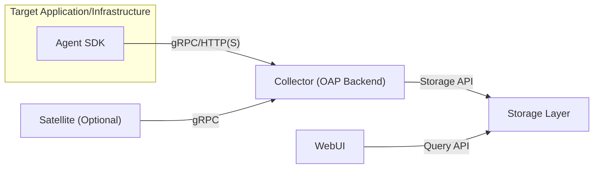
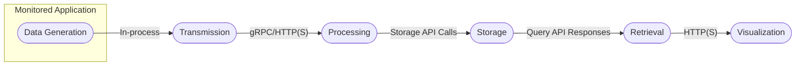

# Project Design Document: Apache SkyWalking for Threat Modeling (Improved)

**Document Version:** 1.1
**Date:** October 26, 2023
**Author:** AI Expert

## 1. Introduction

This document provides an enhanced design overview of the Apache SkyWalking project, specifically tailored for effective threat modeling. It builds upon the foundational understanding of SkyWalking's architecture, data flow, and technologies, providing more granular details crucial for identifying potential security vulnerabilities and risks. This document aims to be a comprehensive resource for security professionals conducting threat analysis on SkyWalking deployments.

## 2. Project Overview

Apache SkyWalking is a powerful open-source Application Performance Monitoring (APM) system designed for modern, distributed architectures, including microservices, cloud-native, and containerized environments. Its primary function is to provide comprehensive observability through distributed tracing, service performance metrics analysis, log correlation, and dynamic service topology mapping. This observability empowers teams to diagnose performance bottlenecks, understand service dependencies, and proactively address issues.

## 3. System Architecture

SkyWalking employs a distributed client-server architecture where lightweight agents collect telemetry data from monitored applications and a central backend processes, analyzes, and stores this data.

### 3.1. Key Components (Detailed)

*   **Agent (SkyWalking Agent SDK):**
    *   **Deployment:** Integrated directly into the application process or deployed as a sidecar.
    *   **Functionality:** Intercepts application requests and responses at runtime using bytecode instrumentation, SDK APIs, or service mesh integrations. Collects detailed telemetry data, including:
        *   Distributed traces spanning multiple services.
        *   Performance metrics (latency, throughput, error rates).
        *   Application logs (optionally correlated with traces).
        *   Resource utilization metrics.
    *   **Language Support:** Offers SDKs for various programming languages and frameworks (Java, .NET Core, Node.js, Python, Go, PHP, etc.), ensuring broad applicability.
    *   **Communication:** Securely transmits collected data to the SkyWalking Collector, typically over gRPC or HTTP(S). Configuration options allow for secure connections (TLS/SSL).
    *   **Configuration:**  Configuration is typically managed through environment variables, configuration files, or centralized configuration servers. Securely managing and distributing agent configurations is critical.
*   **Collector (SkyWalking OAP Backend - Observability Analysis Platform):**
    *   **Role:** The central processing hub for all incoming telemetry data.
    *   **Input Protocols:** Listens for incoming data from agents via gRPC and HTTP(S). Supports pluggable receivers for extending input capabilities.
    *   **Processing Pipeline:**  Data undergoes a multi-stage processing pipeline:
        *   **Decoding:** Deserializes data received from agents.
        *   **Validation:** Verifies data integrity and format.
        *   **Aggregation:** Combines related data points to generate higher-level metrics.
        *   **Analysis:** Performs calculations and derives insights from the data.
        *   **Persistence:**  Prepares data for storage.
    *   **Extensibility:**  Provides a plugin mechanism for extending processing capabilities and integrating with other systems.
*   **Storage (SkyWalking Storage Layer):**
    *   **Purpose:**  Persistently stores the processed telemetry data for querying and visualization.
    *   **Storage Options:** Supports a variety of backend storage systems, allowing users to choose based on their needs and infrastructure:
        *   Elasticsearch (popular choice for its search capabilities).
        *   Apache Cassandra (suitable for high write throughput).
        *   TiDB (HTAP database).
        *   BanyanDB (SkyWalking's native storage solution).
        *   Other databases through plugins.
    *   **Data Model:** Defines the schema for storing traces, metrics, and logs. Understanding the data model is crucial for security analysis.
    *   **Security:**  Security considerations for the storage layer include access control, encryption at rest, and secure network connections.
*   **UI (SkyWalking WebUI):**
    *   **Functionality:** Provides a web-based interface for users to visualize and analyze the collected APM data.
    *   **Data Retrieval:** Queries the storage layer through a defined API to retrieve data based on user requests.
    *   **Visualization:** Presents data through dashboards, charts, graphs, and service topology maps.
    *   **Authentication and Authorization:** Implements mechanisms to control user access to the UI and its features.
*   **Satellite (Optional):**
    *   **Deployment:** Deployed as a sidecar alongside the application agent.
    *   **Benefits:** Offloads certain tasks from the main application agent, such as data forwarding, sampling, and local aggregation, reducing resource consumption on the application.
    *   **Communication:** Communicates with the agent and the Collector using gRPC.

### 3.2. Architectural Diagram

### 3.3. Component Interactions (Detailed)

*   **Agent to Collector Communication:** Agents establish connections with the Collector to transmit telemetry data. This communication channel is a critical security boundary.
    *   **Protocols:** gRPC (default, efficient binary protocol) or HTTP(S) (more interoperable).
    *   **Security:** TLS/SSL encryption should be enforced for secure communication. Authentication mechanisms (e.g., tokens) may be used to verify agent identity.
*   **Satellite to Collector Communication:** Similar to agent communication, Satellite uses gRPC to send aggregated or forwarded data to the Collector. Secure communication is also essential here.
*   **Collector to Storage Interaction:** The Collector interacts with the chosen storage backend using its specific API.
    *   **APIs:**  Vary depending on the storage (e.g., Elasticsearch REST API, Cassandra native protocol).
    *   **Authentication:** The Collector needs appropriate credentials to access the storage layer. Securely managing these credentials is vital.
    *   **Authorization:** The Collector should only have the necessary permissions to write and manage data in the storage layer.
*   **WebUI to Storage Interaction:** The WebUI queries the storage layer to retrieve data for visualization.
    *   **APIs:**  Typically involves a query language specific to the storage backend.
    *   **Authentication and Authorization:** The WebUI needs to authenticate with the storage layer (or the Collector acting as a proxy) and should only be authorized to retrieve data it is permitted to access.

## 4. Data Flow (Detailed)

Understanding the data flow is crucial for identifying potential points of data interception, manipulation, or leakage.

1. **Data Generation (within Monitored Application):** The Agent SDK instruments the application to automatically generate telemetry data.
    *   **Trace Context Propagation:**  Crucially, trace context is propagated across service boundaries, often through HTTP headers, which can be a point of vulnerability if not handled securely.
    *   **Sensitive Data Handling:** Agents might inadvertently capture sensitive data (e.g., API keys, personal information) in request parameters or headers. Proper configuration and data masking are essential.
2. **Data Transmission (Agent/Satellite to Collector):** Data is transmitted over the network to the Collector.
    *   **Network Security:** The network connection should be secured using TLS/SSL to prevent eavesdropping and man-in-the-middle attacks.
    *   **Authentication:**  Mechanisms to authenticate the agent or satellite to the Collector prevent unauthorized data submission.
3. **Data Processing (Collector):** The Collector processes the incoming data.
    *   **Data Validation and Sanitization:** The Collector should validate and sanitize incoming data to prevent injection attacks or data corruption.
    *   **Aggregation and Analysis:**  Processing logic itself could contain vulnerabilities if not implemented securely.
4. **Data Persistence (Collector to Storage):** Processed data is written to the storage layer.
    *   **Storage API Security:** Securely interacting with the storage API is crucial.
    *   **Data Encryption at Rest:**  Encrypting data at rest in the storage layer protects against unauthorized access to the physical storage.
5. **Data Retrieval (WebUI to Storage):** The WebUI retrieves data for display.
    *   **Query Security:**  User queries should be carefully constructed to prevent information leakage or denial-of-service attacks on the storage layer.
    *   **Authorization:** Users should only be able to retrieve data they are authorized to view.
6. **Data Visualization (WebUI):** The WebUI presents the retrieved data.
    *   **Web Application Security:** Standard web application security best practices (e.g., protection against XSS, CSRF) are essential for the WebUI.

### 4.1. Data Flow Diagram

## 5. Technology Stack (Security Implications)

Understanding the underlying technologies helps identify potential vulnerabilities associated with those technologies.

*   **Programming Languages:**
    *   Java (Collector, WebUI):  Known for memory safety issues if not handled carefully. Requires secure coding practices.
    *   Agent Languages (.NET, Node.js, Python, Go, etc.): Each language has its own set of common vulnerabilities.
*   **Communication Protocols:**
    *   gRPC:  Relies on Protocol Buffers, which have their own security considerations regarding serialization and deserialization.
    *   HTTP/HTTPS: Requires proper TLS/SSL configuration to ensure secure communication.
*   **Data Serialization Formats:**
    *   Protocol Buffers: Potential vulnerabilities related to parsing and schema evolution.
    *   JSON: Susceptible to injection attacks if not handled carefully.
*   **Storage Technologies:**
    *   Elasticsearch: Requires careful configuration to prevent unauthorized access and data breaches. Known for past vulnerabilities.
    *   Apache Cassandra:  Security relies on proper authentication and authorization setup.
    *   TiDB, BanyanDB:  Security considerations specific to these databases need to be evaluated.
*   **Message Queues (Optional):**
    *   Apache Kafka, RocketMQ:  Security measures include authentication, authorization, and encryption in transit.
*   **Web Framework (WebUI):**
    *   JavaScript frameworks (React, Vue.js, Angular): Susceptible to common web vulnerabilities like XSS and CSRF. Requires secure development practices.
*   **Operating Systems:**
    *   Linux: Requires regular patching and security hardening.
*   **Containerization and Orchestration:**
    *   Docker, Kubernetes: Introduce their own set of security considerations related to container image security, network policies, and access control.

## 6. Deployment Model (Attack Surface)

The deployment model significantly impacts the attack surface and potential vulnerabilities.

*   **Standalone Deployment:**  Simpler to manage but a single point of failure. Security relies heavily on the security of the single host.
*   **Clustered Deployment:** Increases availability and scalability but introduces complexities in securing inter-node communication and distributed data.
*   **Containerized Deployment (Docker/Kubernetes):** Requires securing container images, managing Kubernetes RBAC (Role-Based Access Control), and implementing network policies. Misconfigurations can lead to significant vulnerabilities.
*   **Cloud-Based Deployment:** Security responsibilities are shared with the cloud provider. Requires understanding the cloud provider's security model and configuring cloud resources securely (e.g., network security groups, IAM roles).

## 7. Security Considerations (Pre-Threat Modeling - Specifics)

This section highlights specific security considerations to guide the threat modeling process.

*   **Agent Configuration Security:** How are agent configurations managed and protected from unauthorized modification? Are sensitive credentials stored securely?
*   **Collector Access Control:** Who or what can communicate with the Collector? Are there proper authentication and authorization mechanisms in place?
*   **Storage Access Control and Encryption:** How is access to the storage layer controlled? Is data encrypted at rest and in transit?
*   **WebUI Authentication and Authorization:** How are users authenticated to the WebUI? Are there different roles and permissions to control access to sensitive data?
*   **Communication Channel Security (TLS/SSL):** Is TLS/SSL enforced for all communication channels? Are certificates managed properly?
*   **Input Validation and Sanitization:** Does the Collector properly validate and sanitize incoming data from agents to prevent injection attacks?
*   **Dependency Management:** Are all dependencies regularly scanned for vulnerabilities?
*   **Secrets Management:** How are sensitive credentials (e.g., database passwords, API keys) managed and protected?
*   **Logging and Auditing:** Are security-related events logged and audited?
*   **Rate Limiting and DoS Protection:** Are there mechanisms in place to prevent denial-of-service attacks on the Collector and WebUI?

## 8. Threat Modeling Scope (Specific Threats)

The subsequent threat modeling exercise should specifically consider the following types of threats within the defined areas:

*   **Authentication and Authorization:**
    *   Bypass authentication mechanisms.
    *   Privilege escalation.
    *   Unauthorized access to data or functionality.
*   **Data Confidentiality:**
    *   Eavesdropping on network traffic to intercept telemetry data.
    *   Unauthorized access to the storage layer.
    *   Data breaches due to insecure storage configurations.
*   **Data Integrity:**
    *   Tampering with telemetry data in transit or at rest.
    *   Malicious agents sending false data.
    *   Data corruption due to vulnerabilities in processing logic.
*   **Availability:**
    *   Denial-of-service attacks on the Collector or WebUI.
    *   Resource exhaustion due to malicious agents sending excessive data.
    *   Failures in the storage layer impacting data availability.
*   **Non-Repudiation:**
    *   Lack of audit trails to track actions and data origins.
    *   Inability to verify the authenticity of telemetry data.
*   **Agent Security:**
    *   Compromised agents acting as attack vectors.
    *   Exposure of sensitive data through agent logs or configurations.
*   **Communication Channels:**
    *   Man-in-the-middle attacks on communication channels.
    *   Replay attacks.
*   **Dependency Vulnerabilities:**
    *   Exploitation of known vulnerabilities in third-party libraries.
*   **Deployment Environment Security:**
    *   Misconfigurations in Kubernetes or cloud infrastructure leading to security breaches.
    *   Container escape vulnerabilities.

## 9. Conclusion

This enhanced design document provides a more detailed and security-focused overview of the Apache SkyWalking project. It highlights critical components, data flows, and technologies, emphasizing aspects relevant to threat identification and mitigation. This document serves as a valuable resource for security professionals to conduct a comprehensive threat modeling exercise, enabling them to proactively address potential security vulnerabilities and ensure the secure operation of SkyWalking deployments.