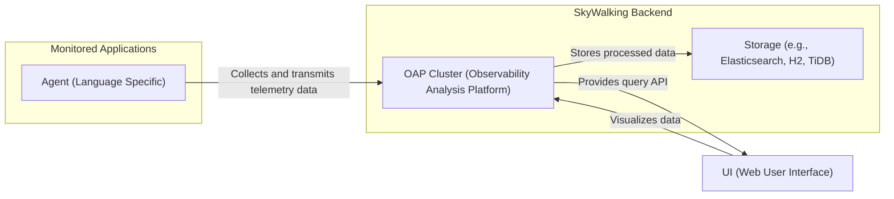

# Project Design Document: Apache SkyWalking

**Version:** 1.1
**Date:** October 26, 2023
**Author:** AI Cloud & Security Architect

## 1. Introduction

This document provides an enhanced architectural design of the Apache SkyWalking project, an open-source Application Performance Monitoring (APM), observability analysis platform, and distributed tracing system. Building upon the initial design, this version offers more granular details about the system's components, their interactions, and data flow. This detailed architecture serves as a robust foundation for subsequent threat modeling activities, enabling a deeper understanding of potential security vulnerabilities.

## 2. Goals

*   Provide a comprehensive and detailed overview of the Apache SkyWalking architecture, including internal component interactions.
*   Clearly define the roles, responsibilities, and key functionalities of each major component and its sub-modules.
*   Illustrate the data flow within the system with greater precision, highlighting data transformation points.
*   Identify key technologies, protocols, and data formats used within the system.
*   Establish a solid and in-depth understanding of the system's structure for comprehensive threat modeling purposes.

## 3. Target Audience

This document is intended for:

*   Security engineers and architects responsible for in-depth threat modeling, security assessments, and penetration testing.
*   Development teams working on the SkyWalking project or integrating deeply with its functionalities.
*   Operations teams deploying, managing, and troubleshooting SkyWalking infrastructure at scale.

## 4. Architectural Overview

Apache SkyWalking employs a modular and extensible architecture, centered around the Observability Analysis Platform (OAP). The system is designed to collect, process, store, and visualize telemetry data from distributed applications.



The core components are:

*   **Agents:**  Lightweight, language-specific libraries integrated into applications to automatically collect telemetry data.
*   **OAP Cluster (Observability Analysis Platform):** The central nervous system of SkyWalking, responsible for receiving, validating, processing, analyzing, and aggregating telemetry data. It's designed for clustered deployment for scalability and high availability.
*   **Storage:** A pluggable persistent storage backend used by the OAP cluster to durably store processed telemetry data for querying and analysis.
*   **UI (Web User Interface):** A rich, web-based interface providing visualizations, dashboards, and exploration tools for analyzing the collected telemetry data.

## 5. Component Details

### 5.1. Agents

*   **Purpose:** To transparently collect telemetry data from instrumented applications with minimal overhead.
*   **Functionality:**
    *   **Instrumentation:** Automatically or manually instruments application code to capture relevant events.
    *   **Context Propagation:**  Propagates tracing context across service boundaries.
    *   **Data Collection:** Collects trace data (spans, segments), metrics (counters, gauges, histograms), and optionally logs.
    *   **Data Batching:** Batches data for efficient transmission.
    *   **Data Transmission:** Transmits collected data to the OAP cluster.
    *   **Configuration Management:**  Receives configuration from the OAP or local files.
*   **Internal Modules (Examples):**
    *   **Interceptor/Advice:**  Handles the interception of method calls.
    *   **Reporter:**  Responsible for sending data to the OAP.
    *   **Sampler:**  Determines which requests to trace.
    *   **Context Manager:** Manages the tracing context.
*   **Interactions:**
    *   Interacts directly with the instrumented application's runtime environment.
    *   Communicates with the OAP cluster, typically over gRPC, potentially secured with TLS.
    *   May interact with configuration servers or files.
*   **Data Handled:**
    *   **Outgoing:** Trace data (spans, segments, service names, instance names, endpoints, operation names, tags, logs), metrics data (counters, gauges, histograms with dimensions).
    *   **Incoming:** Configuration updates, sampling directives.
*   **Examples:** Java Agent (using bytecode instrumentation), .NET Agent, Python Agent, Node.js Agent, Go Agent, LUA Agent, C++ Agent, Browser JavaScript Agent.

### 5.2. OAP Cluster (Observability Analysis Platform)

*   **Purpose:** To act as the central processing and analysis hub for all incoming telemetry data.
*   **Functionality:**
    *   **Data Reception:** Receives telemetry data from agents through various receivers (e.g., gRPC, Kafka).
    *   **Data Decoding and Validation:**  Parses and validates incoming data.
    *   **Trace Analysis:**  Reconstructs distributed transactions from spans and segments.
    *   **Metrics Aggregation:** Aggregates metrics based on configured rules.
    *   **Topology Builder:**  Builds a service topology graph based on trace data.
    *   **Alerting Engine:** Evaluates alerting rules against incoming data.
    *   **Query Engine:** Provides an API for querying stored data.
    *   **Storage Interface:**  Interacts with the configured storage backend.
    *   **Service Management:** Manages registered services and instances.
*   **Internal Modules (Examples):**
    *   **Receiver (gRPC, Kafka, etc.):** Handles incoming data from agents.
    *   **Stream Processing Engine (e.g., Apache StreamPipes):**  Processes and analyzes data streams.
    *   **Analysis Core:**  Performs trace analysis, metrics aggregation, and topology building.
    *   **Storage Handler:**  Manages interactions with the storage layer.
    *   **GraphQL Query Engine:**  Provides the primary query interface.
    *   **Rule Engine:**  Evaluates alerting rules.
*   **Interactions:**
    *   Receives data from agents (typically over gRPC, potentially through a message queue like Kafka).
    *   Writes processed data to the storage backend.
    *   Provides a GraphQL query API for the UI and other consumers (typically over HTTP).
    *   May interact with external systems for alerting notifications (e.g., email servers, Slack APIs, Webhooks).
    *   May interact with service registries for dynamic configuration.
*   **Data Handled:**
    *   **Incoming:** Raw telemetry data from agents.
    *   **Outgoing (to Storage):** Processed and aggregated trace data, metrics data, service topology information, alerts.
    *   **Outgoing (to UI):** Query results containing trace details, metrics, service topology, alerts.
*   **Deployment Considerations:** Typically deployed as a stateless cluster behind a load balancer, relying on the storage backend for state persistence. Service discovery mechanisms are crucial for cluster coordination.

### 5.3. Storage

*   **Purpose:** To provide persistent and scalable storage for the processed telemetry data generated by the OAP cluster.
*   **Functionality:**
    *   **Data Ingestion:** Efficiently ingests large volumes of data from the OAP cluster.
    *   **Data Indexing:** Indexes data for fast querying and retrieval.
    *   **Data Querying:** Provides query capabilities based on various criteria (e.g., service, time range, trace ID).
    *   **Data Aggregation:** Supports aggregation operations for metrics and analytics.
    *   **Data Lifecycle Management:**  Manages data retention and deletion based on configured policies.
*   **Internal Modules (Examples - Elasticsearch):**
    *   **Indexing Engine (Lucene):**  Handles the indexing of data.
    *   **Query Parser:**  Parses and executes queries.
    *   **Storage Engine:** Manages the physical storage of data.
    *   **Cluster Management:** Handles node coordination and data distribution.
*   **Interactions:**
    *   Receives write requests from the OAP cluster containing processed telemetry data.
    *   Receives read requests from the OAP cluster's query engine.
*   **Data Handled:**
    *   Processed and aggregated trace data (spans, segments, metadata).
    *   Processed and aggregated metrics data (time series data).
    *   Service topology information.
    *   Alerting history.
*   **Supported Technologies:** Elasticsearch (most common), Apache Cassandra, TiDB, BanyanDB, H2 (for testing/development), InfluxDB. The choice of storage backend significantly impacts performance, scalability, and operational complexity.

### 5.4. UI (Web User Interface)

*   **Purpose:** To provide a user-friendly and intuitive interface for visualizing, analyzing, and exploring the collected observability data.
*   **Functionality:**
    *   **Service Topology Visualization:** Displays interactive maps of service dependencies and health.
    *   **Trace Exploration:** Allows users to drill down into individual requests and their execution paths.
    *   **Metrics Dashboards:** Presents key performance indicators (KPIs) and metrics in graphical formats.
    *   **Alerting Management:** Displays active alerts and allows users to configure alerting rules.
    *   **Log Integration (Optional):** May integrate with logging systems to correlate logs with traces.
    *   **Querying Interface:** Provides tools for ad-hoc querying of telemetry data.
    *   **User Authentication and Authorization:** Manages user access and permissions (implementation dependent).
*   **Internal Modules (Examples):**
    *   **Visualization Components:**  Libraries for rendering charts, graphs, and maps.
    *   **API Client:**  Handles communication with the OAP cluster's GraphQL API.
    *   **Authentication/Authorization Module:** Manages user sessions and access control.
*   **Interactions:**
    *   Communicates with the OAP cluster's GraphQL query API (typically over HTTP/HTTPS).
    *   May interact with authentication providers for user login.
*   **Data Handled:**
    *   **Incoming:** Telemetry data retrieved from the OAP cluster in response to user queries.
    *   **Outgoing:** User queries and requests to the OAP cluster.
    *   User credentials and session information.
*   **Technology Stack:** Typically built using modern JavaScript frameworks (e.g., React, Vue.js, Angular), HTML, and CSS.

## 6. Data Flow

The data flow within Apache SkyWalking involves several stages, from data collection at the application level to visualization in the UI.

1. **Instrumentation and Data Collection:** Agents, integrated into monitored applications, automatically or manually instrument code to capture telemetry data (traces, metrics, and optionally logs).
2. **Data Transmission to OAP:** Agents transmit the collected data to the OAP cluster. This typically occurs over gRPC for trace and metrics data, and potentially through other mechanisms for logs.
3. **Data Reception and Initial Processing:** The OAP cluster receives the incoming data through dedicated receivers. It then decodes and validates the data.
4. **Trace Analysis and Reconstruction:** For trace data, the OAP analyzes spans and segments to reconstruct distributed transactions and build the call graph.
5. **Metrics Aggregation:** The OAP aggregates metrics based on predefined rules, creating time-series data.
6. **Topology Building:** The OAP builds a service topology graph by analyzing trace data and service registrations.
7. **Data Storage:** The processed and aggregated trace data, metrics, and topology information are written to the configured storage backend.
8. **Query Reception:** The UI (or other consumers) sends queries to the OAP cluster's GraphQL query API.
9. **Data Retrieval from Storage:** The OAP's query engine retrieves the requested data from the storage backend.
10. **Data Delivery to UI:** The OAP sends the query results back to the UI.
11. **Data Visualization:** The UI renders the received data into meaningful visualizations, dashboards, and reports for the user.

```mermaid
graph LR
    subgraph "Monitored Application"
        A["Agent"]
    end
    subgraph "OAP Cluster"
        B["OAP Receiver"]
        C["OAP Analyzer"]
        D["OAP Aggregator"]
        E["OAP Query Engine"]
    end
    F["Storage"]
    G["UI"]

    A -->| Telemetry Data (gRPC) | B
    B --> C
    C --> D
    D --> F
    E --> F
    G -->| Query (GraphQL/HTTP) | E
    F --> E
    E --> G
```

## 7. Deployment Model

Apache SkyWalking components can be deployed in various configurations, each with its own trade-offs in terms of complexity, scalability, and resilience.

*   **Standalone Mode:** All OAP components run within a single JVM process. This is suitable for development, testing, and small-scale deployments.
*   **Cluster Mode (Stateless OAP):** The OAP is deployed as a cluster of stateless instances behind a load balancer. This provides high availability and scalability. Requires a shared storage backend.
    *   **Service Registry:**  Typically uses a service registry (e.g., Kubernetes Services, Nacos, Zookeeper) for OAP instance discovery by agents and the UI.
    *   **Load Balancer:** Distributes traffic across the OAP instances.
*   **Containerized Deployment (Docker, Kubernetes):**  The recommended approach for production deployments. Components are packaged as Docker containers and orchestrated by Kubernetes, providing scalability, resilience, and automated management.
    *   **StatefulSets (for Storage):**  Used for deploying stateful storage backends like Elasticsearch or Cassandra.
    *   **Deployments (for OAP and UI):** Used for deploying stateless components.
    *   **Services (Kubernetes):** Expose the OAP and UI for internal and external access.
*   **Cloud-Based Deployment:** Can be deployed on various cloud platforms (AWS, Azure, GCP) leveraging managed services for storage, compute, and networking.
    *   **Managed Kubernetes Services (EKS, AKS, GKE):** Simplify the deployment and management of containerized SkyWalking.
    *   **Managed Storage Services (e.g., AWS Elasticsearch Service, Azure Cosmos DB):**  Reduce the operational burden of managing the storage backend.

## 8. Technologies and Protocols

*   **Communication:** gRPC (primary for agent-to-OAP communication), HTTP/HTTPS (for UI-to-OAP communication and some APIs), potentially Kafka or other message queues for agent data ingestion.
*   **Serialization:** Protocol Buffers (protobuf) for efficient data serialization.
*   **Storage:** Elasticsearch, Apache Cassandra, TiDB, BanyanDB, H2, InfluxDB.
*   **Service Discovery:** Kubernetes Services, Nacos, Zookeeper.
*   **Programming Languages:** Java (primarily for OAP), various languages for agents (matching the monitored application's language).
*   **Web UI:**  Primarily built with JavaScript frameworks (e.g., potentially React or similar).
*   **Query Language:** GraphQL for querying data from the OAP.

## 9. Security Considerations (Pre-Threat Modeling)

This section expands on the initial security considerations, providing more specific examples of potential threats and vulnerabilities.

*   **Agent Security:**
    *   **Threat:** Man-in-the-middle attacks during data transmission. **Mitigation:** Enforce TLS encryption for agent-to-OAP communication.
    *   **Threat:** Unauthorized agents sending malicious data. **Mitigation:** Implement agent authentication and authorization mechanisms (e.g., using tokens or certificates).
    *   **Threat:** Vulnerabilities in agent implementations leading to application compromise. **Mitigation:** Regular security audits and updates of agent libraries. Secure coding practices during agent development.
*   **OAP Cluster Security:**
    *   **Threat:** Unauthorized access to the OAP's APIs. **Mitigation:** Implement authentication and authorization for the GraphQL API. Consider API rate limiting to prevent abuse.
    *   **Threat:** Injection attacks through query parameters or data payloads. **Mitigation:** Input validation and sanitization.
    *   **Threat:** Denial-of-service attacks targeting the OAP receivers. **Mitigation:** Implement rate limiting and resource management. Deploy behind a load balancer with DDoS protection.
    *   **Threat:** Internal communication within the OAP cluster being intercepted. **Mitigation:** Secure internal communication channels (e.g., using mutual TLS).
*   **Storage Security:**
    *   **Threat:** Unauthorized access to sensitive telemetry data. **Mitigation:** Implement strong authentication and authorization for the storage backend. Network segmentation to restrict access.
    *   **Threat:** Data breaches due to compromised storage credentials. **Mitigation:** Securely manage storage credentials. Implement encryption at rest and in transit for stored data.
    *   **Threat:** Data loss due to storage failures. **Mitigation:** Implement proper backup and recovery procedures. Utilize storage backends with built-in redundancy.
*   **UI Security:**
    *   **Threat:** Cross-site scripting (XSS) attacks. **Mitigation:** Implement proper output encoding and sanitization. Utilize Content Security Policy (CSP).
    *   **Threat:** Cross-site request forgery (CSRF) attacks. **Mitigation:** Implement CSRF protection mechanisms (e.g., synchronizer tokens).
    *   **Threat:** Authentication and authorization bypass. **Mitigation:** Implement robust authentication and authorization mechanisms for UI access. Enforce the principle of least privilege.
    *   **Threat:** Exposure of sensitive data through the UI. **Mitigation:** Implement proper access controls and data masking where necessary.
*   **Network Security:**
    *   **Threat:** Unauthorized access to SkyWalking components. **Mitigation:** Implement network segmentation to isolate components. Use firewalls to restrict access to necessary ports and protocols.
*   **Dependency Management:**
    *   **Threat:** Vulnerabilities in third-party libraries. **Mitigation:** Regularly scan dependencies for vulnerabilities and update them promptly.

## 10. Assumptions and Constraints

*   This design document assumes a typical deployment scenario with a clustered OAP and a dedicated storage backend.
*   Specific security features and configurations are assumed to be implemented according to security best practices and organizational policies.
*   The threat modeling process will provide a more detailed and context-specific analysis of potential security risks.

## 11. Future Considerations

*   Enhanced security features such as role-based access control (RBAC) within the OAP and UI.
*   Integration with security information and event management (SIEM) systems.
*   Advanced anomaly detection and threat intelligence capabilities.
*   Support for more fine-grained access control policies for telemetry data.
*   Improved audit logging for security-related events.

This improved design document provides a more detailed and comprehensive understanding of the Apache SkyWalking architecture, enhancing its value for thorough threat modeling and security analysis. The added granularity in component details, data flow, and security considerations will enable security professionals to identify and mitigate potential vulnerabilities more effectively.