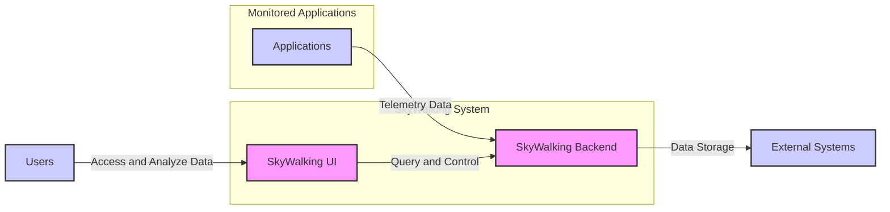
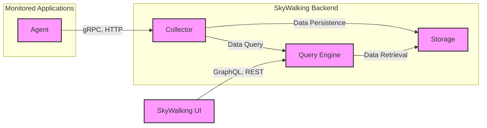
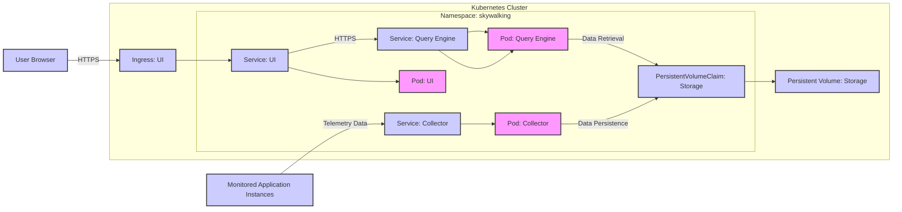
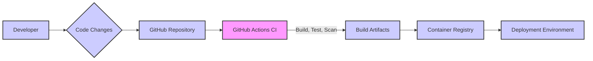

# BUSINESS POSTURE

- Business Priorities and Goals:
  - Provide observability for distributed systems, microservices, and cloud-native architectures.
  - Enable performance monitoring, troubleshooting, and root cause analysis.
  - Support various data sources and protocols for telemetry data collection.
  - Offer customizable dashboards and visualizations for monitoring and analysis.
  - Facilitate proactive issue detection and alerting.
- Business Risks:
  - Data breaches of sensitive application performance data.
  - Service disruption due to misconfiguration or vulnerabilities in the observability platform.
  - Performance impact on monitored applications due to overhead from the observability agent.
  - Vendor lock-in if heavily reliant on specific SkyWalking features or integrations.
  - Complexity of deployment and management of a distributed observability system.

# SECURITY POSTURE

- Existing Security Controls:
  - security control: Code review process (described in project contribution guidelines).
  - security control: Dependency scanning (likely integrated into build process, not explicitly documented).
  - security control: Authentication and authorization for accessing the SkyWalking UI and API (configurable, details in documentation).
  - security control: Secure communication channels (TLS/SSL) for data transmission between agents, collectors, and UI (configurable, details in documentation).
- Accepted Risks:
  - accepted risk: Potential vulnerabilities in third-party dependencies.
  - accepted risk: Risk of misconfiguration leading to security weaknesses.
  - accepted risk: Performance overhead from security features like encryption.
- Recommended Security Controls:
  - security control: Implement automated security scanning (SAST/DAST) in the CI/CD pipeline.
  - security control: Regularly perform penetration testing and vulnerability assessments.
  - security control: Implement robust input validation and output encoding throughout the application.
  - security control: Enhance logging and monitoring of security-related events.
  - security control: Implement security awareness training for developers and operators.
  - security control: Establish incident response plan for security incidents related to SkyWalking.
- Security Requirements:
  - Authentication:
    - Requirement: Securely authenticate users accessing the SkyWalking UI and API.
    - Requirement: Support integration with existing identity providers (e.g., LDAP, OAuth 2.0).
    - Requirement: Implement multi-factor authentication for enhanced security.
  - Authorization:
    - Requirement: Implement role-based access control (RBAC) to manage user permissions.
    - Requirement: Enforce least privilege principle for user access.
    - Requirement: Audit user access and authorization decisions.
  - Input Validation:
    - Requirement: Validate all inputs from agents, UI, and API to prevent injection attacks.
    - Requirement: Sanitize user-provided data before displaying it in the UI.
    - Requirement: Implement input validation at both client-side and server-side.
  - Cryptography:
    - Requirement: Use strong encryption algorithms for sensitive data in transit and at rest (if applicable).
    - Requirement: Securely manage cryptographic keys and certificates.
    - Requirement: Enforce HTTPS for all communication channels.

# DESIGN

## C4 CONTEXT

- Context Diagram Elements:
  - - Name: Applications
    - Type: Software System
    - Description: Applications being monitored by SkyWalking. These can be microservices, monolithic applications, or any software system that can be instrumented with SkyWalking agents or SDKs.
    - Responsibilities: Generate and send telemetry data (traces, metrics, logs) to the SkyWalking backend.
    - Security controls: security control: Application-level security controls, security control: Secure configuration of SkyWalking agents.
  - - Name: SkyWalking Backend
    - Type: Software System
    - Description: The core of SkyWalking, responsible for collecting, processing, analyzing, and storing telemetry data. It includes components like collectors, aggregators, and storage.
    - Responsibilities: Receive telemetry data from agents, process and aggregate data, store data in a persistent storage, provide APIs for querying and retrieving data.
    - Security controls: security control: Authentication and authorization for API access, security control: Input validation, security control: Secure data storage, security control: Secure communication channels.
  - - Name: SkyWalking UI
    - Type: Software System
    - Description: Web-based user interface for visualizing and analyzing telemetry data collected by SkyWalking.
    - Responsibilities: Provide dashboards and visualizations, allow users to query and explore data, manage configurations, provide alerting and notifications.
    - Security controls: security control: Authentication and authorization for UI access, security control: Input validation, security control: Output encoding, security control: Secure communication channels.
  - - Name: Users
    - Type: Person
    - Description: Operators, developers, and SREs who use SkyWalking to monitor and troubleshoot applications.
    - Responsibilities: Access SkyWalking UI to monitor application performance, analyze issues, configure alerts, and manage the SkyWalking system.
    - Security controls: security control: Strong passwords, security control: Multi-factor authentication.
  - - Name: External Systems
    - Type: Software System
    - Description: External storage systems used by SkyWalking backend to persist telemetry data. Examples include Elasticsearch, Apache Cassandra, databases, etc.
    - Responsibilities: Persistently store telemetry data provided by the SkyWalking backend.
    - Security controls: security control: Access control to storage systems, security control: Data encryption at rest, security control: Backup and recovery mechanisms.

## C4 CONTAINER

- Container Diagram Elements:
  - - Name: Agent
    - Type: Software Component
    - Description: SkyWalking agent deployed within monitored applications. It instruments the application code and collects telemetry data. Agents are language-specific (e.g., Java, Python, Go).
    - Responsibilities: Instrument application code, collect traces, metrics, and logs, send telemetry data to the Collector.
    - Security controls: security control: Secure configuration, security control: Minimal permissions, security control: Secure communication with Collector (TLS).
  - - Name: Collector
    - Type: Software Component
    - Description: Receives telemetry data from agents, processes and aggregates it, and forwards it to the Storage.
    - Responsibilities: Data ingestion, data processing, data aggregation, data routing to Storage and Query Engine.
    - Security controls: security control: Input validation, security control: Rate limiting, security control: Authentication for agent connections, security control: Secure communication with agents and Storage (TLS).
  - - Name: Storage
    - Type: Data Store
    - Description: Persistent storage for telemetry data. Supports various storage options like Elasticsearch, Apache Cassandra, databases.
    - Responsibilities: Persistently store traces, metrics, and logs, provide data retrieval capabilities for the Query Engine.
    - Security controls: security control: Access control, security control: Data encryption at rest, security control: Backup and recovery, security control: Regular security patching.
  - - Name: Query Engine
    - Type: Software Component
    - Description: Provides APIs (GraphQL, REST) for querying and retrieving telemetry data from the Storage.
    - Responsibilities: Process queries from UI and other clients, retrieve data from Storage, perform data aggregation and filtering, provide APIs for data access.
    - Security controls: security control: Authentication and authorization for API access, security control: Input validation, security control: Rate limiting, security control: Secure communication with UI (TLS).
  - - Name: SkyWalking UI
    - Type: Web Application
    - Description: Web-based user interface for visualizing and analyzing telemetry data.
    - Responsibilities: Present dashboards and visualizations, allow users to query and explore data, manage configurations, provide alerting and notifications.
    - Security controls: security control: Authentication and authorization, security control: Input validation, security control: Output encoding, security control: Secure communication with Query Engine (TLS), security control: Content Security Policy (CSP).

## DEPLOYMENT

Deployment Solution: Kubernetes Deployment

- Deployment Diagram Elements:
  - - Name: Kubernetes Cluster
    - Type: Infrastructure
    - Description: Kubernetes cluster providing the runtime environment for SkyWalking components.
    - Responsibilities: Orchestration of containers, resource management, service discovery, scaling, high availability.
    - Security controls: security control: Network policies, security control: RBAC for Kubernetes API access, security control: Container security context, security control: Regular security patching of Kubernetes nodes.
  - - Name: Namespace: skywalking
    - Type: Kubernetes Namespace
    - Description: Dedicated Kubernetes namespace to isolate SkyWalking resources.
    - Responsibilities: Resource isolation, access control within the SkyWalking deployment.
    - Security controls: security control: Namespace-based RBAC, security control: Network policies within the namespace.
  - - Name: Pod: Collector
    - Type: Kubernetes Pod
    - Description: Pod running the SkyWalking Collector container.
    - Responsibilities: Receive and process telemetry data from agents.
    - Security controls: security control: Container security context, security control: Resource limits, security control: Network policies.
  - - Name: Pod: Query Engine
    - Type: Kubernetes Pod
    - Description: Pod running the SkyWalking Query Engine container.
    - Responsibilities: Handle data queries from the UI, retrieve data from storage.
    - Security controls: security control: Container security context, security control: Resource limits, security control: Network policies.
  - - Name: Pod: UI
    - Type: Kubernetes Pod
    - Description: Pod running the SkyWalking UI container.
    - Responsibilities: Serve the SkyWalking web UI.
    - Security controls: security control: Container security context, security control: Resource limits, security control: Network policies.
  - - Name: Service: Collector
    - Type: Kubernetes Service
    - Description: Kubernetes service exposing the Collector pods.
    - Responsibilities: Load balancing and service discovery for Collector pods.
    - Security controls: security control: Network policies, security control: Service account.
  - - Name: Service: Query Engine
    - Type: Kubernetes Service
    - Description: Kubernetes service exposing the Query Engine pods.
    - Responsibilities: Load balancing and service discovery for Query Engine pods.
    - Security controls: security control: Network policies, security control: Service account.
  - - Name: Service: UI
    - Type: Kubernetes Service
    - Description: Kubernetes service exposing the UI pods.
    - Responsibilities: Load balancing and service discovery for UI pods.
    - Security controls: security control: Network policies, security control: Service account.
  - - Name: PersistentVolumeClaim: Storage
    - Type: Kubernetes PersistentVolumeClaim
    - Description: Request for persistent storage for SkyWalking data.
    - Responsibilities: Abstract storage provisioning for SkyWalking data.
    - Security controls: security control: Access control to PersistentVolume, security control: Encryption at rest (depending on underlying storage provider).
  - - Name: Persistent Volume: Storage
    - Type: Kubernetes PersistentVolume
    - Description: Actual persistent storage provisioned for SkyWalking data.
    - Responsibilities: Provide persistent storage for telemetry data.
    - Security controls: security control: Access control, security control: Data encryption at rest (depending on storage provider), security control: Backup and recovery.
  - - Name: Ingress: UI
    - Type: Kubernetes Ingress
    - Description: Kubernetes Ingress to expose the SkyWalking UI service externally.
    - Responsibilities: External access to the SkyWalking UI, TLS termination, routing.
    - Security controls: security control: TLS configuration, security control: Ingress controller security, security control: Rate limiting, security control: Web Application Firewall (WAF) integration.
  - - Name: User Browser
    - Type: Person
    - Description: User accessing the SkyWalking UI through a web browser.
    - Responsibilities: Access and analyze monitoring data.
    - Security controls: security control: Browser security controls, security control: Strong passwords, security control: Multi-factor authentication.
  - - Name: Monitored Application Instances
    - Type: Software System
    - Description: Instances of applications being monitored, running in various environments (Kubernetes, VMs, etc.).
    - Responsibilities: Generate and send telemetry data to SkyWalking Collector.
    - Security controls: security control: Application-level security controls, security control: Secure configuration of SkyWalking agents, security control: Network segmentation.

## BUILD

- Build Process:
  - - Name: Developer
    - Type: Person
    - Description: Software developer contributing code to the SkyWalking project.
    - Responsibilities: Write code, commit changes, create pull requests.
    - Security controls: security control: Secure development environment, security control: Code review participation, security control: Security awareness training.
  - - Name: Code Changes
    - Type: Data
    - Description: Source code modifications made by developers.
    - Responsibilities: Represent new features, bug fixes, or security patches.
    - Security controls: security control: Version control (Git), security control: Code review.
  - - Name: GitHub Repository
    - Type: Code Repository
    - Description: Central repository hosting the SkyWalking source code.
    - Responsibilities: Version control, collaboration, code storage.
    - Security controls: security control: Access control (GitHub permissions), security control: Branch protection rules, security control: Audit logs.
  - - Name: GitHub Actions CI
    - Type: CI/CD System
    - Description: GitHub Actions workflows automating the build, test, and security scanning process.
    - Responsibilities: Automated build, unit testing, integration testing, static analysis security testing (SAST), dependency scanning, container image building.
    - Security controls: security control: Secure CI/CD configuration, security control: Secret management, security control: Build environment security, security control: SAST and dependency scanning tools.
  - - Name: Build Artifacts
    - Type: Software Artifacts
    - Description: Compiled binaries, container images, and other build outputs.
    - Responsibilities: Deployable software components.
    - Security controls: security control: Artifact signing, security control: Vulnerability scanning of artifacts.
  - - Name: Container Registry
    - Type: Artifact Repository
    - Description: Registry for storing and distributing container images (e.g., Docker Hub, GitHub Container Registry).
    - Responsibilities: Secure storage and distribution of container images.
    - Security controls: security control: Access control, security control: Vulnerability scanning of images, security control: Image signing, security control: Audit logs.
  - - Name: Deployment Environment
    - Type: Infrastructure
    - Description: Target environment where SkyWalking is deployed (e.g., Kubernetes cluster).
    - Responsibilities: Runtime environment for SkyWalking application.
    - Security controls: security control: Infrastructure security controls, security control: Deployment security practices.

# RISK ASSESSMENT

- Critical Business Processes:
  - Monitoring application performance and availability.
  - Troubleshooting and root cause analysis of application issues.
  - Capacity planning and resource optimization based on performance data.
  - Alerting and notifications for critical application events.
- Data Sensitivity:
  - Telemetry data (traces, metrics, logs) can contain sensitive information depending on the application being monitored.
  - Potential sensitive data includes: transaction details, user IDs, internal system information, error messages.
  - Data sensitivity level: Moderate to High, depending on the monitored applications and organizational policies.

# QUESTIONS & ASSUMPTIONS

- Questions:
  - What are the specific compliance requirements for the organization using SkyWalking (e.g., GDPR, HIPAA, PCI DSS)?
  - What is the organization's risk tolerance for observability data breaches?
  - What are the existing security tools and infrastructure in place within the organization?
  - What is the expected scale and performance requirements for the SkyWalking deployment?
  - What are the specific storage requirements and retention policies for telemetry data?
- Assumptions:
  - Assumption: The organization prioritizes security and data privacy for observability data.
  - Assumption: The organization has a Kubernetes-based infrastructure for deploying SkyWalking.
  - Assumption: The organization has security expertise to implement and manage security controls.
  - Assumption: The organization is willing to invest in security tools and processes for SkyWalking.
  - Assumption: Telemetry data collected by SkyWalking may contain sensitive information and requires appropriate protection.