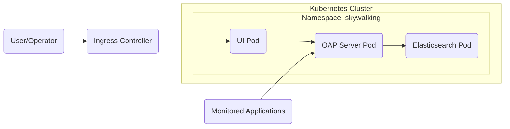
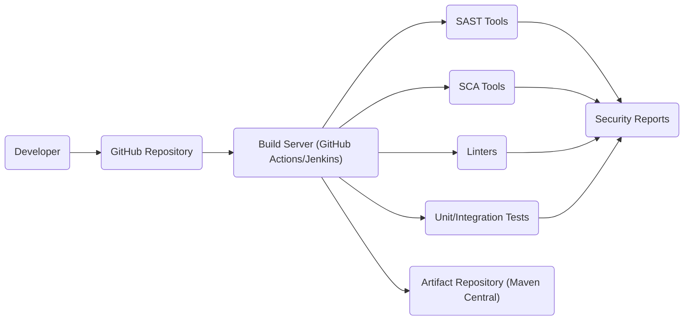

# BUSINESS POSTURE

Business Priorities and Goals:

The Apache SkyWalking project aims to provide a comprehensive Application Performance Monitoring (APM) and observability platform, specifically designed for distributed systems, microservices, and cloud-native architectures. The primary business goals include:

*   Provide deep visibility into application performance and health.
*   Enable rapid troubleshooting and root cause analysis of performance issues.
*   Support a wide range of programming languages, frameworks, and infrastructures.
*   Offer scalability and extensibility to handle large-scale, dynamic environments.
*   Maintain an open-source, community-driven development model.
*   Facilitate proactive performance optimization and capacity planning.
*   Reduce Mean Time To Resolution (MTTR) for application incidents.
*   Improve overall application reliability and user experience.

Business Risks:

*   Inaccurate or incomplete performance data leading to incorrect diagnoses and ineffective optimizations.
*   Performance overhead introduced by the monitoring system itself, impacting the performance of monitored applications.
*   Scalability limitations preventing the system from handling the load of large, complex deployments.
*   Security vulnerabilities within the SkyWalking platform, potentially exposing sensitive application data or allowing unauthorized access.
*   Lack of support for specific technologies or platforms, limiting the applicability of the system.
*   Complexity of configuration and management, hindering adoption and effective utilization.
*   Community stagnation or lack of active development, leading to outdated features and unresolved issues.
*   Integration challenges with existing monitoring tools and workflows.

# SECURITY POSTURE

Existing Security Controls:

*   security control: Authentication mechanisms for accessing the SkyWalking UI and APIs (implementation details are configurable and can integrate with existing identity providers). Described in documentation and configuration files.
*   security control: Authorization controls to restrict access to specific data and functionalities based on user roles (implementation details vary depending on the chosen authentication provider). Described in documentation and configuration files.
*   security control: Input validation to prevent common web vulnerabilities like Cross-Site Scripting (XSS) and SQL Injection (implementation details are spread across the codebase, particularly in the web UI and backend processing components).
*   security control: Encryption of data in transit using HTTPS (configurable and recommended for production deployments). Described in documentation.
*   security control: Regular security audits and penetration testing (frequency and scope are not explicitly stated but implied by the Apache Software Foundation's commitment to security).
*   security control: Dependency vulnerability scanning (likely performed as part of the build process, but details are not explicitly documented).
*   security control: Secure coding practices followed by the development community (enforced through code reviews and community guidelines).
*   security control: Support for various secure communication protocols (e.g., gRPC with TLS).

Accepted Risks:

*   accepted risk: Potential for performance overhead introduced by the monitoring agent, especially in high-throughput applications. This is mitigated by configuration options and performance tuning guidelines.
*   accepted risk: Complexity of securing a distributed system, requiring careful configuration and management of various components.
*   accepted risk: Reliance on third-party libraries and dependencies, which may introduce their own security vulnerabilities.

Recommended Security Controls:

*   Implement a robust secrets management solution for storing and accessing sensitive configuration data (e.g., API keys, database credentials).
*   Enforce mandatory code signing for all released artifacts to ensure integrity and prevent tampering.
*   Establish a clear vulnerability disclosure and response process.
*   Provide detailed security hardening guides for production deployments.
*   Integrate with Security Information and Event Management (SIEM) systems for centralized security monitoring and alerting.
*   Implement regular dynamic application security testing (DAST) to complement static analysis.

Security Requirements:

*   Authentication:
    *   Support for multiple authentication providers (e.g., LDAP, OAuth 2.0, OpenID Connect).
    *   Strong password policies and enforcement.
    *   Multi-factor authentication (MFA) support.
    *   Session management with appropriate timeouts and invalidation mechanisms.

*   Authorization:
    *   Role-Based Access Control (RBAC) with granular permissions.
    *   Ability to define custom roles and permissions.
    *   Audit logging of all access and authorization decisions.

*   Input Validation:
    *   Strict input validation for all user-provided data, including data received from monitored applications.
    *   Protection against common web vulnerabilities (XSS, SQL Injection, CSRF).
    *   Encoding of output data to prevent XSS.

*   Cryptography:
    *   Use of strong, industry-standard cryptographic algorithms and protocols.
    *   Secure key management practices.
    *   Encryption of sensitive data at rest and in transit.
    *   Regular review and updates of cryptographic configurations.

# DESIGN

## C4 CONTEXT

```mermaid
graph LR
    subgraph SkyWalking System
        SW("SkyWalking")
    end
    User("User/Operator") --> SW
    Apps("Monitored Applications") --> SW
    DB[(("Persistent Storage"))]
    SW --> DB
    Metrics("Metrics/Logs/Traces") -.-> SW
    Alert("Alerting System")
    SW --> Alert
```

Element Descriptions:

*   Element:
    *   Name: User/Operator
    *   Type: Person
    *   Description: Individuals who interact with SkyWalking to view performance data, configure the system, and respond to alerts.
    *   Responsibilities: Monitoring application performance, troubleshooting issues, configuring SkyWalking, managing alerts.
    *   Security controls: Authentication, Authorization, Audit Logging.

*   Element:
    *   Name: Monitored Applications
    *   Type: Software System
    *   Description: The applications and services that are being monitored by SkyWalking.
    *   Responsibilities: Generating performance data (traces, metrics, logs).
    *   Security controls: Application-level security controls (not directly managed by SkyWalking).

*   Element:
    *   Name: SkyWalking
    *   Type: Software System
    *   Description: The core SkyWalking APM system.
    *   Responsibilities: Collecting, processing, storing, and visualizing performance data.
    *   Security controls: Authentication, Authorization, Input Validation, Encryption, Secure Communication Protocols.

*   Element:
    *   Name: Persistent Storage
    *   Type: Database
    *   Description: The database used by SkyWalking to store performance data.
    *   Responsibilities: Storing and retrieving performance data.
    *   Security controls: Database security controls (access control, encryption, auditing).

*   Element:
    *   Name: Alerting System
    *   Type: Software System
    *   Description: External system for alert notifications.
    *   Responsibilities: Sending alerts based on configured rules.
    *   Security controls: Secure communication with SkyWalking.

*   Element:
    *   Name: Metrics/Logs/Traces
    *   Type: Data
    *   Description: Performance data generated by monitored applications.
    *   Responsibilities: N/A
    *   Security controls: Data validation, potentially encryption.

## C4 CONTAINER

```mermaid
graph LR
    subgraph SkyWalking System
        UI("UI")
        OAP("OAP Server")
        Agent("Agent")
        subgraph Storage
            ES[(("Elasticsearch"))]
            H2[(("H2"))]
            MySQL[(("MySQL"))]
            TiDB[(("TiDB"))]
            PostgreSQL[(("PostgreSQL"))]
        end
    end
    User("User/Operator") --> UI
    Apps("Monitored Applications") --> Agent
    Agent --> OAP
    OAP --> UI
    OAP --> Storage
```

Element Descriptions:

*   Element:
    *   Name: UI
    *   Type: Web Application
    *   Description: The user interface for interacting with SkyWalking.
    *   Responsibilities: Displaying performance data, providing configuration options, managing alerts.
    *   Security controls: Authentication, Authorization, Input Validation, XSS Protection.

*   Element:
    *   Name: OAP Server
    *   Type: Application Server
    *   Description: The Observability Analysis Platform server, responsible for processing and aggregating data from agents.
    *   Responsibilities: Data aggregation, analysis, storage, query processing.
    *   Security controls: Authentication, Authorization, Input Validation, Secure Communication Protocols.

*   Element:
    *   Name: Agent
    *   Type: Library/Agent
    *   Description: The agent that runs within the monitored applications and collects performance data.
    *   Responsibilities: Collecting traces, metrics, and logs, sending data to the OAP server.
    *   Security controls: Secure Communication Protocols, Minimal Attack Surface.

*   Element:
    *   Name: Storage
    *   Type: Database Cluster
    *   Description: Storage options.
    *   Responsibilities: Storing and retrieving performance data.
    *   Security controls: Database security controls (access control, encryption, auditing).

*   Element:
    *   Name: Elasticsearch
    *   Type: Database
    *   Description: One of the storage options.
    *   Responsibilities: Storing and retrieving performance data.
    *   Security controls: Database security controls (access control, encryption, auditing).

*   Element:
    *   Name: H2
    *   Type: Database
    *   Description: One of the storage options.
    *   Responsibilities: Storing and retrieving performance data.
    *   Security controls: Database security controls (access control, encryption, auditing).

*   Element:
    *   Name: MySQL
    *   Type: Database
    *   Description: One of the storage options.
    *   Responsibilities: Storing and retrieving performance data.
    *   Security controls: Database security controls (access control, encryption, auditing).

*   Element:
    *   Name: TiDB
    *   Type: Database
    *   Description: One of the storage options.
    *   Responsibilities: Storing and retrieving performance data.
    *   Security controls: Database security controls (access control, encryption, auditing).

*   Element:
    *   Name: PostgreSQL
    *   Type: Database
    *   Description: One of the storage options.
    *   Responsibilities: Storing and retrieving performance data.
    *   Security controls: Database security controls (access control, encryption, auditing).

## DEPLOYMENT

Possible Deployment Solutions:

1.  Kubernetes: Deploying SkyWalking components as pods within a Kubernetes cluster.
2.  Docker Compose: Deploying SkyWalking components as containers using Docker Compose.
3.  Virtual Machines: Deploying SkyWalking components directly on virtual machines.
4.  Bare Metal: Deploying SkyWalking components directly on physical servers.

Chosen Solution (Kubernetes):



Element Descriptions:

*   Element:
    *   Name: Kubernetes Cluster
    *   Type: Infrastructure
    *   Description: The Kubernetes cluster where SkyWalking is deployed.
    *   Responsibilities: Orchestrating and managing the SkyWalking containers.
    *   Security controls: Kubernetes security controls (RBAC, network policies, pod security policies).

*   Element:
    *   Name: Namespace: skywalking
    *   Type: Logical Isolation
    *   Description: Kubernetes namespace for SkyWalking components.
    *   Responsibilities: Provides logical isolation for SkyWalking resources.
    *   Security controls: Kubernetes namespace-level security controls.

*   Element:
    *   Name: OAP Server Pod
    *   Type: Pod
    *   Description: Kubernetes pod running the OAP server container.
    *   Responsibilities: Running the OAP server.
    *   Security controls: Kubernetes pod security controls, OAP server security controls.

*   Element:
    *   Name: UI Pod
    *   Type: Pod
    *   Description: Kubernetes pod running the UI container.
    *   Responsibilities: Running the SkyWalking UI.
    *   Security controls: Kubernetes pod security controls, UI security controls.

*   Element:
    *   Name: Elasticsearch Pod
    *   Type: Pod
    *   Description: Kubernetes pod running the Elasticsearch container.
    *   Responsibilities: Running Elasticsearch.
    *   Security controls: Kubernetes pod security controls, Elasticsearch security controls.

*   Element:
    *   Name: Ingress Controller
    *   Type: Load Balancer
    *   Description: Kubernetes Ingress controller for external access to the UI.
    *   Responsibilities: Routing external traffic to the UI pod.
    *   Security controls: Ingress controller security controls (TLS termination, access control).

## BUILD

The Apache SkyWalking build process involves multiple stages, from source code to deployable artifacts. The process leverages Apache Maven and other tools to ensure code quality and security.



Build Process Description:

1.  Developers commit code to the GitHub repository.
2.  A build server (e.g., GitHub Actions, Jenkins) is triggered by commits or pull requests.
3.  The build server checks out the code and executes the build process.
4.  Static Application Security Testing (SAST) tools are run to analyze the source code for potential vulnerabilities.
5.  Software Composition Analysis (SCA) tools are used to identify and analyze third-party dependencies for known vulnerabilities.
6.  Linters are used to enforce code style and identify potential code quality issues.
7.  Unit and integration tests are executed to verify the functionality of the code.
8.  Build artifacts (JAR files, Docker images) are created.
9.  The artifacts are published to an artifact repository (e.g., Maven Central).

Security Controls:

*   security control: SAST (Static Application Security Testing): Tools like FindBugs, SpotBugs, and PMD are likely used (though not explicitly stated in the provided repository link, it's standard practice for Apache projects).
*   security control: SCA (Software Composition Analysis): Tools like OWASP Dependency-Check are likely used to identify vulnerabilities in third-party libraries.
*   security control: Linters: Checkstyle and other linters are used to enforce code quality and prevent common coding errors.
*   security control: Build Automation: GitHub Actions or Jenkins automates the build process, ensuring consistency and repeatability.
*   security control: Code Reviews: All code changes are reviewed by other developers before being merged.

# RISK ASSESSMENT

Critical Business Processes:

*   Application Performance Monitoring: The core process of collecting, processing, and visualizing performance data is critical. Any disruption or failure in this process would significantly impact the value of SkyWalking.
*   Alerting and Notification: Timely and accurate alerts are crucial for enabling rapid response to performance issues.
*   Data Storage and Retrieval: The ability to reliably store and retrieve performance data is essential for historical analysis and trend identification.

Data Sensitivity:

*   Performance Data (Traces, Metrics, Logs): This data can contain sensitive information about the application's internal workings, including database queries, API calls, and user interactions. While not directly PII, it could potentially be used to infer sensitive information or be exploited in conjunction with other data. Sensitivity: Medium.
*   Configuration Data: This data includes settings for connecting to databases, external services, and authentication providers. It may contain credentials or other secrets. Sensitivity: High.
*   User Data (if stored): If SkyWalking is configured to store user-related information (e.g., user IDs, usernames), this data would be considered sensitive. Sensitivity: High (depending on the specific data stored).

# QUESTIONS & ASSUMPTIONS

Questions:

*   What specific SAST and SCA tools are used in the SkyWalking build process?
*   What is the frequency and scope of security audits and penetration testing?
*   What are the specific procedures for handling security vulnerabilities?
*   Are there any specific compliance requirements (e.g., GDPR, HIPAA) that SkyWalking needs to adhere to?
*   What are the detailed procedures for secret management?
*   What are the specific mechanisms for ensuring data integrity and preventing data loss?

Assumptions:

*   BUSINESS POSTURE: The primary users of SkyWalking are technical personnel (developers, operations engineers, SREs) who have a good understanding of application performance monitoring concepts.
*   BUSINESS POSTURE: The organization deploying SkyWalking has a moderate to high risk tolerance, as it is an open-source project and requires careful configuration and management.
*   SECURITY POSTURE: The development team follows secure coding practices and addresses security vulnerabilities promptly.
*   SECURITY POSTURE: The default configuration of SkyWalking is reasonably secure, but additional hardening is recommended for production deployments.
*   DESIGN: The deployment environment is a Kubernetes cluster, and the organization has expertise in managing Kubernetes deployments.
*   DESIGN: Elasticsearch is used as the primary storage backend.
*   DESIGN: The build process includes automated security checks (SAST, SCA).