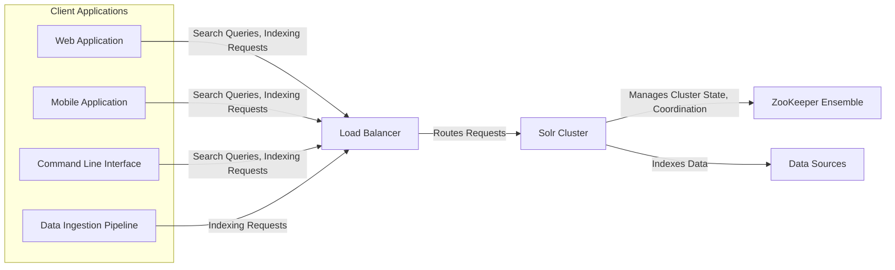
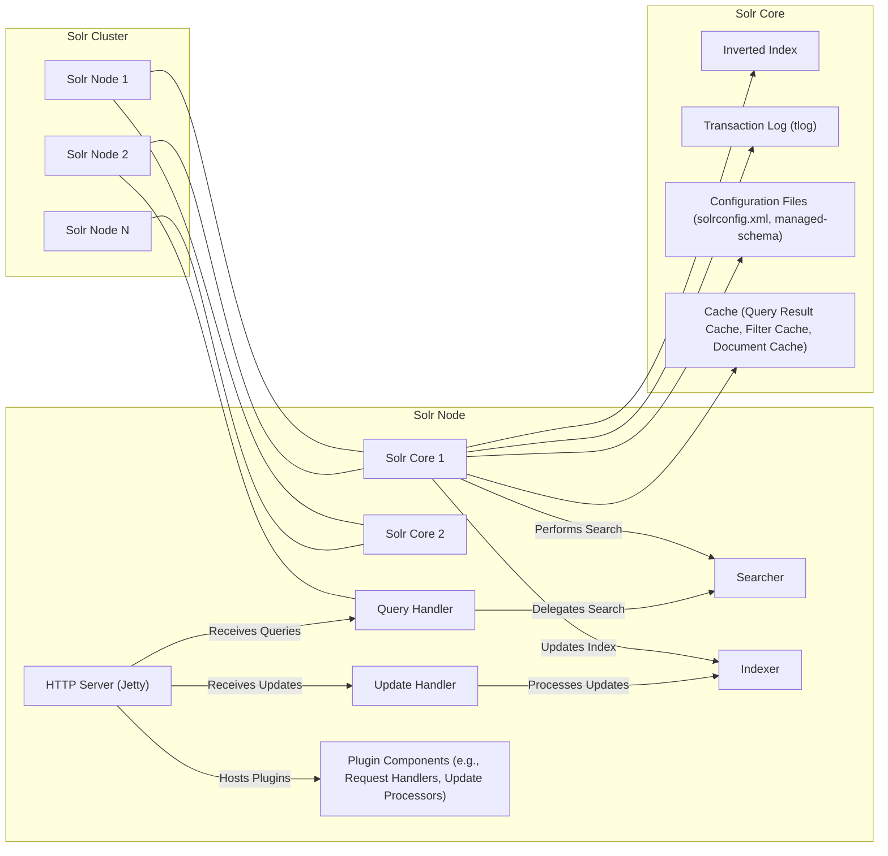
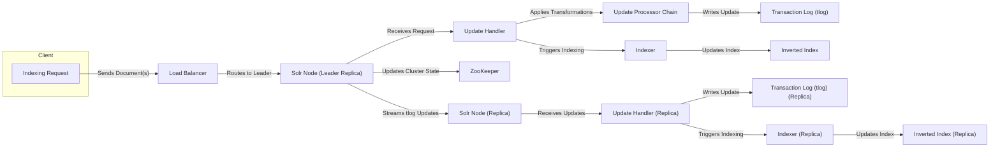
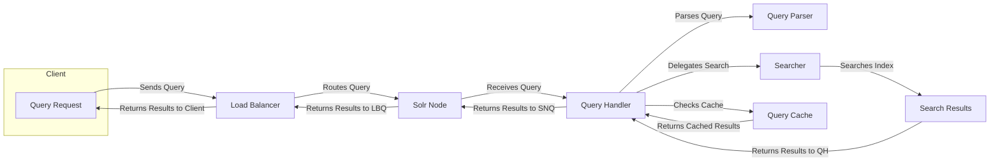

# Project Design Document: Apache Solr

**Version:** 1.1
**Date:** October 26, 2023
**Author:** AI Software Architect

## 1. Introduction

This document provides an enhanced and detailed architectural design of the Apache Solr project, based on its publicly available source code, official documentation, and common deployment patterns. This design serves as a robust foundation for subsequent threat modeling activities, offering a comprehensive understanding of the system's structure and behavior. The focus remains on identifying key components, their interactions, and the flow of data within the Solr ecosystem.

## 2. Goals and Objectives

The primary goal of this document is to provide a highly detailed and accurate representation of the Apache Solr architecture, specifically tailored for threat modeling purposes. Specific objectives include:

*   Clearly and comprehensively outlining the major components of the Solr system and their responsibilities.
*   Precisely describing the interactions and data flow between these components, including protocols and data formats where relevant.
*   Identifying key functionalities and their dependencies, highlighting potential points of failure or vulnerability.
*   Providing a solid and well-structured basis for understanding the system's attack surface and potential threat vectors.

## 3. High-Level Architecture

Apache Solr is an enterprise-grade search platform built upon the Apache Lucene library. It offers distributed indexing, replication, load-balanced querying, and centralized configuration management through Apache ZooKeeper. At a high level, Solr operates as a cluster of interconnected servers (Solr nodes) that collectively manage and serve search indexes, providing a scalable and fault-tolerant search solution.

*   **Client Applications:** These are diverse applications that interact with the Solr cluster. They can send search queries to retrieve information or submit indexing requests to add or update data. Examples include web applications, mobile apps, command-line tools, and data ingestion pipelines.
*   **Load Balancer:**  A crucial component for distributing incoming client requests evenly across the available Solr nodes within the cluster. This ensures high availability and prevents overload on individual nodes.
*   **Solr Cluster:** The core of the system, consisting of multiple interconnected Solr nodes. These nodes work together to store, index, and serve search data.
*   **ZooKeeper Ensemble:** A distributed coordination service essential for managing the Solr cluster. It handles tasks such as leader election, configuration management, and maintaining a consistent view of the cluster state across all nodes.
*   **Data Sources:** The origins of the data that is indexed by Solr. These can be various types of data repositories, including relational databases, NoSQL databases, file systems, message queues, and other data lakes.

## 4. Detailed Architecture

The Solr cluster is composed of individual Solr nodes. Each node can host one or more Solr cores, which represent a single logical index. SolrCloud mode provides advanced features like distributed indexing and querying.

### 4.1. Key Components within a Solr Node:

*   **HTTP Server (Jetty):** Solr embeds an HTTP server, typically Jetty, to expose its API and handle communication with clients and other nodes. It listens for incoming requests on configured ports.
*   **Solr Core:** A fundamental unit within Solr, representing a single, independent Lucene index. Each core has its own configuration, schema, and data. A Solr node can host multiple cores, allowing for logical separation of indexed data.
*   **Query Handler:** Responsible for receiving, parsing, and processing incoming search queries. It determines the appropriate Searcher to use and orchestrates the search process. Solr supports various query handlers for different query languages and functionalities.
*   **Update Handler:** Manages requests to modify the index, including adding, updating, and deleting documents. It interacts with the Indexer and ensures data consistency. Update handlers can be configured with update processors to modify documents before indexing.
*   **Searcher:** The core component responsible for performing the actual search operation against the Inverted Index. It uses the Lucene search library to efficiently retrieve matching documents based on the query.
*   **Indexer:**  Builds and updates the Inverted Index based on incoming documents. It performs tokenization, analysis, and other processing steps defined in the schema.
*   **Inverted Index:** The primary data structure used for efficient full-text searching. It maps terms to the documents containing those terms, enabling rapid retrieval of relevant information.
*   **Transaction Log (tlog):**  A persistent log of all update operations performed on a Solr core. It ensures data durability and is crucial for replication, allowing replica nodes to catch up with the leader.
*   **Configuration Files (solrconfig.xml, managed-schema):** Define the behavior and structure of the Solr core. `solrconfig.xml` contains settings for indexing, querying, caching, and other core functionalities. `managed-schema` (or `schema.xml`) defines the fields in the index, their types, and analysis chains.
*   **Cache (Query Result Cache, Filter Cache, Document Cache):** Solr utilizes various caching mechanisms to improve query performance. The query result cache stores the results of previous queries, the filter cache stores frequently used filters, and the document cache stores frequently accessed documents.
*   **Plugin Components (e.g., Request Handlers, Update Processors):** Solr's architecture is highly extensible through plugins. Request handlers extend the API endpoints, while update processors allow for custom logic to be applied during the indexing process.

### 4.2. Cluster-Level Components:

*   **ZooKeeper Ensemble:**
    *   **Configuration Management:**  Stores the authoritative configuration for the SolrCloud cluster, including collection definitions, shard assignments, and replica locations. This ensures consistency across all nodes.
    *   **Leader Election:**  Facilitates the election of a leader node for each SolrCloud collection and shard. The leader is responsible for coordinating write operations.
    *   **Cluster State Management:** Maintains a dynamic view of the cluster's topology, including the status of each node, core, and replica.
    *   **Coordination and Synchronization:** Provides mechanisms for distributed synchronization and coordination between Solr nodes, ensuring consistent data views and operations.

## 5. Data Flow

The following outlines the typical data flow for indexing and querying operations within a Solr cluster operating in SolrCloud mode.

### 5.1. Indexing Data Flow:

*   **Indexing Request:** A client application sends a request containing documents to be indexed.
*   **Load Balancer:** Routes the indexing request to a Solr node that is the leader replica for the target shard of the collection.
*   **Solr Node (Leader Replica):** The designated node responsible for handling write operations for a specific shard.
*   **Update Handler:** Receives the indexing request and initiates the indexing process.
*   **Update Processor Chain:** A configurable chain of processors that can modify, enrich, or filter documents before they are indexed.
*   **Transaction Log (tlog):** The update operation is first written to the leader replica's transaction log for durability and replication purposes.
*   **Indexer:** Processes the document(s) and updates the local Inverted Index.
*   **Inverted Index:** The core search index on the leader replica is updated with the new or modified documents.
*   **Streams tlog Updates:** The leader replica streams the updates from its transaction log to the replica nodes.
*   **Solr Node (Replica):** Receives the streamed updates from the leader.
*   **Update Handler (Replica):** Processes the replicated updates.
*   **Transaction Log (tlog) (Replica):** The update is written to the replica's transaction log.
*   **Indexer (Replica):** Updates the replica's local Inverted Index to synchronize with the leader.
*   **Updates Cluster State:** The leader node communicates with ZooKeeper to update the cluster state if necessary, such as when new shards or replicas are added.

### 5.2. Querying Data Flow:

*   **Query Request:** A client application sends a search query to retrieve information.
*   **Load Balancer:** Routes the query to a Solr node. The routing strategy can be configured (e.g., round-robin, based on shard affinity).
*   **Solr Node:** Receives the query. This node may or may not hold the data relevant to the query.
*   **Query Handler:** Receives the query and determines how to process it.
*   **Query Parser:** Parses the query string into a structured query object that can be understood by the Searcher.
*   **Query Cache:** Checks if the same query has been executed recently. If a cached result exists, it is returned directly, improving performance.
*   **Searcher:** Executes the search against the local Inverted Index. For distributed queries, the Query Handler coordinates searches across multiple shards and merges the results.
*   **Search Results:** The Searcher retrieves the matching documents from the index.
*   **Returns Results to QH:** The Searcher returns the search results to the Query Handler.
*   **Returns Results to Client:** The Query Handler sends the aggregated search results back to the client application through the load balancer.

## 6. Key Functionalities

*   **Indexing:** The core process of converting raw data into a searchable format and storing it in the Inverted Index. This involves analyzing text, tokenizing it into terms, and creating the index structure.
*   **Searching:** The fundamental function of retrieving documents that match a specified query. Solr supports a rich query language with various operators, filters, and boosting capabilities.
*   **Distributed Indexing:**  The ability to split a large index across multiple shards and nodes, enabling parallel indexing and handling of massive datasets.
*   **Replication:** Maintaining multiple copies of index shards (replicas) on different nodes to ensure high availability and fault tolerance. If a node fails, other replicas can continue serving requests.
*   **Query Routing and Distribution:**  Intelligently directing queries to the appropriate shards that contain the relevant data and merging the results from different shards to provide a unified response.
*   **Schema Management:** Defining the structure of the indexed data, including field names, data types, and analysis chains. The schema dictates how data is processed during indexing and searching.
*   **Query Parsing:**  Interpreting user-provided query strings and converting them into a structured query representation that can be executed against the index.
*   **Faceting:**  Providing aggregated counts of terms or values within the search results, allowing users to refine their search and explore data distributions.
*   **Highlighting:**  Marking the occurrences of search terms within the retrieved documents, making it easier for users to identify the relevant parts of the results.
*   **Real-Time Get (RTG):**  The ability to retrieve the most recent version of a document directly from the transaction log, even if it hasn't been fully committed to the index yet.
*   **Authentication and Authorization:**  Mechanisms to control access to Solr resources and data. Authentication verifies the identity of users or applications, while authorization determines what actions they are permitted to perform.
*   **Data Import Handler (DIH):** A tool for importing data from various sources (databases, files, etc.) into Solr, simplifying the initial indexing process and ongoing data synchronization.
*   **SolrJ:** A Java client library that provides a convenient way for Java applications to interact with Solr.
*   **Admin UI:** A web-based interface for managing and monitoring Solr clusters, cores, and collections.

## 7. Deployment Considerations

Solr offers flexible deployment options to suit various infrastructure needs:

*   **Standalone Mode:** A single Solr instance running on a single server. Suitable for development or small-scale deployments.
*   **SolrCloud Mode:** The recommended mode for production deployments, providing distributed indexing, replication, and fault tolerance. Requires a ZooKeeper ensemble for coordination.
*   **On-Premise:** Deployment on physical or virtual machines within an organization's data center, providing full control over the infrastructure.
*   **Cloud-Based:** Deployment on cloud platforms like AWS, Azure, or GCP, leveraging services like EC2, Azure VMs, or Google Compute Engine. Managed Kubernetes services (EKS, AKS, GKE) are increasingly popular for deploying and managing Solr clusters in the cloud.
*   **Containerized:** Deployment using containerization technologies like Docker, enabling consistent and portable deployments across different environments. Orchestration platforms like Kubernetes are commonly used to manage containerized Solr deployments.
*   **Solr Operator:**  A Kubernetes operator that automates the deployment, scaling, and management of SolrCloud clusters within a Kubernetes environment.

Deployment planning involves considerations such as:

*   **Number of Nodes:** Determined by the expected data volume, query load, and desired level of fault tolerance.
*   **Number of Shards:**  Impacts indexing and query parallelism. The number of shards is typically determined at collection creation time.
*   **Replication Factor:** The number of copies of each shard, influencing data redundancy and availability.
*   **Resource Allocation (CPU, Memory, Disk):**  Adequate resources are crucial for performance and stability.
*   **Network Configuration:**  Proper network setup is essential for communication between Solr nodes and with external clients.
*   **Storage Configuration:**  Choosing appropriate storage for the index data and transaction logs, considering factors like performance and cost.

## 8. Security Considerations (Detailed for Threat Modeling)

This section provides a more detailed overview of security considerations relevant for threat modeling, highlighting potential vulnerabilities and attack vectors.

*   **Authentication:**
    *   **Basic Authentication:** Transmits credentials in base64 encoding, vulnerable to eavesdropping if TLS is not used.
    *   **Kerberos Authentication:** Provides strong authentication using tickets, suitable for enterprise environments. Requires proper Kerberos infrastructure.
    *   **PKI Authentication (SSL Client Certificates):** Uses digital certificates for authentication, providing strong security. Requires certificate management.
    *   **LDAP Authentication:** Integrates with LDAP directories for user authentication. Requires proper LDAP configuration and security.
    *   **Authentication Plugins:** Solr allows for custom authentication mechanisms through plugins. Improperly implemented plugins can introduce vulnerabilities.
*   **Authorization:**
    *   **Rule-Based Authorization:** Defines access control rules based on users, roles, and permissions on specific Solr resources (cores, collections, endpoints). Misconfigured rules can lead to unauthorized access.
    *   **Plugin-Based Authorization:** Allows for more complex authorization logic through custom plugins. Vulnerabilities in plugins can lead to privilege escalation.
*   **Network Security:**
    *   **TLS/SSL Encryption:** Essential for protecting communication between clients and Solr nodes, and between Solr nodes themselves. Improperly configured TLS can lead to man-in-the-middle attacks.
    *   **Firewall Rules:** Restricting network access to only necessary ports and IP addresses is crucial. Open ports can expose Solr to unauthorized access.
    *   **Network Segmentation:** Isolating the Solr cluster within a secure network segment can limit the impact of breaches.
*   **Input Validation:**
    *   **Query Injection:** Maliciously crafted queries can potentially bypass security checks or cause unexpected behavior. Proper input sanitization and parameterized queries are essential.
    *   **Update Request Injection:**  Exploiting vulnerabilities in update handlers or update processors to inject malicious data or commands.
*   **Data Protection:**
    *   **Encryption at Rest:** Encrypting the index data and transaction logs on disk protects sensitive information from unauthorized access if storage is compromised.
    *   **Encryption in Transit:** Using TLS/SSL to encrypt data transmitted over the network.
*   **Access Control to Configuration Files:**
    *   Restricting access to `solrconfig.xml`, `managed-schema`, and other configuration files is vital, as these files contain sensitive information and control the behavior of Solr.
*   **Logging and Auditing:**
    *   Comprehensive logging of user activity, administrative actions, and system events is crucial for security monitoring and incident response. Insufficient logging can hinder the detection of attacks.
*   **ZooKeeper Security:**
    *   Securing the ZooKeeper ensemble is paramount, as it controls the Solr cluster. Unauthorized access to ZooKeeper can lead to complete cluster compromise. Authentication and authorization for ZooKeeper clients are essential.
*   **Denial of Service (DoS) Protection:**
    *   Implementing measures to prevent resource exhaustion attacks, such as limiting request rates, setting timeouts, and properly configuring resource limits.
*   **Vulnerability Management:**
    *   Regularly updating Solr and its dependencies to patch known security vulnerabilities is critical.
*   **Admin UI Security:**
    *   Securing access to the Solr Admin UI through authentication and authorization is important to prevent unauthorized administrative actions.
*   **Third-Party Libraries:**
    *   Vulnerabilities in third-party libraries used by Solr can also pose security risks. Regularly scanning and updating these libraries is necessary.

## 9. Future Considerations

Potential future enhancements and changes to Solr may include:

*   Further improvements in cloud-native deployments and tighter integrations with cloud platforms.
*   Enhanced security features, such as more granular access control and improved auditing capabilities.
*   Performance optimizations for handling larger datasets and higher query loads.
*   New query capabilities and data processing features, potentially leveraging machine learning techniques.
*   Improved monitoring and management tools.
*   Evolution of the plugin architecture for greater flexibility and extensibility.

## 10. Conclusion

This enhanced design document provides a comprehensive and detailed architectural overview of Apache Solr, specifically tailored for threat modeling. It outlines the key components, data flows, and functionalities with greater precision and depth. The detailed security considerations section highlights potential vulnerabilities and attack vectors, providing a solid foundation for identifying and mitigating security risks. The diagrams and descriptions aim to provide a clear and thorough understanding of the Solr system's internal workings, enabling more effective threat analysis and security planning.