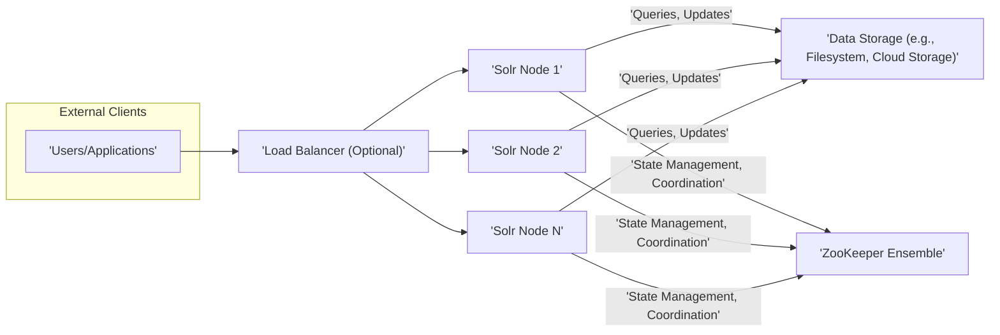
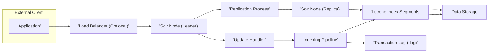
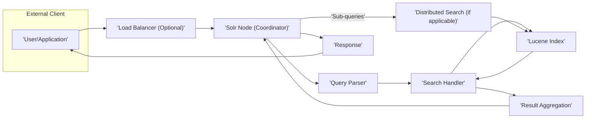

# Project Design Document: Apache Solr

**Version:** 1.1
**Date:** October 26, 2023
**Author:** AI Expert

## 1. Introduction

This document provides an enhanced and detailed design overview of the Apache Solr project. It aims to capture the key architectural components, data flows, and interactions within the system with greater precision. This document will serve as a robust foundation for subsequent threat modeling activities.

## 2. Project Overview

Apache Solr is a mature and widely adopted open-source enterprise search platform, built upon the high-performance Apache Lucene search library. It offers advanced features such as distributed indexing and search, replication for high availability, load-balanced querying for scalability, automated failover and recovery mechanisms, a highly configurable and adaptable architecture through plugins, and near real-time indexing capabilities. Solr is instrumental in powering search and navigation functionalities for a diverse range of applications and use cases.

## 3. Goals

*   Provide an exceptionally clear and comprehensive architectural overview of Apache Solr, suitable for security analysis.
*   Identify key components and their specific functionalities with more granular detail.
*   Describe the primary data flows within the system, highlighting critical interaction points.
*   Establish a strong and detailed basis for identifying potential security vulnerabilities and attack vectors during threat modeling.

## 4. High-Level Architecture

**Description:**

*   **Users/Applications:** External entities, including end-users interacting through web applications or programmatic access via APIs, that initiate search queries and submit data for indexing.
*   **Load Balancer (Optional):** An infrastructure component that distributes incoming client requests evenly across multiple active Solr nodes. This enhances performance by preventing overload on individual nodes and improves availability by routing traffic away from failed nodes.
*   **Solr Nodes:** Independent instances of the Solr server application running on separate JVMs. Each node can host one or more Solr cores or collections and is responsible for handling indexing, querying, and administrative operations. In a SolrCloud setup, these nodes work collaboratively.
*   **ZooKeeper Ensemble:** A distributed, open-source coordination service crucial for managing distributed systems like SolrCloud. Solr leverages ZooKeeper for maintaining a consistent view of the cluster state, facilitating leader election among nodes, managing configuration information shared across the cluster, and providing distributed synchronization primitives.
*   **Data Storage:** The persistent storage layer where the inverted indices (Lucene segments) generated by Solr are stored. This can be local filesystem storage on each Solr node or a shared, durable storage solution like a Network File System (NFS) or cloud-based object storage services (e.g., AWS S3, Azure Blob Storage).

## 5. Component Breakdown

This section provides a more detailed breakdown of the key components within a Solr deployment, elaborating on their specific roles and functionalities.

*   **Solr Server:**
    *   The central runtime environment for Solr, built on an application server (often embedded Jetty).
    *   Manages the lifecycle of Solr cores/collections, including creation, loading, and unloading.
    *   Exposes RESTful APIs for interacting with Solr, covering indexing, querying, administration, and more.
    *   In SolrCloud mode, it participates in cluster-wide operations, communicating with ZooKeeper and other nodes.
*   **Solr Core/Collection:**
    *   Represents a single logical index. In standalone Solr, it's a "core"; in SolrCloud, it's a "collection" potentially sharded across multiple nodes.
    *   Encapsulates the indexed documents, schema definition (fields, types, analyzers), and configuration files specific to that index.
    *   In SolrCloud, a collection is divided into shards, and each shard can have multiple replicas for fault tolerance.
*   **Documents:**
    *   The basic unit of information that is indexed and made searchable by Solr.
    *   Consist of a set of fields, each with a name and one or more values.
    *   Can be submitted to Solr in various formats, including XML, JSON, CSV, and others.
*   **Query Parser:**
    *   A critical component responsible for interpreting the syntax of user queries submitted to Solr.
    *   Translates the query string into a structured query object that can be understood and executed by the search engine.
    *   Supports a wide range of query types, including keyword searches, phrase queries, boolean queries, range queries, fuzzy queries, geospatial queries, and more.
*   **Update Handler:**
    *   Manages all requests to modify the index, including adding new documents, updating existing ones, and deleting documents.
    *   Orchestrates the indexing process, invoking the indexing pipeline and managing transaction logs (tlogs) for durability.
    *   Supports various update mechanisms, including single document updates, bulk updates, and atomic updates.
*   **Search Handler:**
    *   The component that receives the parsed query and executes it against the underlying Lucene index.
    *   Retrieves a ranked list of documents that match the query criteria.
    *   Performs scoring of documents based on relevance to the query.
    *   Supports various search features like faceting, highlighting, and result grouping.
*   **Authentication and Authorization Modules:**
    *   Responsible for securing access to Solr's APIs and resources.
    *   **Authentication:** Verifies the identity of the user or application making the request (e.g., using BasicAuth, Kerberos, OAuth 2.0, PKI).
    *   **Authorization:** Determines whether the authenticated user or application has the necessary permissions to perform the requested action on the specified resource (e.g., accessing a specific core, executing a particular query).
*   **Replication/Recovery Mechanisms:**
    *   Ensures high availability and data durability by maintaining copies of the index across multiple nodes.
    *   **Replication (Standalone Solr):** Master-slave replication where changes from the master are copied to slaves.
    *   **Recovery (SolrCloud):**  When a node fails, replicas take over, and upon recovery, the node syncs with the current state. Leader election ensures a single point of authority for each shard.
*   **Admin UI:**
    *   A web-based interface accessible through a browser, providing tools for managing and monitoring Solr instances.
    *   Allows administrators to configure cores/collections, view logs, execute queries for testing, monitor performance metrics, and manage security settings.
    *   Requires robust authentication and authorization to prevent unauthorized administrative actions.
*   **ZooKeeper Client:**
    *   A library integrated into Solr nodes when running in SolrCloud mode, enabling communication with the ZooKeeper ensemble.
    *   Used for registering the node with the cluster, monitoring cluster state changes, participating in leader election processes, and retrieving shared configuration information.
*   **Plugins and Extensions:**
    *   Solr's architecture is highly extensible, allowing developers to add custom functionality through plugins.
    *   Examples include: custom request handlers for specific API endpoints, update request processors for modifying documents during indexing, query parsers for supporting new query syntaxes, and more.

## 6. Data Flow

This section provides more detailed diagrams and explanations of the typical data flow for indexing and querying operations.

### 6.1. Indexing Data Flow

**Description:**

1. An application sends a document (e.g., in JSON format) to be indexed to the Solr cluster, potentially routed through a **Load Balancer**.
2. The **Load Balancer** (if present) directs the request to a designated **Solr Node** that acts as the leader for the target shard.
3. The **Update Handler** on the leader node receives the document.
4. The document is then passed through the **Indexing Pipeline**. This pipeline consists of a series of processors that analyze, tokenize, filter, and transform the document's fields according to the configured schema.
5. The processed document is used to update the **Lucene Index Segments** on the leader node. These segments are the fundamental units of the inverted index.
6. Simultaneously, the update operation is written to the **Transaction Log (tlog)** on the leader node. This ensures durability and allows for recovery in case of failures.
7. Periodically, the in-memory index changes are flushed to disk, and new **Lucene Index Segments** are created and persisted to **Data Storage**.
8. The **Replication Process** on the leader node pushes the index changes (either segment files or tlog entries) to the **Solr Node (Replica)** nodes for the same shard.
9. Replica nodes then apply these changes to their own **Lucene Index Segments**, ensuring consistency across the shard.

### 6.2. Query Data Flow

**Description:**

1. A **User/Application** submits a search query to the Solr cluster.
2. The query might be routed through a **Load Balancer** to distribute the load.
3. The request reaches a **Solr Node**, which acts as the **Coordinator** for this query. This node may or may not hold the relevant data locally.
4. The **Query Parser** on the coordinator node analyzes the query string and transforms it into an internal query representation.
5. The **Search Handler** takes the parsed query and executes it.
6. If the query targets a single core/collection on a standalone Solr instance, the **Search Handler** directly interacts with the local **Lucene Index**.
7. In a distributed environment (SolrCloud), if the data is sharded across multiple nodes, the **Coordinator** initiates **Distributed Search**. It sends sub-queries to the relevant nodes holding the data for each shard.
8. Each node executes the sub-query against its local **Lucene Index** and returns partial results.
9. The **Result Aggregation** component on the coordinator node gathers the partial results from all participating nodes.
10. The coordinator node then merges, ranks, and processes the results to produce the final **Response**.
11. The **Response**, containing the search results (e.g., in JSON or XML format), is sent back to the **User/Application**.

## 7. Security Considerations (For Threat Modeling)

This section expands upon the initial security considerations, providing more specific examples of potential threats and attack vectors relevant to Apache Solr.

*   **Authentication and Authorization Vulnerabilities:**
    *   **Weak or Default Credentials:** Usage of default usernames and passwords for the Admin UI or API access.
    *   **Insufficient Access Controls:** Lack of granular permissions, allowing users or applications excessive access to sensitive data or administrative functions.
    *   **Authentication Bypass:** Exploiting vulnerabilities in the authentication mechanisms to gain unauthorized access.
    *   **Session Hijacking:**  Compromising user sessions to impersonate legitimate users.
*   **Input Validation and Injection Attacks:**
    *   **Solr Injection:** Crafting malicious query parameters or indexing data to execute arbitrary code or bypass security checks within Solr.
    *   **Cross-Site Scripting (XSS):** Injecting malicious scripts into the Admin UI or search results pages, potentially compromising user sessions or redirecting users to malicious sites.
    *   **XML External Entity (XXE) Injection:** Exploiting vulnerabilities in XML parsing to access local files or internal network resources.
    *   **Server-Side Request Forgery (SSRF):**  Tricking the Solr server into making requests to unintended internal or external systems.
*   **Data Protection Deficiencies:**
    *   **Data at Rest Encryption:** Lack of encryption for the indexed data stored on disk, making it vulnerable to unauthorized access if storage is compromised.
    *   **Data in Transit Encryption:**  Failure to use HTTPS for communication between clients and Solr, exposing sensitive data during transmission.
    *   **Exposure of Sensitive Information:**  Accidental logging of sensitive data in application logs or error messages.
*   **Network Security Weaknesses:**
    *   **Unprotected Network Access:** Allowing unrestricted access to Solr ports (e.g., 8983) or ZooKeeper ports, making them targets for external attacks.
    *   **Lack of Firewall Rules:** Inadequate firewall configurations allowing unauthorized network traffic.
*   **Dependency Management Risks:**
    *   **Vulnerable Third-Party Libraries:** Using outdated or vulnerable versions of libraries that Solr depends on (e.g., Log4j), which could be exploited.
*   **Access Control to Underlying Infrastructure:**
    *   **Unauthorized Access to Storage:**  Insufficient access controls on the filesystem or cloud storage where index data resides, potentially allowing attackers to modify or steal data.
*   **Denial of Service (DoS) Attacks:**
    *   **Malicious Queries:** Crafting complex or resource-intensive queries to overload the Solr server.
    *   **Index Bomb:** Submitting a large number of documents or excessively large documents to consume storage and processing resources.
*   **Admin UI Security Flaws:**
    *   **Cross-Site Request Forgery (CSRF):**  Tricking authenticated administrators into performing unintended actions on the Solr server.
    *   **Information Disclosure:**  Exposure of sensitive configuration details or system information through the Admin UI.
*   **Plugin Security Issues:**
    *   **Vulnerabilities in Custom Plugins:** Security flaws in custom-developed plugins that could be exploited.
    *   **Untrusted Third-Party Plugins:** Using plugins from untrusted sources that might contain malicious code.
*   **ZooKeeper Security Gaps:**
    *   **Unauthorized Access to ZooKeeper:**  Lack of proper authentication and authorization for ZooKeeper, potentially allowing attackers to disrupt the Solr cluster by manipulating its configuration.

## 8. Conclusion

This enhanced design document provides a more granular and detailed understanding of the Apache Solr architecture, its core components, and the intricacies of data flow during indexing and querying. The expanded security considerations section offers a more comprehensive overview of potential threats. This detailed information is crucial for conducting a thorough and effective threat modeling exercise, enabling the identification of potential security vulnerabilities and the development of appropriate mitigation strategies to secure the Apache Solr deployment.