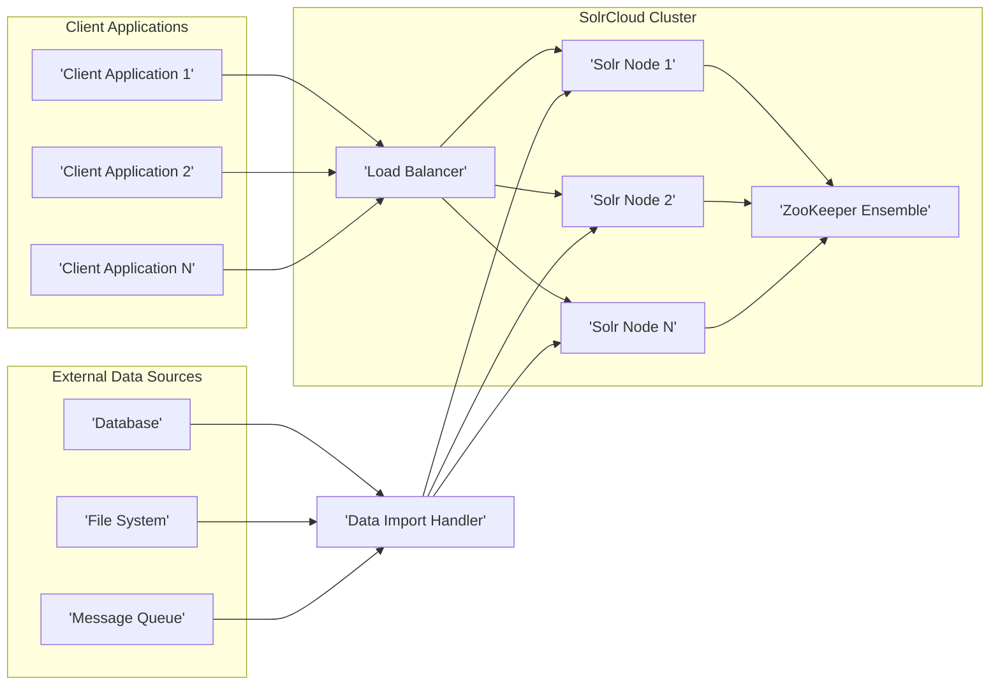
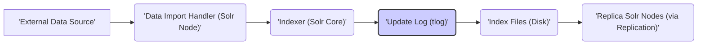
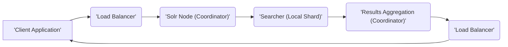

# Project Design Document: Apache Solr

**Version:** 1.1
**Date:** October 26, 2023
**Author:** AI Software Architect

## 1. Introduction

This document provides an enhanced and more detailed architectural design of the Apache Solr project. Building upon the previous version, it further elaborates on the key components, their interactions, data flow, and security considerations. This document remains intended to serve as a robust foundation for subsequent threat modeling activities.

## 2. Goals and Objectives

The primary goal of this document is to provide a comprehensive, clear, and more detailed architectural overview of Apache Solr. Specific objectives include:

*   Identifying and elaborating on the major components of the Solr system with greater detail.
*   Describing the interactions and data flow between these components with more precision.
*   Highlighting key security considerations and potential vulnerabilities with more specific examples.
*   Providing a more robust basis for conducting thorough threat modeling exercises.

## 3. High-Level Architecture

Apache Solr is a highly scalable, fault-tolerant, and open-source enterprise search platform built upon the Apache Lucene library. It provides distributed indexing, replication, load-balanced querying, and centralized configuration management.

## 4. Component Details

This section provides a more detailed description of the key components of the Apache Solr architecture:

*   **Client Applications:** These are external applications that initiate interactions with the Solr cluster. They communicate via standard protocols, primarily HTTP/HTTPS, using Solr's API. These applications can range from simple web interfaces to complex data processing pipelines.
*   **Load Balancer:**  A crucial component for distributing incoming client requests evenly across the available Solr nodes. This ensures high availability by preventing any single node from being overwhelmed and improves performance by parallelizing request processing. Different load balancing strategies can be employed (e.g., round-robin, least connections).
*   **Solr Nodes:** Individual instances of the Solr server, each running within a Java Virtual Machine (JVM). Each node is responsible for hosting and managing one or more Solr Cores or Collections.
    *   **Solr Core/Collection:** A logical index representing a searchable dataset.
        *   In standalone mode, a Core resides on a single node.
        *   In SolrCloud mode, a Collection is logically divided into **shards**, and each shard is replicated across multiple nodes for fault tolerance.
    *   **Request Handlers:** Pluggable components within a Solr Core that process specific types of client requests. Examples include:
        *   `/select`: Handles search queries.
        *   `/update`: Handles indexing and update operations.
        *   `/analysis`: Provides text analysis capabilities.
        *   `/replication`: Manages index replication.
    *   **Searcher:** The core component responsible for executing search queries against the Lucene index. It optimizes query execution and retrieves relevant documents.
    *   **Indexer:** The component responsible for the process of adding, updating, and deleting documents in the Lucene index. It handles tasks like tokenization, stemming, and creating the inverted index.
    *   **Update Log (tlog):** A persistent, append-only transaction log that records all update operations performed on a shard. This is critical for replication and recovery in SolrCloud, ensuring data consistency across replicas.
    *   **Index Files:** The underlying Apache Lucene index files stored on the node's file system. These files contain the inverted index, document metadata, and other structures necessary for efficient searching.
*   **ZooKeeper Ensemble:** A distributed, open-source coordination service that is fundamental to SolrCloud. It maintains the cluster state, including:
    *   **Cluster Configuration:** Stores the configuration for all Collections.
    *   **Live Nodes:** Tracks which Solr nodes are currently active.
    *   **Collection State:** Manages the assignment of shards and replicas to nodes.
    *   **Leader Election:** Facilitates the election of leader replicas for each shard.
*   **Data Import Handler (DIH):** A powerful Solr module that simplifies the process of importing data from various external sources. It supports:
    *   **Full and Delta Imports:** Allows for both initial bulk imports and incremental updates.
    *   **Various Data Sources:** Connects to databases (via JDBC), files (XML, CSV, JSON), and other data sources.
    *   **Data Transformation:** Enables the transformation and manipulation of data during the import process.
*   **External Data Sources:** The systems that hold the original data to be indexed by Solr. These can be relational databases, file systems, message queues, or other data repositories.

## 5. Data Flow

This section provides a more detailed description of the typical data flow for indexing and querying operations:

### 5.1. Indexing Data

1. **Data Extraction:** The Data Import Handler (DIH) running on a designated Solr node initiates the process by connecting to the configured external data source and extracting the relevant data.
2. **Data Transformation:** The DIH applies any configured transformations to the extracted data. This might involve data cleaning, format conversion, or enrichment.
3. **Document Creation:** The transformed data is then converted into Solr documents. Each document represents a unit of information to be indexed and contains fields with corresponding values.
4. **Indexing Request:** The created documents are submitted to the Indexer within the target Solr Core. In SolrCloud, the request is routed to the leader replica of the appropriate shard.
5. **Update Log Write:** The Indexer first writes the update operation (adding, updating, or deleting documents) to the Update Log (tlog). This ensures durability and allows for recovery in case of failures.
6. **Index Update:** The Indexer then updates the underlying Lucene index files on the local disk with the new or modified documents. This involves updating the inverted index and other data structures.
7. **Replication:** In a SolrCloud environment, the leader replica pushes the changes recorded in the tlog to the replica shards on other Solr nodes. This ensures that all replicas are consistent with the leader.

### 5.2. Querying Data

1. **Query Submission:** A client application constructs a search query using Solr's query syntax and submits it to the Load Balancer via HTTP/HTTPS.
2. **Request Routing:** The Load Balancer intelligently routes the query request to an available Solr node. In SolrCloud, this node becomes the coordinator for this specific query.
3. **Distributed Query Processing:** The coordinator node analyzes the query and determines which shards are relevant to the search. It then forwards sub-queries to the leader replicas of those shards.
4. **Local Search Execution:** On each relevant Solr node, the Searcher component executes the sub-query against its local shard's index.
5. **Results Retrieval:** The Searcher retrieves the matching documents from the local index.
6. **Results Aggregation:** The coordinator node collects the results from all the queried shards.
7. **Result Merging and Ranking:** The coordinator merges the results from different shards, ranks them based on relevance scores, and potentially applies post-processing steps like faceting or highlighting.
8. **Response Delivery:** The coordinator sends the final, merged, and ranked search results back to the client application through the Load Balancer.

## 6. Security Considerations

This section provides a more detailed overview of key security considerations for the Apache Solr project, including potential threats and mitigation strategies:

*   **Authentication and Authorization:**
    *   **Client Authentication:**
        *   **Threat:** Unauthorized access to Solr APIs, allowing malicious actors to index, query, or modify data.
        *   **Mitigation:** Implement strong authentication mechanisms such as:
            *   **Basic Authentication:** Simple username/password authentication over HTTPS.
            *   **Kerberos Authentication:** Enterprise-grade authentication using tickets.
            *   **OAuth 2.0:** Token-based authorization for delegated access.
            *   **LDAP/Active Directory Integration:** Leverage existing directory services for authentication.
    *   **Authorization:**
        *   **Threat:** Legitimate users gaining access to resources or operations beyond their assigned privileges.
        *   **Mitigation:** Implement fine-grained authorization controls:
            *   **Role-Based Access Control (RBAC):** Assign permissions based on user roles.
            *   **Rule-Based Authorization:** Define rules based on various criteria (e.g., IP address, user attributes).
            *   **Solr Security Plugin:** Utilize Solr's built-in security features for managing permissions.
*   **Network Security:**
    *   **TLS/SSL Encryption:**
        *   **Threat:** Interception of sensitive data (queries, indexing data, configuration) in transit.
        *   **Mitigation:** Enforce HTTPS for all client-server communication and enable inter-node TLS encryption within the SolrCloud cluster.
    *   **Firewall Rules:**
        *   **Threat:** Unauthorized network access to Solr nodes and ZooKeeper.
        *   **Mitigation:** Configure firewalls to restrict access to only necessary ports and authorized IP addresses. Isolate the Solr cluster within a private network.
*   **Data Security:**
    *   **Data-at-Rest Encryption:**
        *   **Threat:** Exposure of sensitive index data if storage media is compromised.
        *   **Mitigation:** Encrypt the file system where Solr index files are stored using operating system-level encryption or disk encryption solutions.
    *   **Field-Level Security:**
        *   **Threat:** Unauthorized access to specific sensitive fields within documents.
        *   **Mitigation:** Implement field-level security features (if available or through custom plugins) to control access to specific fields based on user roles or permissions.
*   **Input Validation:**
    *   **Threat:** Injection attacks (e.g., Solr Injection, Cross-Site Scripting) due to unsanitized user input in queries or indexing data.
        *   **Solr Injection:** Attackers crafting malicious query parameters to execute unintended operations.
        *   **Cross-Site Scripting (XSS):** Injecting malicious scripts that are executed in the context of other users' browsers.
    *   **Mitigation:**
        *   **Parameterization:** Use parameterized queries to prevent SQL injection-like attacks in Solr.
        *   **Input Sanitization:** Sanitize and validate all user-provided input before processing it.
        *   **Output Encoding:** Encode output data to prevent XSS vulnerabilities.
*   **Access Control to ZooKeeper:**
    *   **Threat:** Unauthorized access to ZooKeeper, potentially leading to cluster disruption or data corruption.
    *   **Mitigation:** Implement strong authentication and authorization for ZooKeeper using mechanisms like Kerberos or SASL. Restrict access to ZooKeeper nodes.
*   **Data Import Handler Security:**
    *   **Threat:** Vulnerabilities in DIH configurations or connections to external data sources leading to data breaches or injection attacks.
    *   **Mitigation:**
        *   **Secure Credentials Management:** Store database credentials securely (e.g., using encrypted configuration files or secrets management tools).
        *   **Principle of Least Privilege:** Grant DIH only the necessary permissions to access external data sources.
        *   **Input Validation for DIH Configurations:** Validate DIH configuration files to prevent injection vulnerabilities.
*   **Plugin Security:**
    *   **Threat:** Malicious or vulnerable plugins introducing security risks to the Solr instance.
    *   **Mitigation:** Carefully vet and audit any custom plugins or extensions before deploying them. Keep plugins up-to-date with the latest security patches.
*   **Denial of Service (DoS) Protection:**
    *   **Threat:** Attackers overwhelming the Solr cluster with excessive requests, making it unavailable.
    *   **Mitigation:**
        *   **Rate Limiting:** Limit the number of requests from a single source.
        *   **Request Size Limits:** Restrict the size of incoming requests.
        *   **Resource Monitoring:** Monitor CPU, memory, and network usage to detect and respond to DoS attacks.
*   **Logging and Auditing:**
    *   **Threat:** Lack of visibility into security-related events, hindering incident detection and response.
    *   **Mitigation:** Configure comprehensive logging to capture user activity, authentication attempts, authorization decisions, and system events. Regularly review audit logs for suspicious activity.
*   **Regular Security Updates:**
    *   **Threat:** Exploitation of known vulnerabilities in Solr or its dependencies.
    *   **Mitigation:** Stay up-to-date with the latest security patches and updates for Solr and its underlying libraries (e.g., Lucene, Jetty).
*   **Secure Configuration:**
    *   **Threat:** Misconfigurations leading to security vulnerabilities.
    *   **Mitigation:** Follow security best practices when configuring Solr, such as disabling unnecessary features, setting strong passwords for administrative users, and reviewing default configurations.

## 7. Deployment Considerations

The deployment architecture of Solr has significant implications for its security. Consider the following security aspects for different deployment scenarios:

*   **Standalone Mode:**
    *   **Security Focus:** Securing the single server instance is paramount. This includes operating system hardening, network security (firewall), and securing the Solr application itself.
    *   **Limitations:** Lacks inherent high availability and fault tolerance, making it a single point of failure.
*   **SolrCloud Mode:**
    *   **Security Focus:** Requires securing all individual Solr nodes and the ZooKeeper ensemble. Inter-node communication security (TLS) is crucial. Proper configuration of ZooKeeper authentication and authorization is essential.
    *   **Benefits:** Provides high availability and scalability, but increases the attack surface due to the distributed nature.
*   **Containerized Deployments (e.g., Docker, Kubernetes):**
    *   **Security Focus:** Container image security, secure container runtime configuration, network policies within the container orchestration platform, and secrets management are critical.
    *   **Considerations:** Ensure containers are running with minimal privileges and that communication between containers is secured.
*   **Cloud-Based Deployments (e.g., AWS, Azure, GCP):**
    *   **Security Focus:** Leverage cloud provider security features such as Network Security Groups (NSGs), Web Application Firewalls (WAFs), Identity and Access Management (IAM) roles, and encryption services.
    *   **Responsibilities:** Understand the shared responsibility model and configure cloud resources securely.

## 8. Future Considerations

Potential future enhancements or changes that could impact the architecture and security include:

*   **Integration with more advanced authentication and authorization providers and protocols.**
*   **Adoption of new security standards and best practices.**
*   **Enhancements to built-in data encryption capabilities, such as column-level encryption.**
*   **Improvements in real-time security monitoring and automated threat detection.**
*   **Changes in the underlying Lucene library that may introduce new security considerations.**
*   **Development of new Solr features that require careful security analysis.**

This enhanced document provides a more in-depth understanding of the Apache Solr architecture, offering a stronger foundation for comprehensive threat modeling activities. Continuous review and updates are recommended to reflect changes in the project and the evolving security landscape.