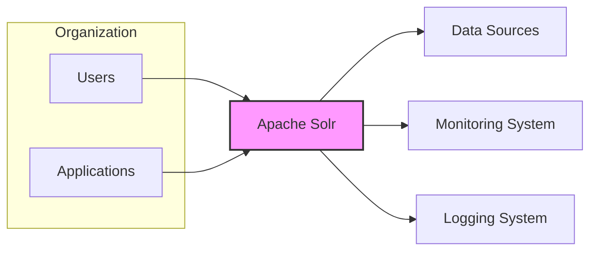
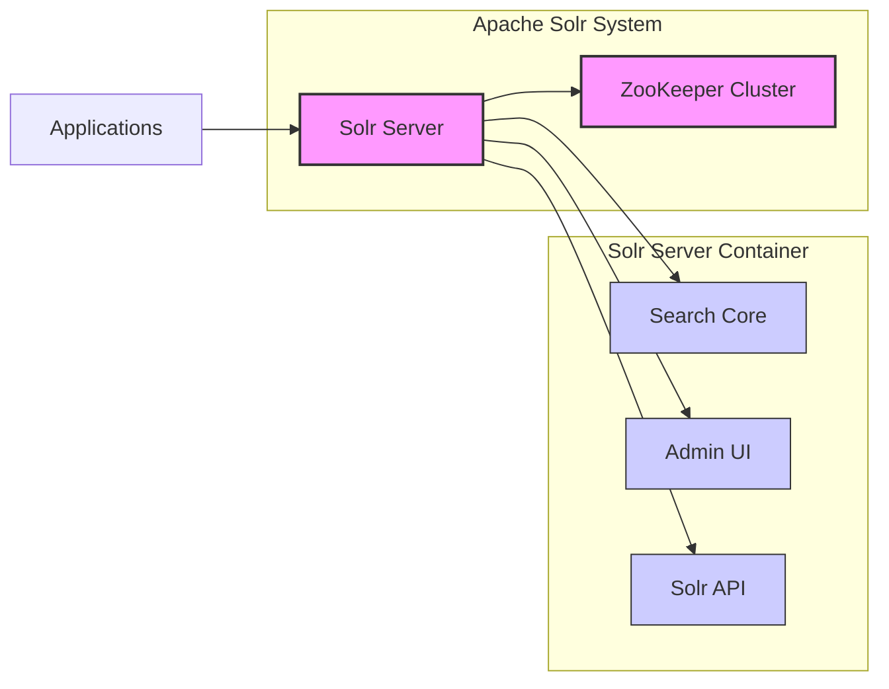
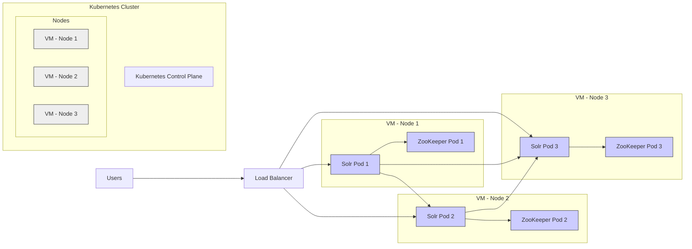

# BUSINESS POSTURE

The Apache Solr project provides a distributed search and analytics platform built on Apache Lucene. It is designed to be highly scalable and fault-tolerant, offering features like full-text search, faceted search, real-time indexing, dynamic clustering, database integration, and rich document handling.

Business priorities and goals for adopting Apache Solr typically include:
- Providing fast and relevant search capabilities for applications and users.
- Enabling data exploration and analytics through faceted search and aggregations.
- Scaling search infrastructure to handle large datasets and high query volumes.
- Ensuring high availability and reliability of search services.
- Integrating search functionality into existing business applications and workflows.

Most important business risks associated with Apache Solr include:
- Data breaches due to vulnerabilities in Solr or its configuration, leading to exposure of sensitive indexed data.
- Service disruption caused by misconfiguration, denial-of-service attacks, or infrastructure failures, impacting business operations reliant on search functionality.
- Data integrity issues resulting from indexing errors or data corruption, leading to inaccurate search results and potentially flawed business decisions.
- Performance degradation under heavy load, impacting user experience and application responsiveness.
- Compliance violations if sensitive data is not handled and secured according to relevant regulations (e.g., GDPR, HIPAA).

# SECURITY POSTURE

Existing security controls and accepted risks for the Apache Solr project are based on common practices for open-source software and typical deployment scenarios.

- security control: Access control to Solr administrative interfaces and APIs, typically configured through authentication and authorization mechanisms within Solr itself or at the network level. (Implemented in Solr configuration files and deployment environment)
- security control: Input validation and sanitization to prevent injection attacks (e.g., query injection, XML External Entity attacks). (Implemented within Solr core search engine and data processing logic)
- security control: Secure communication channels using TLS/SSL for network traffic between clients and Solr servers, and between Solr nodes in a cluster. (Configured in Solr and network infrastructure)
- security control: Regular security updates and patching of Solr software and underlying operating systems and libraries to address known vulnerabilities. (Operational procedure, documented in Solr release notes and security advisories)
- security control: Role-Based Access Control (RBAC) to manage user permissions and access to Solr resources and functionalities. (Implemented within Solr security framework)
- accepted risk: Complexity of Solr configuration and security settings, potentially leading to misconfigurations and security gaps if not properly managed.
- accepted risk: Reliance on underlying infrastructure security (network, operating system, virtualization platform) for overall security posture.
- accepted risk: Potential vulnerabilities in third-party libraries and dependencies used by Solr, requiring ongoing monitoring and updates.

Recommended security controls to implement:
- security control: Automated vulnerability scanning of Solr deployments and underlying infrastructure to proactively identify and address security weaknesses.
- security control: Penetration testing to simulate real-world attacks and assess the effectiveness of security controls.
- security control: Security Information and Event Management (SIEM) integration for centralized logging and monitoring of security events related to Solr.
- security control: Dependency scanning and management to track and update third-party libraries and mitigate supply chain risks.
- security control: Security audits of Solr configurations and deployments to ensure adherence to security best practices and compliance requirements.

Security requirements for Apache Solr project:

- Authentication:
  - Requirement: Solr must support strong authentication mechanisms to verify the identity of users and applications accessing its APIs and administrative interfaces.
  - Requirement: Support for various authentication methods, including username/password, API keys, Kerberos, LDAP, and OAuth 2.0, to integrate with existing identity management systems.
  - Requirement: Secure storage of authentication credentials and protection against credential theft and reuse.

- Authorization:
  - Requirement: Solr must implement fine-grained authorization controls to manage access to specific resources and functionalities based on user roles and permissions.
  - Requirement: Role-Based Access Control (RBAC) to define roles with specific privileges and assign users to these roles.
  - Requirement: Access control policies should be configurable and auditable.

- Input Validation:
  - Requirement: Solr must rigorously validate all inputs from users and applications to prevent injection attacks (e.g., query injection, XML injection, command injection).
  - Requirement: Input validation should be applied to all data entry points, including query parameters, request bodies, and configuration files.
  - Requirement: Use of parameterized queries and prepared statements to mitigate SQL injection risks if database integration is used.

- Cryptography:
  - Requirement: Solr must use strong cryptography to protect sensitive data in transit and at rest.
  - Requirement: Support for TLS/SSL encryption for all network communication.
  - Requirement: Options for encrypting sensitive data at rest, such as indexed data or configuration files, if required by compliance regulations or business needs.
  - Requirement: Secure key management practices for cryptographic keys.

# DESIGN

## C4 CONTEXT



Context Diagram Elements:

- Element:
  - Name: Users
  - Type: Person
  - Description: End-users who interact with applications that utilize Apache Solr for search functionality. These users submit search queries and view search results.
  - Responsibilities: Submitting search queries, interacting with applications.
  - Security controls: Authentication and authorization within applications, access control to application interfaces.

- Element:
  - Name: Applications
  - Type: Software System
  - Description: Various internal and external applications that integrate with Apache Solr to provide search capabilities. These applications send indexing requests and search queries to Solr.
  - Responsibilities: Sending data to Solr for indexing, sending search queries to Solr, displaying search results to users.
  - Security controls: Authentication and authorization when interacting with Solr, input validation before sending data to Solr, secure communication channels.

- Element:
  - Name: Apache Solr
  - Type: Software System
  - Description: The Apache Solr search platform itself, responsible for indexing data from various sources, processing search queries, and returning relevant results.
  - Responsibilities: Indexing data, processing search queries, managing search configurations, providing administrative interfaces.
  - Security controls: Authentication, authorization, input validation, secure communication, access control to administrative interfaces, security logging.

- Element:
  - Name: Data Sources
  - Type: Software System
  - Description: External systems and databases that provide data to be indexed by Apache Solr. These can be databases, file systems, APIs, or other data repositories.
  - Responsibilities: Providing data to Solr for indexing.
  - Security controls: Access control to data sources, data sanitization before sending to Solr (if applicable), secure data transfer to Solr.

- Element:
  - Name: Monitoring System
  - Type: Software System
  - Description: A system used to monitor the health, performance, and security of the Apache Solr deployment. This system collects metrics and logs from Solr for analysis and alerting.
  - Responsibilities: Monitoring Solr performance and availability, detecting anomalies and security events.
  - Security controls: Secure access to monitoring data, secure communication channels, access control to monitoring system interfaces.

- Element:
  - Name: Logging System
  - Type: Software System
  - Description: A centralized logging system that collects and stores logs from Apache Solr and related components. These logs are used for auditing, troubleshooting, and security analysis.
  - Responsibilities: Collecting and storing logs from Solr, providing log analysis capabilities.
  - Security controls: Secure storage of logs, access control to logs, log integrity protection, secure communication channels.

## C4 CONTAINER



Container Diagram Elements:

- Element:
  - Name: Solr Server
  - Type: Container - Java Application
  - Description: The core Solr application server, responsible for running search cores, handling API requests, and providing the administrative UI. It is a Java application typically deployed in a servlet container like Jetty or Tomcat.
  - Responsibilities: Hosting search cores, processing search and indexing requests, managing configurations, providing administrative interface, interacting with ZooKeeper for cluster coordination.
  - Security controls: Authentication and authorization for API and UI access, input validation for all requests, secure communication (TLS/SSL), access control to configuration files, security logging.

- Element:
  - Name: ZooKeeper Cluster
  - Type: Container - Distributed Coordination Service
  - Description: An ensemble of ZooKeeper servers used for cluster coordination, configuration management, and leader election in a distributed Solr setup.
  - Responsibilities: Cluster coordination, configuration management, leader election, maintaining cluster state.
  - Security controls: Authentication and authorization for access to ZooKeeper, secure communication between ZooKeeper nodes and Solr servers, access control to ZooKeeper data, security audits of ZooKeeper configuration.

- Element:
  - Name: Search Core
  - Type: Component - Lucene Index and Search Engine
  - Description: A logical unit within Solr that represents a Lucene index and provides search and indexing functionalities for a specific dataset. Multiple cores can run within a single Solr server.
  - Responsibilities: Indexing documents, processing search queries, managing the Lucene index, providing search results.
  - Security controls: Input validation for indexing and search operations, access control to index data (implicitly managed by Solr server authorization), data sanitization during indexing.

- Element:
  - Name: Admin UI
  - Type: Component - Web Application
  - Description: A web-based user interface provided by Solr for administrative tasks, such as managing cores, configuring Solr, monitoring performance, and executing queries.
  - Responsibilities: Providing a graphical interface for Solr administration and monitoring.
  - Security controls: Authentication and authorization to access the UI, secure communication (TLS/SSL), input validation for UI inputs, protection against Cross-Site Scripting (XSS) and Cross-Site Request Forgery (CSRF) attacks.

- Element:
  - Name: Solr API
  - Type: Component - REST API
  - Description: A RESTful API exposed by Solr for programmatic access to its functionalities, including indexing, searching, and administration. Applications interact with Solr through this API.
  - Responsibilities: Providing a programmatic interface for interacting with Solr.
  - Security controls: Authentication and authorization for API access, input validation for API requests, secure communication (TLS/SSL), API rate limiting and throttling to prevent abuse.

## DEPLOYMENT

Deployment Architecture Option: Cloud-based deployment on Kubernetes.



Deployment Diagram Elements:

- Element:
  - Name: Kubernetes Cluster
  - Type: Infrastructure - Container Orchestration Platform
  - Description: A Kubernetes cluster providing the environment for deploying and managing Solr and ZooKeeper containers. It handles container orchestration, scaling, and health management.
  - Responsibilities: Container orchestration, resource management, service discovery, load balancing within the cluster, health monitoring.
  - Security controls: Kubernetes RBAC for access control, network policies to isolate namespaces and pods, security audits of Kubernetes configurations, vulnerability scanning of Kubernetes components.

- Element:
  - Name: VM - Node 1, VM - Node 2, VM - Node 3
  - Type: Infrastructure - Virtual Machines
  - Description: Virtual machines that serve as worker nodes in the Kubernetes cluster. They host the Solr and ZooKeeper pods.
  - Responsibilities: Providing compute resources for containers, running container runtime (e.g., Docker), network connectivity.
  - Security controls: Hardening of VM operating systems, security patching, access control to VMs, network security groups to restrict traffic.

- Element:
  - Name: Solr Pod 1, Solr Pod 2, Solr Pod 3
  - Type: Container - Pod (Kubernetes)
  - Description: Kubernetes pods running instances of the Solr Server container. These pods are replicated for high availability and scalability.
  - Responsibilities: Running Solr Server application, handling search and indexing requests, participating in the Solr cluster.
  - Security controls: Security context configurations for pods (e.g., user and group IDs, capabilities), resource limits, network policies to restrict pod-to-pod communication, application-level security controls of Solr Server.

- Element:
  - Name: ZooKeeper Pod 1, ZooKeeper Pod 2, ZooKeeper Pod 3
  - Type: Container - Pod (Kubernetes)
  - Description: Kubernetes pods running instances of the ZooKeeper container. These pods form a ZooKeeper ensemble for Solr cluster coordination.
  - Responsibilities: Providing cluster coordination services to Solr, maintaining cluster state.
  - Security controls: Security context configurations for pods, resource limits, network policies to restrict pod-to-pod communication and access from Solr pods, application-level security controls of ZooKeeper.

- Element:
  - Name: Load Balancer
  - Type: Infrastructure - Network Load Balancer
  - Description: A load balancer distributing incoming traffic from users and applications across the Solr pods.
  - Responsibilities: Distributing traffic, providing a single entry point to the Solr cluster, health checking of Solr pods.
  - Security controls: TLS/SSL termination, access control lists to restrict access to the load balancer, DDoS protection, security monitoring of load balancer logs.

## BUILD

Build Process using GitHub Actions:

```mermaid
graph LR
    Developer[Developer] --> Commit[Git Commit]
    Commit --> GitHub[GitHub Repository]
    GitHub --> Workflow[GitHub Workflow (CI/CD)]
    subgraph "GitHub Workflow (CI/CD)"
        Checkout[Checkout Code]
        Build[Build & Test (Maven)]
        SAST[SAST Scanning]
        DependencyCheck[Dependency Check]
        ContainerBuild[Container Image Build]
        Publish[Publish Artifacts (Docker Registry, Maven Repo)]
    end
    Workflow --> Checkout
    Checkout --> Build
    Build --> SAST
    Build --> DependencyCheck
    SAST --> ContainerBuild
    DependencyCheck --> ContainerBuild
    ContainerBuild --> Publish
    Publish --> Artifacts[Build Artifacts (Docker Image, JARs)]

    style Workflow fill:#f9f,stroke:#333,stroke-width:2px
    style Artifacts fill:#f9f,stroke:#333,stroke-width:2px
```

Build Process Description:

1. Developer commits code changes to the GitHub repository.
2. A GitHub Workflow (CI/CD pipeline) is triggered automatically on code commit.
3. Checkout Code step retrieves the latest code from the repository.
4. Build & Test (Maven) step compiles the Java code using Maven, runs unit tests and integration tests.
5. SAST Scanning step performs Static Application Security Testing to identify potential vulnerabilities in the source code.
6. Dependency Check step analyzes project dependencies for known vulnerabilities using tools like OWASP Dependency-Check.
7. Container Image Build step builds a Docker container image for Solr, incorporating build artifacts and dependencies.
8. Publish Artifacts step publishes the built Docker image to a container registry (e.g., Docker Hub, private registry) and potentially JAR artifacts to a Maven repository.
9. Build Artifacts (Docker Image, JARs) are the final output of the build process, ready for deployment.

Security Controls in Build Process:

- security control: Secure coding practices followed by developers to minimize vulnerabilities in the source code. (Developer training and code review processes)
- security control: Static Application Security Testing (SAST) integrated into the CI/CD pipeline to automatically detect code-level vulnerabilities. (SAST tools and configuration in CI/CD workflow)
- security control: Dependency checking and vulnerability scanning to identify vulnerable dependencies. (Dependency-Check tool and configuration in CI/CD workflow)
- security control: Secure build environment for CI/CD agents to prevent tampering and unauthorized access. (GitHub Actions security features, secure runner infrastructure)
- security control: Container image scanning for vulnerabilities before publishing to registries. (Container image scanning tools integrated into CI/CD or registry)
- security control: Access control to code repositories and CI/CD pipelines to prevent unauthorized modifications. (GitHub repository permissions, CI/CD workflow access controls)
- security control: Code signing and artifact signing to ensure integrity and authenticity of build artifacts. (Code signing tools and procedures in build process)

# RISK ASSESSMENT

Critical business processes protected by Apache Solr:
- Search functionality for customer-facing applications (e.g., e-commerce search, website search).
- Internal search applications for knowledge management and data discovery.
- Data analytics and reporting based on indexed data.
- Real-time data ingestion and indexing for operational dashboards and monitoring.

Data being protected and its sensitivity:
- Indexed data: This is the primary data protected by Solr. Sensitivity depends on the type of data indexed. It can range from publicly available information to highly sensitive personal data, financial data, or confidential business information.
- Configuration data: Solr configuration files contain sensitive information such as authentication credentials, API keys, and connection strings. Exposure of this data can lead to unauthorized access and system compromise.
- Logs: Solr logs may contain sensitive information, including user queries, system events, and error messages. Access to logs should be restricted, and logs should be protected from unauthorized disclosure and tampering.

Data sensitivity levels should be classified based on organizational policies and compliance requirements. For example:
- Public: Publicly available information, low sensitivity.
- Internal: Internal business data, moderate sensitivity.
- Confidential: Sensitive business data, high sensitivity.
- Restricted: Highly sensitive personal data or regulated data (e.g., PII, PHI), critical sensitivity.

The security controls implemented should be proportionate to the sensitivity of the data being protected.

# QUESTIONS & ASSUMPTIONS

Questions:
- What is the sensitivity level of the data that will be indexed by Solr in the target deployment environment?
- What are the specific compliance requirements that need to be met (e.g., GDPR, HIPAA, PCI DSS)?
- What authentication and authorization mechanisms are currently in use within the organization that Solr needs to integrate with?
- What are the performance and scalability requirements for the Solr deployment?
- What is the expected deployment environment (on-premise, cloud, hybrid)?
- Are there any specific security policies or guidelines within the organization that need to be followed?
- What is the incident response plan in case of a security breach or service disruption related to Solr?

Assumptions:
- BUSINESS POSTURE: The primary business goal is to provide reliable and scalable search functionality for applications. Security and data protection are important considerations but not the sole priority.
- SECURITY POSTURE: Basic security controls like authentication, authorization, and TLS/SSL are expected to be implemented. However, advanced security features and proactive security measures may not be fully in place. The organization has a moderate risk appetite and is willing to accept some level of security risk in exchange for agility and speed of deployment.
- DESIGN: Solr will be deployed in a distributed cluster for high availability and scalability. Kubernetes will be used as the container orchestration platform in a cloud environment. The build process will be automated using CI/CD pipelines and include basic security checks.