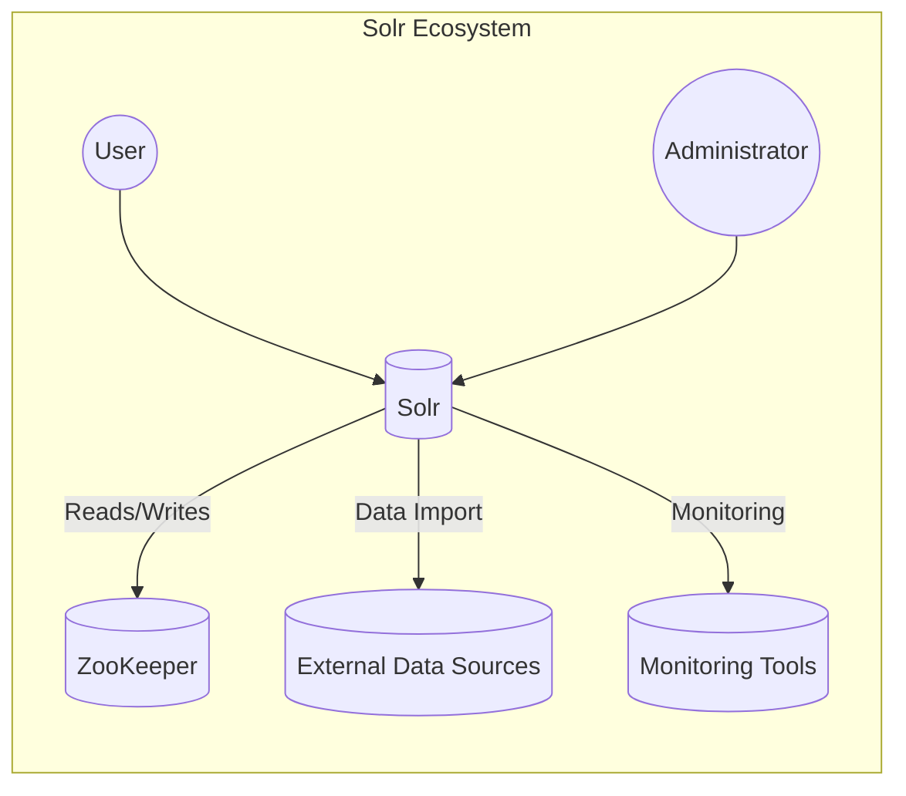
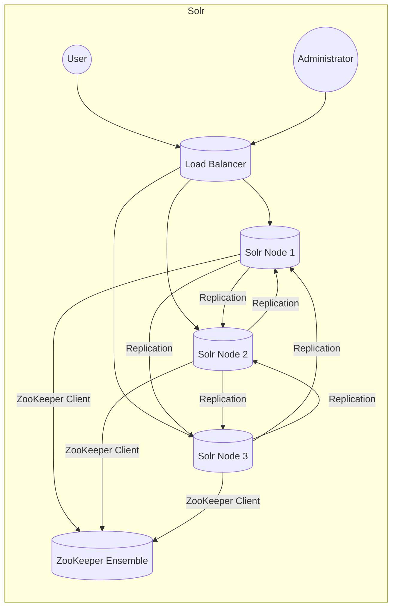
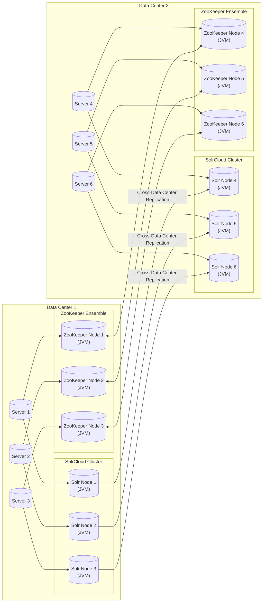
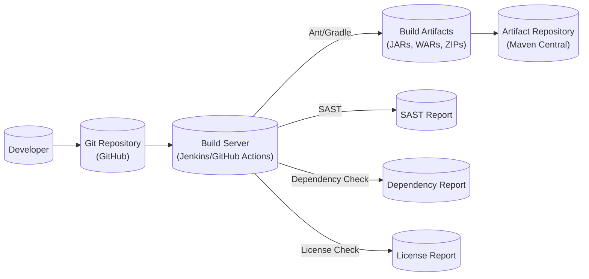

# BUSINESS POSTURE

Apache Solr is a mature, widely-used, open-source enterprise search platform.  It's a critical component for many organizations that rely on fast and reliable search capabilities.  The business priorities and goals that Solr addresses are:

*   Providing fast and scalable search capabilities over large datasets.
*   Enabling rich search experiences with features like faceting, highlighting, and geospatial search.
*   Supporting high availability and fault tolerance to ensure continuous operation.
*   Offering flexibility and extensibility to adapt to various use cases and data structures.
*   Maintaining a strong open-source community for ongoing development and support.

The most important business risks that need to be addressed are:

*   Data breaches: Unauthorized access to sensitive data indexed by Solr.
*   Denial of service: Attacks that make Solr unavailable to legitimate users.
*   Data corruption: Loss or modification of indexed data due to malicious activity or system failures.
*   Performance degradation: Slow search response times that impact user experience.
*   Configuration errors: Misconfigurations that expose vulnerabilities or lead to data leaks.
*   Supply chain attacks: Vulnerabilities introduced through third-party dependencies or build processes.

# SECURITY POSTURE

Existing security controls (based on the GitHub repository and general knowledge of Solr):

*   security control: Authentication: Solr supports various authentication mechanisms, including Basic Authentication, Kerberos, and JWT. Implemented in Solr's security framework and configurable via `security.json`.
*   security control: Authorization: Solr provides role-based access control (RBAC) to restrict access to collections, APIs, and features. Implemented in Solr's security framework and configurable via `security.json`.
*   security control: SSL/TLS: Solr can be configured to use SSL/TLS for secure communication between clients and servers, and between nodes in a SolrCloud cluster. Configurable via Solr's configuration files.
*   security control: Audit logging: Solr can log security-relevant events, such as authentication failures and authorization decisions. Configurable via Solr's logging framework.
*   security control: Rule-based authorization plugin. Allows fine-grained authorization rules.
*   security control: PKI authentication plugin. Allows authentication using x509 certificates.

Accepted risks:

*   accepted risk: Solr, by default, does not enforce strict security settings.  Administrators must explicitly configure authentication, authorization, and other security features.
*   accepted risk: Some older versions of Solr may have known vulnerabilities.  Regular updates and patching are essential.
*   accepted risk: Complex configurations can lead to misconfigurations and security gaps. Careful review and testing are required.

Recommended security controls (high priority):

*   Implement regular security audits and penetration testing.
*   Enable and monitor audit logging for all security-relevant events.
*   Enforce strong password policies and multi-factor authentication where possible.
*   Regularly review and update Solr's configuration to address potential misconfigurations.
*   Implement network segmentation to isolate Solr from other systems.
*   Use a dedicated, hardened operating system for Solr servers.

Security Requirements:

*   Authentication:
    *   All users and clients must be authenticated before accessing Solr.
    *   Support for multiple authentication mechanisms (e.g., Basic Auth, Kerberos, JWT).
    *   Integration with existing identity providers (e.g., LDAP, Active Directory).
    *   Strong password policies and enforcement.
*   Authorization:
    *   Role-based access control (RBAC) to restrict access to collections, APIs, and features.
    *   Fine-grained access control at the document and field level (if required by the application).
    *   Ability to define custom authorization rules.
*   Input Validation:
    *   Validate all user-supplied input to prevent injection attacks (e.g., Solr query injection).
    *   Sanitize data before indexing to prevent cross-site scripting (XSS) vulnerabilities in search results.
    *   Limit the size and complexity of queries to prevent denial-of-service attacks.
*   Cryptography:
    *   Use SSL/TLS for all communication between clients and servers, and between nodes in a SolrCloud cluster.
    *   Encrypt sensitive data at rest (if required by the application).
    *   Use strong cryptographic algorithms and key management practices.

# DESIGN

## C4 CONTEXT

Element Descriptions:

*   Element:
    *   Name: User
    *   Type: Person
    *   Description: A person interacting with Solr to perform searches.
    *   Responsibilities: Sends search queries, views search results.
    *   Security controls: Authentication, Authorization.

*   Element:
    *   Name: Solr
    *   Type: Software System
    *   Description: The Apache Solr search platform.
    *   Responsibilities: Indexes data, processes search queries, returns search results.
    *   Security controls: Authentication, Authorization, SSL/TLS, Audit Logging, Input Validation.

*   Element:
    *   Name: ZooKeeper
    *   Type: Software System
    *   Description: Apache ZooKeeper, a distributed coordination service.
    *   Responsibilities: Manages SolrCloud cluster state, configuration, and leader election.
    *   Security controls: Authentication, Authorization, SSL/TLS (if configured).

*   Element:
    *   Name: External Data Sources
    *   Type: Software System
    *   Description: Various sources from which Solr imports data.
    *   Responsibilities: Provides data to be indexed by Solr.
    *   Security controls: Varies depending on the data source.

*   Element:
    *   Name: Monitoring Tools
    *   Type: Software System
    *   Description: Tools used to monitor Solr's performance and health.
    *   Responsibilities: Collects metrics, generates alerts.
    *   Security controls: Authentication, Authorization (if configured).

*   Element:
    *   Name: Administrator
    *   Type: Person
    *   Description: A person who manages and configures Solr.
    *   Responsibilities: Configures Solr, manages users and permissions, monitors performance.
    *   Security controls: Authentication, Authorization.

## C4 CONTAINER

Element Descriptions:

*   Element:
    *   Name: Load Balancer
    *   Type: Software System
    *   Description: Distributes client requests across multiple Solr nodes.
    *   Responsibilities: Distributes traffic, provides high availability.
    *   Security controls: SSL/TLS termination, DDoS protection (depending on implementation).

*   Element:
    *   Name: Solr Node 1, Solr Node 2, Solr Node 3
    *   Type: Container (e.g., JVM, Docker container)
    *   Description: An instance of the Solr application.
    *   Responsibilities: Indexes data, processes search queries, returns search results.
    *   Security controls: Authentication, Authorization, SSL/TLS, Audit Logging, Input Validation.

*   Element:
    *   Name: ZooKeeper Ensemble
    *   Type: Software System
    *   Description: A cluster of ZooKeeper servers.
    *   Responsibilities: Manages SolrCloud cluster state, configuration, and leader election.
    *   Security controls: Authentication, Authorization, SSL/TLS (if configured).

*   Element:
    *   Name: Administrator
    *   Type: Person
    *   Description: A person who manages and configures Solr.
    *   Responsibilities: Configures Solr, manages users and permissions, monitors performance.
    *   Security controls: Authentication, Authorization.

*   Element:
    *   Name: User
    *   Type: Person
    *   Description: A person interacting with Solr to perform searches.
    *   Responsibilities: Sends search queries, views search results.
    *   Security controls: Authentication, Authorization.

## DEPLOYMENT

Possible deployment solutions:

1.  Standalone Solr: Single Solr instance running on a single server.  Simplest deployment, but not highly available.
2.  SolrCloud: Distributed Solr deployment with multiple nodes and ZooKeeper for coordination.  Provides high availability and scalability.
3.  Master-Slave: Older Solr deployment model with a single master node and multiple slave nodes.  Being superseded by SolrCloud.

Chosen solution (SolrCloud):

Element Descriptions:

*   Element:
    *   Name: Server 1, Server 2, Server 3, Server 4, Server 5, Server 6
    *   Type: Physical or Virtual Machine
    *   Description: A server hosting Solr or ZooKeeper instances.
    *   Responsibilities: Provides compute resources.
    *   Security controls: Operating system hardening, firewall, intrusion detection/prevention system.

*   Element:
    *   Name: Solr Node 1-6
    *   Type: Container (JVM)
    *   Description: An instance of the Solr application running within a JVM.
    *   Responsibilities: Indexes data, processes search queries, returns search results.
    *   Security controls: Authentication, Authorization, SSL/TLS, Audit Logging, Input Validation (within the JVM).

*   Element:
    *   Name: ZooKeeper Node 1-6
    *   Type: Container (JVM)
    *   Description: An instance of the ZooKeeper server running within a JVM.
    *   Responsibilities: Manages SolrCloud cluster state, configuration, and leader election.
    *   Security controls: Authentication, Authorization, SSL/TLS (if configured within the JVM).

## BUILD

The Apache Solr build process is complex and involves multiple tools and stages. It uses Apache Ant and Gradle as primary build tools.

Security Controls in the Build Process:

*   Source Code Management (Git): All code changes are tracked in a Git repository (GitHub), providing version control and auditability.
*   Build Automation (Ant/Gradle): The build process is automated using Ant and Gradle, ensuring consistency and repeatability.
*   Dependency Management: Dependencies are managed through build tools, allowing for tracking and auditing of third-party libraries.
*   Static Application Security Testing (SAST): SAST tools are (or should be) integrated into the build process to identify potential security vulnerabilities in the Solr codebase.
*   Software Composition Analysis (SCA): SCA tools (like Dependency-Check) are used to identify known vulnerabilities in third-party dependencies.
*   License Compliance: The build process includes checks to ensure compliance with open-source licenses.
*   Artifact Repository: Build artifacts are published to a trusted artifact repository (Maven Central).
*   Code Signing: Release artifacts are (or should be) digitally signed to ensure their integrity and authenticity.

# RISK ASSESSMENT

*   Critical Business Processes:
    *   Search functionality: Providing users with the ability to search for information.
    *   Data indexing: Keeping the search index up-to-date with the latest data.
    *   System availability: Ensuring that Solr is available to users when they need it.

*   Data Protection:
    *   Indexed data: The sensitivity of the data indexed by Solr varies depending on the application. It can range from publicly available information to highly sensitive data. The sensitivity level dictates the required security controls.
    *   Configuration data: Solr's configuration files may contain sensitive information, such as passwords and API keys.
    *   Audit logs: Audit logs may contain sensitive information about user activity and system events.

# QUESTIONS & ASSUMPTIONS

*   Questions:
    *   What specific SAST and SCA tools are currently used in the Solr build process?
    *   What is the process for handling security vulnerabilities reported by external researchers or discovered internally?
    *   Are there any specific compliance requirements (e.g., PCI DSS, HIPAA) that apply to Solr deployments?
    *   What is the current patching and update strategy for Solr and its dependencies?
    *   What is the disaster recovery plan for Solr deployments?
    *   Is data at rest encryption used or required for any specific deployments?
    *   What are the specific monitoring tools and procedures used for Solr?

*   Assumptions:
    *   BUSINESS POSTURE: The organization deploying Solr prioritizes security and understands the risks associated with search platforms.
    *   SECURITY POSTURE: Basic security best practices are followed, such as regular patching and secure configuration.
    *   DESIGN: SolrCloud is the preferred deployment model for high availability and scalability. The build process is automated and includes security checks.
    *   The Solr community actively addresses security vulnerabilities.
    *   Administrators have sufficient expertise to configure and manage Solr securely.
    *   Network infrastructure provides basic security controls (firewalls, etc.).