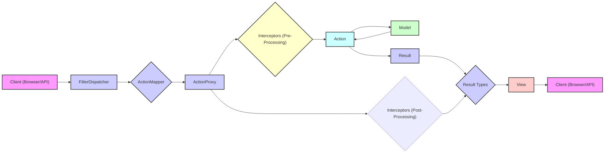

## Project Design Document: Apache Struts Framework (Improved)

**1. Introduction**

This document provides an enhanced and detailed architectural design overview of the Apache Struts framework, intended for use in subsequent threat modeling activities. Apache Struts is a widely adopted, open-source web application framework based on the Model-View-Controller (MVC) design pattern. It streamlines the development of robust and maintainable Java web applications by providing a structured approach to managing application logic, data, and presentation.

**2. Goals and Objectives**

The primary goals and objectives of the Apache Struts framework are:

*   To offer a mature and extensible framework for building enterprise-grade Java web applications.
*   To enforce a clear separation of concerns through the MVC pattern, enhancing code organization and maintainability.
*   To simplify the web application development lifecycle by providing reusable components and conventions.
*   To offer a comprehensive set of features for common web application tasks, including form handling, input validation, internationalization, and UI templating.
*   To foster an active open-source community and provide a well-documented and supported framework.

**3. Architectural Overview**

Apache Struts adheres to the Model-View-Controller (MVC) architectural pattern. The key components and their interactions within the framework are as follows:

*   **Client (Web Browser or API Consumer):** Initiates HTTP requests to the web application.
*   **FilterDispatcher (Front Controller - Struts 2 and later):** The primary entry point for all requests in modern Struts applications. It intercepts incoming requests and delegates processing. (Note: Older versions used `ActionServlet`).
*   **ActionMapper:** Responsible for determining which Action should handle a given request based on the request URL and configured mappings.
*   **ActionProxy:** Acts as an intermediary, managing the lifecycle of Action invocation, including the execution of interceptors.
*   **Interceptors:** Reusable components that implement cross-cutting concerns such as logging, input validation, security checks, workflow management, and type conversion. They are executed before and after the Action.
*   **Action:** A Plain Old Java Object (POJO) containing the core business logic to handle a specific request. It processes input, interacts with the Model, and determines the appropriate Result.
*   **Model:** Represents the data and business logic of the application. Struts does not dictate a specific Model implementation, allowing integration with various data access technologies.
*   **Result:** Defines the outcome of an Action's execution and specifies the next step in the request processing, typically rendering a View.
*   **Result Types:** Different strategies for rendering the response, such as forwarding to a JSP, performing an HTTP redirect, or rendering JSON or XML.
*   **View (JSP, FreeMarker, Velocity, etc.):** The presentation layer responsible for rendering the user interface and displaying data to the client.
*   **Configuration Files (struts.xml, struts.properties, etc.):** Define the application's flow, Action mappings, interceptor configurations, Result types, and other framework settings.

**4. Key Components and Subsystems**

*   **FilterDispatcher:**
    *   Serves as the front controller in Struts 2 and later versions.
    *   Intercepts all incoming HTTP requests to the application.
    *   Initializes the Struts framework and manages its lifecycle.
    *   Delegates request processing to the appropriate components.

*   **ActionMapper:**
    *   Responsible for mapping incoming HTTP requests to specific Action classes.
    *   Uses configuration information (typically defined in `struts.xml`) to determine the appropriate Action based on the request URL, namespace, and action name.
    *   Common implementations include the `DefaultActionMapper`.

*   **ActionProxy:**
    *   Acts as a proxy object for the actual Action instance.
    *   Manages the invocation of interceptors before and after the execution of the Action's business logic.
    *   Handles exception management during the Action invocation process.

*   **Interceptors:**
    *   Highly configurable and reusable components that intercept the execution of an Action.
    *   Provide a mechanism for implementing cross-cutting concerns in a modular and declarative way.
    *   Configured in interceptor stacks and executed in a defined order, allowing for chained processing.
    *   Examples of built-in interceptors include:
        *   `params`: Populates Action properties with request parameters.
        *   `validation`: Performs declarative input validation based on configuration.
        *   `workflow`: Manages the workflow of an Action, potentially redirecting based on validation errors.
        *   `i18n`: Provides support for internationalization and localization.
        *   `static-params`: Allows setting static parameters on the Action.
        *   Custom interceptors can be created to address specific application needs, such as security checks or logging.

*   **Action:**
    *   POJOs that encapsulate the specific business logic required to handle a particular request.
    *   Receive processed request data, interact with the application's Model layer, and determine the appropriate Result based on the outcome of the business logic.
    *   Typically implement the `com.opensymphony.xwork2.Action` interface or extend the `ActionSupport` class.

*   **Result:**
    *   Represents the outcome of an Action's execution and dictates the next step in the request processing.
    *   Determines how the response will be rendered and sent back to the client.
    *   Common Result types include:
        *   `dispatcher`: Forwards the request to another resource, such as a JSP page.
        *   `redirect`: Sends an HTTP redirect response to the client's browser.
        *   `redirectAction`: Redirects the request to another Struts Action.
        *   Template-based Results (e.g., `freemarker`, `velocity`): Render dynamic content using template engines.
        *   `json`, `stream`: Render responses in specific formats like JSON or as a data stream.

*   **Value Stack (OGNL):**
    *   A runtime data structure that holds the Action instance, the Model objects, and other relevant objects during request processing.
    *   Provides a unified context for accessing data within the application, particularly in the View layer.
    *   Utilizes the Object-Graph Navigation Language (OGNL) for accessing object properties, calling methods, and performing type conversion. **OGNL is a powerful but potentially risky component if not handled carefully, as vulnerabilities related to OGNL expression injection have been a source of security issues in Struts.**

*   **Configuration Files:**
    *   `struts.xml`: The primary configuration file that defines Action mappings, interceptor stacks, Result types, global results, and other framework settings.
    *   `struts.properties`: Contains framework-level properties that control the behavior of Struts.
    *   `validation.xml`: Defines validation rules for Action properties, enabling declarative input validation.
    *   Resource bundles (`.properties` files): Used for internationalization (i18n) to provide localized messages and text.

*   **Tag Libraries:**
    *   Provide a set of reusable UI components (custom tags) for use within JSP pages or other View technologies.
    *   Simplify the process of displaying data from the Value Stack, creating forms, handling errors, and interacting with the Struts framework.
    *   Examples of common tags include:
        *   `s:property`: Displays a property from the Value Stack.
        *   `s:form`: Creates an HTML form that integrates with Struts form handling.
        *   `s:textfield`, `s:password`, etc.: Create input fields bound to Action properties.
        *   `s:iterator`: Iterates over collections to display lists of data.
        *   `s:actionerror`, `s:fielderror`: Display validation errors.

**5. Data Flow (Detailed)**

The typical data flow for a request in a Struts 2 (and later) application is as follows:

1. A client (web browser or API consumer) sends an HTTP request to the web application.
2. The `FilterDispatcher` servlet filter intercepts the incoming request.
3. The `FilterDispatcher` consults the `ActionMapper` to determine the appropriate Action to handle the request based on the URL.
4. The `ActionMapper` returns information about the Action and its configuration.
5. The `FilterDispatcher` instantiates the `ActionProxy`.
6. The `ActionProxy` retrieves the configured interceptor stack for the Action.
7. Pre-processing interceptors in the stack are executed sequentially. These interceptors can perform tasks like logging, security checks, or parameter population.
8. The `ActionProxy` invokes the `execute()` method (or a specifically mapped method) of the Action.
9. The Action performs its business logic, often interacting with the Model layer to retrieve or manipulate data.
10. The Action returns a logical `Result` string (e.g., "success", "error", "input").
11. Post-processing interceptors in the stack are executed in reverse order. These interceptors can perform tasks like transaction management or cleanup.
12. The `ActionProxy` consults the configuration to determine the actual `Result` object based on the logical `Result` returned by the Action.
13. The appropriate `Result Type` is executed. This might involve forwarding to a JSP, performing a redirect, or rendering a template.
14. The View is rendered, often using data from the Value Stack accessed via OGNL expressions within JSP tags or template directives.
15. The `FilterDispatcher` sends the HTTP response back to the client.

```mermaid
graph LR
    A["Client Request"] --> B["FilterDispatcher"];
    B --> C["ActionMapper"];
    C --> D["ActionProxy Instantiation"];
    D --> E["Retrieve Interceptor Stack"];
    E --> F["Pre-Processing Interceptors"];
    F --> G["Action Execution"];
    G --> H["Return Logical Result"];
    H --> I["Post-Processing Interceptors"];
    I --> J["Determine Actual Result"];
    J --> K["Execute Result Type"];
    K --> L["View Rendering"];
    L --> M["HTTP Response"];
    M --> N["Client"];
    style A fill:#f9f,stroke:#333,stroke-width:2px
    style B fill:#ccf,stroke:#333,stroke-width:2px
    style C fill:#ccf,stroke:#333,stroke-width:2px
    style D fill:#ccf,stroke:#333,stroke-width:2px
    style E fill:#ccf,stroke:#333,stroke-width:2px
    style F fill:#ffc,stroke:#333,stroke-width:2px
    style G fill:#cff,stroke:#333,stroke-width:2px
    style H fill:#ccf,stroke:#333,stroke-width:2px
    style I fill:#ffc,stroke:#333,stroke-width:2px
    style J fill:#ccf,stroke:#333,stroke-width:2px
    style K fill:#ccf,stroke:#333,stroke-width:2px
    style L fill:#fcc,stroke:#333,stroke-width:2px
    style M fill:#ccf,stroke:#333,stroke-width:2px
    style N fill:#f9f,stroke:#333,stroke-width:2px
```

**6. Security Considerations (Detailed)**

*   **Input Validation:** Struts provides robust validation mechanisms, including XML-based validation and programmatic validation. Properly configuring and utilizing these mechanisms is crucial to prevent vulnerabilities like Cross-Site Scripting (XSS), SQL Injection, and other injection attacks. Ensure all user inputs are validated against expected formats and constraints.
*   **Output Encoding:**  Always encode data displayed in the View layer to prevent XSS attacks. Struts tag libraries often provide automatic encoding, but developers must be aware of the context and ensure appropriate encoding is applied.
*   **Authentication and Authorization:** While Struts doesn't provide built-in authentication and authorization, it integrates well with security frameworks like Spring Security or Apache Shiro. Implementing robust authentication to verify user identity and authorization to control access to resources is essential. Custom interceptors can also be used for basic security checks.
*   **Session Management:** Securely manage user sessions to prevent session hijacking and fixation attacks. This includes using secure session IDs, setting appropriate session timeouts, and protecting against cross-site scripting attacks that could steal session cookies.
*   **Error Handling:** Implement proper error handling to prevent sensitive information from being leaked in error messages. Avoid displaying stack traces or internal system details to end-users.
*   **Dependency Management:**  Keep the Struts framework and all its dependencies up-to-date to patch known security vulnerabilities. Regularly review and update dependencies to mitigate risks associated with outdated libraries. **The history of Struts includes significant vulnerabilities arising from outdated or vulnerable dependencies.**
*   **Cross-Site Request Forgery (CSRF) Protection:** Implement CSRF protection mechanisms, such as using synchronizer tokens. Struts provides a built-in `token` interceptor to help prevent CSRF attacks. Ensure this interceptor is properly configured for sensitive actions.
*   **File Upload Security:**  Carefully handle file uploads to prevent malicious file uploads. Implement restrictions on file types and sizes, sanitize filenames, and store uploaded files in secure locations outside the webroot. Be wary of path traversal vulnerabilities during file upload and processing.
*   **Remote Code Execution (RCE) via OGNL Injection:**  **Historically, Apache Struts has been significantly impacted by vulnerabilities related to OGNL expression injection, leading to Remote Code Execution (RCE). It is absolutely critical to stay updated with security patches and follow best practices to prevent OGNL injection.** Avoid directly evaluating user-supplied input as OGNL expressions. Use parameterized actions and secure coding practices.
*   **Secure Configuration:**  Ensure that Struts configuration files (`struts.xml`, etc.) are properly secured and not accessible to unauthorized users. Avoid exposing sensitive configuration details.

**7. Deployment Model**

Apache Struts applications are typically deployed as web archive (WAR) files onto Java application servers or servlet containers. Common deployment environments include:

*   **Standalone Servlet Containers:** Apache Tomcat, Jetty. These are lightweight containers suitable for deploying web applications.
*   **Full Java EE Application Servers:** WildFly, GlassFish, IBM WebSphere, Oracle WebLogic. These provide a more comprehensive environment with support for various Java EE specifications.
*   **Cloud Platforms:** Deployment to cloud platforms like AWS, Azure, or Google Cloud often involves containerization (e.g., Docker) and orchestration (e.g., Kubernetes). The WAR file is packaged into a container image and deployed to the cloud environment.
*   **Embedded Servlet Containers:**  For development or lightweight deployments, servlet containers can be embedded within the application itself (e.g., using Spring Boot's embedded Tomcat or Jetty).

The deployment process typically involves packaging the application as a WAR file and deploying it through the application server's administration console or command-line tools. Configuration of the application server and the Struts application within the server is crucial for proper operation and security.

**8. Assumptions and Constraints**

*   It is assumed that the underlying operating system, Java Virtual Machine (JVM), and application server are properly secured and configured according to security best practices.
*   This document focuses on the architectural design of the Apache Struts framework itself and not on the specific implementation details of individual applications built using Struts.
*   Developers building applications with Struts are expected to adhere to secure coding practices and leverage the framework's security features appropriately.
*   The security posture of a Struts application heavily relies on the correct configuration of the framework and its components.

This improved design document provides a more in-depth understanding of the Apache Struts framework's architecture, components, and security considerations. This detailed information is crucial for conducting a comprehensive threat model to identify potential vulnerabilities and implement effective mitigation strategies.
