## Project Design Document: Apache Struts Framework (Improved)

**1. Project Overview**

This document provides an enhanced design overview of the Apache Struts framework, an open-source, extensible framework for creating enterprise-ready Java web applications. Struts implements the Model-View-Controller (MVC) design pattern, promoting separation of concerns and facilitating the development of maintainable, testable, and scalable web applications. This detailed design document serves as a critical input for subsequent threat modeling activities, providing a comprehensive understanding of the framework's architecture and potential attack surfaces.

**2. Goals and Objectives**

*   Deliver a more detailed and comprehensive architectural overview of the Apache Struts framework.
*   Provide in-depth descriptions of key components, emphasizing their roles and potential security implications.
*   Illustrate the data flow within a Struts application with greater granularity, highlighting data transformation points.
*   Elaborate on potential security considerations, providing specific examples of vulnerabilities.
*   Serve as a robust and informative reference for security architects, developers, and anyone involved in the security assessment of Struts-based applications.

**3. Target Audience**

*   Security Architects and Engineers responsible for threat modeling and security assessments.
*   Software Developers building, maintaining, or integrating with Struts applications.
*   Cloud Architects designing deployment environments for Struts applications.
*   DevOps Engineers involved in the deployment and operation of Struts applications.
*   Security Auditors evaluating the security posture of systems utilizing the Struts framework.

**4. Architectural Overview**

The Apache Struts framework orchestrates the handling of web requests through a well-defined MVC pipeline. The following diagram illustrates the key components and their interactions:

```mermaid
graph LR
    subgraph "Client"
        A["User Browser"]
    end
    B["Web Server (e.g., Tomcat, Jetty)"]
    C["Filter Dispatcher ('StrutsPrepareAndExecuteFilter')"]
    D["ActionMapper"]
    E["ActionProxy"]
    F["Configuration Manager ('struts.xml', Annotations)"]
    G["Interceptor Stack"]
    H["Action"]
    I["Result"]
    J["Value Stack / OGNL Context"]
    K["View ('JSP', 'FreeMarker', 'Velocity')"]
    L["Model (Business Logic, Data Access Objects)"]

    A --> B
    B --> C
    C --> D
    D --> E
    E --> F
    E --> G
    G --> H
    H --> L
    H --> I
    I --> J
    J --> K
    K --> B
    B --> A

    style A fill:#f9f,stroke:#333,stroke-width:2px
    style B fill:#ccf,stroke:#333,stroke-width:2px
    style C fill:#ddf,stroke:#333,stroke-width:2px
    style D fill:#ddf,stroke:#333,stroke-width:2px
    style E fill:#ddf,stroke:#333,stroke-width:2px
    style F fill:#ddf,stroke:#333,stroke-width:2px
    style G fill:#aaf,stroke:#333,stroke-width:2px
    style H fill:#aaf,stroke:#333,stroke-width:2px
    style I fill:#aaf,stroke:#333,stroke-width:2px
    style J fill:#eea,stroke:#333,stroke-width:2px
    style K fill:#eea,stroke:#333,stroke-width:2px
    style L fill:#bbe,stroke:#333,stroke-width:2px
```

**5. Key Components (Detailed)**

*   **User Browser:** The client application, typically a web browser, initiating HTTP requests. Potential attack vectors include malicious scripts embedded in user-generated content or browser vulnerabilities.
*   **Web Server (e.g., Tomcat, Jetty):**  The application server hosting the Struts application. Security considerations include server misconfiguration, vulnerabilities in the server software itself, and exposure of management interfaces.
*   **Filter Dispatcher ('StrutsPrepareAndExecuteFilter'):** The servlet filter acting as the entry point for all requests. It initializes the Struts framework and delegates request processing. Vulnerabilities here could bypass framework security measures.
*   **ActionMapper:** Determines the appropriate Action to handle a request based on the URL. Misconfigurations or predictable mapping patterns could be exploited.
*   **ActionProxy:**  Manages the execution of an Action, consulting the Configuration Manager and invoking the Interceptor Stack. It's a central point for control flow and potential manipulation.
*   **Configuration Manager ('struts.xml', Annotations):** Loads and manages the framework's configuration. Insecure configurations (e.g., allowing dynamic method invocation) can introduce significant vulnerabilities.
*   **Interceptor Stack:** A chain of interceptors performing pre-processing and post-processing. Vulnerabilities in interceptors (including custom ones) or improper ordering can lead to security bypasses. Examples include:
    *   **ValidationInterceptor:**  If not configured correctly, it might not prevent invalid input.
    *   **FileUploadInterceptor:**  Vulnerable to denial-of-service attacks through excessive file uploads or path traversal issues.
    *   **ExceptionMappingInterceptor:**  May inadvertently expose sensitive information in error messages.
*   **Action:**  Java classes containing the application's business logic. Vulnerabilities here include insecure coding practices, SQL injection if interacting with databases, and command injection if executing external commands.
*   **Result:** Determines the next step after Action execution, often specifying the View to render. Improperly configured Results could lead to unauthorized resource access.
*   **Value Stack / OGNL Context:**  A runtime data structure used by Struts and OGNL to access and manipulate object properties. Vulnerabilities in OGNL have historically allowed remote code execution.
*   **View ('JSP', 'FreeMarker', 'Velocity'):** The presentation layer responsible for rendering the user interface. Susceptible to Cross-Site Scripting (XSS) vulnerabilities if output encoding is not handled correctly.
*   **Model (Business Logic, Data Access Objects):** Represents the application's data and business logic. Security depends on secure coding practices within these components, including protection against SQL injection and other data manipulation attacks.

**6. Data Flow (Detailed)**

The following diagram illustrates the detailed flow of a request, highlighting key data transformation and processing points:

```mermaid
graph LR
    A["User sends HTTP Request (Raw Data, Headers, Cookies)"] --> B("Web Server receives request");
    B --> C("Filter Dispatcher ('StrutsPrepareAndExecuteFilter') - Initializes RequestContext");
    C --> D("ActionMapper - Maps URL to Action Configuration");
    D --> E("ActionProxy - Creates Action Instance");
    E --> F("Interceptor Stack - Executes Pre-processing Interceptors (e.g., Parameter Interceptor, File Upload Interceptor)");
    F --> G["Action - Executes Business Logic, Interacts with Model (Data Transformation, Validation)"];
    G --> H["Action returns a Result (Logical Name, Data for View)"];
    H --> I["Result - Determines View (Based on Configuration)"];
    I --> J["Value Stack / OGNL Context - Prepares Data for View"];
    J --> K["View ('JSP', 'FreeMarker', 'Velocity') - Renders Response (Output Encoding)"];
    K --> L("Interceptor Stack - Executes Post-processing Interceptors");
    L --> M("Web Server sends HTTP Response (HTML, JSON, etc., Headers, Cookies)");
    M --> N("User Browser receives response");

    style A fill:#f9f,stroke:#333,stroke-width:2px
    style B fill:#ccf,stroke:#333,stroke-width:2px
    style C fill:#ddf,stroke:#333,stroke-width:2px
    style D fill:#ddf,stroke:#333,stroke-width:2px
    style E fill:#ddf,stroke:#333,stroke-width:2px
    style F fill:#aaf,stroke:#333,stroke-width:2px
    style G fill:#aaf,stroke:#333,stroke-width:2px
    style H fill:#aaf,stroke:#333,stroke-width:2px
    style I fill:#aaf,stroke:#333,stroke-width:2px
    style J fill:#eea,stroke:#333,stroke-width:2px
    style K fill:#eea,stroke:#333,stroke-width:2px
    style L fill:#aaf,stroke:#333,stroke-width:2px
    style M fill:#ccf,stroke:#333,stroke-width:2px
    style N fill:#f9f,stroke:#333,stroke-width:2px
```

**7. Security Considerations (Elaborated)**

*   **Input Validation:**  Crucial for preventing injection attacks.
    *   **Vulnerability:** Failure to validate user input can lead to SQL injection, command injection, LDAP injection, and cross-site scripting (XSS).
    *   **Mitigation:** Implement robust server-side validation using Struts' built-in validation framework or custom interceptors. Sanitize input before using it in database queries or rendering it in the view.
*   **Authentication and Authorization:** Securing access to resources.
    *   **Vulnerability:** Weak or missing authentication allows unauthorized access. Insufficient authorization can lead to privilege escalation.
    *   **Mitigation:** Implement strong authentication mechanisms (e.g., multi-factor authentication). Use interceptors to enforce authorization rules based on user roles and permissions.
*   **Session Management:** Secure handling of user sessions.
    *   **Vulnerability:** Session fixation, session hijacking, and insecure storage of session identifiers.
    *   **Mitigation:** Use secure session cookies (HttpOnly, Secure flags). Implement session timeout mechanisms. Regenerate session IDs after successful login.
*   **Cross-Site Scripting (XSS):** Preventing injection of malicious scripts into web pages.
    *   **Vulnerability:**  Failure to properly encode output rendered in the View can allow attackers to inject malicious scripts that execute in the user's browser.
    *   **Mitigation:**  Utilize proper output encoding techniques (e.g., HTML escaping) in JSPs and other view technologies. Consider using Content Security Policy (CSP).
*   **Cross-Site Request Forgery (CSRF):** Protecting against unauthorized actions performed on behalf of an authenticated user.
    *   **Vulnerability:**  Attackers can trick authenticated users into submitting unintended requests.
    *   **Mitigation:** Implement CSRF tokens (synchronizer tokens) for state-changing requests.
*   **Dependency Management:** Keeping dependencies up-to-date.
    *   **Vulnerability:** Using outdated versions of Struts or its dependencies can expose applications to known vulnerabilities.
    *   **Mitigation:** Regularly update Struts and its dependencies to the latest stable versions. Use dependency management tools to track and manage dependencies.
*   **Configuration Security:** Secure configuration of Struts components.
    *   **Vulnerability:** Misconfigurations, such as enabling dynamic method invocation or insecure default settings, can create security loopholes.
    *   **Mitigation:** Follow security best practices for configuring `struts.xml` and other configuration files. Disable unnecessary features.
*   **Error Handling:** Preventing information leakage through error messages.
    *   **Vulnerability:**  Verbose error messages can reveal sensitive information about the application's internal workings.
    *   **Mitigation:** Implement generic error pages for production environments. Log detailed error information securely.
*   **OGNL Injection:**  A historical vulnerability related to the Object-Graph Navigation Language.
    *   **Vulnerability:**  Improper handling of user-provided input in OGNL expressions can lead to remote code execution.
    *   **Mitigation:**  Avoid using user input directly in OGNL expressions. Keep Struts updated to versions that address known OGNL vulnerabilities.

**8. Technologies Used (Specifics)**

*   **Java (Version Specific):**  The underlying programming language. Security considerations depend on the Java version used (e.g., older versions may have known vulnerabilities).
*   **Java Servlets API (Version Specific):** Struts is built upon this API. Ensure the application server and servlet API version are up-to-date.
*   **JavaServer Pages (JSP) / FreeMarker / Velocity (Version Specific):** Templating engines. Security vulnerabilities can exist in these engines.
*   **XML (struts.xml):** Used for configuration. Proper parsing and validation are important to prevent XML External Entity (XXE) attacks.
*   **OGNL (Version Specific):**  Used for data access. Keep the OGNL library updated to mitigate known injection vulnerabilities.
*   **Logging Frameworks (e.g., Log4j, SLF4j):**  Used for logging. Ensure proper configuration to prevent information leakage.
*   **Other Dependencies:**  Struts relies on various third-party libraries. Regularly audit and update these dependencies.

**9. Deployment Model (Detailed)**

Struts applications are typically packaged as Web Application Archive (WAR) files and deployed to Java EE compliant application servers. Deployment considerations include:

*   **Application Server Security:** The security of the application server itself is paramount. This includes proper configuration, security patching, and access controls.
*   **Deployment Environment:**  The environment where the application server runs (e.g., cloud, on-premises). Security measures should be in place to protect the infrastructure.
*   **Network Security:** Network configurations (firewalls, load balancers) play a crucial role in protecting the application.
*   **Secure Deployment Practices:**  Use secure protocols (HTTPS). Ensure proper file permissions on the deployed WAR file. Avoid deploying with default credentials.
*   **Containerization (e.g., Docker):** If using containers, ensure the container images are secure and regularly updated. Follow container security best practices.

**10. Assumptions and Constraints**

*   This document describes the general architecture of the Apache Struts framework. Specific application implementations may introduce additional components and complexities.
*   The focus is on the core framework. Struts plugins and custom extensions are not covered in detail but should be considered during application-specific threat modeling.
*   It is assumed that developers are following secure coding practices and are aware of common web application vulnerabilities.
*   The security considerations outlined are not exhaustive and should be supplemented with further analysis and testing.

This improved design document provides a more detailed and security-focused understanding of the Apache Struts framework, serving as a valuable resource for comprehensive threat modeling and security assessments. The enhanced descriptions of components, data flow, and security considerations aim to facilitate the identification of potential vulnerabilities and the development of effective mitigation strategies.