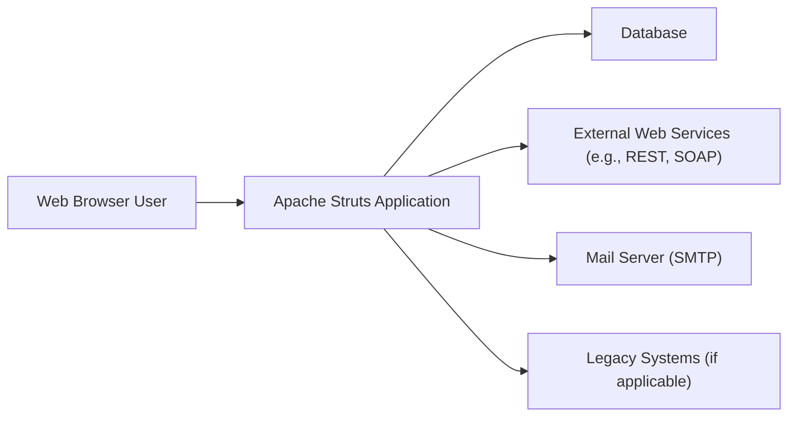
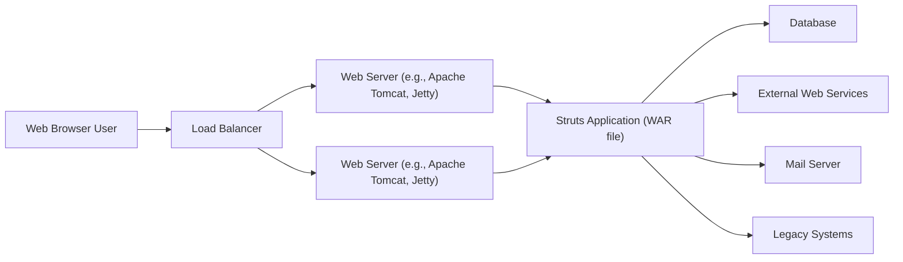
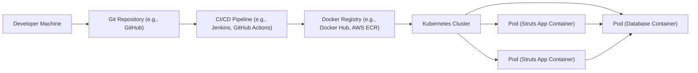

# BUSINESS POSTURE

The Apache Struts project is a mature, open-source framework for building enterprise-grade Java web applications. It's been around for a long time and has a large, established user base. Given its maturity and widespread use, the business posture emphasizes stability, maintainability, and backward compatibility, while also needing to address evolving security threats.

Business Priorities and Goals:

*   Maintainability: Ensure the framework is easy to maintain and update, given its long lifespan and the volunteer nature of many contributors.
*   Stability: Provide a stable and reliable platform for existing applications. Many organizations rely on Struts, and breaking changes can have significant consequences.
*   Security: Address security vulnerabilities promptly and effectively. Struts has been the target of high-profile security exploits in the past, making security a top priority.
*   Community Support: Foster a vibrant and active community to support users and contributors.
*   Backward Compatibility (where possible): Minimize breaking changes to avoid disrupting existing applications.
*   Modernization: Incrementally modernize the framework to support newer Java features and web development practices, without sacrificing stability.

Most Important Business Risks:

*   Reputational Damage: Another major security breach could severely damage the reputation of the Apache Struts project and the Apache Software Foundation.
*   Loss of User Base: If the framework becomes too difficult to maintain or use, or if security concerns are not addressed, users may migrate to other frameworks.
*   Contributor Burnout: Reliance on volunteer contributors can lead to burnout and slow down development and maintenance.
*   Legacy Codebase: Maintaining a large, mature codebase can be challenging and may hinder the adoption of new technologies and practices.

# SECURITY POSTURE

Existing Security Controls:

*   security control: Secure Software Development Lifecycle (SSDLC): The Apache Software Foundation has general security guidelines, and the Struts project likely follows some form of SSDLC, though specifics may vary. This includes vulnerability reporting processes and security advisories. (Described in Apache Security guidelines and Struts security documentation).
*   security control: Input Validation: Struts provides mechanisms for validating user input, such as the Validation Framework and declarative validation using XML or annotations. (Described in Struts documentation).
*   security control: Output Encoding: Struts encourages proper output encoding to prevent Cross-Site Scripting (XSS) vulnerabilities. (Described in Struts documentation).
*   security control: Regular Security Updates: The Struts team releases security updates to address vulnerabilities as they are discovered. (Described in Struts security advisories).
*   security control: Community Security Reporting: A process for reporting security vulnerabilities to the Struts security team. (Described in Struts security documentation).

Accepted Risks:

*   accepted risk: Complexity: The framework's complexity can make it challenging to fully understand and secure all possible attack vectors.
*   accepted risk: Third-Party Dependencies: Struts relies on third-party libraries, which may introduce their own security vulnerabilities.
*   accepted risk: User Misconfiguration: Struts can be misconfigured by users, leading to security vulnerabilities. This is a common issue with frameworks.
*   accepted risk: Legacy Features: Some older features of Struts may be less secure than newer alternatives, but are maintained for backward compatibility.

Recommended Security Controls:

*   security control: Static Application Security Testing (SAST): Integrate SAST tools into the build process to automatically identify potential vulnerabilities in the codebase.
*   security control: Software Composition Analysis (SCA): Use SCA tools to track and manage third-party dependencies and identify known vulnerabilities in those libraries.
*   security control: Dynamic Application Security Testing (DAST): Regularly perform DAST scans on running instances of Struts applications to identify vulnerabilities.
*   security control: Security Training for Contributors: Provide regular security training to contributors to improve security awareness and coding practices.

Security Requirements:

*   Authentication:
    *   Struts itself does not provide a built-in authentication mechanism. It relies on the underlying application server or a separate security framework (like Spring Security or Apache Shiro) for authentication.
    *   Requirement: Integrate with a robust authentication system that supports industry-standard protocols and best practices.
*   Authorization:
    *   Struts provides basic interceptor-based authorization capabilities.
    *   Requirement: Implement fine-grained authorization controls to restrict access to resources based on user roles and permissions. Consider using a dedicated authorization framework for more complex scenarios.
*   Input Validation:
    *   Struts provides built-in validation mechanisms.
    *   Requirement: Thoroughly validate all user input on both the client-side (for usability) and server-side (for security) to prevent injection attacks and other vulnerabilities. Use a whitelist approach whenever possible.
*   Cryptography:
    *   Struts does not handle cryptography directly but relies on Java's built-in cryptographic libraries or external libraries.
    *   Requirement: Use strong, industry-standard cryptographic algorithms and libraries for all sensitive data, including passwords, session tokens, and any data transmitted over the network. Follow best practices for key management.

# DESIGN

## C4 CONTEXT

Element Descriptions:

*   Element:
    *   Name: Web Browser User
    *   Type: Person
    *   Description: A user interacting with the Apache Struts application through a web browser.
    *   Responsibilities: Initiates requests, views responses, provides input.
    *   Security controls: Browser-based security controls (e.g., same-origin policy, cookie security).

*   Element:
    *   Name: Apache Struts Application
    *   Type: Software System
    *   Description: The web application built using the Apache Struts framework.
    *   Responsibilities: Handles user requests, processes business logic, interacts with backend systems, renders responses.
    *   Security controls: Input validation, output encoding, authentication and authorization integration, session management.

*   Element:
    *   Name: Database
    *   Type: Software System
    *   Description: A database system used to store application data.
    *   Responsibilities: Stores and retrieves data, enforces data integrity.
    *   Security controls: Database access controls, encryption at rest and in transit, auditing.

*   Element:
    *   Name: External Web Services (e.g., REST, SOAP)
    *   Type: Software System
    *   Description: External web services that the Struts application interacts with.
    *   Responsibilities: Provides specific functionalities or data to the Struts application.
    *   Security controls: API authentication and authorization, secure communication protocols (HTTPS), input validation.

*   Element:
    *   Name: Mail Server (SMTP)
    *   Type: Software System
    *   Description: A mail server used to send emails (e.g., notifications, password resets).
    *   Responsibilities: Sends emails on behalf of the Struts application.
    *   Security controls: Secure SMTP configuration, authentication, encryption (TLS).

*   Element:
    *   Name: Legacy Systems (if applicable)
    *   Type: Software System
    *   Description: Existing legacy systems that the Struts application may need to integrate with.
    *   Responsibilities: Varies depending on the specific legacy system.
    *   Security controls: Secure communication protocols, data validation, potentially a security gateway or adapter.

## C4 CONTAINER

Element Descriptions:

*   Element:
    *   Name: Web Browser User
    *   Type: Person
    *   Description: A user interacting with the Apache Struts application.
    *   Responsibilities: Initiates requests, views responses, provides input.
    *   Security controls: Browser-based security controls.

*   Element:
    *   Name: Load Balancer
    *   Type: System
    *   Description: Distributes incoming traffic across multiple web servers.
    *   Responsibilities: Improves availability and scalability.
    *   Security controls: SSL/TLS termination, DDoS protection.

*   Element:
    *   Name: Web Server (e.g., Apache Tomcat, Jetty)
    *   Type: Container
    *   Description: A Java web server that hosts the Struts application.
    *   Responsibilities: Executes the Struts application, handles HTTP requests and responses.
    *   Security controls: Web server security configuration, access controls, secure communication protocols.

*   Element:
    *   Name: Struts Application (WAR file)
    *   Type: Container
    *   Description: The packaged Struts application, typically deployed as a WAR (Web Application Archive) file.
    *   Responsibilities: Contains the application's code, configuration, and dependencies.
    *   Security controls: All application-level security controls (input validation, output encoding, etc.).

*   Element:
    *   Name: Database
    *   Type: Container
    *   Description: Database system.
    *   Responsibilities: Stores and retrieves data.
    *   Security controls: Database access controls, encryption.

*   Element:
    *   Name: External Web Services
    *   Type: Container
    *   Description: External services.
    *   Responsibilities: Provides specific functionalities.
    *   Security controls: API authentication and authorization.

*   Element:
    *   Name: Mail Server
    *   Type: Container
    *   Description: Mail server.
    *   Responsibilities: Sends emails.
    *   Security controls: Secure SMTP configuration.

*   Element:
    *   Name: Legacy Systems
    *   Type: Container
    *   Description: Legacy systems.
    *   Responsibilities: Varies.
    *   Security controls: Secure communication, data validation.

## DEPLOYMENT

Possible Deployment Solutions:

1.  Traditional WAR deployment to a Java application server (Tomcat, Jetty, WildFly, etc.).
2.  Cloud-based deployment using Platform as a Service (PaaS) offerings (AWS Elastic Beanstalk, Google App Engine, Azure App Service, etc.).
3.  Containerized deployment using Docker and Kubernetes.

Chosen Solution (for detailed description): Containerized deployment using Docker and Kubernetes.

Element Descriptions:

*   Element:
    *   Name: Developer Machine
    *   Type: Infrastructure Node
    *   Description: The developer's workstation where code is written and tested.
    *   Responsibilities: Code development, local testing.
    *   Security controls: Local security measures (firewall, antivirus).

*   Element:
    *   Name: Git Repository (e.g., GitHub)
    *   Type: Infrastructure Node
    *   Description: A version control system that stores the application's source code.
    *   Responsibilities: Code versioning, collaboration.
    *   Security controls: Access controls, branch protection rules.

*   Element:
    *   Name: CI/CD Pipeline (e.g., Jenkins, GitHub Actions)
    *   Type: Infrastructure Node
    *   Description: An automated pipeline that builds, tests, and deploys the application.
    *   Responsibilities: Automates the build, test, and deployment process.
    *   Security controls: Secure configuration, access controls, integration with security tools (SAST, SCA).

*   Element:
    *   Name: Docker Registry (e.g., Docker Hub, AWS ECR)
    *   Type: Infrastructure Node
    *   Description: A registry that stores Docker images.
    *   Responsibilities: Stores and manages Docker images.
    *   Security controls: Access controls, image scanning.

*   Element:
    *   Name: Kubernetes Cluster
    *   Type: Infrastructure Node
    *   Description: A container orchestration platform that manages the deployment and scaling of the application.
    *   Responsibilities: Manages containerized applications, provides scalability and resilience.
    *   Security controls: Kubernetes security context, network policies, role-based access control (RBAC).

*   Element:
    *   Name: Pod (Struts App Container)
    *   Type: Infrastructure Node
    *   Description: A Kubernetes Pod running the Struts application container.
    *   Responsibilities: Executes the Struts application.
    *   Security controls: Container security best practices, resource limits.

*   Element:
    *   Name: Pod (Database Container)
    *   Type: Infrastructure Node
    *   Description: A Kubernetes Pod running the database container (if the database is also containerized).
    *   Responsibilities: Provides database services.
    *   Security controls: Database security configuration, network policies.

## BUILD

```mermaid
graph LR
    Developer["Developer"] --> IDE["IDE (e.g., IntelliJ, Eclipse)"]
    IDE --> LocalBuild["Local Build (Maven/Gradle)"]
    LocalBuild --> GitCommit["Git Commit"]
    GitCommit --> GitPush["Git Push to Repository"]
    GitPush --> CI_Server["CI Server (e.g., Jenkins, GitHub Actions)"]
    CI_Server --> BuildStep["Build (Maven/Gradle)"]
    BuildStep --> SAST["SAST (e.g., FindBugs, SonarQube)"]
    SAST --> TestStep["Unit & Integration Tests"]
    TestStep --> SCA["SCA (e.g., OWASP Dependency-Check)"]
    SCA --> PackageStep["Package (WAR/JAR)"]
    PackageStep --> DockerBuild["Build Docker Image"]
    DockerBuild --> DockerPush["Push Image to Registry"]

```

Build Process Description:

1.  Developer writes code using an IDE (e.g., IntelliJ IDEA, Eclipse).
2.  Local Build: Developer performs a local build using Maven or Gradle to compile the code, run unit tests, and package the application.
3.  Git Commit: Developer commits the code changes to a local Git repository.
4.  Git Push: Developer pushes the changes to a remote Git repository (e.g., GitHub, GitLab).
5.  CI Server Trigger: The push to the remote repository triggers the CI/CD pipeline on a CI server (e.g., Jenkins, GitHub Actions).
6.  Build: The CI server checks out the code and executes the build process (using Maven or Gradle).
7.  SAST: Static Application Security Testing (SAST) tools (e.g., FindBugs, SonarQube) are run to analyze the code for potential vulnerabilities.
8.  Unit & Integration Tests: Unit and integration tests are executed to verify the functionality of the code.
9.  SCA: Software Composition Analysis (SCA) tools (e.g., OWASP Dependency-Check) are run to identify known vulnerabilities in third-party dependencies.
10. Package: The application is packaged into a WAR or JAR file.
11. Docker Build: A Docker image is built, containing the packaged application and its dependencies.
12. Docker Push: The Docker image is pushed to a Docker registry (e.g., Docker Hub, Amazon ECR).

Security Controls in Build Process:

*   SAST: Identifies potential vulnerabilities in the source code.
*   SCA: Identifies known vulnerabilities in third-party libraries.
*   Automated Testing: Ensures code quality and helps prevent regressions.
*   Secure CI/CD Configuration: Access controls and secure configuration of the CI/CD pipeline.
*   Image Scanning: Scanning Docker images for vulnerabilities before deployment.

# RISK ASSESSMENT

Critical Business Processes:

*   User Authentication and Authorization: Ensuring only authorized users can access sensitive data and functionality.
*   Data Management: Protecting the integrity and confidentiality of data stored in the database.
*   Web Application Functionality: Maintaining the availability and proper functioning of the web application.
*   External Service Integrations: Securely interacting with external web services and legacy systems.

Data Sensitivity:

*   User Data (PII): Personally Identifiable Information (PII) such as usernames, passwords, email addresses, and potentially other personal details, depending on the specific application. Sensitivity: High.
*   Application Data: Data specific to the application's functionality, which may include financial data, business data, or other sensitive information. Sensitivity: Varies depending on the application, potentially High.
*   Session Data: Data related to user sessions, including session tokens. Sensitivity: High.
*   Configuration Data: Configuration files and settings that may contain sensitive information such as database credentials or API keys. Sensitivity: High.

# QUESTIONS & ASSUMPTIONS

Questions:

*   What specific security standards or compliance requirements (e.g., PCI DSS, HIPAA) apply to applications built with Struts?
*   What is the current process for handling security vulnerabilities reported to the Struts project?
*   What are the specific third-party dependencies used by the Struts framework, and how are they managed?
*   Are there any specific legacy systems that Struts applications commonly integrate with, and what are the security considerations for those integrations?
*   What level of detail is required for the component-level C4 diagrams? (Component diagrams were omitted for brevity, but could be added if needed.)

Assumptions:

*   BUSINESS POSTURE: The Apache Struts project prioritizes stability, security, and maintainability.
*   SECURITY POSTURE: The project follows some form of SSDLC and has basic security controls in place.
*   DESIGN: Struts applications are typically deployed to Java application servers or containerized environments. The build process involves Maven or Gradle and may include CI/CD pipelines.