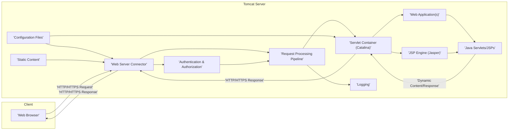
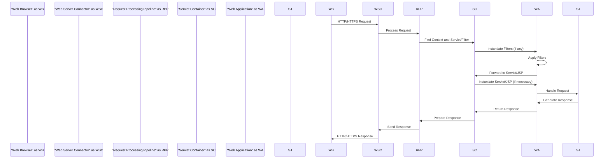

# Project Design Document: Apache Tomcat

**Version:** 1.1
**Date:** October 26, 2023
**Author:** AI Software Architect

## 1. Introduction

This document provides a detailed design overview of the Apache Tomcat project, intended for use in subsequent threat modeling activities. It outlines the core architectural components, data flows, and external dependencies critical for understanding potential security vulnerabilities. This document focuses on Tomcat's primary role as a web server and servlet container.

## 2. Project Overview

Apache Tomcat is an open-source implementation of several core Java Enterprise Edition specifications, including Java Servlet, JavaServer Pages (JSP), Java Unified Expression Language (EL), and WebSocket. It functions as a standalone Java HTTP web server environment, enabling the execution of Java code to serve dynamic web content. Tomcat is widely adopted for powering numerous mission-critical web applications across diverse industries.

**Key Responsibilities:**

*   Serving static web resources:
    *   HTML files
    *   CSS stylesheets
    *   JavaScript files
    *   Images
*   Executing Java Servlets and JSPs:
    *   Processing requests and generating dynamic content.
*   Managing the lifecycle of web applications:
    *   Deployment
    *   Undeployment
    *   Reloading
*   Providing a runtime environment for Java web applications:
    *   Managing resources and dependencies.
*   Handling HTTP and HTTPS requests and responses.
*   Supporting WebSocket communication for real-time bidirectional communication.
*   Implementing security features:
    *   Authentication
    *   Authorization
    *   Session management

## 3. Architectural Overview

Tomcat's architecture is modular, built around several interconnected components responsible for processing web requests.

**Component Descriptions:**

*   **Web Browser:** The client application (e.g., Chrome, Firefox, Safari) that initiates HTTP/HTTPS requests to access web resources.
*   **Web Server Connector:** Responsible for handling incoming network connections and processing requests. Examples include:
    *   **HTTP Connectors (e.g., Coyote HTTP/1.1, NIO, APR):**
        *   Responsibilities:
            *   Accepting incoming HTTP/HTTPS requests on configured ports (e.g., 8080, 8443).
            *   Parsing the HTTP request headers and body.
            *   Creating an internal request object representing the incoming request.
            *   Passing the request to the Request Processing Pipeline for further handling.
            *   Receiving the processed response from the pipeline.
            *   Constructing and sending the HTTP response back to the client.
            *   Managing connection lifecycle (keep-alive, closing).
    *   **AJP Connector (e.g., Coyote AJP):**
        *   Responsibilities:
            *   Accepting incoming AJP (Apache JServ Protocol) requests, typically from a front-end web server like Apache HTTP Server.
            *   Parsing the AJP request.
            *   Creating an internal request object.
            *   Passing the request to the Request Processing Pipeline.
            *   Receiving the response and sending it back to the front-end server using AJP.
            *   Managing connections with the front-end server.
*   **Request Processing Pipeline:** A series of components (Valves) that process each request.
    *   Responsibilities:
        *   Managing the sequence of processing steps for each incoming request.
        *   Applying configured Valves, which can perform tasks like:
            *   Logging request details.
            *   Authenticating users.
            *   Redirecting requests.
            *   Handling errors.
        *   Determining the appropriate Host and Context (web application) for the request based on the request URI and configured virtual hosts.
        *   Forwarding the request to the designated Servlet Container for further processing.
*   **Servlet Container (Catalina):** The core of Tomcat, responsible for managing web applications.
    *   Responsibilities:
        *   Managing the lifecycle of deployed web applications (Contexts): loading, initializing, starting, stopping, and destroying.
        *   Loading and initializing servlets and filters defined within web applications.
        *   Invoking the appropriate servlet or filter to handle an incoming request based on URL mappings.
        *   Providing the runtime environment for web applications, including access to resources and services.
        *   Managing user sessions, including creation, persistence, and invalidation.
*   **Web Application(s):** A collection of resources (Servlets, JSPs, static files, libraries) deployed within Tomcat. Each web application has:
    *   Components:
        *   Java Servlets: Java classes that handle requests and generate responses.
        *   JSPs (JavaServer Pages): Text-based documents with embedded Java code for creating dynamic web content.
        *   Static Content: HTML, CSS, JavaScript, images, and other static files.
        *   Configuration Files (e.g., `web.xml`, `META-INF/context.xml`): Define application settings, servlet mappings, security constraints, etc.
        *   Libraries (JAR files): Containing reusable Java code.
*   **Java Servlets/JSPs:** The core components that process requests and generate dynamic content.
    *   Responsibilities:
        *   Receiving requests from the Servlet Container.
        *   Processing data and performing business logic.
        *   Generating responses (e.g., HTML, JSON, XML).
*   **JSP Engine (Jasper):** Responsible for processing JSP files.
    *   Responsibilities:
        *   Parsing JSP files.
        *   Compiling JSPs into Java Servlets.
        *   Dynamically reloading JSPs when changes are detected (in development mode).
*   **Authentication & Authorization:** Mechanisms for securing web applications.
    *   Mechanisms:
        *   **Authentication:** Verifying the identity of a user. Tomcat supports various methods:
            *   Basic Authentication (over HTTP).
            *   Form-based Authentication (using login forms).
            *   Digest Authentication (using a hash of the password).
            *   Client Certificate Authentication (using SSL/TLS client certificates).
        *   **Authorization:** Determining if an authenticated user has permission to access a specific resource. Typically based on:
            *   Roles defined in the web application's deployment descriptor (`web.xml`).
            *   Programmatic checks within the application code.
*   **Logging:** Records events and errors for monitoring, debugging, and auditing.
    *   Log Types:
        *   **Access Logs:** Records details of each HTTP request, including client IP, requested URL, status code, and response time.
        *   **Application Logs:** Output generated by web applications using logging frameworks (e.g., Log4j, SLF4j).
        *   **Catalina Logs:** Tomcat's internal logs, recording events related to server startup, shutdown, deployment, and errors.
*   **Configuration Files:** XML files that define Tomcat's behavior and the configuration of deployed applications.
    *   Key Configuration Files:
        *   `server.xml`: Main Tomcat configuration file, defining connectors, listeners, realms, and virtual hosts.
        *   `web.xml`: Deployment descriptor for each web application, defining servlets, mappings, security constraints, etc.
        *   `context.xml`: Configuration file for individual web applications, overriding server-level settings.
*   **Static Content:** Files served directly by Tomcat without further processing.

## 4. Data Flow

The following sequence diagram illustrates the typical flow of an HTTP request through Tomcat:

**Detailed Data Flow Description:**

1. The **Web Browser** sends an HTTP/HTTPS request to Tomcat, targeting a specific URL.
2. The **Web Server Connector** receives the request on the configured port.
3. The **Web Server Connector** parses the HTTP headers and body of the request.
4. The **Web Server Connector** passes the request to the **Request Processing Pipeline**.
5. The **Request Processing Pipeline** applies configured Valves. This might include authentication checks.
6. The **Request Processing Pipeline** determines the target **Servlet Container** and **Web Application** (Context) based on the hostname and URL path.
7. The **Servlet Container** locates the appropriate **Servlet** or **JSP** to handle the request based on the URL mappings defined in the web application's `web.xml` or annotations. It also identifies any applicable Filters.
8. The **Servlet Container** instantiates the configured **Filters** (if any) in the order they are defined.
9. The **Filters** in the **Web Application** are executed, potentially modifying the request or response.
10. The **Filters** pass control to the target **Servlet** or **JSP**.
11. The **Servlet Container** instantiates the **Servlet** or processes the **JSP** (using the JSP Engine) if necessary.
12. The **Servlet/JSP** in the **Web Application** handles the request, interacting with business logic and data sources.
13. The **Servlet/JSP** generates a response (e.g., HTML, JSON, XML).
14. The **Servlet/JSP** returns the generated response to the **Servlet Container**.
15. The **Servlet Container** prepares the HTTP response, including setting headers and the response body.
16. The **Request Processing Pipeline** performs any final processing on the response through its configured Valves.
17. The **Request Processing Pipeline** passes the response back to the **Web Server Connector**.
18. The **Web Server Connector** sends the HTTP/HTTPS response back to the **Web Browser**.

## 5. External Dependencies

Tomcat relies on several external components and systems for its operation:

*   **Java Virtual Machine (JVM):**
    *   Tomcat is a Java application and requires a compatible JVM to execute.
    *   The specific JVM version and configuration can significantly impact performance and security.
*   **Operating System:**
    *   The underlying operating system provides the environment for Tomcat to run.
    *   OS security configurations, user permissions, and system updates are crucial for Tomcat's security.
*   **File System:**
    *   Tomcat reads configuration files from the file system.
    *   Web applications are deployed from the file system.
    *   Tomcat may store temporary files on the file system.
    *   File system permissions are critical for preventing unauthorized access and modification.
*   **Network:**
    *   Tomcat listens on network ports for incoming requests.
    *   Network security measures like firewalls, intrusion detection/prevention systems (IDS/IPS) are essential for protecting Tomcat.
*   **Databases (Optional):**
    *   Web applications deployed on Tomcat often interact with databases.
    *   Tomcat itself doesn't manage databases, but connection pooling and data source configurations are relevant.
    *   Database security is a critical consideration.
*   **LDAP/Active Directory Servers (Optional):**
    *   For authentication and authorization, Tomcat can integrate with LDAP servers or Active Directory.
    *   Secure communication and configuration of these integrations are important.
*   **SMTP Server (Optional):**
    *   Web applications might use SMTP servers to send emails.
    *   Configuration of the SMTP server and secure handling of email credentials are necessary.
*   **Load Balancers/Reverse Proxies (Optional):**
    *   In production environments, Tomcat is often deployed behind load balancers or reverse proxies like Apache HTTP Server or Nginx.
    *   These components handle SSL termination, load distribution, and can provide additional security features.

## 6. Security Considerations

Tomcat incorporates several security features and requires careful configuration to maintain a secure environment:

*   **SSL/TLS Configuration:**
    *   Tomcat can be configured to handle HTTPS requests, providing encryption for data in transit.
    *   Proper configuration of SSL/TLS certificates, protocols, and ciphers is crucial to prevent vulnerabilities.
*   **Authentication Mechanisms:**
    *   Tomcat supports various authentication methods: Basic, Form-based, Digest, and Client Certificate.
    *   Choosing the appropriate authentication method and configuring it securely is important.
*   **Authorization (Role-Based Access Control):**
    *   Web applications can define roles and security constraints in their deployment descriptors (`web.xml`) to control access to resources based on user roles.
    *   Properly defining and enforcing these constraints is essential.
*   **Security Manager (Considered Legacy):**
    *   A Java security feature that can restrict the actions of web applications. While available, it's less commonly used in modern deployments due to complexity.
*   **CSRF Prevention (Application Level Responsibility):**
    *   Tomcat provides the framework for applications to implement CSRF prevention mechanisms (e.g., Synchronizer Token Pattern).
    *   It's the responsibility of the web application developers to implement these measures.
*   **Session Management:**
    *   Tomcat manages user sessions using cookies or URL rewriting.
    *   Secure session management practices include:
        *   Using HTTPS for session cookie transmission.
        *   Setting the `HttpOnly` and `Secure` flags on session cookies.
        *   Setting appropriate session timeouts.
        *   Regenerating session IDs after successful login.
*   **Input Validation (Primarily Application Responsibility):**
    *   Tomcat provides the environment, but input validation is primarily the responsibility of the deployed web applications to prevent vulnerabilities like cross-site scripting (XSS) and SQL injection.
*   **Error Handling:**
    *   Proper error handling prevents information leakage by avoiding the display of sensitive details in error messages.
*   **Regular Security Updates:**
    *   Keeping Tomcat updated with the latest security patches is critical to address known vulnerabilities.
*   **Secure Configuration Practices:**
    *   Disabling unnecessary features and default applications.
    *   Setting appropriate file system permissions.
    *   Restricting access to administrative interfaces.
    *   Using a dedicated user account for running Tomcat with minimal privileges.
*   **HTTP Header Security:**
    *   Tomcat can be configured to set security-related HTTP headers (e.g., `Strict-Transport-Security`, `X-Frame-Options`, `X-Content-Type-Options`) to enhance client-side security.

## 7. Assumptions and Constraints

*   This document focuses on the core functionality of Apache Tomcat as a standalone web server and servlet container.
*   Specific security implementations and business logic within deployed web applications are outside the direct scope of this document.
*   The document assumes a typical deployment scenario. Complex configurations involving clustering, load balancing, or custom extensions might introduce additional considerations.
*   The threat modeling exercise will utilize the information presented in this document as a foundation for identifying potential vulnerabilities.

## 8. Glossary

*   **Servlet:** A Java programming language class used to extend the capabilities of servers that host applications accessed by means of a request-response programming model.
*   **JSP (JavaServer Pages):** A technology that allows developers to create dynamic web pages using a mix of static HTML and embedded Java code.
*   **Context:** Represents a deployed web application within Tomcat.
*   **Host:** Represents a virtual host within Tomcat, allowing multiple websites to be served from a single Tomcat instance.
*   **Connector:** A component in Tomcat that listens for incoming requests on a specific port and protocol.
*   **Valve:** A component in Tomcat's request processing pipeline that can intercept and process requests and responses.
*   **AJP (Apache JServ Protocol):** A binary protocol used to connect a front-end web server (like Apache HTTP Server) to a backend application server (like Tomcat).
*   **SSL/TLS:** Cryptographic protocols that provide secure communication over a network.
*   **CSRF (Cross-Site Request Forgery):** A web security vulnerability that allows an attacker to induce users to perform actions on a web application for which they are authenticated.
*   **XSS (Cross-Site Scripting):** A type of web security vulnerability that enables attackers to inject client-side scripts into web pages viewed by other users.
*   **SQL Injection:** A code injection technique that might exploit security vulnerabilities occurring in the database layer of an application.