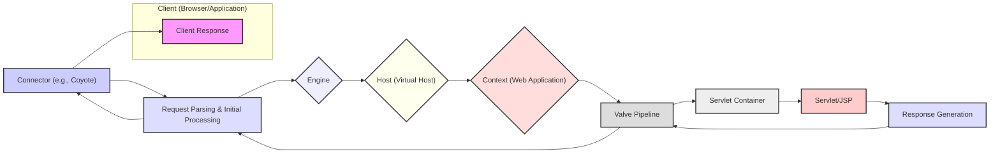

## Project Design Document: Apache Tomcat (Improved)

**Project Name:** Apache Tomcat

**Version:**  (This document describes the general architecture, not a specific version)

**Author:** AI Software Architect

**Date:** October 26, 2023

**1. Introduction**

This document provides a detailed architectural design of the Apache Tomcat project. It elaborates on the key components, their interactions, and the overall structure of the system. This document is intended to serve as a comprehensive reference for understanding Tomcat's architecture, particularly for activities such as threat modeling, security reviews, and development planning. It aims to provide a clear understanding of the system's boundaries, data flow, critical components, and configuration aspects.

**2. Goals**

* To provide a comprehensive and detailed overview of the Apache Tomcat architecture.
* To clearly define the responsibilities and functionalities of key components.
* To illustrate the complete flow of requests and responses within Tomcat, including internal processing steps.
* To highlight specific areas relevant for security considerations and threat modeling, providing concrete examples.
* To outline key configuration aspects relevant to security and operation.
* To serve as a foundational document for security analysis and development efforts.

**3. System Overview**

Apache Tomcat is a robust open-source implementation of several core Java Enterprise Edition specifications, including Java Servlet, JavaServer Pages (JSP), Java Expression Language, and WebSocket. It functions as a standalone Java HTTP web server, providing an environment where Java code can execute to serve dynamic web content. Tomcat is widely adopted for hosting Java-based web applications, ranging from simple websites to complex enterprise applications.

**4. Architectural Diagram**

**5. Key Components**

* **Client (Browser/Application):** The initiator of HTTP requests to the Tomcat server. This can be a web browser, a mobile application, an API client, or another server.
* **Connector (e.g., Coyote):**  The component responsible for handling communication protocols. It listens on specific ports for incoming client requests and sends responses back. Key responsibilities include:
    * **Receiving Connections:** Accepting new network connections.
    * **Protocol Handling:** Implementing the HTTP or AJP protocol.
    * **Request Parsing:**  Parsing the incoming request headers and body.
    * **Response Formatting:** Formatting the outgoing response according to the protocol.
    * **Thread Management:** Managing threads to handle concurrent requests.
* **Request Parsing & Initial Processing:**  The stage where the Connector processes the raw request data, decodes it, and prepares it for further handling by the Tomcat engine. This includes tasks like:
    * **Decoding URL:**  Interpreting the requested resource path.
    * **Header Processing:**  Extracting and interpreting HTTP headers.
    * **Parameter Extraction:**  Retrieving request parameters from the URL or request body.
* **Engine:** The top-level container within Tomcat's architecture. It represents the entire servlet engine and manages multiple virtual hosts. Only one Engine exists per Tomcat instance.
* **Host (Virtual Host):** Represents a virtual web server within the Tomcat instance. It allows hosting multiple websites on a single Tomcat server, each with its own domain name or IP address.
* **Context (Web Application):** Represents an individual web application deployed within a Host. Each web application has its own set of servlets, JSPs, static resources, and deployment descriptors.
* **Valve Pipeline:** A chain of interceptors that process requests and responses as they flow through the Tomcat engine. Valves can perform various tasks, including:
    * **Logging:** Recording request details.
    * **Authentication:** Verifying user credentials.
    * **Authorization:** Controlling access to resources.
    * **Request Filtering:** Modifying or blocking requests based on certain criteria.
    * **Session Management:** Managing user sessions.
* **Servlet Container (Catalina):** The core of Tomcat, responsible for managing the lifecycle of servlets and JSPs within a web application. It provides the runtime environment and necessary APIs for web applications to function. Key responsibilities include:
    * **Servlet Loading and Initialization:** Loading servlet classes and calling their initialization methods.
    * **Servlet Invocation:**  Dispatching requests to the appropriate servlet instance.
    * **Resource Management:** Providing access to resources within the web application.
    * **Security Management:** Enforcing security constraints defined in the web application.
* **Servlet/JSP:** Java code components that handle specific client requests and generate dynamic content.
    * **Servlets:** Java classes that implement the `Servlet` interface.
    * **JSPs (JavaServer Pages):** Text-based documents containing HTML and embedded Java code, which are compiled into servlets.
* **Response Generation:** The process of creating the HTTP response to be sent back to the client. This involves:
    * **Setting Headers:**  Adding appropriate HTTP headers (e.g., Content-Type, Content-Length).
    * **Writing Response Body:**  Generating the HTML, JSON, XML, or other content to be sent to the client.

**6. Data Flow (Detailed)**

1. **Client Request:** A client initiates an HTTP request targeting the Tomcat server's IP address and port.
2. **Connector Receives Connection:** The configured Connector listens on the specified port and accepts the incoming TCP connection.
3. **Request Parsing:** The Connector parses the raw byte stream from the client, interpreting the HTTP request line, headers, and body.
4. **Initial Processing:** The Connector performs initial processing, such as determining the character encoding and extracting basic request information.
5. **Dispatch to Engine:** The Connector forwards the processed request to the Tomcat Engine.
6. **Host Selection:** The Engine uses the `Host` header in the request to identify the appropriate virtual host. If no matching host is found, the default host is used.
7. **Context Selection:** The selected Host uses the request URI to determine the target `Context` (web application). This involves matching the beginning of the URI with the context path of deployed web applications.
8. **Valve Pipeline Processing (Request):** The request passes through the Valve pipeline associated with the selected Context. Valves in the pipeline can perform actions like logging, authentication checks, and request modification.
9. **Dispatch to Servlet Container:** The request is passed to the Servlet Container associated with the target web application.
10. **Servlet Mapping:** The Servlet Container uses the URL mapping defined in the web application's deployment descriptor (`web.xml`) or annotations to identify the appropriate Servlet or JSP to handle the request.
11. **Servlet/JSP Execution:**
    * **Servlet:** The `service()` method (or a specific HTTP method like `doGet()` or `doPost()`) of the identified servlet is invoked.
    * **JSP:** The JSP is compiled into a servlet (if it hasn't been already), and then the generated servlet's `service()` method is invoked.
12. **Response Generation:** The Servlet or JSP generates the response content and sets appropriate headers using the `HttpServletResponse` object.
13. **Valve Pipeline Processing (Response):** The generated response passes back through the Valve pipeline. Valves can perform actions like adding response headers or logging response information.
14. **Response Formatting:** The Connector formats the response according to the HTTP protocol, including adding necessary headers and the response body.
15. **Response Sent to Client:** The Connector sends the formatted HTTP response back to the client over the established TCP connection.
16. **Connection Closure (Optional):** The connection may be kept alive for subsequent requests (HTTP keep-alive) or closed depending on the HTTP version and configuration.

**7. Security Considerations (Detailed)**

This section outlines potential security concerns that should be thoroughly investigated during threat modeling.

* **Network Exposure:**
    * **Unprotected Ports:** Tomcat listening on publicly accessible ports without proper firewalling.
    * **Default Ports:** Using default ports (8080) can make it easier for attackers to identify Tomcat instances.
* **Authentication and Authorization:**
    * **Weak Credentials:** Default or easily guessable user credentials.
    * **Insecure Authentication Schemes:** Using basic authentication over unencrypted connections.
    * **Missing Authorization Checks:** Lack of proper access controls allowing unauthorized access to resources.
    * **Bypassable Authentication:** Vulnerabilities allowing attackers to bypass authentication mechanisms.
* **Session Management:**
    * **Predictable Session IDs:**  Session IDs that can be easily guessed or brute-forced.
    * **Session Fixation:**  Allowing attackers to force a user to use a known session ID.
    * **Session Hijacking:**  Stealing valid session IDs to impersonate users.
    * **Insecure Session Storage:** Storing session data in a way that is vulnerable to compromise.
* **Input Validation:**
    * **SQL Injection:**  Improperly sanitized user input used in database queries.
    * **Cross-Site Scripting (XSS):**  Injecting malicious scripts into web pages viewed by other users.
    * **Command Injection:**  Executing arbitrary commands on the server through vulnerable input fields.
    * **Path Traversal:**  Accessing files and directories outside the intended web application root.
* **Output Encoding:**
    * **Cross-Site Scripting (XSS):** Failure to properly encode output can allow injected scripts to execute in users' browsers.
* **File Uploads:**
    * **Malicious File Uploads:** Uploading executable files that can compromise the server.
    * **Directory Traversal:**  Uploading files to unintended locations on the server.
    * **Denial of Service:** Uploading excessively large files to exhaust server resources.
* **Error Handling:**
    * **Information Disclosure:**  Verbose error messages revealing sensitive information about the application or server.
* **Configuration Security:**
    * **Default Configurations:** Using default configurations with known vulnerabilities.
    * **Insecure Permissions:**  Incorrect file system permissions allowing unauthorized access.
    * **Unnecessary Features Enabled:**  Leaving features like JMX or the Manager application accessible without proper security.
* **Dependency Management:**
    * **Vulnerable Libraries:** Using outdated or vulnerable third-party libraries.
* **Denial of Service (DoS):**
    * **Resource Exhaustion:** Attacks that consume excessive server resources (CPU, memory, network).
    * **Slowloris Attacks:**  Sending incomplete HTTP requests to keep connections open.
* **Information Disclosure:**
    * **Exposed Sensitive Data:** Unintentionally revealing sensitive information in HTTP responses or logs.
    * **Directory Listing:**  Allowing users to browse directories on the server.
* **JMX (Java Management Extensions):**
    * **Unsecured JMX Access:**  Allowing unauthorized access to JMX management interfaces, potentially leading to remote code execution.
* **WebSocket Security:**
    * **Lack of Input Validation:** Vulnerabilities in handling WebSocket messages.
    * **Cross-Site WebSocket Hijacking (CSWSH):**  Exploiting vulnerabilities to establish unauthorized WebSocket connections.

**8. Configuration Considerations**

* **`server.xml`:** The main configuration file for Tomcat, defining Connectors, Engines, Hosts, and other server-level settings. Security-relevant configurations include:
    * **Connector Configuration:**  Defining ports, protocols (HTTP/HTTPS), SSL/TLS settings.
    * **Host Configuration:**  Defining virtual hosts and their document roots.
    * **Realm Configuration:**  Configuring authentication mechanisms (e.g., JDBCRealm, MemoryRealm).
* **`web.xml` (Deployment Descriptor):**  A file within each web application (in the `WEB-INF` directory) that defines the application's components, servlets, mappings, security constraints, and other settings.
* **`context.xml`:**  Configuration file for individual web applications, allowing overrides of server-level settings.
* **`tomcat-users.xml`:**  A file used by the `MemoryRealm` for storing user credentials. This should be secured and not used in production environments.

**9. Monitoring and Logging**

* **Access Logs:**  Record details of incoming requests, including client IP, requested resource, status code, and timestamps. Crucial for security auditing and incident response.
* **Application Logs:** Logs generated by the web applications themselves, providing insights into application behavior and potential errors.
* **Tomcat Logs:** Logs generated by Tomcat's internal components, useful for troubleshooting server issues.
* **Security Monitoring:** Implementing systems to monitor logs for suspicious activity, such as failed login attempts, unusual access patterns, and error spikes.

**10. Assumptions and Constraints**

* This document describes a general architecture and may not cover all specific configurations, extensions, or Tomcat versions.
* The focus is on the core components and concepts relevant for web application hosting and security.
* Security considerations are intended to be comprehensive but may not be exhaustive. Specific threats and mitigations will be further explored during the threat modeling process.

**11. Further Considerations for Threat Modeling**

The following aspects should be central to the threat modeling process:

* **Detailed Data Flow Diagrams:** Create more granular diagrams showing the flow of specific data elements and interactions between components.
* **STRIDE Analysis:** Apply the STRIDE model (Spoofing, Tampering, Repudiation, Information Disclosure, Denial of Service, Elevation of Privilege) to identify potential threats at each stage of the data flow and for each component.
* **Attack Surface Analysis:**  Identify all potential entry points for attackers, including network ports, user interfaces, and APIs.
* **Security Controls Assessment:** Evaluate the effectiveness of existing security controls and identify gaps.
* **Risk Assessment:**  Prioritize identified threats based on their likelihood and potential impact.
* **Mitigation Strategies:**  Develop and implement strategies to mitigate identified risks.

This improved design document provides a more detailed and comprehensive understanding of the Apache Tomcat architecture, enhancing its value for security analysis and threat modeling activities.